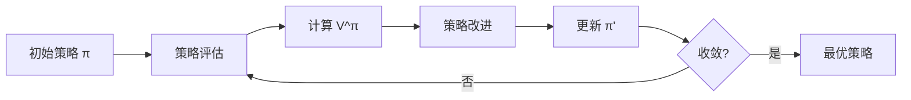
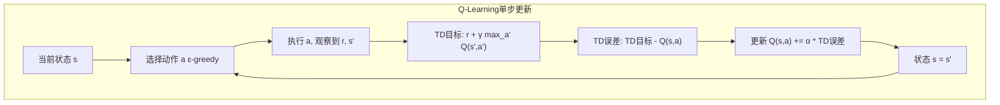
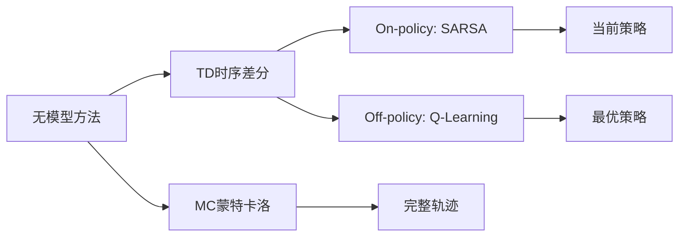

# 基础强化学习

## 1. 马尔可夫决策过程 MDP

### 定义
MDP 由五元组 `(S, A, P, R, γ)` 定义：
- **S**：有限状态集合
- **A**：有限动作集合
- **P(s'|s,a)**：状态转移概率
- **R(s,a)**：即时奖励函数
- **γ ∈ [0,1]**：折扣因子

### 马尔可夫性质
- **无记忆性**：下一状态只取决于当前状态和动作，与历史无关
- P(s_{t+1} | s_t, a_t, s_{t-1}, ...) = P(s_{t+1} | s_t, a_t)

### 回报与价值
- **回报 G_t**：R_{t+1} + γR_{t+2} + γ²R_{t+3} + ...
- **状态价值 V^π(s)**：从状态 s 开始，按策略 π 的期望回报
- **动作价值 Q^π(s,a)**：从状态 s 执行动作 a，然后按策略 π 的期望回报

### MDP 全流程

```mermaid
graph LR
    subgraph 单步转移
    A[状态 s_t] --> B[策略 π 选择动作 a_t]
    B --> C["环境: P(s_{t+1}|s_t,a_t)"]
    C --> D[获得奖励 r_t + 新状态 s_{t+1}]
    D --> E[更新策略]
    E --> A
    end
```

### 核心方程

| 方程 | 公式 | 说明 |
|------|------|------|
| 贝尔曼期望方程 | V^π(s) = Σ_a π(a|s)[R(s,a) + γΣ_{s'} P(s'|s,a)V^π(s')] | 策略评估 |
| 贝尔曼最优方程 | V^*(s) = max_a [R(s,a) + γΣ_{s'} P(s'|s,a)V^*(s')] | 最优价值 |
| Q 值递推 | Q^π(s,a) = R(s,a) + γΣ_{s'} P(s'|s,a) Σ_{a'} π(a'|s')Q^π(s',a') | 动作价值 |

### MDP 类型对比

| 类型 | 状态空间 | 动作空间 | 时间 | 代表问题 |
|------|---------|---------|------|---------|
| 有限 MDP | 有限 | 有限 | 离散 | 网格世界 |
| 连续 MDP | 连续 | 连续 | 连续 | 机器人控制 |
| 部分可观测 POMDP | 隐状态 | 有限/连续 | 离散 | 自动驾驶 |
| 回合制 MDP | 任意 | 任意 | 有终止 | 游戏 |

## 2. 动态规划

### 策略迭代
1. **策略评估**：计算当前策略的价值函数 V^π（迭代式贝尔曼方程）
2. **策略改进**：贪心选择，更新策略 π'(s) = argmax_a Q^π(s,a)



### 价值迭代
- 直接迭代最优贝尔曼方程：V_{k+1}(s) = max_a Σ P(s'|s,a)[R + γV_k(s')]
- 收敛到最优价值函数 V^*

### 动态规划方法对比

| 方法 | 更新方式 | 收敛速度 | 复杂度 | 使用场景 |
|------|---------|---------|-------|---------|
| 策略迭代 | 评估+改进交替 | 快(迭代少) | O(|S|²|A|) | 状态少时高效 |
| 价值迭代 | 直接最优 | 慢(迭代多) | O(|S|²|A|) | 收敛保证 |
| 广义策略迭代(GPI) | 部分评估+部分改进 | 灵活 | 可变 | 结合两者优点 |

## 3. 无模型方法

### 蒙特卡洛（MC）方法
- **基于样本**：完整交互轨迹 → 平均回报
- **特点**：无偏估计，高方差，只能用于回合制任务

### 时序差分学习（TD Learning）
- **特点**：Bootstrapping（用当前估计更新），低方差，可在线学习
- **TD(0)**：V(S_t) ← V(S_t) + α[R_{t+1} + γV(S_{t+1}) - V(S_t)]

### SARSA（On-policy）
- Q(S,A) ← Q(S,A) + α[R + γQ(S',A') - Q(S,A)]
- **特点**：基于实际采取的动作 A' 更新
- **安全性**：保守，考虑到实际策略行为

### Q-Learning（Off-policy）
- Q(S,A) ← Q(S,A) + α[R + γ max_a Q(S',a) - Q(S,A)]
- **特点**：基于最优动作更新，与实际动作无关
- **优势**：更激进，收敛更快

### Q-Learning 更新图





### 无模型方法对比

| 方法 | 更新时机 | 方差 | 偏差 | 适用任务 |
|------|---------|------|------|---------|
| MC | 回合结束 | 高 | 无偏 | 回合制 |
| TD(0) | 每步 | 低 | 有偏 | 连续/回合 |
| TD(λ) | 每步+回溯 | 中 | 可调 | 通用 |
| SARSA | 每步(on) | 中 | 有偏 | 安全优先 |
| Q-Learning | 每步(off) | 中 | 有偏 | 收敛快 |

### λ-回报与 n 步 TD

| 方法 | 公式 | 特点 |
|------|------|------|
| 1步 TD | R_{t+1} + γV(s_{t+1}) | 高偏差低方差 |
| 2步 TD | R_{t+1} + γR_{t+2} + γ²V(s_{t+2}) | 偏差方差折中 |
| n步 TD | Σ_{k=1}^{n} γ^{k-1}R_{t+k} + γ^nV(s_{t+n}) | 灵活调整 |
| TD(λ) | 加权平均所有 n步 | λ=0 TD, λ=1 MC |

## 4. PyTorch 代码示例

### 4.1 Q-Learning 表格实现

```python
import numpy as np

class QLearningTable:
    def __init__(self, n_states, n_actions, lr=0.1, gamma=0.99, epsilon=0.1):
        self.q_table = np.zeros((n_states, n_actions))
        self.lr = lr
        self.gamma = gamma
        self.epsilon = epsilon
        self.n_actions = n_actions

    def select_action(self, state):
        if np.random.random() < self.epsilon:
            return np.random.randint(self.n_actions)
        return np.argmax(self.q_table[state])

    def update(self, state, action, reward, next_state, done):
        td_target = reward + self.gamma * np.max(self.q_table[next_state]) * (1 - done)
        td_error = td_target - self.q_table[state, action]
        self.q_table[state, action] += self.lr * td_error

    def train(self, env, episodes=1000):
        returns = []
        for ep in range(episodes):
            state, _ = env.reset()
            total_reward = 0
            done = False
            while not done:
                action = self.select_action(state)
                next_state, reward, done, _, _ = env.step(action)
                self.update(state, action, reward, next_state, done)
                total_reward += reward
                state = next_state
            returns.append(total_reward)
        return returns
```

### 4.2 价值迭代 (Value Iteration)

```python
import numpy as np

class ValueIteration:
    def __init__(self, n_states, n_actions, gamma=0.99, theta=1e-6):
        self.gamma = gamma
        self.theta = theta
        self.n_states = n_states
        self.n_actions = n_actions
        self.values = np.zeros(n_states)
        self.policy = np.zeros(n_states, dtype=int)

    def solve(self, env):
        while True:
            delta = 0
            for s in range(self.n_states):
                v = self.values[s]
                action_values = []
                for a in range(self.n_actions):
                    transitions = env.get_transitions(s, a)
                    q = sum(p * (r + self.gamma * self.values[s_next])
                            for p, r, s_next in transitions)
                    action_values.append(q)
                self.values[s] = max(action_values)
                delta = max(delta, abs(v - self.values[s]))
            if delta < self.theta:
                break
        for s in range(self.n_states):
            action_values = []
            for a in range(self.n_actions):
                transitions = env.get_transitions(s, a)
                q = sum(p * (r + self.gamma * self.values[s_next])
                        for p, r, s_next in transitions)
                action_values.append(q)
            self.policy[s] = np.argmax(action_values)
        return self.policy, self.values
```

### 4.3 策略迭代 (Policy Iteration)

```python
import numpy as np

class PolicyIteration:
    def __init__(self, n_states, n_actions, gamma=0.99, theta=1e-6):
        self.gamma = gamma
        self.theta = theta
        self.n_states = n_states
        self.n_actions = n_actions
        self.values = np.zeros(n_states)
        self.policy = np.zeros(n_states, dtype=int)

    def policy_evaluation(self, env):
        while True:
            delta = 0
            for s in range(self.n_states):
                v = self.values[s]
                a = self.policy[s]
                transitions = env.get_transitions(s, a)
                self.values[s] = sum(p * (r + self.gamma * self.values[s_next])
                                     for p, r, s_next in transitions)
                delta = max(delta, abs(v - self.values[s]))
            if delta < self.theta:
                break

    def policy_improvement(self, env):
        policy_stable = True
        for s in range(self.n_states):
            old_action = self.policy[s]
            action_values = []
            for a in range(self.n_actions):
                transitions = env.get_transitions(s, a)
                q = sum(p * (r + self.gamma * self.values[s_next])
                        for p, r, s_next in transitions)
                action_values.append(q)
            self.policy[s] = np.argmax(action_values)
            if old_action != self.policy[s]:
                policy_stable = False
        return policy_stable

    def solve(self, env):
        while True:
            self.policy_evaluation(env)
            stable = self.policy_improvement(env)
            if stable:
                return self.policy, self.values
```

### 4.4 多臂老虎机 UCB

```python
import numpy as np

class UCB1:
    def __init__(self, n_arms):
        self.n_arms = n_arms
        self.counts = np.zeros(n_arms)
        self.values = np.zeros(n_arms)
        self.total_steps = 0

    def select_arm(self):
        for arm in range(self.n_arms):
            if self.counts[arm] == 0:
                return arm
        ucb_values = self.values + np.sqrt(2 * np.log(self.total_steps) / self.counts)
        return np.argmax(ucb_values)

    def update(self, arm, reward):
        self.counts[arm] += 1
        self.total_steps += 1
        self.values[arm] += (reward - self.values[arm]) / self.counts[arm]

    def run(self, env, n_steps=10000):
        regrets = []
        for t in range(n_steps):
            arm = self.select_arm()
            reward = env.pull(arm)
            self.update(arm, reward)
            regrets.append(env.best_reward - reward)
        return np.cumsum(regrets)
```

## 5. 表格方法局限
- **维度诅咒**：状态过多时查表不可行
- **泛化能力**：无法处理未见过状态
- **解决方案**：价值函数近似（神经网络）— 深度强化学习

### 探索 vs 利用策略

| 策略 | 公式 | 特点 |
|------|------|------|
| ε-greedy | 以ε随机, 1-ε贪心 | 简单但均匀探索 |
| Softmax(Boltzmann) | P(a)=exp(Q(a)/τ)/Σexp | 温度调节探索 |
| UCB | Q(a)+√(2ln t/N(a)) | 置信上界, 自动平衡 |
| Thompson Sampling | 从后验采样 | 贝叶斯最优 |
| 乐观初值 | Q₀ = R_max | 鼓励早期探索 |
