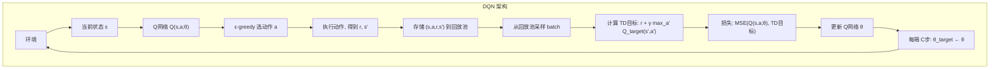
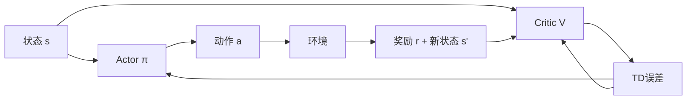
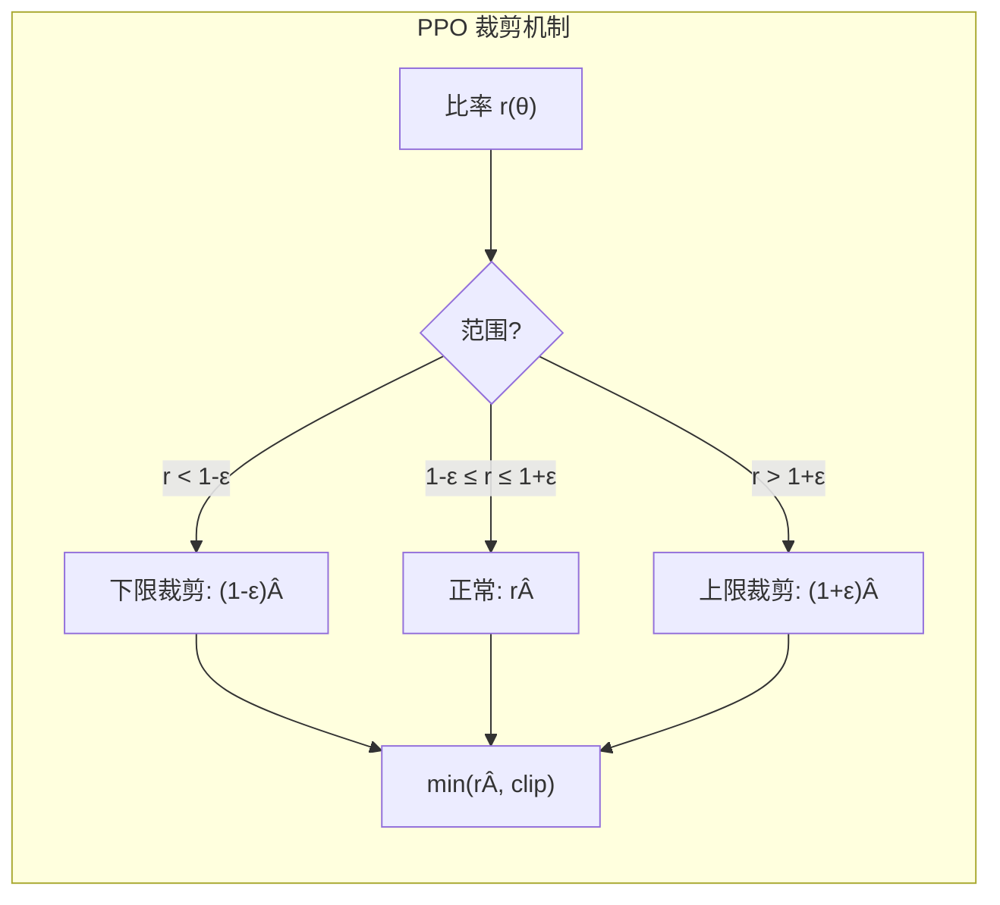
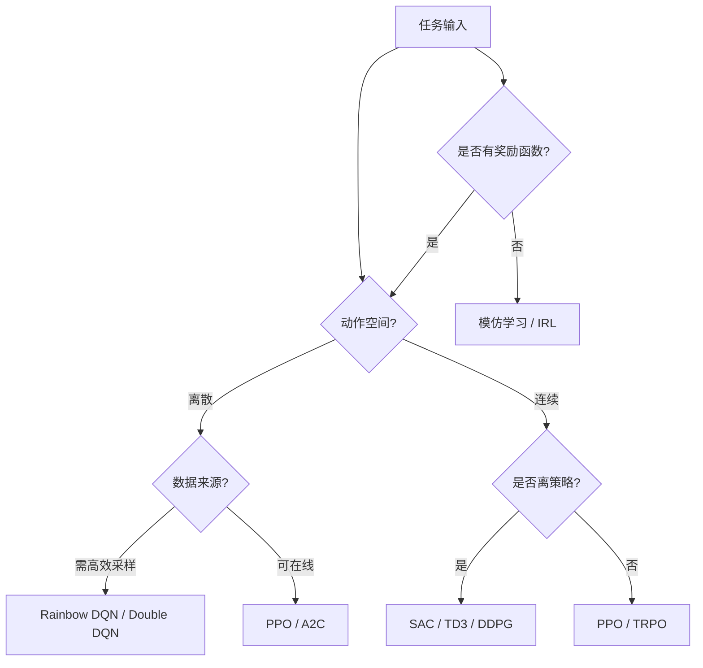

# 深度强化学习

## 1. 深度 Q 网络 DQN

### 从 Q-Learning 到 DQN
- **问题**：状态空间太大，表格 Q-Learning 不可行
- **方案**：用神经网络 Q(s,a;θ) 近似 Q 值函数

### DQN 创新（2013, Mnih et al.）
- **经验回放（Experience Replay）**：存储历史经验 (s,a,r,s')，随机采样训练
  - 打破样本相关性
  - 提高数据效率
- **目标网络（Target Network）**：固定目标 Q 网络，滞后更新
  - 减少自举误差



### DQN 改进

| 改进 | 方法 | 效果 |
|------|------|------|
| Double DQN | 动作选择和解耦 | 减少 Q 值高估 |
| Dueling DQN | Q=V+A 分解 | 更好估计状态价值 |
| Prioritized Replay | TD 误差优先采样 | 加速学习 |
| Noisy DQN | 参数噪声探索 | 更好的探索策略 |
| Distributional DQN | 学习分布而非期望 | 更丰富的信息 |
| N-step DQN | n步回报 | 偏差方差平衡 |

### Rainbow DQN
- 融合以上 6 种改进，Atari 游戏 SOTA

### DQN 系列对比

| 算法 | 高估问题 | 探索方式 | 采样策略 | 网络结构 |
|------|---------|---------|---------|---------|
| DQN | 严重 | ε-greedy | 均匀 | 单头 Q |
| Double DQN | 缓解 | ε-greedy | 均匀 | 单头 Q |
| Dueling DQN | 有 | ε-greedy | 均匀 | 分离 V/A |
| Prioritized DQN | 有 | ε-greedy | TD优先 | 单头 Q |
| Distributional DQN | 有 | ε-greedy | 均匀 | 分布输出 |
| Rainbow | 缓解 | 带噪网络 | 优先 | 融合结构 |

## 2. 策略梯度

### 理论
- **目标**：最大化 J(θ) = E[R(τ)]
- **梯度**：∇J(θ) = E[Σ∇logπ_θ(a_t|s_t) G_t]
- **REINFORCE**：最简单的策略梯度，使用完整收益 G_t

### 高方差问题
- G_t 方差大，学习不稳定
- **加入基线（Baseline）**：∇J = E[Σ∇logπ (G_t - b(s_t))]

### REINFORCE 算法

```python
import torch
import torch.nn as nn
import torch.optim as optim

class PolicyNetwork(nn.Module):
    def __init__(self, state_dim, action_dim, hidden_dim=128):
        super().__init__()
        self.net = nn.Sequential(
            nn.Linear(state_dim, hidden_dim),
            nn.ReLU(),
            nn.Linear(hidden_dim, hidden_dim),
            nn.ReLU(),
            nn.Linear(hidden_dim, action_dim),
            nn.Softmax(dim=-1)
        )

    def forward(self, x):
        return self.net(x)

class REINFORCE:
    def __init__(self, state_dim, action_dim, lr=1e-3, gamma=0.99):
        self.policy = PolicyNetwork(state_dim, action_dim)
        self.optimizer = optim.Adam(self.policy.parameters(), lr=lr)
        self.gamma = gamma

    def select_action(self, state):
        state = torch.FloatTensor(state).unsqueeze(0)
        probs = self.policy(state)
        m = torch.distributions.Categorical(probs)
        action = m.sample()
        return action.item(), m.log_prob(action)

    def update(self, log_probs, rewards):
        returns = []
        G = 0
        for r in reversed(rewards):
            G = r + self.gamma * G
            returns.insert(0, G)
        returns = torch.tensor(returns)
        returns = (returns - returns.mean()) / (returns.std() + 1e-8)
        loss = sum(-lp * G for lp, G in zip(log_probs, returns))
        self.optimizer.zero_grad()
        loss.backward()
        self.optimizer.step()
```

### 值函数 vs 策略梯度

| 维度 | 值函数方法 | 策略梯度方法 |
|------|-----------|------------|
| 输出 | Q值/状态值 | 动作概率 |
| 动作空间 | 离散友好 | 连续友好 |
| 收敛性 | 可能振荡 | 单调改进 |
| 方差 | 低 | 高 |
| 局部最优 | 可保证 | 可能陷入 |
| 代表 | DQN | REINFORCE, PPO |

## 3. Actor-Critic 方法

### 核心思想
- **Actor（演员）**：策略网络 π_θ(a|s)，输出动作
- **Critic（评论家）**：价值网络 V_φ(s) 或 Q_φ(s,a)，评估动作



### A2C / A3C
- **Advantage Actor-Critic**：使用优势函数 A = Q - V
- **A3C（Asynchronous）**：多线程异步训练
- **A2C（Synchronous）**：同步训练，更稳定

### Actor-Critic 变体对比

| 算法 | Critic | Actor | 更新方式 | 特点 |
|------|--------|-------|---------|------|
| A2C | V(s) | 随机策略 | 同步多worker | 稳定 |
| A3C | V(s) | 随机策略 | 异步多worker | 吞吐高 |
| PPO | V(s) | 随机策略 | 裁剪约束 | SOTA通用 |
| DDPG | Q(s,a) | 确定性策略 | 离策略 | 连续控制 |
| SAC | 双Q+V | 最大熵策略 | 离策略 | 鲁棒高效 |
| TRPO | V(s) | 随机策略 | KL约束 | 理论保证 |

## 4. PPO（Proximal Policy Optimization）
- **当前最主流的 RL 算法**
- **核心**：限制策略更新幅度，防止灾难性崩溃
- **裁剪目标（Clipped Objective）**：r_t(θ) = π_θ(a_t|s_t) / π_old(a_t|s_t)

### PPO 损失函数



L^CLIP(θ) = E[min(r_t(θ)Â_t, clip(r_t(θ), 1-ε, 1+ε)Â_t)]

- **PPO 优点**：实现简单、超参数鲁棒、性能好
- **PPO 在 LLM 应用**：RLHF 中 PPO 训练奖励模型

### PPO vs TRPO vs SAC

| 维度 | PPO | TRPO | SAC |
|------|-----|------|-----|
| 约束方式 | clip裁剪 | KL散度约束 | 最大熵 |
| 阶数 | 一阶 | 二阶(近似) | 一阶 |
| 实现难度 | 简单 | 复杂 | 中等 |
| 数据效率 | 低(on) | 低(on) | 高(off) |
| 连续控制 | 好 | 好 | 极好 |
| 离散控制 | 极好 | 好 | 好 |
| 调参难度 | 低 | 高 | 中 |

## 5. SAC（Soft Actor-Critic）
- **最大熵 RL**：最大化奖励 + 策略熵 H(π(·|s))
- **优点**：更好的探索、更鲁棒
- **连续控制 SOTA**：机器人、自动驾驶

### 最大熵公式对比

| 公式 | 传统 RL | 最大熵 RL |
|------|---------|-----------|
| 目标 | ΣE[r] | ΣE[r + αH(π)] |
| Q值更新 | r + γV(s') | r + γ(V(s') + αH(π)) |
| 策略形式 | 确定/随机 | 软策略 |
| 探索方式 | ε-greedy/噪声 | 熵自然探索 |

## 6. 探索 vs 利用

| 策略 | 方法 | 适用 |
|------|------|------|
| ε-greedy | 1-ε 贪心，ε 随机 | DQN |
| Boltzmann | 按 Q 值概率采样 | On-policy |
| 噪声注入 | 参数/动作加噪声 | 连续控制 |
| 计数探索 | 访问次数少的奖励 | 稀疏奖励 |
| ICM（好奇心） | 预测误差作为内在奖励 | 无外在奖励 |
| RND | 随机网络预测误差 | 探索困难环境 |
| 熵正则化 | 最大熵策略 | SAC |

## 7. 2025-2026 趋势
- **RL for LLM**：RLHF/DPO/GRPO 成为 LLM 对齐主流
- **离线 RL**：从固定数据集学习，无需环境交互
- **世界模型 + RL**：DreamerV3 等基于世界模型的 RL
- **多模态 RL**：从图像/视频直接学习策略

### 深度 RL 算法选择图谱

| 场景 | 算法 | 理由 |
|------|------|------|
| Atari 游戏 | Rainbow DQN | 离散动作 SOTA |
| 机器人控制 | SAC | 连续控制最佳 |
| LLM 对齐 | PPO | 稳定且可控 |
| 多智能体 | MAPPO | CTDE 范式 |
| 自动驾驶 | SAC+PPO | 连续+安全 |
| 芯片布局 | REINFORCE+监督 | 组合优化 |

## 8. 实现案例：用 stable-baselines3 训练 CartPole

下面用 DQN 和 PPO 分别训练经典的 CartPole 平衡任务，并对比训练曲线，体现深度 RL 算法落地的最小代价。

```python
import gymnasium as gym
import numpy as np
from stable_baselines3 import DQN, PPO
from stable_baselines3.common.evaluation import evaluate_policy

# 离散动作任务：CartPole，适合值函数类算法 DQN
env = gym.make("CartPole-v1")

model_dqn = DQN("MlpPolicy", env, verbose=0, buffer_size=10000,
                learning_starts=500, target_update_interval=500)
model_dqn.learn(total_timesteps=50000)

# 随机策略基线对比
mean_rand, _ = evaluate_policy(DQN("MlpPolicy", env, verbose=0), env, n_eval_episodes=10)
mean_dqn, _ = evaluate_policy(model_dqn, env, n_eval_episodes=10)
print(f"随机策略平均回报 = {mean_rand:.1f}")
print(f"DQN 平均回报     = {mean_dqn:.1f}")

# 连续/离散皆可的 on-policy 算法 PPO
model_ppo = PPO("MlpPolicy", env, verbose=0, n_steps=512, batch_size=64)
model_ppo.learn(total_timesteps=50000)
mean_ppo, _ = evaluate_policy(model_ppo, env, n_eval_episodes=10)
print(f"PPO 平均回报     = {mean_ppo:.1f}")
```

### 案例：Double DQN 解决 Q 值高估

标准 DQN 用同一个网络选动作并估值，会系统性高估 Q 值。Double DQN 用在线网络选动作、目标网络估值，降低高估偏差。

```python
import torch
import torch.nn as nn
import torch.optim as optim
import numpy as np
import random
from collections import deque

class QNet(nn.Module):
    def __init__(self, obs_dim, act_dim, hidden=128):
        super().__init__()
        self.net = nn.Sequential(
            nn.Linear(obs_dim, hidden), nn.ReLU(),
            nn.Linear(hidden, hidden), nn.ReLU(),
            nn.Linear(hidden, act_dim)
        )
    def forward(self, x):
        return self.net(x)

class DoubleDQN:
    def __init__(self, obs_dim, act_dim, lr=1e-3, gamma=0.99, tau=0.005):
        self.online = QNet(obs_dim, act_dim)
        self.target = QNet(obs_dim, act_dim)
        self.target.load_state_dict(self.online.state_dict())
        self.opt = optim.Adam(self.online.parameters(), lr=lr)
        self.gamma = gamma; self.tau = tau
        self.buffer = deque(maxlen=50000)

    def act(self, obs, eps=0.1):
        if random.random() < eps:
            return random.randrange(self.online.net[-1].out_features)
        with torch.no_grad():
            q = self.online(torch.FloatTensor(obs))
        return int(q.argmax())

    def push(self, s, a, r, s2, d):
        self.buffer.append((s, a, r, s2, d))

    def update(self, batch=64):
        if len(self.buffer) < batch:
            return
        s, a, r, s2, d = zip(*random.sample(self.buffer, batch))
        s = torch.FloatTensor(s); a = torch.LongTensor(a)
        r = torch.FloatTensor(r); s2 = torch.FloatTensor(s2); d = torch.FloatTensor(d)
        # 在线网络选动作，目标网络估值 —— Double DQN 核心
        next_a = self.online(s2).argmax(1, keepdim=True)
        next_q = self.target(s2).gather(1, next_a).squeeze()
        td_target = r + self.gamma * next_q * (1 - d)
        q = self.online(s).gather(1, a.unsqueeze(1)).squeeze()
        loss = nn.MSELoss()(q, td_target.detach())
        self.opt.zero_grad(); loss.backward(); self.opt.step()
        for p, tp in zip(self.online.parameters(), self.target.parameters()):
            tp.data.copy_(self.tau * p.data + (1 - self.tau) * tp.data)

# 注：obs_dim / act_dim 需根据环境设定，例如 CartPole 为 4 和 2
print("Double DQN 模块已就绪，替换标准 DQN 的 max_a' Q_target 即可消除高估")
```

### 深度强化学习算法选型 Mermaid 图


