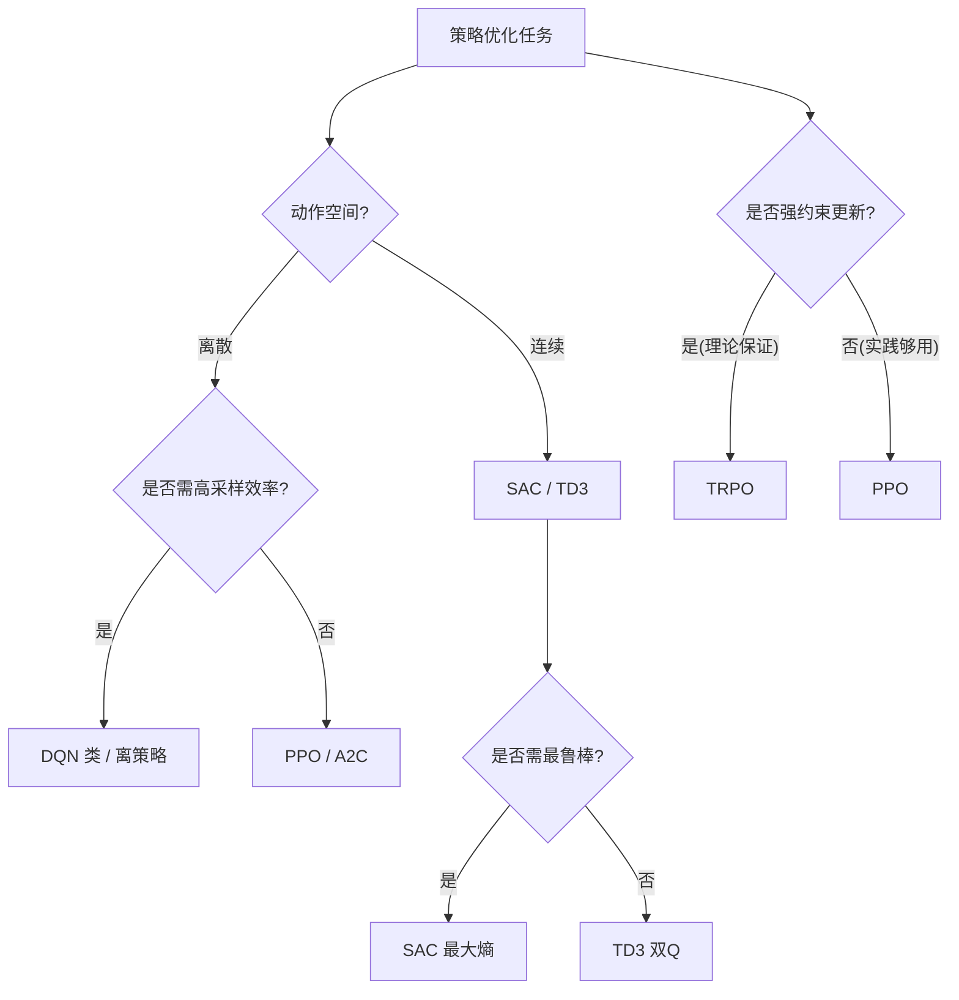

# 策略优化

## 1. On-Policy vs Off-Policy

| 特性 | On-Policy | Off-Policy |
|------|-----------|------------|
| 数据来源 | 当前策略 | 任意策略 |
| 数据效率 | 低 | 高 |
| 稳定性 | 稳定 | 不稳定 |
| 方差 | 高 | 低 |
| 探索要求 | 需要随机策略 | 可分离 |
| 样本重用 | 否(每个样本一次) | 是(多次使用) |
| 代表 | PPO / A2C / TRPO | DQN / SAC / DDPG |
| 实现复杂度 | 简单 | 中等 |

### 学习范式对比

| 范式 | 策略类型 | 是否用回放池 | 梯度形式 | 适用场景 |
|------|---------|------------|---------|---------|
| REINFORCE | 随机 | 否 | Σ∇logπ·G | 简单回合 |
| Actor-Critic | 随机 | 否(on) | Σ∇logπ·A | 通用 |
| Q-Learning | 隐式 | 是 | TD误差 | 离散 |
| DPG | 确定 | 是 | ∇Q·∇π | 连续 |
| 最大熵 | 随机 | 是 | 软Q+熵 | 鲁棒控制 |

## 2. TRPO（Trust Region Policy Optimization）

### 核心思想
- **约束策略更新**：KL 散度限制新旧策略距离
- **自然梯度**：Fisher 信息矩阵近似

### 公式
max L(θ)  s.t.  D_KL(π_old||π_θ) ≤ δ

### 局限
- Fisher 矩阵计算复杂
- 二阶优化实现困难

### TRPO 伪代码

```python
import torch
import torch.nn as nn

class TRPO:
    def __init__(self, policy, value_net, gamma=0.99, tau=0.95, delta=0.01):
        self.policy = policy
        self.value_net = value_net
        self.gamma = gamma
        self.tau = tau
        self.delta = delta

    def compute_advantages(self, rewards, values, next_values, dones):
        advantages = []
        gae = 0
        for t in reversed(range(len(rewards))):
            delta = rewards[t] + self.gamma * next_values[t] * (1 - dones[t]) - values[t]
            gae = delta + self.gamma * self.tau * (1 - dones[t]) * gae
            advantages.insert(0, gae)
        return torch.tensor(advantages)

    def hessian_vector_product(self, states, actions, old_log_probs, v):
        log_probs = self.policy.get_log_prob(states, actions)
        kl = (old_log_probs - log_probs).mean()
        grads = torch.autograd.grad(kl, self.policy.parameters(), create_graph=True)
        flat_grad = torch.cat([g.contiguous().view(-1) for g in grads])
        hvp = torch.autograd.grad((flat_grad * v).sum(), self.policy.parameters())
        return torch.cat([g.contiguous().view(-1) for g in hvp])

    def conjugate_gradient(self, A_fn, b, n_iter=10):
        x = torch.zeros_like(b)
        r = b.clone()
        p = b.clone()
        for _ in range(n_iter):
            Ap = A_fn(p)
            alpha = torch.dot(r, r) / (torch.dot(p, Ap) + 1e-8)
            x += alpha * p
            r_next = r - alpha * Ap
            beta = torch.dot(r_next, r_next) / (torch.dot(r, r) + 1e-8)
            p = r_next + beta * p
            r = r_next
        return x

    def update(self, states, actions, advantages, old_log_probs):
        def loss_fn():
            log_probs = self.policy.get_log_prob(states, actions)
            ratio = torch.exp(log_probs - old_log_probs)
            return - (ratio * advantages).mean()

        loss = loss_fn()
        grad = torch.autograd.grad(loss, self.policy.parameters())
        flat_grad = torch.cat([g.contiguous().view(-1) for g in grad])

        def A_fn(v):
            return self.hessian_vector_product(states, actions, old_log_probs, v)

        step_dir = self.conjugate_gradient(A_fn, flat_grad, n_iter=10)
        step_size = torch.sqrt(2 * self.delta / (torch.dot(step_dir, A_fn(step_dir)) + 1e-8))
        full_step = step_size * step_dir
        self._apply_update(full_step)

    def _apply_update(self, flat_params):
        idx = 0
        for param in self.policy.parameters():
            n = param.numel()
            param.data += flat_params[idx:idx+n].view(param.shape)
            idx += n
```

### TRPO vs PPO

| 维度 | TRPO | PPO |
|------|------|-----|
| 约束机制 | KL散度硬约束 | 裁剪软约束 |
| 优化方法 | 共轭梯度(二阶) | SGD/Adam(一阶) |
| 计算开销 | 高(Hessian计算) | 低 |
| 实现难度 | 困难 | 简单 |
| 每步更新 | 一次大更新 | 多次小更新 |
| 样本效率 | 相当 | 相当 |
| 伸缩性 | 差 | 好 |
| 使用率 | 学术 | 工业主流 |

## 3. PPO（Proximal Policy Optimization）

### 裁剪替代
- **简单高效**：一阶优化，约束策略更新
- **Clip 损失**：L = min(r·A, clip(r, 1-ε, 1+ε)·A)
- **效果**：TRPO 效果 + 一阶优化效率

### PPO 损失实现

```python
import torch
import torch.nn as nn
import torch.optim as optim

class ActorNetwork(nn.Module):
    def __init__(self, state_dim, action_dim, hidden_dim=256):
        super().__init__()
        self.fc1 = nn.Linear(state_dim, hidden_dim)
        self.fc2 = nn.Linear(hidden_dim, hidden_dim)
        self.mean = nn.Linear(hidden_dim, action_dim)
        self.log_std = nn.Parameter(torch.zeros(action_dim))

    def forward(self, x):
        x = torch.relu(self.fc1(x))
        x = torch.relu(self.fc2(x))
        mean = self.mean(x)
        std = torch.exp(self.log_std)
        return mean, std

    def get_action(self, x):
        mean, std = self.forward(x)
        dist = torch.distributions.Normal(mean, std)
        action = dist.sample()
        return action, dist.log_prob(action).sum(-1)

    def evaluate(self, x, actions):
        mean, std = self.forward(x)
        dist = torch.distributions.Normal(mean, std)
        return dist.log_prob(actions).sum(-1), dist.entropy().sum(-1)

class CriticNetwork(nn.Module):
    def __init__(self, state_dim, hidden_dim=256):
        super().__init__()
        self.net = nn.Sequential(
            nn.Linear(state_dim, hidden_dim),
            nn.ReLU(),
            nn.Linear(hidden_dim, hidden_dim),
            nn.ReLU(),
            nn.Linear(hidden_dim, 1)
        )

    def forward(self, x):
        return self.net(x)

class PPOClip:
    def __init__(self, state_dim, action_dim, lr=3e-4, gamma=0.99, clip_epsilon=0.2, epochs=10):
        self.actor = ActorNetwork(state_dim, action_dim)
        self.critic = CriticNetwork(state_dim)
        self.optimizer = optim.Adam([
            {'params': self.actor.parameters()},
            {'params': self.critic.parameters()}
        ], lr=lr)
        self.gamma = gamma
        self.clip_epsilon = clip_epsilon
        self.epochs = epochs

    def compute_gae(self, rewards, values, dones):
        advantages = []
        gae = 0
        next_value = 0
        for t in reversed(range(len(rewards))):
            delta = rewards[t] + self.gamma * next_value * (1 - dones[t]) - values[t]
            gae = delta + self.gamma * 0.95 * (1 - dones[t]) * gae
            advantages.insert(0, gae)
            next_value = values[t]
        returns = [a + v for a, v in zip(advantages, values)]
        return advantages, returns

    def update(self, states, actions, old_log_probs, advantages, returns):
        advantages = (advantages - advantages.mean()) / (advantages.std() + 1e-8)
        for _ in range(self.epochs):
            log_probs, entropy = self.actor.evaluate(states, actions)
            ratio = torch.exp(log_probs - old_log_probs)
            surr1 = ratio * advantages
            surr2 = torch.clamp(ratio, 1 - self.clip_epsilon, 1 + self.clip_epsilon) * advantages
            actor_loss = -torch.min(surr1, surr2).mean() - 0.01 * entropy.mean()
            critic_loss = nn.MSELoss()(self.critic(states).squeeze(), returns)
            loss = actor_loss + critic_loss
            self.optimizer.zero_grad()
            loss.backward()
            torch.nn.utils.clip_grad_norm_(self.actor.parameters(), 0.5)
            torch.nn.utils.clip_grad_norm_(self.critic.parameters(), 0.5)
            self.optimizer.step()
```

### PPO 实践技巧
- **GAE（广义优势估计）**：λ 参数平衡偏差方差
- **价值网络裁剪**：稳定价值估计
- **熵奖励**：促进探索
- **多 epochs 更新**：数据重用
- **梯度裁剪**：防止梯度爆炸
- **学习率衰减**：稳定收敛
- **正交初始化**：加速训练

### GAE 实现

```python
import torch
import numpy as np

def compute_gae(rewards, values, dones, gamma=0.99, lam=0.95):
    advantages = []
    gae = 0
    next_value = 0
    for t in reversed(range(len(rewards))):
        delta = rewards[t] + gamma * next_value * (1 - dones[t]) - values[t]
        gae = delta + gamma * lam * (1 - dones[t]) * gae
        advantages.insert(0, gae)
        next_value = values[t]
    returns = [a + v for a, v in zip(advantages, values)]
    return torch.tensor(advantages), torch.tensor(returns)

class GAE:
    @staticmethod
    def compute(rewards, values, dones, gamma=0.99, lam=0.95):
        advantages = np.zeros(len(rewards))
        gae = 0
        for t in reversed(range(len(rewards))):
            if t == len(rewards) - 1:
                next_val = 0
            else:
                next_val = values[t + 1]
            delta = rewards[t] + gamma * next_val * (1 - dones[t]) - values[t]
            gae = delta + gamma * lam * (1 - dones[t]) * gae
            advantages[t] = gae
        return advantages
```

### GAE λ 参数效应

| λ 值 | 含义 | 偏差 | 方差 | 类似方法 |
|------|------|------|------|---------|
| λ=0 | 只看1步TD | 高 | 低 | TD(0) |
| λ=0.5 | 平衡 | 中 | 中 | 混合 |
| λ=0.95 | 推荐值 | 低 | 中 | PPO默认 |
| λ=1 | 完整回报 | 低 | 高 | MC |

## 4. DDPG / TD3（连续控制）

### DDPG（Deep Deterministic Policy Gradient）
- **确定性策略**：输出确定动作而非概率
- **演员-评论家**：+ 目标网络
- **经验回放**：离策略学习

### TD3（Twin Delayed DDPG, 2018）
- **双 Q 网络**：取小值防止 Q 值高估
- **延迟策略更新**：价值网络更新多次后再更新策略
- **目标策略平滑**：目标动作加噪声

### 连续控制算法对比

| 算法 | 策略类型 | Q网络 | 目标网络 | 探索方式 | 更新频率 |
|------|---------|-------|---------|---------|---------|
| DDPG | 确定性 | 单Q | 有 | OU噪声 | 同步 |
| TD3 | 确定性 | 双Q(取小) | 有 | 高斯噪声 | 策略延迟 |
| SAC | 最大熵 | 双Q+α | 有 | 熵自动 | 同步 |
| PPO | 随机 | V值 | 无 | 策略随机 | on-policy |

## 5. SAC（Soft Actor-Critic）

### 最大熵框架
J(π) = ΣE[r(s,a) + αH(π(·|s))]

### 优势
- **自动熵调整**：自动学 α 参数
- **高采样效率**：离策略 + 最大熵
- **连续控制 SOTA**

## 6. 策略优化选择指南

| 场景 | 推荐算法 | 原因 |
|------|---------|------|
| 离散动作 | PPO / DQN | 简单稳定 |
| 连续动作 | SAC / TD3 | 高效 |
| 高维动作 | PPO | 更稳定 |
| 稀疏奖励 | SAC+HER | 离策略 |
| 需要在线学习 | PPO | On-Policy |
| 安全关键 | TRPO | KL约束保证 |
| 计算资源少 | PPO | 一阶优化 |
| 大规模分布式 | IMPALA | V-trace |

### 损失函数汇总

| 算法 | Actor 损失 | Critic 损失 | 辅助项 |
|------|-----------|------------|-------|
| PPO | -min(r·A, clip(r)·A) | MSE(V, R) | 熵奖励 |
| SAC | E[αlogπ - Q] | MSE(Q, r+γ(Q'-αlogπ')) | 自动α |
| DDPG | -Q(s,μ(s)) | MSE(Q, r+γQ'(s',μ'(s'))) | 无 |
| TD3 | -Q₁(s,μ(s)) | MSE(Q, r+γmin(Q₁',Q₂')) | 策略平滑 |

## 7. 实现案例：PPO 在 CartPole 上的最小训练循环

把第 3 节的 PPOClip 与 gymnasium 串联，跑通一个可复现的 on-policy 训练闭环。

```python
import gymnasium as gym
import torch
import torch.nn as nn
import torch.optim as optim
import numpy as np
from collections import deque

# 复用第 3 节的 ActorNetwork / CriticNetwork 结构（简化版）
class Actor(nn.Module):
    def __init__(self, s_dim, a_dim):
        super().__init__()
        self.net = nn.Sequential(nn.Linear(s_dim, 64), nn.ReLU(),
                                 nn.Linear(64, 64), nn.ReLU(),
                                 nn.Linear(64, a_dim))
    def forward(self, x):
        return torch.softmax(self.net(x), dim=-1)

class Critic(nn.Module):
    def __init__(self, s_dim):
        super().__init__()
        self.net = nn.Sequential(nn.Linear(s_dim, 64), nn.ReLU(),
                                 nn.Linear(64, 64), nn.ReLU(),
                                 nn.Linear(64, 1))

env = gym.make("CartPole-v1")
s_dim = env.observation_space.shape[0]
a_dim = env.action_space.n
actor, critic = Actor(s_dim, a_dim), Critic(s_dim)
opt_a, opt_c = optim.Adam(actor.parameters(), lr=3e-4), optim.Adam(critic.parameters(), lr=3e-4)

returns = []
for episode in range(500):
    states, actions, logps, rewards = [], [], [], []
    s, _ = env.reset()
    done = False
    while not done:
        st = torch.FloatTensor(s).unsqueeze(0)
        probs = actor(st); dist = torch.distributions.Categorical(probs)
        a = dist.sample(); lp = dist.log_prob(a)
        s2, r, term, trunc, _ = env.step(a.item())
        done = term or trunc
        states.append(s); actions.append(a.item()); logps.append(lp); rewards.append(r)
        s = s2
    # 计算折扣回报与优势（简化，无 GAE）
    G, returns_ep = 0, []
    for r in reversed(rewards):
        G = r + 0.99 * G; returns_ep.insert(0, G)
    returns_ep = torch.tensor(returns_ep)
    adv = (returns_ep - returns_ep.mean()) / (returns_ep.std() + 1e-8)
    S = torch.FloatTensor(states); A = torch.LongTensor(actions)
    LP = torch.stack(logps)
    # PPO 多轮更新（这里跑 4 轮小更新）
    for _ in range(4):
        new_lp = torch.log(actor(S).gather(1, A.unsqueeze(1)).squeeze() + 1e-8)
        ratio = torch.exp(new_lp - LP)
        clip = torch.clamp(ratio, 0.8, 1.2)
        a_loss = -torch.min(ratio * adv, clip * adv).mean()
        c_loss = nn.MSELoss()(critic(S).squeeze(), returns_ep)
        opt_a.zero_grad(); a_loss.backward(); opt_a.step()
        opt_c.zero_grad(); c_loss.backward(); opt_c.step()
    returns.append(sum(rewards))
    if episode % 50 == 0:
        print(f"Episode {episode}: 平均回报 = {np.mean(returns[-50:]):.1f}")
```

### 案例：SAC 自动温度系数 α 调整

SAC 的核心魅力之一是「最大熵」自动平衡探索。下面给出 α 自动调整的实现片段，让策略熵维持在目标附近。

```python
import torch
import torch.nn as nn
import torch.optim as optim

class SACAutoAlpha:
    def __init__(self, target_entropy=-2.0, lr=3e-4):
        # log_alpha 保证 α>0，目标熵通常为 -action_dim
        self.log_alpha = nn.Parameter(torch.zeros(1))
        self.opt = optim.Adam([self.log_alpha], lr=lr)
        self.target_entropy = target_entropy

    def alpha(self):
        return self.log_alpha.exp()

    def update(self, log_probs):
        # 希望策略熵接近 target_entropy：loss = α(-logp - H_target)
        loss = -(self.log_alpha * (log_probs + self.target_entropy)).mean()
        self.opt.zero_grad(); loss.backward(); self.opt.step()
        return loss.item()

# 使用方式：在 SAC 的 actor_loss 中加入 α * log_prob，再调用 update 调节 α
print("SAC 自动 α 模块：熵过低时 α 增大促进探索，过高时 α 减小促进利用")
```

### 策略优化方法决策图


