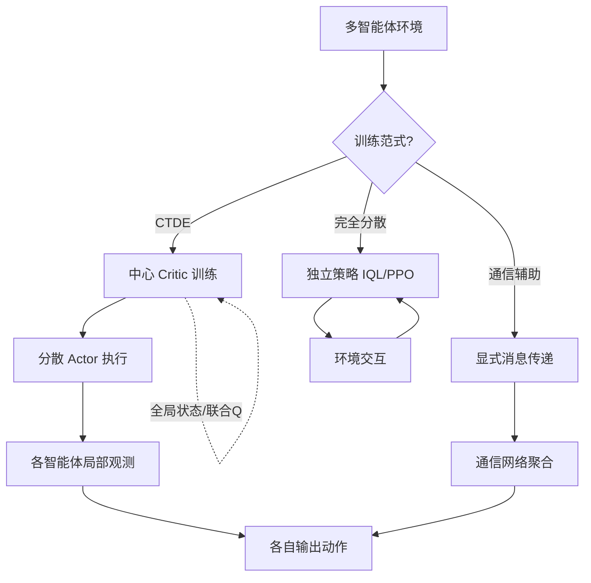

# 多智能体系统

## 1. 多智能体强化学习 MARL

### 范式分类
| 范式 | 训练 | 执行 | 通信 | 代表 |
|------|------|------|------|------|
| 集中训练集中执行(CTCE) | 共享信息 | 共享决策 | 需要 | 非MD痛点 |
| 集中训练分散执行(CTDE) | 共享信息 | 各自决策 | 不需要 | MADDPG / QMIX |
| 完全分散(ID) | 各自独立 | 各自决策 | 无 | IQL / 独立PPO |
| 通信辅助 | 集中+通信 | 分散+消息 | 显式通信 | CommNet / TarMAC |

### 环境分类

| 环境类型 | 奖励结构 | 目标 | 代表场景 |
|---------|---------|------|---------|
| 完全合作 | 共享奖励 | 团队最大 | 无人机编队 |
| 完全竞争 | 零和奖励 | 个体最大 | 对抗游戏 |
| 混合 | 个体+共享 | 个人+团队 | 足球、MOBA |
| 利他 | 自身+他人 | 社会总福利 | 交通调度 |

### CTDE 架构

```mermaid
graph TD
    subgraph 集中训练(Centralized Training)
    A[全局状态 s_t] --> B[中心评论家]
    B --> C[Joint Q值 / 优势]
    end
    subgraph 分散执行(Decentralized Execution)
    D[智能体1观测 o¹] -->     E["策略网络 π¹(o¹)"]
    F[智能体2观测 o²] --> G["策略网络 π²(o²)"]
    H[智能体N观测 o^N] --> I["策略网络 π^N(o^N)"]
    E --> J[动作 a¹]
    G --> K[动作 a²]
    I --> L[动作 a^N]
    end
    C -.->|参数共享| E
    C -.-> G
    C -.-> I
```

## 2. 主要算法

### MADDPG
- **中心化评论家**：每个智能体拥有中心化 Q 函数
- **分散化演员**：仅用局部观测决策
- **适用于**：合作 / 竞争 / 混合环境

### MADDPG 简化实现

```python
import torch
import torch.nn as nn
import torch.optim as optim
import numpy as np
from collections import deque
import random

class Actor(nn.Module):
    def __init__(self, obs_dim, action_dim, hidden=64):
        super().__init__()
        self.net = nn.Sequential(
            nn.Linear(obs_dim, hidden),
            nn.ReLU(),
            nn.Linear(hidden, hidden),
            nn.ReLU(),
            nn.Linear(hidden, action_dim),
            nn.Tanh()
        )

    def forward(self, obs):
        return self.net(obs)

class Critic(nn.Module):
    def __init__(self, n_agents, obs_dims, action_dims, hidden=64):
        super().__init__()
        total_obs = sum(obs_dims)
        total_act = sum(action_dims)
        self.net = nn.Sequential(
            nn.Linear(total_obs + total_act, hidden),
            nn.ReLU(),
            nn.Linear(hidden, hidden),
            nn.ReLU(),
            nn.Linear(hidden, 1)
        )
        self.n_agents = n_agents
        self.obs_dims = obs_dims
        self.action_dims = action_dims

    def forward(self, obs_list, act_list):
        x = torch.cat(obs_list + act_list, dim=-1)
        return self.net(x)

class ReplayBuffer:
    def __init__(self, capacity=100000):
        self.buffer = deque(maxlen=capacity)

    def push(self, obs_list, act_list, reward_list, next_obs_list, done_list):
        self.buffer.append((obs_list, act_list, reward_list, next_obs_list, done_list))

    def sample(self, batch_size):
        batch = random.sample(self.buffer, batch_size)
        obs_list = [torch.stack([b[0][i] for b in batch]) for i in range(len(batch[0][0]))]
        act_list = [torch.stack([b[1][i] for b in batch]) for i in range(len(batch[0][1]))]
        reward_list = torch.stack([torch.tensor(b[2]) for b in batch])
        next_obs_list = [torch.stack([b[3][i] for b in batch]) for i in range(len(batch[0][3]))]
        done_list = torch.stack([torch.tensor(b[4], dtype=torch.float32) for b in batch])
        return obs_list, act_list, reward_list, next_obs_list, done_list

    def __len__(self):
        return len(self.buffer)

class MADDPGAgent:
    def __init__(self, obs_dim, action_dim, actor_lr=1e-3, critic_lr=1e-3, gamma=0.95):
        self.actor = Actor(obs_dim, action_dim)
        self.critic = None
        self.target_actor = Actor(obs_dim, action_dim)
        self.target_critic = None
        self.target_actor.load_state_dict(self.actor.state_dict())
        self.actor_optimizer = optim.Adam(self.actor.parameters(), lr=actor_lr)
        self.gamma = gamma
        self.action_dim = action_dim

    def set_critic(self, critic):
        self.critic = critic
        self.target_critic = Critic(
            critic.n_agents, critic.obs_dims, critic.action_dims
        )
        self.target_critic.load_state_dict(critic.state_dict())
        self.critic_optimizer = optim.Adam(critic.parameters(), lr=1e-3)

    def select_action(self, obs, noise=0.1):
        obs_t = torch.FloatTensor(obs).unsqueeze(0)
        action = self.actor(obs_t).detach().numpy().squeeze(0)
        action += noise * np.random.randn(self.action_dim)
        return np.clip(action, -1, 1)

    def update(self, replay_buffer, batch_size, agent_idx, agents):
        if len(replay_buffer) < batch_size:
            return
        obs_list, act_list, reward_list, next_obs_list, done_list = replay_buffer.sample(batch_size)
        agent_rewards = reward_list[:, agent_idx]
        agent_dones = done_list[:, agent_idx]

        with torch.no_grad():
            next_acts = []
            for i, agent in enumerate(agents):
                next_acts.append(agent.target_actor(next_obs_list[i]))
            target_q = self.target_critic(next_obs_list, next_acts)
            target_q = target_q.squeeze()
            target_value = agent_rewards + self.gamma * target_q * (1 - agent_dones)

        current_q = self.critic(obs_list, act_list).squeeze()
        critic_loss = nn.MSELoss()(current_q, target_value)
        self.critic_optimizer.zero_grad()
        critic_loss.backward()
        self.critic_optimizer.step()

        new_acts = act_list.copy()
        new_acts[agent_idx] = self.actor(obs_list[agent_idx])
        actor_loss = -self.critic(obs_list, new_acts).mean()
        self.actor_optimizer.zero_grad()
        actor_loss.backward()
        self.actor_optimizer.step()
```

### QMIX / VDN
- **值分解**：Q_total = 各 Q_i 的单调组合
- **QMIX**：混合网络保证单调性
- **VDN**：简单相加分解

### QMIX Mixing Network

```python
import torch
import torch.nn as nn

class QMIXMixer(nn.Module):
    def __init__(self, n_agents, state_dim, hypernet_hidden=64):
        super().__init__()
        self.n_agents = n_agents
        self.state_dim = state_dim
        self.hyper_w1 = nn.Sequential(
            nn.Linear(state_dim, hypernet_hidden),
            nn.ReLU(),
            nn.Linear(hypernet_hidden, n_agents * n_agents)
        )
        self.hyper_w2 = nn.Sequential(
            nn.Linear(state_dim, hypernet_hidden),
            nn.ReLU(),
            nn.Linear(hypernet_hidden, n_agents)
        )
        self.hyper_b1 = nn.Linear(state_dim, n_agents)
        self.hyper_b2 = nn.Sequential(
            nn.Linear(state_dim, hypernet_hidden),
            nn.ReLU(),
            nn.Linear(hypernet_hidden, 1)
        )

    def forward(self, agent_qs, states):
        batch_size = agent_qs.size(0)
        w1 = self.hyper_w1(states).view(batch_size, self.n_agents, self.n_agents)
        b1 = self.hyper_b1(states).view(batch_size, 1, self.n_agents)
        w2 = self.hyper_w2(states).view(batch_size, self.n_agents, 1)
        b2 = self.hyper_b2(states).view(batch_size, 1, 1)
        w1 = torch.abs(w1)
        w2 = torch.abs(w2)
        hidden = torch.bmm(agent_qs.view(batch_size, 1, self.n_agents), w1) + b1
        hidden = torch.relu(hidden)
        q_total = torch.bmm(hidden, w2) + b2
        return q_total.view(batch_size, -1)

class QMIXAgent:
    def __init__(self, obs_dim, action_dim, hidden=64):
        self.q_net = nn.Sequential(
            nn.Linear(obs_dim, hidden),
            nn.ReLU(),
            nn.Linear(hidden, hidden),
            nn.ReLU(),
            nn.Linear(hidden, action_dim)
        )

    def forward(self, obs):
        return self.q_net(obs)
```

### MAPPO (CTDE)
- PPO 的多智能体版本
- CTDE + PPO 裁剪
- StarCraft II 战舰 SOTA

### MARL 算法对比

| 算法 | 类型 | 值分解 | 策略 | 适用规模 | 代表场景 |
|------|------|--------|------|---------|---------|
| IQL | 独立 | 无 | Q-Learning | 小-中 | 简单合作 |
| VDN | 值分解 | Q=ΣQ_i | DQN | 中 | 合作任务 |
| QMIX | 值分解 | Q=f(Q_i) | DQN | 中 | SMAC |
| MADDPG | CTDE | 无 | DDPG | 小 | 物理环境 |
| MAPPO | CTDE | 无 | PPO | 中-大 | SMAC/MFE |
| COMA | CTDE | 反事实基线 | 策略梯度 | 小 | 合作 |
| FACMAC | CTDE | 混合+连续 | 确定性 | 中 | 连续控制 |

## 3. 多智能体通信

### 通信协议
- **显式通信**：智能体直接传递消息
- **隐式通信**：行为观察间接传递
- **通信学习**：学习何时/向谁/传什么

### 通信协议对比

| 协议 | 带宽需求 | 可解释性 | 灵活度 | 代表方法 |
|------|---------|---------|-------|---------|
| 广播 | 高 | 高 | 低 | CommNet |
| 选择性通信 | 中 | 中 | 高 | TarMAC |
| 注意力通信 | 中 | 低 | 高 | ATOC |
| 隐式通信 | 无 | 低 | 中 | MADDPG |
| 图通信 | 低 | 高 | 高 | GNN+MARL |

## 4. 应用场景

| 场景 | 任务 | 特点 |
|------|------|------|
| 自动驾驶 | 多车协同 | 安全优先 |
| 无人机编队 | 协同探索 | 资源约束 |
| 交通信号 | 多路口调度 | 实时优化 |
| 游戏 | Dota 2/StarCraft II | 复杂交互 |
| 机器人仓库 | 多机调度 | 避碰协作 |
| 能源网络 | 电网调度 | 长期规划 |

## 5. 2025-2026 趋势
- **LLM 作为智能体大脑**：自然语言协调
- **大规模 MARL**：百级智能体
- **Human-AI 协作**：人机混合团队
- **迁移 MARL**：训练任务迁移到实际

### MARL 挑战

| 挑战 | 描述 | 研究方向 |
|------|------|---------|
| 非平稳性 | 其他智能体策略变化 | CTDE、元学习 |
| 可扩展性 | 智能体数量爆炸 | 均值场、图分解 |
| 信用分配 | 奖励归属难 | COMA、反事实基线 |
| 通信带宽 | 大量信息交换 | 通信压缩、注意力 |
| 异构性 | 智能体能力不同 | 参数共享+个性化 |

## 6. 实现案例：独立 Q-Learning（IQL）多智能体陷阱

最朴素的多智能体方案是每个智能体独立用 Q-Learning，但环境对他人而言非平稳。下面演示两个智能体抢同一资源的冲突场景。

```python
import numpy as np

# 两个智能体共享 3 个资源格，同时选同一格则冲突(无奖励)
n_resources = 3
n_agents = 2
q_tables = [np.zeros(n_resources) for _ in range(n_agents)]
eps = 0.2; gamma = 0.9; lr = 0.1
episodes = 2000

def select(a, s):
    if np.random.random() < eps:
        return np.random.randint(n_resources)
    return int(np.argmax(q_tables[a]))

collisions = 0
for ep in range(episodes):
    a0 = select(0, 0); a1 = select(1, 0)
    if a0 == a1:  # 冲突：双方都拿不到资源
        collisions += 1
        r0 = r1 = 0.0
    else:
        r0 = 1.0 if a0 == np.argmax(q_tables[0]) else 0.0  # 简单奖励
        r1 = 1.0 if a1 == np.argmax(q_tables[1]) else 0.0
    # 独立更新（忽略对方存在 -> 环境对单个智能体非平稳）
    q_tables[0][a0] += lr * (r0 + gamma * np.max(q_tables[0]) - q_tables[0][a0])
    q_tables[1][a1] += lr * (r1 + gamma * np.max(q_tables[1]) - q_tables[1][a1])

print(f"独立 Q-Learning {episodes} 局后冲突率 = {collisions / episodes:.2%}")
print("说明: 缺乏协调导致高冲突率，这正是 CTDE/MAPPO 要解决的问题")
```

### 案例：MAPPO 角色化协同（简化实现）

在 CTDE 范式下，中心 Critic 能观测全局状态，分散 Actor 仅用局部观测。下面给出 MAPPO 训练一步的简化骨架。

```python
import torch
import torch.nn as nn
import torch.optim as optim
import numpy as np

class MAPPOAgent(nn.Module):
    def __init__(self, obs_dim, act_dim, hidden=64):
        super().__init__()
        self.actor = nn.Sequential(nn.Linear(obs_dim, hidden), nn.ReLU(),
                                   nn.Linear(hidden, act_dim))
        self.critic = nn.Sequential(nn.Linear(obs_dim, hidden), nn.ReLU(),
                                    nn.Linear(hidden, 1))  # 中心 Critic 用全局状态
    def act(self, obs):
        return int(torch.argmax(self.actor(torch.FloatTensor(obs))))
    def value(self, global_state):
        return self.critic(torch.FloatTensor(global_state))

# 两个智能体共享参数（参数共享是 MAPPO 的常用技巧）
agent = MAPPOAgent(obs_dim=4, act_dim=2)
opt = optim.Adam(agent.parameters(), lr=3e-4)

# 单步更新示意：中心 Critic 提供全局优势基线
obs_list = [np.random.randn(4), np.random.randn(4)]
global_state = np.concatenate(obs_list)
team_reward = 1.0
values = agent.value(global_state)
action_logits = torch.stack([agent.actor(torch.FloatTensor(o)) for o in obs_list])
# 实际 MAPPO 用 GAE + 裁剪；此处仅展示中心化价值基线思想
advantage = torch.tensor(team_reward) - values.detach()
policy_loss = -(action_logits.mean() * advantage).mean()
value_loss = (values - torch.tensor(team_reward)).pow(2).mean()
opt.zero_grad(); (policy_loss + value_loss).backward(); opt.step()
print("MAPPO 中心化 Critic 一步更新完成")
```

### 多智能体训练范式流程图


