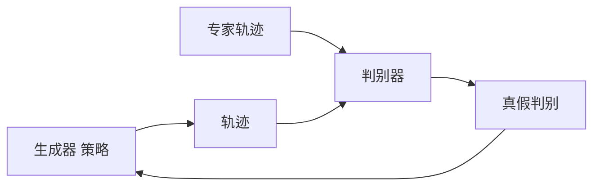

# 逆强化学习与模仿学习

## 1. 模仿学习 Imitation Learning

### 定义
从专家示范中学习策略，无需奖励函数设计。

### 行为克隆 Behavior Cloning
- **监督学习**：(s, a*) → π_θ(a|s)
- **问题**：分布偏移（协变量漂移）
- **修复**：DAgger（专家交互式纠正）

### 行为克隆实现

```python
import torch
import torch.nn as nn
import torch.optim as optim
from torch.utils.data import DataLoader, TensorDataset

class BehaviorClone(nn.Module):
    def __init__(self, state_dim, action_dim, hidden=128):
        super().__init__()
        self.net = nn.Sequential(
            nn.Linear(state_dim, hidden),
            nn.ReLU(),
            nn.Linear(hidden, hidden),
            nn.ReLU(),
            nn.Linear(hidden, action_dim)
        )

    def forward(self, x):
        return self.net(x)

def train_bc(expert_states, expert_actions, epochs=100, lr=1e-3):
    model = BehaviorClone(expert_states.shape[1], expert_actions.shape[1])
    optimizer = optim.Adam(model.parameters(), lr=lr)
    dataset = TensorDataset(
        torch.FloatTensor(expert_states),
        torch.FloatTensor(expert_actions)
    )
    loader = DataLoader(dataset, batch_size=64, shuffle=True)
    for epoch in range(epochs):
        for states, actions in loader:
            pred = model(states)
            loss = nn.MSELoss()(pred, actions)
            optimizer.zero_grad()
            loss.backward()
            optimizer.step()
    return model

def bc_rollout(model, env, max_steps=1000):
    state, _ = env.reset()
    trajectory = []
    for _ in range(max_steps):
        state_t = torch.FloatTensor(state).unsqueeze(0)
        with torch.no_grad():
            action = model(state_t).squeeze(0).numpy()
        next_state, reward, done, _, _ = env.step(action)
        trajectory.append((state, action, reward, next_state, done))
        state = next_state
        if done:
            break
    return trajectory
```

### DAgger（Dataset Aggregation）
1. 用当前策略收集数据
2. 专家为收集的状态标注动作
3. 扩充数据集
4. 重新训练策略

### DAgger 伪代码实现

```python
import numpy as np

class DAgger:
    def __init__(self, policy, expert, max_iterations=100, max_steps=500):
        self.policy = policy
        self.expert = expert
        self.max_iterations = max_iterations
        self.max_steps = max_steps
        self.dataset_states = []
        self.dataset_actions = []

    def initialize_with_expert(self, env, n_trajectories=10):
        for _ in range(n_trajectories):
            state, _ = env.reset()
            for _ in range(self.max_steps):
                action = self.expert(state)
                self.dataset_states.append(state)
                self.dataset_actions.append(action)
                next_state, _, done, _, _ = env.step(action)
                state = next_state
                if done:
                    break

    def run(self, env):
        self.initialize_with_expert(env)
        dataset_states = np.array(self.dataset_states)
        dataset_actions = np.array(self.dataset_actions)

        for iteration in range(self.max_iterations):
            self.policy.train(dataset_states, dataset_actions)
            new_states = []
            state, _ = env.reset()
            for _ in range(self.max_steps):
                action = self.policy.predict(state)
                next_state, _, done, _, _ = env.step(action)
                new_states.append(state)
                state = next_state
                if done:
                    break

            for s in new_states:
                expert_action = self.expert(s)
                dataset_states = np.vstack([dataset_states, [s]])
                dataset_actions = np.vstack([dataset_actions, [expert_action]])

            if iteration % 10 == 0:
                self.policy.train(dataset_states, dataset_actions, epochs=50)

        return self.policy
```

### 分布偏移对比

| 方法 | 训练分布 | 测试分布 | 误差累积 |
|------|---------|---------|---------|
| 行为克隆 | 专家分布 | 策略分布 | 严重(O(T²)) |
| DAgger | 混合分布 | 策略分布 | 可控制(O(T)) |
| GAIL | 对抗对齐 | 策略分布 | 最小化 |
| IRL | 奖励匹配 | 最优策略 | 理论无偏 |

## 2. 逆强化学习 IRL

### 核心
从专家轨迹中推断奖励函数 R(s,a)
- **特征匹配**：策略的特征期望匹配专家
- **最大熵 IRL**：最大化轨迹概率的熵

### 方法对比
| 方法 | 输出 | 特点 |
|------|------|------|
| 最大熵 IRL | 奖励函数 | 概率建模 |
| GAIL | 策略 | GAN 式对抗训练 |
| AIRL | 奖励+策略 | 解耦奖励函数 |
| f-IRL | 奖励函数 | f散度框架 |
| IQ-Learn | Q函数 | 隐式奖励 |

### 最大熵 IRL 实现

```python
import torch
import torch.nn as nn
import torch.optim as optim

class RewardNet(nn.Module):
    def __init__(self, state_dim, action_dim, hidden=128):
        super().__init__()
        self.net = nn.Sequential(
            nn.Linear(state_dim + action_dim, hidden),
            nn.ReLU(),
            nn.Linear(hidden, hidden),
            nn.ReLU(),
            nn.Linear(hidden, 1)
        )

    def forward(self, state, action):
        x = torch.cat([state, action], dim=-1)
        return self.net(x)

class MaxEntIRL:
    def __init__(self, state_dim, action_dim, lr=1e-3):
        self.reward = RewardNet(state_dim, action_dim)
        self.optimizer = optim.Adam(self.reward.parameters(), lr=lr)

    def compute_gradient(self, expert_trajs, policy_samples, gamma=0.99):
        expert_features = self._compute_feature_expectations(expert_trajs, gamma)
        policy_features = self._compute_feature_expectations(policy_samples, gamma)
        feature_diff = expert_features - policy_features
        return feature_diff

    def _compute_feature_expectations(self, trajectories, gamma):
        features = []
        for traj in trajectories:
            G = 0
            for t, (s, a) in enumerate(traj):
                s_t = torch.FloatTensor(s).unsqueeze(0)
                a_t = torch.FloatTensor(a).unsqueeze(0)
                r = self.reward(s_t, a_t)
                G += (gamma ** t) * r.detach().numpy()
            features.append(G)
        return torch.tensor(np.mean(features, axis=0))

    def update(self, expert_trajs, policy_samples, gamma=0.99):
        expert_features = self._compute_feature_expectations(expert_trajs, gamma)
        policy_features = self._compute_feature_expectations(policy_samples, gamma)
        loss = -(expert_features - policy_features).mean()
        self.optimizer.zero_grad()
        loss.backward()
        self.optimizer.step()
```

## 3. GAIL（Generative Adversarial Imitation Learning）



- **生成器**：策略 π_θ 生成轨迹
- **判别器**：区分专家和生成轨迹
- **奖励**：D(s,a) = -log(1 - D(s,a))

### GAIL 判别器与生成器实现

```python
import torch
import torch.nn as nn
import torch.optim as optim

class Discriminator(nn.Module):
    def __init__(self, state_dim, action_dim, hidden=128):
        super().__init__()
        self.net = nn.Sequential(
            nn.Linear(state_dim + action_dim, hidden),
            nn.Tanh(),
            nn.Linear(hidden, hidden),
            nn.Tanh(),
            nn.Linear(hidden, 1),
            nn.Sigmoid()
        )

    def forward(self, state, action):
        x = torch.cat([state, action], dim=-1)
        return self.net(x)

class GeneratorPolicy(nn.Module):
    def __init__(self, state_dim, action_dim, hidden=128):
        super().__init__()
        self.fc1 = nn.Linear(state_dim, hidden)
        self.fc2 = nn.Linear(hidden, hidden)
        self.mean = nn.Linear(hidden, action_dim)
        self.log_std = nn.Parameter(torch.zeros(action_dim))

    def forward(self, state):
        x = torch.relu(self.fc1(state))
        x = torch.relu(self.fc2(x))
        mean = self.mean(x)
        std = torch.exp(self.log_std)
        return mean, std

    def sample(self, state):
        mean, std = self.forward(state)
        dist = torch.distributions.Normal(mean, std)
        action = dist.rsample()
        log_prob = dist.log_prob(action).sum(-1)
        return torch.tanh(action), log_prob

class GAIL:
    def __init__(self, state_dim, action_dim, lr_d=1e-3, lr_g=1e-4):
        self.discriminator = Discriminator(state_dim, action_dim)
        self.generator = GeneratorPolicy(state_dim, action_dim)
        self.d_optimizer = optim.Adam(self.discriminator.parameters(), lr=lr_d)
        self.g_optimizer = optim.Adam(self.generator.parameters(), lr=lr_g)

    def update_discriminator(self, expert_states, expert_actions, gen_states, gen_actions):
        expert_score = self.discriminator(expert_states, expert_actions)
        gen_score = self.discriminator(gen_states, gen_actions)
        loss = -torch.log(expert_score + 1e-8).mean() - torch.log(1 - gen_score + 1e-8).mean()
        self.d_optimizer.zero_grad()
        loss.backward()
        self.d_optimizer.step()
        return loss.item()

    def get_reward(self, states, actions):
        with torch.no_grad():
            d = self.discriminator(states, actions)
            return -torch.log(1 - d + 1e-8)

    def update_generator(self, states, actions):
        rewards = self.get_reward(states, actions)
        _, log_probs = self.generator.sample(states)
        loss = -(log_probs * rewards.squeeze()).mean()
        self.g_optimizer.zero_grad()
        loss.backward()
        self.g_optimizer.step()
        return loss.item()
```

## 4. 行为克隆 vs IRL vs GAIL

| 方法 | 数据效率 | 泛化性 | 复杂度 | 对抗性 | 奖励需求 |
|------|---------|--------|-------|-------|---------|
| 行为克隆 | 高 | 低（分布偏移） | 低 | 否 | 无需 |
| 最大熵 IRL | 低 | 高 | 高 | 否 | 提取奖励 |
| GAIL | 中 | 中 | 中 | 是 | 无需 |
| AIRL | 低 | 高 | 高 | 是 | 可迁移 |
| DAgger | 中 | 中 | 中 | 否 | 需专家 |

### IRL 方法对比

| 方法 | 目标函数 | 优化方式 | 优点 | 缺点 |
|------|---------|---------|------|------|
| 最大熵 IRL | max ΣlogP(τ) + H(P) | 梯度下降 | 概率解释好 | 需求解 MDP |
| 结构化最大边距 | max margin | 二次规划 | 鲁棒 | 计算慢 |
| LEARCH | 损失函数最小 | 梯度提升 | 可扩展 | 需要特征 |
| GCL | 最大熵+引导 | 策略梯度 | 高维可用 | 训练不稳定 |
| AIRL | 奖励+策略分解 | 对抗训练 | 奖励迁移 | 实现复杂 |

### 模仿学习应用对比

| 应用 | 推荐方法 | 数据来源 | 挑战 |
|------|---------|---------|------|
| 机器人操作 | BC + DAgger | 遥操作 | 精度要求高 |
| 自动驾驶 | GAIL + AIRL | 人类驾驶 | 安全关键 |
| 游戏AI | BC 初始化+GAIL | 人类回放 | 多样性 |
| 对话系统 | BC + RLHF | 人工标注 | 偏好主观 |
| 运动生成 | 最大熵 IRL | 运动捕捉 | 高维连续 |

## 5. 应用
- **机器人**：从演示学习操作
- **自动驾驶**：从人类驾驶学习
- **游戏**：从人类玩家学习

### 奖励函数设计对比

| 方式 | 优点 | 缺点 | 代表 |
|------|------|------|------|
| 人工设计 | 明确可控 | 任务依赖 | 规则 |
| IRL 推断 | 自动学习 | 计算量大 | 最大熵IRL |
| 对抗学习 | 免奖励设计 | 不稳定 | GAIL |
| RLHF | 对齐人类偏好 | 标注成本 | PPO+RM |
| 自奖励 | 无限数据 | 可能作弊 | Self-Rewarding |
