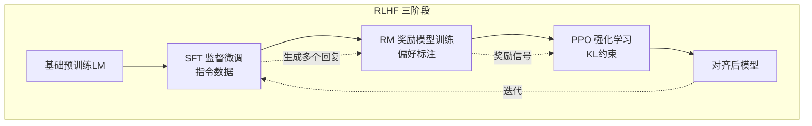
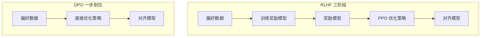
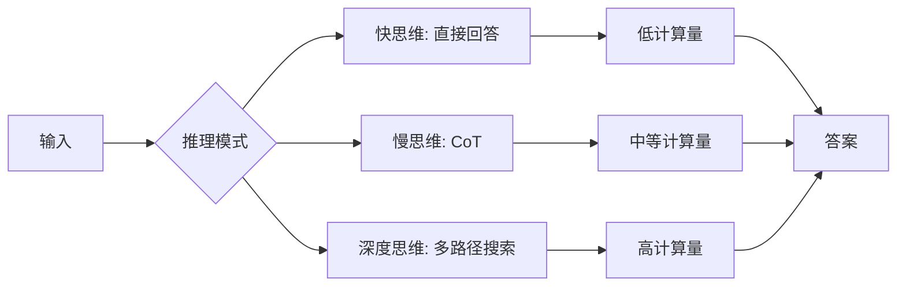

# RL 与 LLM

## 1. RLHF 全流程

### 训练框架



### 三步流程
1. **SFT（监督微调）**：指令数据微调，让模型学会对话格式
2. **RM（奖励模型训练）**：
   - 对同一 prompt 生成多个回复
   - 人工标注偏好（A > B）
   - Bradly-Terry 模型拟合偏好
3. **PPO 优化**：
   - 策略（当前 LM）生成回复 → 奖励模型打分
   - 参考 KL 惩罚防止偏离太远
   - 价值网络估计优势函数

### 奖励模型训练实现

```python
import torch
import torch.nn as nn
import torch.optim as optim

class RewardModel(nn.Module):
    def __init__(self, base_model, hidden_size=4096):
        super().__init__()
        self.base_model = base_model
        self.reward_head = nn.Linear(hidden_size, 1)

    def forward(self, input_ids, attention_mask=None):
        outputs = self.base_model(
            input_ids=input_ids,
            attention_mask=attention_mask,
            output_hidden_states=True
        )
        last_hidden = outputs.hidden_states[-1]
        if attention_mask is not None:
            last_token = (attention_mask.cumsum(dim=-1).argmax(dim=-1))
            pooled = last_hidden[torch.arange(last_hidden.size(0)), last_token]
        else:
            pooled = last_hidden[:, -1, :]
        return self.reward_head(pooled).squeeze(-1)

def train_reward_model(model, chosen_ids, rejected_ids, lr=1e-5):
    optimizer = optim.Adam(model.parameters(), lr=lr)
    for epoch in range(3):
        r_chosen = model(chosen_ids)
        r_rejected = model(rejected_ids)
        loss = -torch.log(torch.sigmoid(r_chosen - r_rejected) + 1e-8).mean()
        optimizer.zero_grad()
        loss.backward()
        optimizer.step()
    return model
```

### KL 散度惩罚
- **原因**：奖励模型可能被利用（Reward Hacking）
- **策略**：在奖励中加入 KL(π_θ||π_ref) 惩罚项
- **效果**：保持生成多样性，不偏离 SFT 太远

### PPO for LLM 实现（含 KL 散度）

```python
import torch
import torch.nn as nn
import torch.optim as optim
from torch.distributions import Categorical

class PPOForLLM:
    def __init__(self, policy, ref_policy, reward_model, lr=1e-5, kl_coef=0.02, clip_epsilon=0.2):
        self.policy = policy
        self.ref_policy = ref_policy
        self.reward_model = reward_model
        self.optimizer = optim.Adam(policy.parameters(), lr=lr)
        self.kl_coef = kl_coef
        self.clip_epsilon = clip_epsilon

    def compute_kl_penalty(self, log_probs, ref_log_probs):
        return (log_probs - ref_log_probs).mean()

    def compute_advantages(self, rewards, values, gamma=0.99, lam=0.95):
        advantages = []
        gae = 0
        next_value = 0
        for t in reversed(range(len(rewards))):
            delta = rewards[t] + gamma * next_value - values[t]
            gae = delta + gamma * lam * gae
            advantages.insert(0, gae)
            next_value = values[t]
        return advantages

    def update(self, query_ids, response_ids, attention_mask):
        with torch.no_grad():
            ref_logits = self.ref_policy(response_ids, attention_mask=attention_mask)
            ref_log_probs = ref_logits.log_softmax(-1)
        logits = self.policy(response_ids, attention_mask=attention_mask)
        log_probs = logits.log_softmax(-1)
        ratio = torch.exp(log_probs - ref_log_probs)

        rewards = self.reward_model(response_ids, attention_mask=attention_mask)
        kl_penalty = self.kl_coef * self.compute_kl_penalty(log_probs, ref_log_probs)
        adjusted_rewards = rewards - kl_penalty

        values = torch.zeros_like(adjusted_rewards)
        advantages = self.compute_advantages(adjusted_rewards, values)
        advantages = torch.tensor(advantages, device=response_ids.device)

        surr1 = ratio * advantages
        surr2 = torch.clamp(ratio, 1 - self.clip_epsilon, 1 + self.clip_epsilon) * advantages
        policy_loss = -torch.min(surr1, surr2).mean()

        self.optimizer.zero_grad()
        policy_loss.backward()
        self.optimizer.step()
        return policy_loss.item()
```

### RLHF 各阶段对比

| 阶段 | 模型 | 数据 | 目标 | 计算量 |
|------|------|------|------|-------|
| SFT | 基础LM | 指令-回复对 | 模仿对话 | 中等 |
| RM | 分类头+LM | 偏好对(A>B) | 评分偏好 | 小 |
| PPO | 策略LM+参考LM | prompts | 最大化RM分数 | 大 |
| DPO | 策略LM+参考LM | 偏好对 | 直接偏好 | 中 |

## 2. DPO（Direct Preference Optimization）

### 核心创新
- **隐式奖励**：从偏好对直接推导奖励函数
- **闭式解**：无需训练单独的奖励模型

### 公式
π_θ 优于 π_ref 需要满足：
E[log σ(β(log(π_θ(y_w|x) / π_ref(y_w|x)) - log(π_θ(y_l|x) / π_ref(y_l|x))))]

### DPO 损失实现

```python
import torch
import torch.nn as nn
import torch.optim as optim

class DPO:
    def __init__(self, policy, ref_policy, beta=0.1, lr=1e-5):
        self.policy = policy
        self.ref_policy = ref_policy
        self.beta = beta
        self.optimizer = optim.Adam(policy.parameters(), lr=lr)

    def compute_log_probs(self, model, input_ids, attention_mask):
        logits = model(input_ids, attention_mask=attention_mask).logits
        log_probs = logits.log_softmax(dim=-1)
        token_log_probs = log_probs.gather(-1, input_ids.unsqueeze(-1)).squeeze(-1)
        if attention_mask is not None:
            token_log_probs = token_log_probs * attention_mask
        return token_log_probs.sum(dim=-1)

    def loss(self, chosen_ids, rejected_ids, chosen_mask, rejected_mask):
        pi_chosen_logp = self.compute_log_probs(self.policy, chosen_ids, chosen_mask)
        pi_rejected_logp = self.compute_log_probs(self.policy, rejected_ids, rejected_mask)

        with torch.no_grad():
            ref_chosen_logp = self.compute_log_probs(self.ref_policy, chosen_ids, chosen_mask)
            ref_rejected_logp = self.compute_log_probs(self.ref_policy, rejected_ids, rejected_mask)

        pi_logratios = pi_chosen_logp - pi_rejected_logp
        ref_logratios = ref_chosen_logp - ref_rejected_logp

        logits = self.beta * (pi_logratios - ref_logratios)
        loss = -torch.log(torch.sigmoid(logits) + 1e-8).mean()
        return loss

    def update(self, chosen_ids, rejected_ids, chosen_mask, rejected_mask):
        loss = self.loss(chosen_ids, rejected_ids, chosen_mask, rejected_mask)
        self.optimizer.zero_grad()
        loss.backward()
        self.optimizer.step()
        return loss.item()
```

### DPO vs RLHF 对比



| 维度 | RLHF（PPO） | DPO |
|------|------------|-----|
| 奖励模型 | 需要训练 | 不需要 |
| 训练流程 | 3 步 | 1 步 |
| 实现复杂度 | 复杂 | 简单 |
| 稳定性 | 需要调参 | 稳定 |
| 推理能力 | PPO 更强 | 稍弱 |
| 内存占用 | 高(4个模型) | 低(2个模型) |
| 超参数 | 多(ε, λ, KL) | 少(β) |
| 对齐效果 | 好 | 好 |

### 对齐方法家族对比

| 方法 | 奖励模型 | 参考模型 | 数据需求 | 训练稳定性 | 代表工作 |
|------|---------|---------|---------|-----------|---------|
| RLHF(PPO) | 需要 | 需要 | 偏好对 | 低 | InstructGPT |
| DPO | 不需要 | 需要 | 偏好对 | 高 | DPO(2023) |
| GRPO | 不需要 | 不需要 | 可验证答案 | 高 | DeepSeek R1 |
| KTO | 不需要 | 需要 | 好/坏标签 | 高 | KTO(2024) |
| SimPO | 不需要 | 不需要 | 偏好对 | 高 | SimPO(2024) |
| SPIN | 不需要 | 自博弈 | 自身生成 | 中 | SPIN(2024) |
| ORPO | 不需要 | 不需要 | 偏好对 | 高 | ORPO(2024) |

## 3. GRPO（Group Relative Policy Optimization）

### DeepSeek R1 的核心技术
- **无价值网络**：GRPO 不需要 Critic 模型
- **分组采样**：为每个 prompt 生成一组回复 G
- **组内优势计算**：以组内平均奖励为基线

### 公式
A_i = (r_i - mean(r_1,...,r_G)) / std(r_1,...,r_G)

### 优势
- **节省内存**：无需价值网络（约 30% 显存）
- **适合推理强化**：DeepSeek R1 证明在推理任务上优于 PPO
- **实现简单**

### GRPO 组优势计算实现

```python
import torch
import torch.nn as nn
import torch.optim as optim

class GRPO:
    def __init__(self, policy, tokenizer, beta=0.04, lr=1e-6, group_size=8):
        self.policy = policy
        self.tokenizer = tokenizer
        self.beta = beta
        self.optimizer = optim.Adam(policy.parameters(), lr=lr)
        self.group_size = group_size

    def generate_group(self, prompts, max_length=512):
        batch_size = prompts.size(0)
        all_input_ids = []
        for _ in range(self.group_size):
            outputs = self.policy.generate(
                prompts,
                max_length=max_length,
                do_sample=True,
                temperature=0.8,
                pad_token_id=self.tokenizer.pad_token_id
            )
            all_input_ids.append(outputs)
        return torch.stack(all_input_ids, dim=1)

    def compute_group_advantages(self, rewards):
        mean_r = rewards.mean(dim=-1, keepdim=True)
        std_r = rewards.std(dim=-1, keepdim=True) + 1e-8
        return (rewards - mean_r) / std_r

    def compute_log_probs(self, input_ids):
        logits = self.policy(input_ids).logits
        log_probs = logits.log_softmax(dim=-1)
        return log_probs.gather(-1, input_ids.unsqueeze(-1)).squeeze(-1)

    def update(self, prompts, reward_fn):
        prompt_len = prompts.size(-1)
        responses = self.generate_group(prompts)
        batch_size, gs, seq_len = responses.shape
        responses_flat = responses.view(-1, seq_len)

        log_probs = self.compute_log_probs(responses_flat).view(batch_size, gs, -1)
        response_lp = log_probs[:, :, prompt_len:].sum(dim=-1)

        rewards = torch.zeros(batch_size, gs)
        for i in range(batch_size):
            for j in range(gs):
                text = self.tokenizer.decode(responses[i, j], skip_special_tokens=True)
                rewards[i, j] = reward_fn(text)

        advantages = self.compute_group_advantages(rewards)
        policy_loss = -(response_lp * advantages).mean()
        kl_loss = 0.5 * (log_probs[:, :, prompt_len:] ** 2).sum(dim=-1).mean()
        loss = policy_loss + self.beta * kl_loss

        self.optimizer.zero_grad()
        loss.backward()
        self.optimizer.step()
        return loss.item()
```

### PPO vs GRPO 对比

| 维度 | PPO | GRPO |
|------|-----|------|
| 价值网络 | 需要(Critic) | 不需要 |
| 基线方式 | 学习V(s) | 组内平均 |
| 优势函数 | A = R - V(s) | A = (r - μ)/σ |
| 显存占用 | 高(+30%) | 低 |
| 训练稳定性 | 依赖Critic | 自然稳定 |
| 适用场景 | 通用 | 推理/数学 |
| 实现复杂度 | 复杂 | 简单 |

## 4. 推理强化学习（2025-2026 热点）

### OpenAI o1/o3
- **扩展推理**：在推理阶段用 RL 训练，"想更多"得到更好结果
- **思维链 RL**：用 RL 训练模型生成更长、更好的推理链
- **验证者**：奖励基于最终答案正确性而非人类偏好

### DeepSeek R1
- **冷启动**：少量 CoT 示例让模型学会推理
- **GRPO 迭代**：多轮 GRPO 训练→拒绝采样→SFT→GRPO
- **自我进化**：模型生成的推理路径作为新训练数据

### 推理时扩展


### 推理 RL 方法对比

| 方法 | 奖励信号 | 搜索策略 | 代表模型 | 适用任务 |
|------|---------|---------|---------|---------|
| CoT SFT | 人工标注 | 无 | GPT-4 | 通用推理 |
| Self-Consistency | 多数投票 | 采样集成 | CoT-SC | 数学 |
| Tree-of-Thoughts | 中间评估 | 树搜索 | ToT | 规划 |
| REBASE | 结果奖励 | 集束搜索 | LLM+VM | 数学证明 |
| GRPO | 结果验证 | 组内采样 | DeepSeek R1 | 数学/代码 |
| PRM | 过程奖励 | 步骤搜索 | OpenAI o1 | 竞赛 |
| MCTS + RL | 终局奖励 | 蒙特卡洛树 | AlphaProof | IMO |

## 5. 对齐挑战与前沿

### 当前挑战
- **Reward Hacking**：模型找到评分函数的漏洞
- **多样性降低**：对齐导致输出模式固化
- **能力遗忘**：对齐可能降低推理/创造力
- **评估困难**：人类偏好主观不一致

### 前沿方法
- **Constitutional AI**：AI 自监督原则约束
- **Self-Rewarding**：模型自己生成和评估训练数据
- **SPIN**：自我博弈，区分自身生成和真实数据
- **KTO**：仅需好/坏标签，不需要偏好对
- **SimPO**：简化 DPO，去掉参考模型

### 对齐技术成熟度

| 技术 | 成熟度 | 数据效率 | 效果 | 大规模验证 |
|------|-------|---------|------|-----------|
| SFT | ★★★★★ | 高 | 基础 | 所有模型 |
| RLHF(PPO) | ★★★★☆ | 低 | 好 | GPT-4, Claude |
| DPO | ★★★★☆ | 中 | 好 | Llama 3 |
| GRPO | ★★★☆☆ | 中 | 很好 | DeepSeek R1 |
| KTO | ★★★☆☆ | 高 | 中 | Zephyr |
| SimPO | ★★★☆☆ | 高 | 好 | Llama, Mistral |
| Self-Rewarding | ★★☆☆☆ | 无限 | 中 | 实验性质 |

## 6. 实践指南

| 场景 | 推荐方法 | 数据需求 |
|------|---------|---------|
| 风格调整 | SFT + LoRA | 500-2000 示例 |
| 偏好对齐 | DPO | 1000-5000 对 |
| 推理增强 | GRPO | 可验证问题 |
| 安全对齐 | RLHF（PPO） | 偏好+原则 |
| 多轮对话 | DPO + 迭代 | 2000-10000 |
| 数学推理 | GRPO + CoT | 10000+可验证题 |
