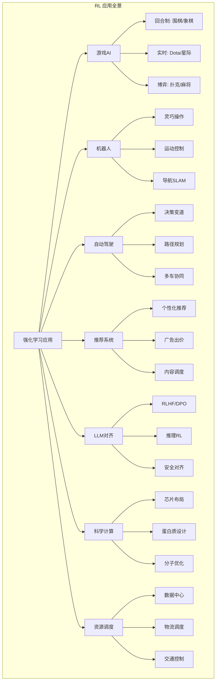
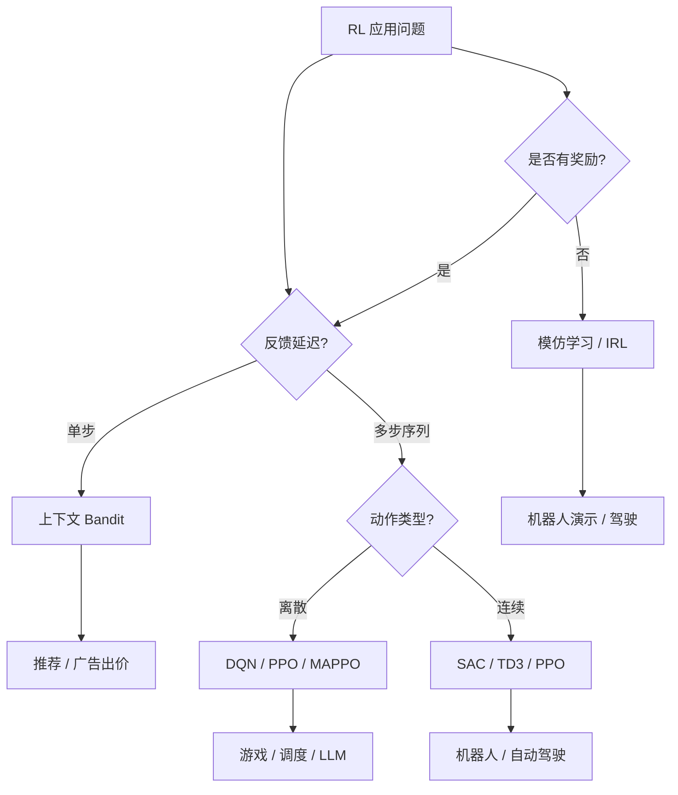

# 强化学习应用场景

## 1. 游戏 AI

| 领域 | 代表成果 | 方法 |
|------|---------|------|
| 围棋 | AlphaGo / AlphaZero | MCTS + RL |
| Atari | DQN / Rainbow | 值函数 |
| Dota 2 | OpenAI Five | PPO 大规模 |
| StarCraft II | AlphaStar | 模仿+RL+自我博弈 |
| 德州扑克 | Libratus / Pluribus | CFR 博弈论 |
| 战略游戏 | 星际/文明级 | 层次化 RL |
| Minecraft | VPT / DreamerV3 | 视频预训练+RL |

### RL 应用分类图



### 游戏 RL 里程碑

| 年份 | 成果 | 算法 | 意义 |
|------|------|------|------|
| 2013 | DQN Atari | DQN | 首次通用游戏AI |
| 2016 | AlphaGo | MCTS+CNN | 击败李世石 |
| 2017 | AlphaZero | 自对弈MCTS | 通用棋类 |
| 2019 | OpenAI Five | PPO+大规模 | Dota世界冠军 |
| 2019 | AlphaStar | 模仿+RL+SL | 星际大师 |
| 2022 | DreamerV3 | 世界模型 | 通用Minecraft |
| 2024 | 扩散策略 | 扩散+RL | 复杂连续控制 |

## 2. 机器人控制

### 任务类型
- **灵巧操作**：SAC + 手指触觉
- **行走/跑步**：PPO 四足机器人
- **抓取**：DRL + 视觉
- **组装**：精细操作

### Sim2Real 成功案例
- **ANYmal 行走**：RL 训练后直接部署
- **四足倒立**：模拟→真实零迁移
- **无人机竞速**：RL 超越人类

### 机器人 RL 算法对比

| 任务 | 推荐算法 | 奖励设计 | 挑战 |
|------|---------|---------|------|
| 灵巧手操作 | SAC + ASR | 目标达成 | Sim2Real 差距 |
| 四足运动 | PPO + 课程 | 速度+稳定 | 关节保护 |
| 无人机飞行 | TD3 + 扰动 | 轨迹跟踪 | 时延敏感 |
| 物体抓取 | HER + DDPG | 二值奖励 | 稀疏 |
| 组装任务 | 分层RL | 子任务奖励 | 长周期 |

### 环境封装实现 (Gym)

```python
import gymnasium as gym
import numpy as np
import torch
import torch.nn as nn

class CustomEnvWrapper(gym.Wrapper):
    def __init__(self, env, max_steps=1000):
        super().__init__(env)
        self.max_steps = max_steps
        self.step_count = 0

    def reset(self, **kwargs):
        self.step_count = 0
        obs, info = self.env.reset(**kwargs)
        return obs, info

    def step(self, action):
        obs, reward, terminated, truncated, info = self.env.step(action)
        self.step_count += 1
        if self.step_count >= self.max_steps:
            truncated = True
        return obs, reward, terminated, truncated, info

class NormalizedEnv(gym.ActionWrapper):
    def __init__(self, env):
        super().__init__(env)
        self.action_space = gym.spaces.Box(
            low=-1, high=1,
            shape=env.action_space.shape,
            dtype=np.float32
        )

    def action(self, action):
        low = self.env.action_space.low
        high = self.env.action_space.high
        action = low + (action + 1.0) * 0.5 * (high - low)
        action = np.clip(action, low, high)
        return action

def make_env(env_id, seed=0):
    env = gym.make(env_id)
    env = NormalizedEnv(env)
    env = CustomEnvWrapper(env)
    env.reset(seed=seed)
    return env
```

### RL 训练循环模板

```python
import time
from collections import deque

class RLTrainer:
    def __init__(self, agent, env, eval_env=None):
        self.agent = agent
        self.env = env
        self.eval_env = eval_env or env
        self.episode_returns = deque(maxlen=100)

    def train_episode(self, render=False):
        state, _ = self.env.reset()
        done = False
        episode_return = 0
        episode_steps = 0
        states, actions, rewards = [], [], []

        while not done:
            action = self.agent.select_action(state)
            next_state, reward, terminated, truncated, _ = self.env.step(action)
            done = terminated or truncated

            states.append(state)
            actions.append(action)
            rewards.append(reward)

            state = next_state
            episode_return += reward
            episode_steps += 1

            if render:
                self.env.render()

        return states, actions, rewards, episode_return, episode_steps

    def evaluate(self, n_episodes=10):
        returns = []
        for _ in range(n_episodes):
            state, _ = self.eval_env.reset()
            done = False
            ep_return = 0
            while not done:
                action = self.agent.select_action(state, eval_mode=True)
                state, reward, terminated, truncated, _ = self.eval_env.step(action)
                done = terminated or truncated
                ep_return += reward
            returns.append(ep_return)
        return np.mean(returns), np.std(returns)

    def train(self, total_steps=1000000, log_interval=10000):
        start_time = time.time()
        step_count = 0

        while step_count < total_steps:
            states, actions, rewards, ep_return, ep_steps = self.train_episode()
            self.episode_returns.append(ep_return)
            step_count += ep_steps

            self.agent.update(states, actions, rewards)

            if step_count % log_interval == 0:
                mean_return = np.mean(self.episode_returns) if self.episode_returns else 0
                eval_return, eval_std = self.evaluate()
                fps = log_interval / (time.time() - start_time)
                print(f"Step {step_count}: train_return={mean_return:.2f}, "
                      f"eval_return={eval_return:.2f}±{eval_std:.2f}, fps={fps:.0f}")
                start_time = time.time()
```

## 3. 自动驾驶

| 模块 | RL 角色 | 方法 |
|------|---------|------|
| 决策 | 变道/跟车 | PPO / SAC |
| 路径规划 | 路径选择 | 层次 RL |
| 交通路口 | 决策博弈 | 多智能体 RL |
| 速度控制 | 自适应巡航 | DDPG |
| 泊车 | 倒车入位 | 逆向 RL |

### 自动驾驶 RL 挑战

| 挑战 | 描述 | 解决方案 |
|------|------|---------|
| 安全性 | 错误决策致命 | 约束RL、安全屏障 |
| 多智能体 | 他车策略未知 | 对手建模、MARL |
| 泛化性 | 场景无穷 | Sim2Real、域随机化 |
| 实时性 | 毫秒级决策 | 轻量网络、推理加速 |
| 可解释性 | 黑箱决策 | 因果RL、注意力机制 |

## 4. 推荐系统

### RL 推荐
- **状态**：用户历史行为
- **动作**：推荐物品
- **奖励**：点击/购买/时长
- **挑战**：冷启动、探索利用

### 在线广告出价
- **RTB**：实时出价优化
- **预算约束**：RL 分配预算

### 推荐系统 RL 方法

| 方法 | 建模方式 | 优点 | 缺点 |
|------|---------|------|------|
| 上下文bandit | 单步选择 | 理论成熟 | 无长期 |
| MDP | 序列建模 | 长期规划 | 状态爆炸 |
| 分层RL | 多层级 | 可扩展 | 训练慢 |
| 离线RL | 日志学习 | 安全 | 分布偏移 |
| 因果RL | 因果关系 | 鲁棒 | 假设强 |

## 5. 资源调度

| 场景 | 决策 | 优化目标 |
|------|------|---------|
| 数据中心 | VM 分配 | 能耗/延迟 |
| 网络路由 | 路径选择 | 吞吐量 |
| 仓储物流 | 机器人派发 | 效率 |
| 电梯调度 | 层停靠 | 等待时间 |
| 电网调度 | 发电分配 | 成本/稳定 |

### 多智能体协作示例

```python
import torch
import torch.nn as nn
import torch.optim as optim
import numpy as np

class CommNet(nn.Module):
    def __init__(self, n_agents, obs_dim, action_dim, comm_dim=16, hidden=64):
        super().__init__()
        self.n_agents = n_agents
        self.encoder = nn.Linear(obs_dim, hidden)
        self.comm_encoder = nn.Linear(hidden, comm_dim)
        self.comm_decoder = nn.Linear(comm_dim + hidden, hidden)
        self.actor = nn.Linear(hidden, action_dim)
        self.critic = nn.Linear(hidden, 1)

    def forward(self, obs_list):
        batch_size = obs_list[0].size(0)
        encoded = [torch.relu(self.encoder(o)) for o in obs_list]
        comm = [self.comm_encoder(e) for e in encoded]
        comm_mean = torch.stack(comm).mean(dim=0)
        combined = [torch.cat([e, comm_mean], dim=-1) for e in encoded]
        decoded = [torch.relu(self.comm_decoder(c)) for c in combined]
        actions = [torch.tanh(self.actor(d)) for d in decoded]
        values = [self.critic(d).squeeze(-1) for d in decoded]
        return actions, values

class MultiAgentCollaboration:
    def __init__(self, n_agents, obs_dim, action_dim, lr=1e-3):
        self.net = CommNet(n_agents, obs_dim, action_dim)
        self.optimizer = optim.Adam(self.net.parameters(), lr=lr)
        self.n_agents = n_agents

    def select_actions(self, obs_list, noise=0.1):
        actions, _ = self.net(obs_list)
        noisy_actions = []
        for a in actions:
            na = a + noise * torch.randn_like(a)
            noisy_actions.append(torch.clamp(na, -1, 1))
        return noisy_actions

    def update(self, obs_list, act_list, reward_list, next_obs_list):
        _, values = self.net(obs_list)
        with torch.no_grad():
            _, next_values = self.net(next_obs_list)

        total_loss = 0
        for i in range(self.n_agents):
            target = torch.tensor(reward_list[i]) + 0.99 * next_values[i]
            actor_loss = -values[i].mean()
            critic_loss = nn.MSELoss()(values[i], target)
            total_loss += actor_loss + critic_loss

        self.optimizer.zero_grad()
        total_loss.backward()
        self.optimizer.step()
```

## 6. 科学应用

### 芯片设计
- **Google Floorplanning**：RL 芯片布局
- **宏单元放置**：RL 自动放置
- **互连优化**：RL 缩短布线

### 生物
- **蛋白质折叠**：AlphaFold 部分 RL
- **分子生成**：RL 生成分子
- **药物设计**：RL 分子优化

### 科学应用 RL 对比

| 领域 | 任务 | 状态空间 | 动作空间 | 奖励 | 代表工作 |
|------|------|---------|---------|------|---------|
| 芯片布局 | 元件放置 | 网表 | 位置坐标 | 面积/功耗 | Google RL |
| 网络架构搜索 | 架构设计 | 网络状态 | 层操作 | 准确率 | NAS-RL |
| 蛋白设计 | 氨基酸序列 | 残基 | 替换 | 折叠能 | ProteinRL |
| 分子优化 | 分子编辑 | SMILES | 化学键改 | 药效/毒性 | GCPN |
| 实验设计 | 参数优化 | 实验条件 | 参数调整 | 实验结果 | BO-RL |

## 7. 2025-2026 趋势
- **RL for LLM** 成为最大 RL 应用
- **离线 RL 产品化**：无需交互的数据驱动部署
- **RL 安全**：安全约束的 RL
- **世界模型**：DreamerV3 / Sora 世界模拟
- **RL + 扩散模型**：扩散策略用于控制

### 各领域 RL 投入占比

| 应用领域 | 研究热度 | 工业落地 | 增长趋势 |
|---------|---------|---------|---------|
| LLM 对齐 | ★★★★★ | ★★★★★ | ↑↑↑ |
| 游戏 AI | ★★★★☆ | ★★★★☆ | → |
| 机器人 | ★★★★☆ | ★★★☆☆ | ↑↑ |
| 自动驾驶 | ★★★☆☆ | ★★☆☆☆ | → |
| 推荐系统 | ★★★☆☆ | ★★★★☆ | ↑ |
| 科学计算 | ★★☆☆☆ | ★☆☆☆☆ | ↑↑ |
| 资源调度 | ★★☆☆☆ | ★★★☆☆ | → |

## 8. 实现案例：Atari 上的 DQN 端到端训练

游戏 AI 是 RL 最经典的应用。下面用 stable-baselines3 + Atari 预处理器跑一个最小 DQN，并可视化训练回报趋势。

```python
import gymnasium as gym
import numpy as np
from stable_baselines3 import DQN
from stable_baselines3.common.atari_wrappers import AtariWrapper

# 注: 需安装 ale-py 与对应 ROM；此处以 Pong 为例
env = gym.make("PongNoFrameskip-v4")
env = AtariWrapper(env)  # 帧堆叠/灰度/跳帧等标准预处理

model = DQN("CnnPolicy", env, verbose=0, buffer_size=100000,
            learning_starts=10000, target_update_interval=1000,
            train_freq=4, gradient_steps=1, exploration_fraction=0.1)
model.learn(total_timesteps=200000)

# 评估并记录回报
ep_returns = []
for _ in range(10):
    s, _ = env.reset()
    done = False; total = 0
    while not done:
        a, _ = model.predict(s, deterministic=True)
        s, r, term, trunc, _ = env.step(a)
        done = term or trunc; total += r
    ep_returns.append(total)
print(f"Pong 平均得分 = {np.mean(ep_returns):.1f} (越高越好，DQN 通常 > 18)")
```

### 案例：推荐系统中的上下文 Bandit

推荐/出价问题常可建模为单步决策（Contextual Bandit）。下面用 ε-greedy 的 bandit 模拟「文章点击」优化。

```python
import numpy as np

np.random.seed(1)
n_articles = 4
# 每篇文章对用户上下文(2维)的真实点击率 = sigmoid(w·x)
true_w = np.random.randn(n_articles, 2)
user_context = np.random.randn(2)

def click_prob(a, x):
    return 1.0 / (1.0 + np.exp(-np.dot(true_w[a], x)))

# ε-greedy 上下文 bandit：根据上下文选择文章
counts = np.zeros(n_articles); values = np.zeros(n_articles)
clicks = 0
for t in range(5000):
    x = np.random.randn(2)
    if np.random.random() < 0.1:
        a = np.random.randint(n_articles)
    else:
        a = int(np.argmax(values))
    reward = 1.0 if np.random.random() < click_prob(a, x) else 0.0
    counts[a] += 1; values[a] += (reward - values[a]) / counts[a]
    clicks += reward

best = int(np.argmax([click_prob(a, user_context) for a in range(n_articles)]))
print(f"累计点击 = {clicks} / 5000")
print(f"最优文章理论上线率约 = {click_prob(best, user_context):.2%}")
```

### 应用场景—算法映射图


