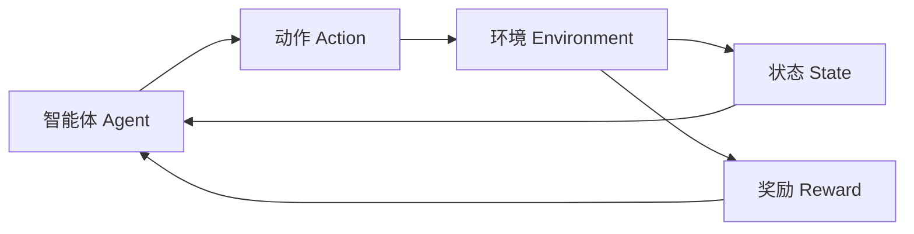
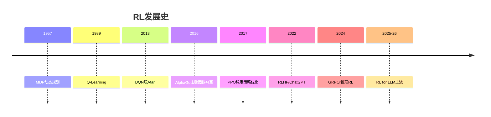

# 强化学习与决策

## 概述

强化学习（Reinforcement Learning, RL）是智能体通过与环境交互、最大化累积奖励来学习决策策略的范式。从 AlphaGo 到 ChatGPT 的 RLHF，RL 在现代 AI 中扮演关键角色。

## 目录

```
06-强化学习与决策/
├── README.md
├── 01-基础强化学习.md      # MDP/价值迭代/策略迭代/Q-Learning
├── 02-深度强化学习.md      # DQN/PPO/SAC/TD3/Rainbow
├── 03-策略优化.md          # 策略梯度/TRPO/PPO/GAE
├── 04-多智能体系统.md      # MADDPG/QMIX/多智能体通信
├── 05-逆强化学习与模仿.md  # IRL/GAIL/行为克隆
├── 06-RL与LLM.md           # RLHF/DPO/GRPO/偏好对齐
└── 07-应用场景.md          # 游戏/机器人/推荐/自动驾驶
```



## 核心概念

| 概念 | 说明 | 类比 |
|------|------|------|
| 状态 S | 环境的描述 | 棋盘局面 |
| 动作 A | 智能体的行为 | 落子位置 |
| 奖励 R | 行为的即时反馈 | 得分/扣分 |
| 策略 π | 状态→动作映射 | 下棋风格 |
| 价值 V(s) | 状态的长期价值 | 局面评估 |
| Q(s,a) | 状态-动作值 | 某步的价值 |
| 折扣 γ | 未来奖励的衰减 | 近见远疏 |

## 发展脉络


