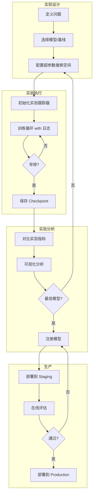
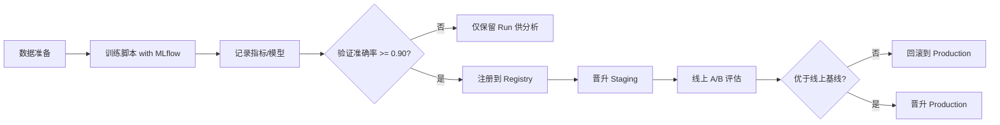
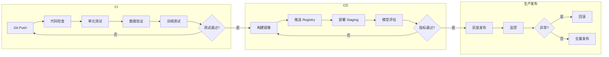
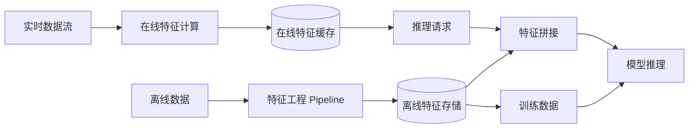

# MLOps 与实验管理

## 1. 实验跟踪

### 核心工具对比
| 工具 | 部署 | 核心功能 | 定价 | 适用场景 |
|------|------|---------|------|---------|
| MLflow | 自托管 | 实验跟踪 + 模型注册 + 部署 | 免费开源 | 企业内网、全流程管控 |
| Weights & Biases | SaaS/自托管 | 交互式可视化 + 报告 + 超参调优 | 免费团队版 + 企业付费 | 研究团队、协作需求强 |
| TensorBoard | 本地 | 训练过程可视化 | 免费 | TensorFlow/PyTorch 本地调试 |
| Optuna Dashboard | 自托管 | 超参数优化可视化 | 免费开源 | Optuna 用户 |
| Neptune | SaaS | 元数据追踪 + 仪表盘 | 免费版 + 按席位付费 | 大型团队、需要丰富元数据 |

### 实验记录要素
| 要素 | 说明 | 示例 |
|------|------|------|
| 超参数 | 模型配置参数 | lr=3e-5, batch_size=32, layers=12 |
| 指标 | 训练/验证评估指标 | train_loss=0.23, val_acc=0.915, F1=0.89 |
| 模型权重 | 模型 checkpoint | model_epoch_10.pt, best_model.pkl |
| 环境 | 运行时环境信息 | Python 3.11, torch 2.3, CUDA 12.1, A100-80G |
| 代码版本 | 代码版本标识 | git commit sha: a3f2c9e1 |
| 数据集版本 | 数据唯一标识 | data_hash: md5:e4c8d2, dataset_v2.1 |

### 代码示例

```python
# MLflow 实验记录
import mlflow
import mlflow.pytorch
from sklearn.metrics import accuracy_score

mlflow.set_tracking_uri("http://localhost:5000")
mlflow.set_experiment("text-classification-experiment")

with mlflow.start_run(run_name="bert-finetune-v2"):
    mlflow.log_param("model_name", "bert-base-chinese")
    mlflow.log_param("learning_rate", 3e-5)
    mlflow.log_param("batch_size", 32)
    mlflow.log_param("num_epochs", 10)

    model = train_model()
    val_acc = evaluate_model(model)

    mlflow.log_metric("val_accuracy", val_acc)
    mlflow.log_metric("val_loss", val_loss)
    mlflow.log_artifact("confusion_matrix.png")
    mlflow.pytorch.log_model(model, "model")

    mlflow.set_tag("team", "nlp-group")
    mlflow.set_tag("dataset", "news_2025_v2")
```

```python
# Weights & Biases 日志
import wandb

wandb.init(project="llm-finetune", config={
    "model": "llama-3-8b",
    "learning_rate": 2e-5,
    "batch_size": 16,
    "lora_r": 16,
    "lora_alpha": 32,
    "optimizer": "adamw_8bit",
})

for epoch in range(10):
    train_loss = train_one_epoch()
    val_loss, val_perplexity = validate()
    wandb.log({
        "epoch": epoch,
        "train/loss": train_loss,
        "val/loss": val_loss,
        "val/perplexity": val_perplexity,
        "learning_rate": scheduler.get_last_lr()[0],
    })

wandb.finish()
```

```python
# 随机种子固定（可复现性）
import random
import numpy as np
import torch

def set_seed(seed: int = 42):
    random.seed(seed)
    np.random.seed(seed)
    torch.manual_seed(seed)
    torch.cuda.manual_seed_all(seed)
    torch.backends.cudnn.deterministic = True
    torch.backends.cudnn.benchmark = False
    os.environ["PYTHONHASHSEED"] = str(seed)

set_seed(42)
```

```yaml
# DVC 配置 .dvc/config
[core]
    remote = myremote
[cache]
    type = symlink
    dir = .dvc/cache
['remote "myremote"']
    url = s3://my-bucket/dvc-store
    credentialpath = ~/.aws/credentials
```

```python
# Pipeline 构建 (ZenML)
from zenml import pipeline, step

@step
def load_data(path: str) -> pd.DataFrame:
    return pd.read_parquet(path)

@step
def preprocess(df: pd.DataFrame) -> pd.DataFrame:
    df = df.dropna()
    df["text_length"] = df["text"].str.len()
    return df

@step
def train_model(df: pd.DataFrame, lr: float) -> float:
    model = SomeModel(lr=lr)
    return model.train(df)

@step
def evaluate(model) -> dict:
    acc = model.accuracy()
    return {"accuracy": acc}

@pipeline
def ml_pipeline(data_path: str, lr: float = 0.001):
    df = load_data(data_path)
    df = preprocess(df)
    model = train_model(df, lr)
    metrics = evaluate(model)
    return metrics

pipeline_instance = ml_pipeline(data_path="./data/raw", lr=0.001)
pipeline_instance.run()
```

### Mermaid: 实验生命周期



## 1.5 实践案例

### 案例：端到端实验跟踪 + 自动注册

下面的案例演示如何在一个训练脚本中同时完成超参记录、指标跟踪、最佳模型注册到 MLflow Registry，并在达到阈值时自动打 Staging 标签。

```python
# 端到端实验跟踪与模型注册
import mlflow
import mlflow.pytorch
import mlflow.tracking
from mlflow.tracking import MlflowClient

EXPERIMENT_NAME = "text-classification-experiment"
REGISTER_MODEL_NAME = "bert-classifier-prod"

client = MlflowClient()

def train_and_register(train_df, val_df, lr=3e-5, batch_size=32, epochs=10):
    # 1. 创建或获取实验
    mlflow.set_experiment(EXPERIMENT_NAME)

    with mlflow.start_run(run_name="bert-finetune-v3") as run:
        run_id = run.info.run_id
        # 2. 记录超参数
        mlflow.log_params({
            "learning_rate": lr,
            "batch_size": batch_size,
            "num_epochs": epochs,
            "model_name": "bert-base-chinese",
        })

        # 3. 训练循环（伪代码）
        best_val_acc = 0.0
        for epoch in range(epochs):
            train_loss = train_one_epoch(train_df, lr, batch_size)
            val_acc, val_loss = evaluate(val_df)
            mlflow.log_metrics({
                "train_loss": train_loss,
                "val_accuracy": val_acc,
                "val_loss": val_loss,
            }, step=epoch)
            if val_acc > best_val_acc:
                best_val_acc = val_acc
                mlflow.pytorch.log_model(model, "model", registered_model_name=REGISTER_MODEL_NAME)

        # 4. 达到阈值自动晋升到 Staging
        if best_val_acc >= 0.90:
            latest_version = client.get_latest_versions(REGISTER_MODEL_NAME, stages=["None"])[0].version
            client.transition_model_version_stage(
                name=REGISTER_MODEL_NAME,
                version=latest_version,
                stage="Staging",
            )
            print(f"模型 v{latest_version} 已晋升到 Staging，验证准确率={best_val_acc:.3f}")
        return run_id

run_id = train_and_register(train_df, val_df)
```

### 实现案例：用 Evidently 检测数据漂移并触发告警

```python
# 数据漂移检测 + 阈值告警
from evidently.report import Report
from evidently.metric_preset import DataDriftPreset
import pandas as pd

reference_data = pd.read_csv("data/reference.csv")
current_data = pd.read_csv("data/current.csv")

report = Report(metrics=[DataDriftPreset()])
report.run(reference_data=reference_data, current_data=current_data)
result = report.as_dict()

# 汇总漂移特征数量
drifted_features = [
    m["metric"] for m in result["metrics"]
    if m.get("result", {}).get("drift_detected")
]

print(f"检测到 {len(drifted_features)} 个特征发生漂移")
if len(drifted_features) > 0:
    # 触发告警（实际可接入 Prometheus / 钉钉机器人）
    print("ALERT: 数据漂移超过阈值，建议重新训练")
```

### Mermaid: 训练-注册-上线闭环



## 2. 流水线编排

| 工具 | 类型 | 调度方式 | 失败处理 | 适用场景 |
|------|------|---------|---------|---------|
| Kubeflow | K8s 原生 | DAG + Argo | 自动重试 | GPU 训练、K8s 集群 |
| Apache Airflow | DAG | 时间/事件 | 重试 + 告警 | ETL、定时批处理 |
| Prefect | Python | 声明式 | 自动重试 + 通知 | 数据流水线 |
| Flyte | K8s | DAG | 类型安全重试 | ML 训练 + 推理 |
| ZenML | Python | 可组合步 | 缓存 + 重试 | MLOps 端到端 |

### Mermaid: CI/CD for ML



### Shell: MLflow 服务启动

```bash
# 启动 MLflow Tracking Server
mlflow server --host 0.0.0.0 --port 5000 \
    --backend-store-uri sqlite:///mlflow.db \
    --default-artifact-root ./mlruns

# MLflow 模型注册与部署
mlflow models serve -m runs:/<run_id>/model --port 5001
```

## 3. 模型注册与版本管理

### 模型注册表功能对比

| 平台 | 版本控制 | 阶段管理 | 部署集成 | 回滚 | 权限控制 |
|------|---------|---------|---------|------|---------|
| MLflow Registry | ✅ 语义版本 | Staging/Production/Archived | REST API + Docker | ✅ | 基础 RBAC |
| Hugging Face Hub | ✅ Git-LFS | 主分支 + 标签 | Inference API | ✅ | 细粒度 |
| Seldon Core | ✅ 自定义 | 金丝雀/蓝绿 | K8s 原生 | ✅ | K8s RBAC |
| BentoML | ✅ 语义版本 | Staging/Production | Yatai 平台 | ✅ | API 密钥 |

## 4. 生产监控

### 监控维度详解

| 维度 | 检测方法 | 告警阈值 | 响应策略 |
|------|---------|---------|---------|
| 数据漂移 | KS 检验 / PSI / 卡方检验 | PSI > 0.1 | 重新训练 / 特征回滚 |
| 概念漂移 | DDM / ADWIN / Page-Hinkley | 检测到变化 | 模型切换 / 增量更新 |
| 模型性能 | 在线 A/B 指标 | 指标下降 > 5% | 回滚 / 模型更新 |
| 系统状态 | P99 延迟 / QPS / GPU 利用率 | P99 > 2s / GPU > 90% | 扩容 / 限流 |

### Shell: 监控部署

```bash
# Prometheus + Grafana 部署 (docker-compose)
docker run -d --name prometheus -p 9090:9090 \
    -v prometheus.yml:/etc/prometheus/prometheus.yml prom/prometheus

docker run -d --name grafana -p 3000:3000 grafana/grafana

# Evidently 漂移报告
evidently calculate --data drifts --reference reference.csv --current current.csv
```

## 5. 特征存储 Feature Store

### 特征存储核心流程



### Feast 特征存储对比

| 特性 | Feast | Tecton | SageMaker Feature Store |
|------|-------|--------|------------------------|
| 开源 | ✅ 免费 | ❌ 商业 | ❌ 绑定 AWS |
| 时间点查询 | ✅ | ✅ | ✅ |
| 在线/离线一致性 | ✅ | ✅ | ✅ |
| 流式特征 | ✅ Kafka | ✅ 原生 | ✅ Kinesis |
| 部署复杂度 | 中 | 低 (托管) | 低 (托管) |

## 6. LLMOps 特有

| 领域 | 挑战 | 解决方案 | 工具 |
|------|------|---------|------|
| Prompt 管理 | 版本混乱、A/B 测试困难 | Prompt Registry + 版本控制 | LangSmith, PromptLayer |
| RAG 质量 | 检索召回低、生成不忠实 | RAGAS 评估、Retrieval 优化 | RAGAS, TruLens |
| 成本追踪 | Token 消耗不可控 | Token 计量 + 预算告警 | Helicone, LangFuse |
| 护栏系统 | 内容安全合规 | 输入/输出过滤器 + Guardrails | NeMo Guardrails, Guardrails AI |
| 幻觉检测 | 事实性错误 | 事实一致性验证 + 引用溯源 | SelfCheckGPT, FactScore |
