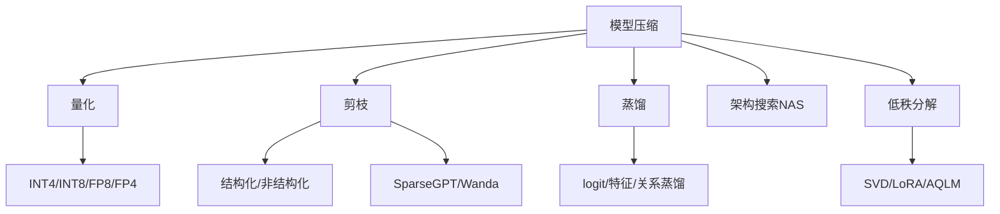
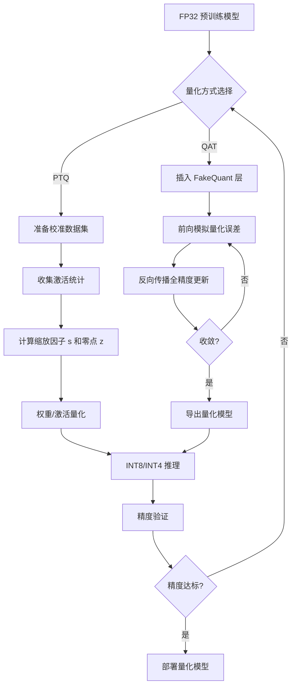
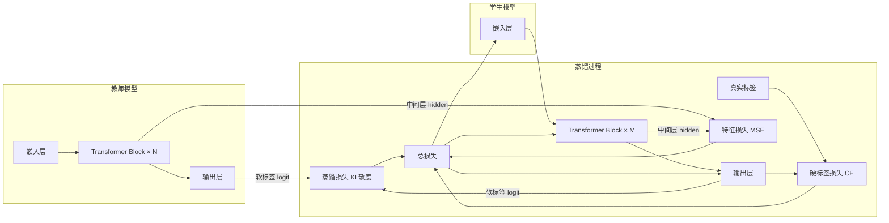

# 模型压缩

## 1. 压缩概览



### 压缩目标与权衡

| 目标 | 指标 | 常用方法 | 典型收益 |
|------|------|---------|---------|
| 减少存储 | 模型文件大小 | 量化 + 剪枝 | 4-16× 压缩 |
| 降低延迟 | P50/P99 推理时间 | 量化 + 结构化剪枝 | 2-4× 加速 |
| 降低显存 | GPU 内存占用 | 量化 INT4/NF4 | 4-8× 显存减少 |
| 降低能耗 | 每推理焦耳 | 量化 + 稀疏计算 | 2-3× 能效提升 |

## 2. 量化 Quantization

### 量化原理
- 将 FP32 权重映射到低精度整数表示
- **对称量化**：x_q = round(x / s)，s = max(|x|) / 2^(b-1)，z = 0
- **非对称量化**：x_q = round(x / s + z)，s = (max - min) / (2^b - 1)，z = round(-min / s)
- **量化误差**：ε = |x - s · (x_q - z)|，受离群值影响大

### 量化方式对比

| 方式 | 原理 | 是否需要训练 | 精度损失 | 适用模型 |
|------|------|------------|---------|---------|
| PTQ | 校准集统计权重分布 | 否 | 小 ~ 中 (1-3%) | CNN、小 Transformer |
| QAT | 前向模拟量化、反向全精 | 是 (5-10% 额外训练) | 最小 (<1%) | 对精度要求高的场景 |
| GPTQ | 列级量化 + OBS 补偿 | 否 (几小时校准) | 中等 (1-5%) | LLM 7B-70B |
| AWQ | 激活感知、保留重要通道 | 否 | 小 (1-2%) | LLM 部署首选 |
| SmoothQuant | 迁移量化难度到权重 | 否 | 小 (1-2%) | 激活难量化的 LLM |

### 精度格式

| 格式 | 位宽 | 指数位 | 尾数位 | 范围 | 应用 |
|------|------|-------|-------|------|------|
| FP32 | 32 | 8 | 23 | ±3.4×10³⁸ | 训练基准 |
| FP16 | 16 | 5 | 10 | ±65504 | 混合精度训练 |
| BF16 | 16 | 8 | 7 | ±3.4×10³⁸ | LLM 训练首选 |
| FP8 E4M3 | 8 | 4 | 3 | ±448 | H100 前向传播 |
| FP8 E5M2 | 8 | 5 | 2 | ±57344 | H100 反向传播 |
| INT8 | 8 | - | - | -128~127 | 推理主流 |
| INT4 | 4 | - | - | -8~7 | 超大模型推理 |
| NF4 | 4 | - | - | 归一化浮点 | QLoRA 微调 |
| FP4 E2M1 | 4 | 2 | 1 | ±6 | 新一代推理 |

### Mermaid: 量化流程



### 代码示例

```python
# PyTorch PTQ (训练后量化)
import torch
import torch.quantization as quant

model = torch.load("resnet50_fp32.pth")
model.eval()
model.cpu()

model.qconfig = quant.get_default_qconfig("fbgemm")
model = quant.prepare(model, inplace=False)

def calibrate(model, calib_loader):
    model.eval()
    with torch.no_grad():
        for images, _ in calib_loader:
            model(images)

calibrate(model, calibration_loader)

model = quant.convert(model, inplace=False)
torch.save(model.state_dict(), "resnet50_int8.pth")

scripted_model = torch.jit.script(model)
scripted_model.save("resnet50_int8.pt")
```

```python
# PyTorch QAT (量化感知训练)
import torch
import torch.quantization as quant

model = torch.load("resnet50_fp32.pth")
model.train()

model.qconfig = quant.get_default_qat_qconfig("fbgemm")
model = quant.prepare_qat(model, inplace=False)

optimizer = torch.optim.SGD(model.parameters(), lr=1e-5)
criterion = torch.nn.CrossEntropyLoss()

for epoch in range(5):
    for images, labels in train_loader:
        optimizer.zero_grad()
        outputs = model(images)
        loss = criterion(outputs, labels)
        loss.backward()
        optimizer.step()

model.eval()
model = quant.convert(model, inplace=False)
torch.save(model.state_dict(), "resnet50_qat_int8.pth")
```

```python
# 剪枝实现（非结构化）
import torch
import torch.nn.utils.prune as prune

model = torch.load("model.pth")

for name, module in model.named_modules():
    if isinstance(module, torch.nn.Linear):
        prune.l1_unstructured(module, name="weight", amount=0.5)

prune.remove(model.layer1[0], "weight")

sparsity = 0.0
total_params = 0
for name, param in model.named_buffers():
    if "weight_mask" in name:
        sparsity += param.sum().item()
        total_params += param.numel()

print(f"全局稀疏度: {1 - sparsity / total_params:.2%}")
```

```python
# 知识蒸馏实现
import torch
import torch.nn.functional as F

def distillation_loss(student_logits, teacher_logits, labels, T=4.0, alpha=0.7):
    soft_targets = F.softmax(teacher_logits / T, dim=-1)
    soft_prob = F.log_softmax(student_logits / T, dim=-1)
    distill_loss = F.kl_div(soft_prob, soft_targets, reduction="batchmean") * (T ** 2)

    ce_loss = F.cross_entropy(student_logits, labels)

    return alpha * distill_loss + (1 - alpha) * ce_loss

teacher_model = torch.load("teacher_bert.pth")
student_model = TinyBertForSequenceClassification.from_pretrained("tiny-bert")

teacher_model.eval()
optimizer = torch.optim.AdamW(student_model.parameters(), lr=2e-5)

for batch in train_dataloader:
    with torch.no_grad():
        teacher_logits = teacher_model(batch["input_ids"], batch["attention_mask"])

    student_logits = student_model(batch["input_ids"], batch["attention_mask"])
    loss = distillation_loss(student_logits, teacher_logits, batch["labels"], T=4.0, alpha=0.7)

    loss.backward()
    optimizer.step()
    optimizer.zero_grad()
```

```python
# GPTQ 调用 (auto-gptq)
from transformers import AutoModelForCausalLM, AutoTokenizer
from auto_gptq import AutoGPTQForCausalLM

model_name = "meta-llama/Llama-2-7b-hf"
tokenizer = AutoTokenizer.from_pretrained(model_name)

quantize_config = {
    "bits": 4,
    "group_size": 128,
    "desc_act": False,
    "damp_percent": 0.01,
}

model = AutoGPTQForCausalLM.from_pretrained(
    model_name,
    quantize_config,
    train_dataset=calibration_dataset,
)

model.quantize()
model.save_quantized("./llama2-7b-gptq-int4")

model = AutoGPTQForCausalLM.from_quantized(
    "./llama2-7b-gptq-int4",
    device="cuda:0",
    use_triton=True,
)
```

## 3. 剪枝 Pruning

### 非结构化剪枝
- 逐权重剪枝（权重=0），保留稀疏矩阵
- 可达到 90%+ 稀疏度
- 推理需要稀疏计算硬件/软件支持（如 NVIDIA 2:4 结构化稀疏）

### 结构化剪枝
- 剪掉整个通道/注意力头/层
- 天然加速，无需特殊硬件
- **SparseGPT**：一步剪枝无需重训，50% 稀疏度
- **Wanda**：基于权重和激活幅度的剪枝

### 剪枝方法对比

| 方法 | 类型 | 是否需要重训 | 稀疏度 | 硬件加速 | 精度损失 |
|------|------|------------|-------|---------|---------|
| 幅度剪枝 | 非结构化 | 是 | 50-90% | 稀疏 GPU | 中 |
| SparseGPT | 非结构化 | 否 | 50-70% | 稀疏 GPU | 小 |
| Wanda | 非结构化 | 否 | 50-60% | 稀疏 GPU | 小 |
| 通道剪枝 | 结构化 | 是 | 20-50% | 通用 GPU | 小-中 |
| 头剪枝 | 结构化 | 是 | 25-50% | 通用 GPU | 小 |
| 层剪枝 | 结构化 | 否 | 10-33% | 通用 GPU | 中-大 |

## 4. 知识蒸馏

### Mermaid: 蒸馏架构



### 蒸馏策略详解

| 策略 | 损失函数 | 对齐目标 | 适用场景 |
|------|---------|---------|---------|
| logit 蒸馏 | KL(softmax(s/T) || softmax(t/T)) | 类别概率分布 | 分类任务 |
| 特征蒸馏 | MSE(h_s, h_t) | 中间层 hidden state | 表示学习 |
| 关系蒸馏 | MSE(G_s, G_t) | 样本间相似度矩阵 | 检索/排序 |
| 自蒸馏 | KL(logits || logits) | 同一模型不同 epoch | 无大教师模型 |
| 对比蒸馏 | InfoNCE | 正负样本表示 | 对比学习 |

### 常见蒸馏方案

| 方案 | 教师 | 学生 | 参数量缩减 | 精度保持 |
|------|------|------|-----------|---------|
| DistilBERT | BERT-base | BERT-6层 | 40% | 97% |
| TinyBERT | BERT-base | BERT-4层 | 75% | 95% |
| MiniLM | BERT-large | BERT-6层 | 75% | 96% |
| MiniLLM | GPT-175B | GPT-13B | 93% | 90% |
| DeepSeek-R1 蒸馏 | R1-671B | Qwen-7B/14B | 99%/98% | 85%/92% |

## 5. 低秩分解

| 方法 | 原理 | 压缩比 | 精度损失 | 计算加速 |
|------|------|-------|---------|---------|
| SVD | W ≈ UΣV^T，保留 top-k 奇异值 | 2-5× | 中 | 1.5-2× |
| NMF | W ≈ WH，非负约束 | 2-4× | 中 | 1.5× |
| CP 分解 | W ≈ A∘B∘C，张量分解 | 3-10× | 大 | 2-3× |
| Tucker 分解 | W ≈ G ×₁A ×₂B，核心张量 | 3-8× | 中 | 2-3× |
| LoRA | W + BA，低秩适应微调 | 不压缩 | 0 | 微调加速 |
| AQLM | 量化 + 低秩联合优化 | 8-16× | 小-中 | 3-4× |

## 6. 压缩效果对比

### 综合压缩方案对比

| 方法 | 模型大小 | 压缩比 | 延迟(ms) | 延迟减少 | 精度(Acc) | 精度损失 | 实现难度 |
|------|---------|-------|---------|---------|----------|---------|---------|
| FP32 (基线) | 26.0 GB | 1× | 120 | 1× | 92.5% | 0 | - |
| FP16 | 13.0 GB | 2× | 85 | 1.4× | 92.5% | 0 | 低 |
| INT8 PTQ | 6.5 GB | 4× | 55 | 2.2× | 92.2% | 0.3% | 低 |
| INT4 PTQ | 3.3 GB | 8× | 40 | 3.0× | 90.5% | 2.0% | 中 |
| INT4 GPTQ | 3.3 GB | 8× | 38 | 3.2× | 91.8% | 0.7% | 中 |
| 蒸馏 50% | 2.6 GB | 10× | 60 | 2.0× | 91.0% | 1.5% | 高 |
| 剪枝 50% | 13.0 GB | 2× | 50 | 2.4× | 92.0% | 0.5% | 中 |
| 蒸馏+量化 | 1.3 GB | 20× | 30 | 4.0× | 89.5% | 3.0% | 极高 |

### 各类模型推荐压缩方案

| 模型类型 | 推荐方案 | 理由 |
|---------|---------|------|
| ResNet-50 (CNN) | INT8 PTQ | 精度损失 <0.5%，延迟减半 |
| BERT-base (Transformer) | INT8 PTQ + 蒸馏 | 精度保持 97%，4× 加速 |
| LLaMA-7B (LLM) | INT4 GPTQ/AWQ | 精度损失 <1%，3× 加速 |
| LLaMA-70B (大 LLM) | INT4 GPTQ + KV Cache INT8 | 单卡部署，5× 显存节省 |
| ViT-L (视觉) | INT8 PTQ | 精度保持 <0.3% |
| Whisper (语音) | INT8 QAT | 精度关键，用 QAT |

### Shell: 量化工具使用

```bash
# GPTQ 量化 (AutoGPTQ)
python -m auto_gptq.quant --model_name meta-llama/Llama-2-7b-hf \
    --bits 4 --group_size 128 --desc_act False \
    --dataset c4 --save_path ./llama2-7b-int4

# AWQ 量化
python -m awq.quantize --model_path meta-llama/Llama-2-7b-hf \
    --calib_dataset pile --quant_file ./llama2-7b-awq

# TensorRT 量化
trtexec --onnx=model.onnx --saveEngine=model_int8.plan \
    --int8 --calib=calibration_table --explicitBatch
```

## 7. 2025-2026 趋势
- **FP8 训练推理**：H100/B200 原生支持，动态精度选择
- **量化 + MoE**：MoE 模型量化挑战，专家路由量化
- **混合精度推理**：不同层不同精度，敏感层 FP16，非敏感层 INT4
- **剪枝 + 蒸馏 + 量化三件套**：20-40× 压缩，适应端侧部署
- **FP4/NF2 训练推理**：下一代超低精度训练
