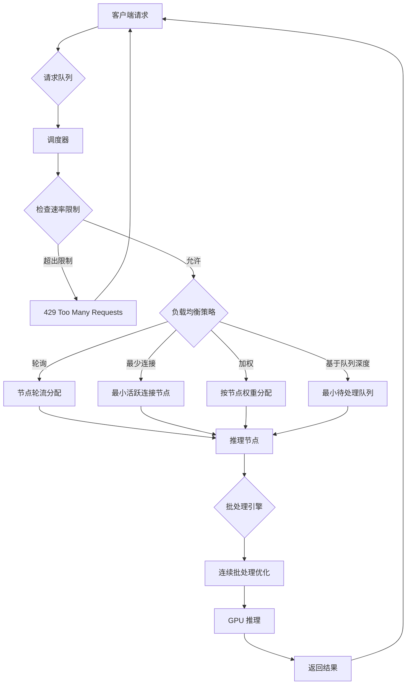

# 推理部署

## 1. 推理框架

### 主流框架对比

| 框架 | 硬件 | 编程语言 | 核心优化 | 吞吐量 | 延迟 | 生态集成 |
|------|------|---------|---------|-------|------|---------|
| vLLM | NVIDIA GPU | Python/C++ | PagedAttention, 连续批处理 | 极高 | 低 | HuggingFace 原生 |
| TensorRT-LLM | NVIDIA GPU | C++/Python | 图优化, 内核融合, FP8 | 极高 | 极低 | TensorRT 生态 |
| TGI (HuggingFace) | GPU | Rust/Python | 连续批处理, 量化 | 高 | 低 | HF 生态集成 |
| ONNX Runtime | CPU/GPU/CUDA | C++/Python | 跨平台优化, 量化 | 中 | 中 | 多框架 |
| llama.cpp | CPU/GPU/Metal | C/C++ | GGML 量化, CPU 推理 | 中 | 中 | 纯 CPU 可跑 |
| SGLang | GPU | Python | RadixAttention, 结构化推理 | 极高 | 极低 | LLM 结构化 |
| MLX | Apple Silicon | C++/Python | 统一内存, 苹果芯片优化 | 中 | 低 | Mac 生态 |

### 推理优化策略详解

| 策略 | 原理 | 加速比 | 额外开销 | 适用场景 |
|------|------|-------|---------|---------|
| 连续批处理 | 动态插入/移除请求批次 | 5-20× | 调度器开销 | 高并发 LLM |
| PagedAttention | 分页 KV Cache 管理 | 2-4× 显存节省 | 页表维护 | vLLM 核心 |
| KV Cache 量化 | INT8/FP8 压缩 KV | 1.5-2× 容量提升 | 精度损失 | 长序列推理 |
| 投机解码 | 草稿模型 + 验证 | 2-3× | 草稿模型开销 | 延迟敏感 |
| Flash Attention | IO 感知注意力 | 3-5× | 无 (融合算子) | 所有 Transformer |
| 前缀缓存 | 复用公共前缀计算 | 1.5-5× | 缓存管理 | 系统 prompt 复用 |

### Mermaid: 部署架构

```mermaid
graph TB
    subgraph 客户端
    C1[Web App]
    C2[Mobile App]
    C3[API Client]
    end
    subgraph 网关层
    G1[Nginx/HAProxy 负载均衡]
    G2[API Gateway Kong]
    G3[速率限制]
    G4[鉴权认证]
    end
    subgraph 推理集群
    N1[推理节点 1]
    N2[推理节点 2]
    N3[推理节点 3]
    N4[推理节点 N]
    end
    subgraph 每节点
    N1 --> P1[vLLM Worker]
    N1 --> G5[GPU 0..7]
    end
    subgraph 监控层
    M1[Prometheus]
    M2[Grafana]
    M3[告警系统]
    end
    subgraph 存储
    S1[(模型存储 S3)]
    S2[(KV Cache)]
    end
    C1 --> G1
    C2 --> G1
    C3 --> G1
    G1 --> G2
    G2 --> G3
    G3 --> G4
    G4 --> N1
    G4 --> N2
    G4 --> N3
    G4 --> N4
    N1 --> M1
    N2 --> M1
    N1 --> S2
    S1 --> N1
    M1 --> M2
    M2 --> M3
```



## 2. 部署架构

### API 服务
- **REST API**：FastAPI + 推理引擎，简单直接
- **gRPC**：基于 HTTP/2，protobuf 序列化，低延迟内部通信
- **流式输出**：SSE (Server-Sent Events) / WebSocket 实现 token-by-token 推流

### 代码示例

```python
# vLLM 服务端
from vllm import LLM, SamplingParams
from vllm import AsyncLLMEngine, AsyncEngineArgs

engine_args = AsyncEngineArgs(
    model="meta-llama/Llama-3-70b-instruct",
    tensor_parallel_size=4,
    gpu_memory_utilization=0.9,
    max_num_seqs=256,
    max_model_len=8192,
    enforce_eager=False,
    quantization="awq",
)

engine = AsyncLLMEngine.from_engine_args(engine_args)

# 同步调用
llm = LLM(model="meta-llama/Llama-3-8b-instruct")
sampling_params = SamplingParams(
    temperature=0.7,
    top_p=0.9,
    max_tokens=1024,
    stop=["<|eot_id|>"],
)

outputs = llm.generate(["Hello, how are you?"], sampling_params)
for output in outputs:
    print(output.outputs[0].text)
```

```python
# FastAPI 部署
from fastapi import FastAPI, HTTPException
from pydantic import BaseModel
from vllm import LLM, SamplingParams

app = FastAPI(title="LLM Inference API", version="1.0.0")

class ChatRequest(BaseModel):
    prompt: str
    max_tokens: int = 512
    temperature: float = 0.7
    top_p: float = 0.9
    stream: bool = False

class ChatResponse(BaseModel):
    text: str
    usage: dict

llm = LLM(model="meta-llama/Llama-3-8b-instruct")

@app.post("/v1/chat/completions", response_model=ChatResponse)
async def chat_completion(request: ChatRequest):
    try:
        sampling_params = SamplingParams(
            temperature=request.temperature,
            top_p=request.top_p,
            max_tokens=request.max_tokens,
        )

        outputs = llm.generate([request.prompt], sampling_params)
        generated_text = outputs[0].outputs[0].text
        prompt_tokens = len(outputs[0].prompt_token_ids)
        completion_tokens = len(outputs[0].outputs[0].token_ids)

        return ChatResponse(
            text=generated_text,
            usage={
                "prompt_tokens": prompt_tokens,
                "completion_tokens": completion_tokens,
                "total_tokens": prompt_tokens + completion_tokens,
            },
        )
    except Exception as e:
        raise HTTPException(status_code=500, detail=str(e))

@app.get("/health")
async def health():
    return {"status": "ok", "model": "llama-3-8b-instruct"}
```

```dockerfile
# Dockerfile
FROM nvidia/cuda:12.4.0-base-ubuntu22.04

RUN apt-get update && apt-get install -y \
    python3.11 python3-pip git && \
    rm -rf /var/lib/apt/lists/*

WORKDIR /app

COPY requirements.txt .
RUN pip install --no-cache-dir -r requirements.txt

COPY . .

ENV CUDA_VISIBLE_DEVICES=0,1,2,3
ENV VLLM_ENGINE_MODE=async

EXPOSE 8000

CMD ["uvicorn", "main:app", "--host", "0.0.0.0", "--port", "8000"]
```

```python
# 流式输出
from fastapi import FastAPI
from fastapi.responses import StreamingResponse
from vllm import SamplingParams

app = FastAPI()

async def stream_generator(prompt: str):
    sampling_params = SamplingParams(
        temperature=0.7,
        max_tokens=512,
    )

    async for output in llm.generate_stream([prompt], sampling_params):
        text = output.outputs[0].text
        yield f"data: {text}\n\n"

    yield "data: [DONE]\n\n"

@app.get("/v1/chat/stream")
async def chat_stream(prompt: str):
    return StreamingResponse(
        stream_generator(prompt),
        media_type="text/event-stream",
        headers={
            "Cache-Control": "no-cache",
            "Connection": "keep-alive",
        },
    )
```

```python
# 负载均衡客户端
import asyncio
import aiohttp
from itertools import cycle

class LoadBalancer:
    def __init__(self, endpoints: list[str]):
        self.endpoints = cycle(endpoints)
        self.semaphore = asyncio.Semaphore(100)

    async def infer(self, prompt: str) -> str:
        endpoint = next(self.endpoints)
        async with self.semaphore:
            async with aiohttp.ClientSession() as session:
                async with session.post(
                    f"{endpoint}/v1/chat/completions",
                    json={"prompt": prompt, "max_tokens": 256},
                ) as resp:
                    result = await resp.json()
                    return result["text"]

    async def batch_infer(self, prompts: list[str]) -> list[str]:
        tasks = [self.infer(p) for p in prompts]
        return await asyncio.gather(*tasks)

lb = LoadBalancer([
    "http://inference-1:8000",
    "http://inference-2:8000",
    "http://inference-3:8000",
])

results = asyncio.run(lb.batch_infer(["prompt1", "prompt2", "prompt3"]))
```

### Mermaid: 请求调度



### 部署平台对比

| 平台 | 类型 | 扩缩容 | 网络 | 存储 | GPU 支持 | 运维成本 |
|------|------|-------|------|------|---------|---------|
| K8s + KubeRay | 容器编排 | 自动 HPA | 服务网格 | CSI 挂载 | 原生 GPU operator | 高 |
| Ray Serve | AI 原生 | 自动扩缩 | 内置路由 | Ray 对象存储 | 自动 GPU 分配 | 中 |
| AWS SageMaker | 托管 | 自动 | AWS 网络 | S3 + EFS | 全系列 GPU | 低 |
| NVIDIA Triton | 推理服务器 | 手动 | 负载均衡 | 共享存储 | 原生 TensorRT | 中 |
| 自建裸金属 | 物理机 | 手动 | 直连 | NVMe | 极致性能 | 极高 |

## 3. 请求调度

### 负载均衡策略

| 策略 | 实现方式 | 优点 | 缺点 | 适用场景 |
|------|---------|------|------|---------|
| 轮询 | round-robin | 实现简单 | 不考虑负载不均 | 同规格节点 |
| 加权轮询 | weight-based | 异构节点适配 | 静态权重 | 不同 GPU 型号 |
| 最少连接 | min-connections | 负载感知 | 连接不代表计算量 | 短请求场景 |
| 基于队列深度 | queue-depth | 真实负载感知 | 实现复杂 | 长/短请求混合 |
| 一致性哈希 | hash(request_id) | 缓存友好 | 热点风险 | KV Cache 亲和性 |

### 速率限制策略

| 策略 | 粒度 | 限流单位 | 实现方式 | 效果 |
|------|------|---------|---------|------|
| 固定窗口 | 用户/API Key | RPM/TPM | 计数器 | 简单但有毛刺 |
| 滑动窗口 | 用户/API Key | RPM/TPM | 时间轮 | 平滑限流 |
| 令牌桶 | 请求 | 每秒 Token | 令牌生成 | 允许突发 |
| 漏桶 | 请求 | 每秒请求 | 固定速率 | 严格平缓 |

## 4. 边缘推理

| 设备 | 芯片 | 算力 (TOPS) | 内存 | 功耗 | 支持框架 |
|------|------|-----------|------|------|---------|
| Jetson Orin NX | Ampere | 70 | 16GB | 15W | TensorRT, PyTorch |
| Jetson AGX Orin | Ampere | 275 | 64GB | 60W | TensorRT, DeepStream |
| Apple A17 Pro | Neural Engine | 35 | 共享 | ~5W | CoreML, MLX |
| Snapdragon 8 Gen 3 | Hexagon NPU | 45 | 共享 | ~5W | Qualcomm AI Engine |
| Google TPU v5e | TPU | 400 | 16GB HBM | 100W | TensorFlow, JAX |

### Shell: 推理部署

```bash
# vLLM 服务启动
python -m vllm.entrypoints.openai.api_server \
    --model meta-llama/Llama-3-8b-instruct \
    --tensor-parallel-size 2 \
    --gpu-memory-utilization 0.9 \
    --max-num-seqs 256 \
    --port 8000 \
    --host 0.0.0.0

# 构建 Docker 镜像
docker build -t llm-inference:latest .
docker run --gpus all -p 8000:8000 llm-inference:latest

# 测试推理
curl -X POST http://localhost:8000/v1/chat/completions \
    -H "Content-Type: application/json" \
    -d '{"prompt": "Hello", "max_tokens": 50}'

# TensorRT-LLM 构建
trtllm-build --checkpoint_dir ./checkpoint \
    --output_dir ./engine \
    --max_batch_size 64 \
    --max_input_len 4096 \
    --max_output_len 1024 \
    --gpt_attention_plugin float16
```

## 5. 2025-2026 趋势
- **推测解码普及**：2-3× 速度提升，草稿模型 + 验证
- **FP8 推理原生支持**：H100/B200 标配，动态精度
- **高效 MoE 推理**：专家路由/负载均衡，部分专家激活
- **模型市场**：即插即用模型服务，一键部署
- **Disaggregated 推理**：预填充与解码分离部署，资源最优利用
