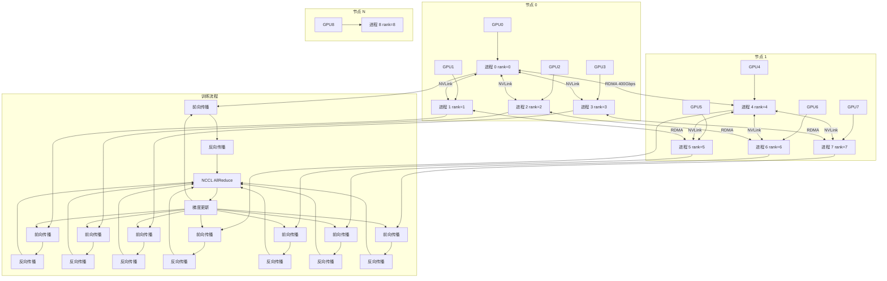

# GPU 计算与集群

## 1. GPU 架构

### NVIDIA GPU 规格对比

| GPU | 架构 | 制程 | FP16 TFLOPS | FP8 TFLOPS | INT8 TFLOPS | 显存 | 显存带宽 | 互连 | TDP |
|-----|------|------|-----------|-----------|------------|------|---------|------|-----|
| V100 | Volta | 12nm | 125 | - | - | 32GB HBM2 | 900 GB/s | NVLink 300GB/s | 300W |
| A100 | Ampere | 7nm | 312 | 624 | 1248 | 80GB HBM2e | 2 TB/s | NVLink 600GB/s | 400W |
| H100 | Hopper | 4nm | 989 (稀疏) | 1979 | 3958 | 80GB HBM3 | 3.35 TB/s | NVLink 900GB/s | 700W |
| H200 | Hopper | 4nm | 989 (稀疏) | 1979 | 3958 | 141GB HBM3e | 4.8 TB/s | NVLink 900GB/s | 700W |
| B200 | Blackwell | 4nm | 2250 | 4500 | 9000 | 192GB HBM3e | 8 TB/s | NVLink 1.8TB/s | 700W |
| L40S | Ada Lovelace | 4nm | 182 | 364 | 733 | 48GB GDDR6 | 864 GB/s | - | 350W |

### 核心组件
- **CUDA Cores**：通用计算单元，FP32/INT32 运算
- **Tensor Cores**：矩阵乘法加速（FP16/BF16/INT8/FP8），混合精度训练关键
- **Transformer Engine**：FP8 动态精度（H100+），自动选择最佳精度
- **HBM**：高带宽显存，HBM3/HBM3e 是关键瓶颈
- **NVLink + NVSwitch**：GPU 间高速互联，构建域

### GPU 计算能力 (Compute Capability)

| 架构 | Compute Capability | 特性 |
|------|-------------------|------|
| Volta | 7.0 | 第一代 Tensor Cores |
| Turing | 7.5 | INT4/INT8 Tensor Cores |
| Ampere | 8.0 | BF16, 稀疏 Tensor Core |
| Ada Lovelace | 8.9 | FP8, Transformer Engine |
| Hopper | 9.0 | FP8, DPX, 异步执行 |
| Blackwell | 10.0 | FP4, 第二代 Transformer Engine |

## 2. CUDA 编程基础

### 内存层次

| 层级 | 延迟 | 带宽 | 大小 | 作用域 | 生命周期 |
|------|------|------|------|--------|---------|
| 全局内存 | ~400 cycle | ~2 TB/s | 80GB | 所有线程 | 程序 |
| 共享内存 | ~20 cycle | ~20 TB/s | 48-228 KB | Block 内 | Block |
| 寄存器 | ~1 cycle | ~100 TB/s | 255/个线程 | 线程 | 线程 |
| 常量内存 | ~10 cycle | ~2 TB/s | 64 KB | 所有线程 | 程序 |
| 纹理内存 | ~10 cycle | ~2 TB/s | 依赖 | 所有线程 | 程序 |
| L1 缓存 | ~30 cycle | ~10 TB/s | 128-256 KB | SM | 自动 |
| L2 缓存 | ~200 cycle | ~5 TB/s | 40-80 MB | GPU | 自动 |

### 优化原则
- **合并访问**：连续线程访问连续地址，warp 内对齐
- **SM 占用率**：足够多的块/线程隐藏延迟，目标 ≥ 50%
- **减少全局内存读**：利用共享内存，tile 分块
- **减少线程束发散**：避免 warp 内分支
- **异步内存拷贝**：使用 CUDA Stream 重叠计算和传输

### 代码示例

```python
# CUDA 内存管理 (PyTorch)
import torch

torch.cuda.empty_cache()
total = torch.cuda.get_device_properties(0).total_memory
reserved = torch.cuda.memory_reserved(0)
allocated = torch.cuda.memory_allocated(0)
free = total - reserved

print(f"Total: {total / 1024**3:.2f} GB")
print(f"Reserved: {reserved / 1024**3:.2f} GB")
print(f"Allocated: {allocated / 1024**3:.2f} GB")

tensor = torch.randn(10000, 10000, device="cuda")
torch.cuda.empty_cache()
print(torch.cuda.memory_summary())
```

```python
# NCCL AllReduce 实现
import torch
import torch.distributed as dist

dist.init_process_group(backend="nccl")
local_rank = dist.get_rank()
world_size = dist.get_world_size()

tensor = torch.randn(1024, 1024).cuda(local_rank)
dist.all_reduce(tensor, op=dist.ReduceOp.SUM)

tensor /= world_size

dist.all_gather([tensor] * world_size, tensor)
dist.reduce_scatter(tensor, [tensor] * world_size)

dist.barrier()
dist.destroy_process_group()
```

```python
# PyTorch DDP 分布式训练
import torch
import torch.distributed as dist
import torch.multiprocessing as mp
from torch.nn.parallel import DistributedDataParallel as DDP

def setup(rank, world_size):
    dist.init_process_group("nccl", rank=rank, world_size=world_size)

def cleanup():
    dist.destroy_process_group()

def train(rank, world_size, model, dataset):
    setup(rank, world_size)

    model = model.to(rank)
    ddp_model = DDP(model, device_ids=[rank])

    optimizer = torch.optim.AdamW(ddp_model.parameters(), lr=3e-5)
    train_sampler = torch.utils.data.distributed.DistributedSampler(
        dataset, num_replicas=world_size, rank=rank
    )
    dataloader = torch.utils.data.DataLoader(dataset, sampler=train_sampler, batch_size=32)

    for epoch in range(10):
        train_sampler.set_epoch(epoch)
        for batch in dataloader:
            inputs, labels = batch
            inputs, labels = inputs.to(rank), labels.to(rank)

            outputs = ddp_model(inputs)
            loss = torch.nn.CrossEntropyLoss()(outputs, labels)

            loss.backward()
            optimizer.step()
            optimizer.zero_grad()

    cleanup()

def main():
    world_size = torch.cuda.device_count()
    model = torch.nn.Transformer()
    dataset = MyDataset()
    mp.spawn(train, args=(world_size, model, dataset), nprocs=world_size)
```

```python
# 混合精度训练
from torch.cuda.amp import autocast, GradScaler

model = model.cuda()
optimizer = torch.optim.AdamW(model.parameters(), lr=3e-5)
scaler = GradScaler()

for batch in dataloader:
    inputs, labels = batch
    inputs, labels = inputs.cuda(), labels.cuda()

    optimizer.zero_grad()

    with autocast(dtype=torch.bfloat16):
        outputs = model(inputs)
        loss = criterion(outputs, labels)

    scaler.scale(loss).backward()
    scaler.step(optimizer)
    scaler.update()
```

```python
# 显存分析
import torch.cuda
from torch.profiler import profile, ProfilerActivity

with profile(
    activities=[ProfilerActivity.CUDA, ProfilerActivity.CPU],
    record_shapes=True,
    profile_memory=True,
) as prof:
    model(inputs)

print(prof.key_averages().table(sort_by="cuda_memory_usage", row_limit=10))

torch.cuda.memory._dump_snapshot("memory_snapshot.pkl")
```

### 分布式训练架构



## 3. 分布式通信

### NCCL 通信操作

| 操作 | 描述 | 时间复杂度 | 应用场景 |
|------|------|-----------|---------|
| AllReduce | 所有 rank 求和/求平均 | 2(N-1)/N × 数据量 | DDP 梯度同步 |
| AllGather | 收集所有 rank 数据 | (N-1)/N × 数据量 | 全参数收集 (ZeRO-3) |
| ReduceScatter | 求和后分片 | (N-1)/N × 数据量 | ZeRO-2 梯度分片 |
| Broadcast | 一个 rank 广播 | 数据量 | 参数初始化 |
| Reduce | 求和到一个 rank | 数据量 | 指标聚合 |
| Send/Recv | 点对点通信 | 数据量 | Pipeline 并行 |
| Barrier | 同步所有 rank | O(1) | 同步点 |

### 通信拓扑对比

| 拓扑 | 延迟 | 带宽效率 | 可扩展性 | 硬件要求 |
|------|------|---------|---------|---------|
| Ring AllReduce | O(N) | 高 | 好 | 标准网络 |
| Tree AllReduce | O(log N) | 低 | 好 | 标准网络 |
| NVLink Fully Connected | O(1) | 极高 | 有限 (8 GPU) | NVSwitch |
| 3D Torus | O(∛N) | 高 | 极好 | 特殊拓扑 |
| DragonFly | O(1) | 高 | 极好 | 特殊拓扑 |

### 通信库对比

| 特性 | NCCL | MPI (OpenMPI) | Gloo | RCCL |
|------|------|--------------|------|------|
| GPU 原生 | ✅ 最佳 | ⚠️ 一般 | ⚠️ 一般 | ✅ AMD GPU |
| CPU 通信 | ❌ | ✅ | ✅ | ❌ |
| NVLink 优化 | ✅ | ❌ | ❌ | ❌ |
| RoCE/InfiniBand | ✅ | ✅ | ✅ | ✅ |
| PyTorch 默认 | ✅ | ❌ (可选) | ✅ (备选) | ❌ |

## 4. 集群管理

### 调度系统对比

| 系统 | 类型 | GPU 调度 | 任务编排 | 弹性扩缩 | 学习成本 |
|------|------|---------|---------|---------|---------|
| Slurm | HPC 调度器 | ✅ GPU GRES | ❌ (依赖脚本) | ❌ | 高 |
| Kubernetes + Volcano | 容器编排 | ✅ GPU Operator | ✅ CRD | ✅ HPA | 中 |
| Ray | 分布式执行 | ✅ 自动 GPU 分配 | ✅ DAG | ✅ 自动 | 低 |
| AWS Batch | 托管 | ✅ 按需 GPU | ✅ 队列 | ✅ 自动 | 低 |

### 集群规模与网络

| 集群规模 | GPU 数量 | 网络方案 | 带宽 | 存储方案 |
|---------|---------|---------|------|---------|
| 单机 | 1-8 | NVLink 内部 | 600-900 GB/s | 本地 NVMe |
| 小集群 | 8-64 | RoCEv2 100G | 12.5 GB/s | NFS / JuiceFS |
| 中集群 | 64-512 | InfiniBand NDR 400G | 50 GB/s | Lustre / GPFS |
| 大集群 | 512-8192 | InfiniBand + NVSwitch | 400 GB/s | 并行文件系统 |
| 超大规模 | 8192+ | HPC 专用网络 | 400+ GB/s | 分布式存储 |

### Shell: 集群操作

```bash
# NCCL 测试
nccl-tests/build/all_reduce_perf -b 128M -e 8G -f 2 -g 8

# 检查 NCCL 版本
nvcc --version
nccl-tests/build/all_reduce_perf --help

# Slurm 提交训练任务
sbatch --gres=gpu:8 --nodes=4 --ntasks-per-node=8 \
    --cpus-per-task=16 --mem=512G --time=72:00:00 \
    --output=train_%j.log train_script.sh

# PyTorch DDP 启动
torchrun --nnodes=4 --nproc_per_node=8 \
    --rdzv_endpoint=master:29500 \
    --rdzv_backend=c10d \
    train_ddp.py

# 查看 GPU 状态
nvidia-smi -l 1
watch -n 1 nvidia-smi
nvidia-smi dmon -s pucvmet -d 1
nvidia-smi pmon -s u -d 1

# 单机多卡训练
torchrun --standalone --nproc_per_node=8 train.py
```

## 5. 训练效率优化

### 计算-通信重叠
- 反向传播时异步 AllReduce：bucket 化梯度，一边计算一边通信
- 梯度 bucket 化：小消息合并成大消息，减少通信次数
- 通信计算图重叠：pipeline 并行中异步传输

### 并行策略对比

| 策略 | 切分维度 | 通信量 | 显存节省 | 适用场景 |
|------|---------|-------|---------|---------|
| DDP | 数据 | 梯度 AllReduce | 1× (每卡一份) | 小模型大数据 |
| ZeRO-1 | 优化器状态 | O(Ψ) | 4× | 中等模型 |
| ZeRO-2 | + 梯度 | O(Ψ) | 8× | 较大模型 |
| ZeRO-3 | + 参数 | O(Ψ) + gather | 16× | 大模型 |
| Tensor Parallel | 层内切分 | O(Ψ) all-reduce | N× | Transformer |
| Pipeline Parallel | 层间切分 | O(1) p2p | N× | 超大模型 |
| Sequence Parallel | 序列 | O(L²) | L× | 长序列 |

### 内存优化

| 技术 | 节省 | 额外开销 | 实现复杂度 | 推荐场景 |
|------|------|---------|-----------|---------|
| 梯度检查点 | 50% 显存 | 30% 计算重算 | 低 (单行代码) | 任何显存不足 |
| ZeRO-1 | 优化器状态 | 少量通信 | 中 (DeepSpeed) | 大模型微调 |
| ZeRO-2 | 梯度 | 增通信 | 中 | 大模型微调 |
| ZeRO-3 | 全部 | 更多通信 | 中 | 全参训练 |
| 卸载到 CPU | 大部分显存 | CPU-GPU 带宽瓶颈 | 中 | 显存极有限 |
| 激活压缩 | 激活值 2-4× | 压缩解压耗时 | 高 | 超长序列 |
| Flash Attention | 激活 O(L²)→O(L) | 无 (融合算子) | 无 (直接替换) | 所有 Transformer |

### 训练效率基准

| 模型 | 参数量 | GPU 配置 | 策略 | tokens/s/GPU | MFU |
|------|-------|---------|------|-------------|-----|
| LLaMA-7B | 7B | 8×A100 80G | DDP + ZeRO-2 | 3800 | 45% |
| LLaMA-13B | 13B | 16×A100 80G | ZeRO-3 + TP=2 | 2100 | 42% |
| LLaMA-70B | 70B | 64×A100 80G | ZeRO-3 + TP=4 + PP=2 | 450 | 40% |
| GPT-3 175B | 175B | 256×A100 80G | ZeRO-3 + TP=8 + PP=4 | 110 | 38% |

## 6. 2025-2026 趋势
- **NVLink Domain**：NVLink 大规模域互联，64+ GPU 域
- **液冷散热**：60kW+/rack，直接液体冷却
- **以太网 + RoCEv2**：400G Ethernet 替代 InfiniBand，成本降低 50%
- **FP8/FP4 训练**：新一代精度，B200 原生 FP4
- **光互连**：未来 GPU 间通信，SiPh 硅光子
- **Disaggregated 计算**：计算与显存分离，弹性资源池
