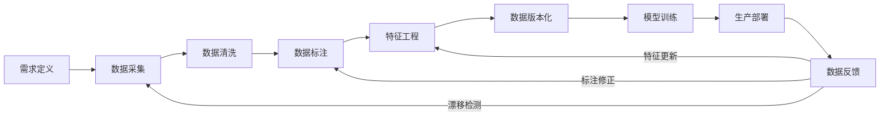
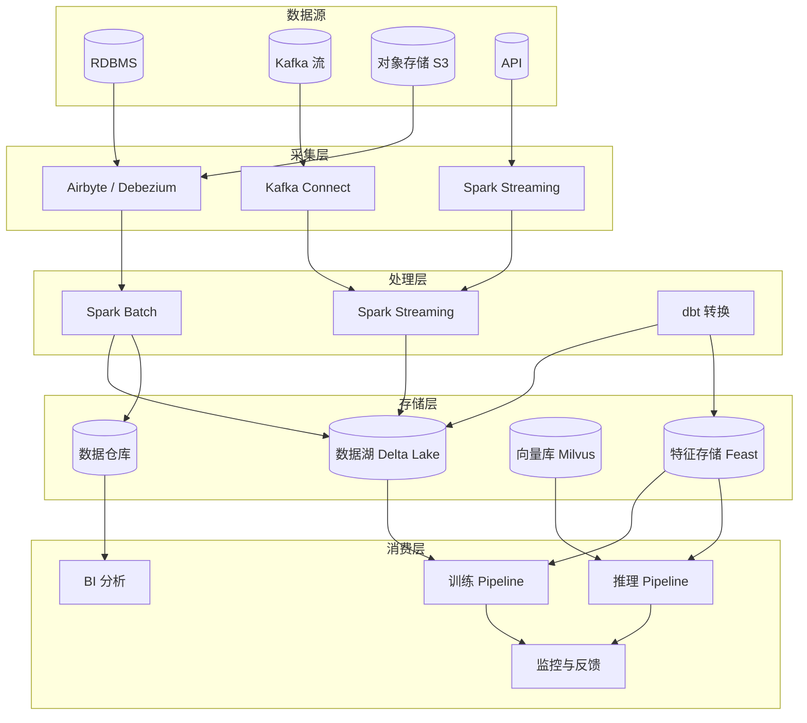
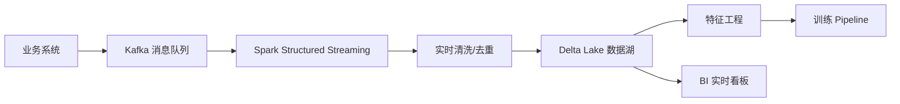

# 数据工程

## 1. 数据生命周期



### 数据生命周期各阶段

| 阶段 | 关键活动 | 产出物 | 工具 |
|------|---------|-------|------|
| 需求定义 | 数据源识别、Schema 设计 | 数据需求文档 | 文档工具 |
| 数据采集 | API 拉取、数据库同步、流接入 | 原始数据集 | Kafka, Flume, Airbyte |
| 数据清洗 | 去重、缺失处理、格式规范化 | 干净数据集 | Spark, Pandas, dbt |
| 数据标注 | 人工/自动/弱监督标注 | 标注数据集 | Label Studio, Scale AI |
| 特征工程 | 特征衍生、选择、归一化 | 特征表 | Spark, Feast |
| 数据版本化 | 存储版本、可复现 | 版本化数据集 | DVC, LakeFS |
| 数据反馈 | 漂移检测、标注修正 | 反馈回路 | Evidently, Great Expectations |

## 2. 数据处理 Pipeline

### 数据清洗

| 问题类型 | 检测方法 | 处理策略 | Spark 实现 |
|---------|---------|---------|-----------|
| 缺失值 | isnull / count | 删除行 / 均值填充 / 模型预测 | df.dropna() / df.fillna() |
| 重复数据 | hash 去重 / 多字段分组 | 保留首条 / 合并去重 | df.dropDuplicates() |
| 离群点 | IQR (Q3-Q1) / Z-score | 截断 / 对数变换 / 删除 | df.filter() + 窗口函数 |
| 格式错误 | 正则表达式 / Schema 校验 | 规则修复 / 丢弃 | df.withColumn() + regexp |
| 不一致编码 | 编码检测 (chardet) | 统一 UTF-8 | 自定义 UDF |
| 语义错误 | 标注一致性检查 | 人工复核 | - |

### 特征工程对比

| 方法 | 类型 | 适用数据 | 效果 | 实现复杂度 |
|------|------|---------|------|-----------|
| 标准化 (Z-score) | 数值缩放 | 连续型 | 均值为0，方差1 | 低 |
| 归一化 (MinMax) | 数值缩放 | 连续型 | 映射到 [0,1] | 低 |
| One-Hot 编码 | 类别编码 | 类别型 | 稀疏二进制 | 低 |
| Label Encoding | 类别编码 | 有序类别 | 整数映射 | 低 |
| Target Encoding | 类别编码 | 高势类别 | 目标均值编码 | 中 |
| 特征交叉 | 组合特征 | 多特征 | 高阶组合 | 中 |
| 文本 TF-IDF | 文本特征 | 文本 | 词频逆文档 | 中 |
| 文本 Embedding | 文本特征 | 文本 | 语义向量 (BERT) | 高 |

### Mermaid: 数据 Pipeline



### 代码示例

```python
# Spark 数据处理
from pyspark.sql import SparkSession, functions as F
from pyspark.sql.window import Window
from pyspark.ml.feature import StringIndexer, VectorAssembler, StandardScaler

spark = SparkSession.builder \
    .appName("DataPipeline") \
    .config("spark.sql.adaptive.enabled", "true") \
    .config("spark.sql.adaptive.coalescePartitions.enabled", "true") \
    .config("spark.driver.memory", "16g") \
    .getOrCreate()

df = spark.read.parquet("s3a://data-lake/raw/events/")

df_clean = df.dropDuplicates(["user_id", "event_id"]) \
    .filter(F.col("timestamp").isNotNull()) \
    .fillna({"user_agent": "unknown", "country": "unknown"})

df_clean = df_clean.withColumn("event_date", F.to_date("timestamp")) \
    .withColumn("hour", F.hour("timestamp"))

df_clean = df_clean.withColumn(
    "is_outlier",
    F.abs(F.col("amount") - F.mean("amount").over()) > 3 * F.stddev("amount").over()
).filter(~F.col("is_outlier"))

indexer = StringIndexer(inputCol="category", outputCol="category_idx")
df_indexed = indexer.fit(df_clean).transform(df_clean)

assembler = VectorAssembler(
    inputCols=["category_idx", "amount", "hour"],
    outputCol="features",
)
df_features = assembler.transform(df_indexed)

scaler = StandardScaler(inputCol="features", outputCol="scaled_features")
scaler_model = scaler.fit(df_features)
df_final = scaler_model.transform(df_features)

df_final.write.mode("overwrite").parquet("s3a://data-lake/processed/events/")
```

```python
# 数据加载 Pipeline
from torch.utils.data import Dataset, DataLoader
from torchvision import transforms
from PIL import Image
import pandas as pd

class ImageDataset(Dataset):
    def __init__(self, csv_path, transform=None):
        self.df = pd.read_csv(csv_path)
        self.transform = transform or transforms.Compose([
            transforms.Resize((224, 224)),
            transforms.ToTensor(),
            transforms.Normalize(mean=[0.485, 0.456, 0.406], std=[0.229, 0.224, 0.225]),
        ])

    def __len__(self):
        return len(self.df)

    def __getitem__(self, idx):
        row = self.df.iloc[idx]
        image = Image.open(row["image_path"])
        image = self.transform(image)
        label = row["label"]
        return image, label

class TextDataset(Dataset):
    def __init__(self, df, tokenizer, max_length=512):
        self.df = df
        self.tokenizer = tokenizer
        self.max_length = max_length

    def __len__(self):
        return len(self.df)

    def __getitem__(self, idx):
        row = self.df.iloc[idx]
        encoding = self.tokenizer(
            row["text"],
            truncation=True,
            padding="max_length",
            max_length=self.max_length,
            return_tensors="pt",
        )
        return {
            "input_ids": encoding["input_ids"].squeeze(),
            "attention_mask": encoding["attention_mask"].squeeze(),
            "labels": torch.tensor(row["label"]),
        }

dataset = ImageDataset("data/train.csv")
dataloader = DataLoader(dataset, batch_size=64, shuffle=True, num_workers=8, pin_memory=True)
```

```python
# 数据增强 Pipeline (Albumentations)
import albumentations as A
from albumentations.pytorch import ToTensorV2

train_transform = A.Compose([
    A.Resize(224, 224),
    A.RandomRotate90(p=0.5),
    A.Flip(p=0.5),
    A.Transpose(p=0.5),
    A.OneOf([
        A.MotionBlur(p=0.2),
        A.MedianBlur(blur_limit=3, p=0.1),
        A.Blur(blur_limit=3, p=0.1),
    ], p=0.3),
    A.OneOf([
        A.OpticalDistortion(p=0.3),
        A.GridDistortion(p=0.1),
    ], p=0.2),
    A.OneOf([
        A.HueSaturationValue(p=0.3),
        A.RandomBrightnessContrast(p=0.3),
    ], p=0.3),
    A.CoarseDropout(max_holes=8, max_height=32, max_width=32, p=0.3),
    A.Normalize(mean=[0.485, 0.456, 0.406], std=[0.229, 0.224, 0.225]),
    ToTensorV2(),
])

def apply_augmentation(image_path):
    image = cv2.imread(image_path)
    image = cv2.cvtColor(image, cv2.COLOR_BGR2RGB)
    augmented = train_transform(image=image)
    return augmented["image"]

# NLP 数据增强
nlp_aug = A.Compose([
    A.SynonymReplacement(p=0.3),
    A.RandomSwap(p=0.1),
    A.BackTranslation(p=0.2),
    A.MaskedLM(p=0.3),
])
```

```python
# DVC 版本化
import dvc.api
import os

os.system("dvc init")
os.system("dvc add data/raw/dataset.parquet")
os.system("dvc push")
os.system("git add data/raw/dataset.parquet.dvc .gitignore")
os.system("git commit -m 'add dataset v1.0'")

with dvc.api.open(
    "data/raw/dataset.parquet",
    repo=".",
    rev="main",
    mode="rb",
) as fd:
    df = pd.read_parquet(fd)

os.system("dvc checkout data/raw/dataset.parquet")
os.system("dvc diff")
os.system("dvc metrics show")

# 版本回退
os.system("git checkout <commit_hash>")
os.system("dvc checkout")
```

### 案例：Kafka 实时数据接入 + 落湖

下面的案例演示用 Kafka 接入用户行为事件，经 Spark Structured Streaming 实时清洗后写入 Delta Lake 数据湖。

```python
# Spark Structured Streaming 实时落湖
from pyspark.sql import SparkSession
from pyspark.sql.functions import from_json, col
from pyspark.sql.types import StructType, StringType, TimestampType, DoubleType

spark = SparkSession.builder.appName("RealtimeLake").getOrCreate()

schema = StructType() \
    .add("user_id", StringType()) \
    .add("event", StringType()) \
    .add("amount", DoubleType()) \
    .add("ts", TimestampType())

# 1. 从 Kafka 读取流
raw = spark.readStream.format("kafka") \
    .option("kafka.bootstrap.servers", "broker1:9092") \
    .option("subscribe", "user_events") \
    .load()

parsed = raw.select(
    from_json(col("value").cast("string"), schema).alias("data")
).select("data.*")

# 2. 实时清洗（去空、过滤异常金额）
clean = parsed.filter(
    (col("user_id").isNotNull()) & (col("amount") > 0) & (col("amount") < 1_000_000)
)

# 3. 写入 Delta Lake（按事件日期分区）
query = clean.writeStream.format("delta") \
    .outputMode("append") \
    .option("checkpointLocation", "/checkpoints/user_events") \
    .partitionBy("event") \
    .start("s3a://data-lake/raw/user_events/")

query.awaitTermination()
```

### 实现案例：数据质量校验（Great Expectations）

```python
# Great Expectations 数据质量校验
import great_expectations as gx
from great_expectations.checkpoint import SimpleCheckpoint

context = gx.get_context()

# 1. 定义数据源与数据资产
datasource = context.sources.add_pandas("pandas_datasource")
asset = datasource.add_dataframe_asset("events_asset")

# 2. 构建期望（校验规则）
batch_def = asset.add_batch_definition_whole_dataframe("batch_def")
df = __import__("pandas").read_parquet("s3a://data-lake/raw/user_events/")

validator = context.get_validator(batch_request=batch_def, dataframe=df)
validator.expect_column_values_to_not_be_null("user_id")
validator.expect_column_values_to_be_between("amount", min_value=0, max_value=1_000_000)
validator.expect_column_values_to_be_in_set("event", ["click", "purchase", "view"])

# 3. 执行校验
results = validator.validate()
print(f"校验通过: {results.success}")
for r in results.results:
    if not r.success:
        print(f"失败项: {r.expectation_config.expectation_type}")
```

### 批流处理选型对比

| 场景 | 推荐框架 | 延迟 | 一致性 | 适用说明 |
|------|---------|------|-------|---------|
| 离线 ETL | Spark Batch | 分钟-小时 | 批级 | 大规模历史数据处理 |
| 微批流 | Spark Streaming | 秒级 | 准实时 | 与原 Spark 栈统一 |
| 真流处理 | Flink | 毫秒 | 精确一次 | 实时风控、监控 |
| 消息缓冲 | Kafka | 毫秒 | 至少一次 | 流数据管道中枢 |
| 轻量 Python | Dask | 秒级 | 有限 | Pandas 扩展 |

### Mermaid: 实时数据湖链路



## 3. 数据标注

### 标注策略对比

| 策略 | 成本/样本 | 质量 | 速度 | 适用场景 |
|------|----------|------|------|---------|
| 人工标注 | $0.5-5 | 极高 (95%+) | 慢 | 关键任务、小规模、基准 |
| 弱监督 | $0.01-0.1 | 中 (70-85%) | 极快 | 大规模预训练、规则匹配 |
| 主动学习 | $0.1-1 | 高 (90%+) | 中 | 难样本、标注预算有限 |
| 自标注 (伪标签) | $0 | 中低 (60-80%) | 极快 | 半监督、模型辅助 |
| 合成数据 | $0-0.1 | 中 (60-90%) | 极快 | 数据增强、隐私场景 |

### 标注工具对比

| 工具 | 开源 | 多模态 | 协作 | 自动化 | API | 部署方式 |
|------|------|-------|------|-------|-----|---------|
| Label Studio | ✅ 开源 | ✅ 文本/图像/音频/视频 | ✅ 团队 | ✅ ML 后端 | ✅ REST | Docker / 托管 |
| Doccano | ✅ 开源 | ❌ 仅文本 | ❌ | ❌ | ✅ | Docker |
| CVAT | ✅ 开源 | ✅ 图像/视频 | ✅ | ✅ SAM | ✅ REST | Docker |
| Scale AI | ❌ 商业 | ✅ 全模态 | ✅ | ✅ 预标注 | ✅ | SaaS |
| Labelbox | ❌ 商业 | ✅ 全模态 | ✅ | ✅ 模型辅助 | ✅ | SaaS |

## 4. 大规模数据处理

### 批处理框架对比

| 框架 | 语言 | 执行模型 | 延迟 | 容错 | 内存管理 | 适用场景 |
|------|------|---------|------|------|---------|---------|
| Apache Spark | Scala/Python | DAG + 内存计算 | 秒-分 | ✅ lineage | JVM 内存 | 大规模 ETL、特征工程 |
| Ray | Python | 分布式 actor | 毫秒-秒 | ✅ 重试 | 共享内存 | 分布式训练、RL |
| Dask | Python | 惰性计算图 | 秒-分 | ❌ 有限 | Python 内存 | Pandas 扩展、数组计算 |
| Flink | Java/Python | 流式 DAG | 毫秒 | ✅ checkpoint | 托管内存 | 实时流处理 |

### 流处理对比

| 特性 | Apache Kafka | Apache Flink | Spark Streaming |
|------|-------------|-------------|----------------|
| 处理模型 | 消息队列 (存储) | 真正的流处理 | 微批次 |
| 延迟 | 毫秒 (生产/消费) | 毫秒 | 秒-分 |
| 状态管理 | ❌ (需要 Kafka Streams) | ✅ 原生状态后端 | ✅ 状态操作 |
| 精确一次语义 | ✅ | ✅ | ✅ |
| 事件时间 | ✅ KSQL | ✅ 原生 | ✅ |

## 5. 数据存储

| 存储类型 | 技术 | 访问模式 | 格式 | 适用场景 |
|---------|------|---------|------|---------|
| 对象存储 | S3 / MinIO / GCS | HTTP API | 任意 | 原始数据、模型权重、备份 |
| 数据湖 (湖仓一体) | Delta Lake / Apache Iceberg / Hudi | Spark SQL | Parquet/ORC | 大规模分析、ACID 事务 |
| 数据仓库 | Snowflake / ClickHouse / Redshift | SQL | 列存 | 结构化查询、BI 报表 |
| 特征存储 | Feast / Tecton | 时间点查询 | Parquet + 在线引擎 | 特征复用、在线/离线 |
| 向量存储 | Milvus / Qdrant | ANN 搜索 | 向量索引 | RAG、语义搜索 |
| 图存储 | Neo4j / NebulaGraph | Cypher/gremlin | 图结构 | 关系挖掘、推荐 |

## 6. 数据版本化

| 工具 | 存储后端 | 版本粒度 | 支持回滚 | CI/CD 集成 | 适用规模 |
|------|---------|---------|---------|-----------|---------|
| DVC | S3/GCS/本地 | 文件级 (md5) | ✅ | ✅ GitHub Actions | < 100GB |
| LakeFS | S3/GCS | 仓库级 (Git-like) | ✅ 快照 | ✅ | 无限 (S3) |
| Pachyderm | 对象存储 | 数据集级 + Pipeline | ✅ 自动 | ✅ | 大规模 Pipeline |
| Hugging Face Hub | S3 | 仓库级 | ✅ | ✅ | < 50GB/文件 |

### Shell: 数据工程操作

```bash
# Spark 提交任务
spark-submit --master yarn \
    --deploy-mode cluster \
    --num-executors 100 \
    --executor-cores 4 \
    --executor-memory 32g \
    --driver-memory 16g \
    --conf spark.sql.shuffle.partitions=400 \
    process_data.py

# DVC 操作
dvc init
dvc remote add myremote s3://my-bucket/dvc
dvc add data/train.parquet
git add data/train.parquet.dvc .gitignore
git commit -m "add training data v1"
dvc push

# DVC Pipeline
dvc stage add -n preprocess -p preprocess.yaml \
    -d src/preprocess.py -d data/raw \
    -o data/processed \
    python src/preprocess.py

dvc repro
dvc dag

# Kafka 操作
kafka-topics --create --topic events --partitions 12 --replication-factor 3 --bootstrap-server localhost:9092
kafka-console-producer --topic events --bootstrap-server localhost:9092
kafka-console-consumer --topic events --from-beginning --bootstrap-server localhost:9092
```

## 7. 2025-2026 趋势
- **合成数据**：大模型生成训练数据，Synthetic Data Vault
- **数据飞轮**：生产数据→模型改进→生产数据，自动迭代
- **数据合规自动化**：GDPR/个保法自动审计，合规即代码
- **LLM 数据质量评估**：LLM-as-Judge 评估数据质量
- **数据策展**：数据目录 + 血缘追踪 + 质量评分
- **实时特征**：毫秒级特征计算，在线学习 Pipeline
