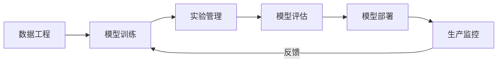

# AI 工程与基础设施

## 概述

AI 工程化是连接研究与生产的桥梁。本模块覆盖 MLOps、模型部署、模型压缩、向量数据库、GPU 集群等工程化全链路。

## 目录

```
07-AI工程与基础设施/
├── README.md
├── 01-MLOps与实验管理.md   # 实验跟踪/流水线/特征存储/监控
├── 02-模型压缩.md          # 量化/剪枝/蒸馏/架构搜索
├── 03-推理部署.md          # 服务框架/K8s部署/边缘推理
├── 04-向量数据库.md        # FAISS/Milvus/Qdrant/Pinecone
├── 05-GPU计算与集群.md     # CUDA/分布式通信/NVLink/集群管理
├── 06-数据工程.md          # 数据湖/管道/标注/特征工程
└── 07-LLMOps.md            # Prompt管理/RAG观察/成本/护栏
```



## MLOps 成熟度模型

| 级别 | 特征 | 自动化程度 |
|------|------|-----------|
| L0：手工 | 脚本训练，手动部署 | 0% |
| L1：基础 | 实验跟踪，Docker 部署 | 30% |
| L2：流水线 | CI/CD for ML，自动重训 | 60% |
| L3：自动 | 自动特征/模型/超参 | 90% |
| L4：自适应 | 自动 A/B，漂移自恢复 | 100% |
