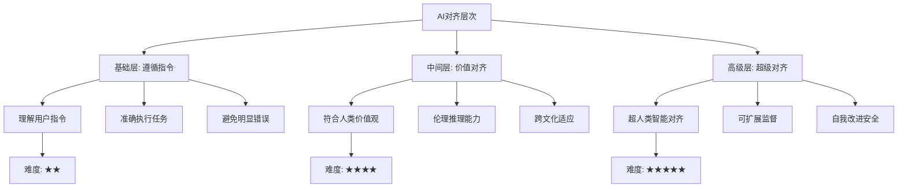
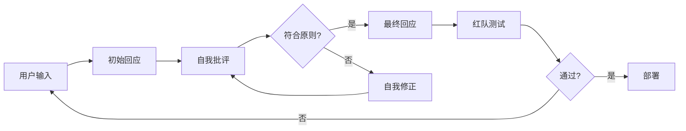
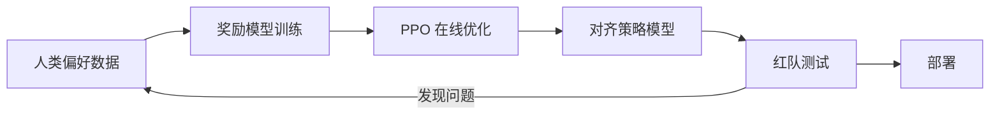

# AI 对齐

## 1. 对齐问题定义

### 核心问题

- **目标错位**：AI 优化的目标与人类真实意图不一致
- **外推风险**：模型能力的提升 > 对齐能力的提升
- **规范博弈**：AI 发现奖励/评估的漏洞

### 对齐的层次



| 层次 | 定义 | 关键挑战 | 评估方法 | 难度 |
|------|------|---------|---------|------|
| 遵循指令 | 理解并执行用户指令 | 歧义消解、多步推理 | HELM、MMLU | ★★ |
| 价值对齐 | 符合人类价值观和伦理 | 价值多样性、冲突 | BBQ、TruthfulQA | ★★★★ |
| 超级对齐 | 远超人类智能的 AI 对齐 | 可扩展监督、动机外推 | 尚无标准化基准 | ★★★★★ |

### 对齐方法对比

| 方法 | 需要奖励模型 | 在线/离线 | 计算成本 | 对齐效果 | 稳定性 |
|------|------------|----------|---------|---------|-------|
| RLHF (PPO) | 是 | 在线 | 高 | 优 | 中 |
| DPO | 否 | 离线 | 低 | 优 | 高 |
| KTO | 否 | 离线 | 低 | 良 | 高 |
| IPO | 否 | 离线 | 低 | 良-优 | 高 |
| SimPO | 否 | 离线 | 最低 | 良-优 | 高 |
| Constitutional AI | 否 | 在线 | 中 | 优 | 高 |
| RRHF | 否 | 离线 | 低 | 良 | 高 |

## 2. 训练对齐方法

### RLHF

- 人类偏好反馈 → 奖励模型 → PPO 优化

```python
import torch
import torch.nn as nn
import torch.nn.functional as F

class RewardModel(nn.Module):
    def __init__(self, base_model, hidden_size=1024):
        super().__init__()
        self.base_model = base_model
        self.reward_head = nn.Sequential(
            nn.Linear(hidden_size, 512),
            nn.ReLU(),
            nn.Linear(512, 1)
        )

    def forward(self, input_ids, attention_mask):
        hidden = self.base_model(input_ids, attention_mask=attention_mask).last_hidden_state
        eos_mask = attention_mask.cumsum(dim=1).argmax(dim=1)
        pooled = hidden[torch.arange(hidden.size(0)), eos_mask]
        return self.reward_head(pooled).squeeze(-1)

def compute_reward_loss(reward_model, chosen_ids, chosen_mask, rejected_ids, rejected_mask):
    r_chosen = reward_model(chosen_ids, chosen_mask)
    r_rejected = reward_model(rejected_ids, rejected_mask)
    loss = -F.logsigmoid(r_chosen - r_rejected).mean()
    acc = (r_chosen > r_rejected).float().mean()
    return loss, acc

def ppo_update(policy_model, ref_model, reward_model, rollouts, clip_eps=0.2, kl_coef=0.02):
    total_loss = 0.0
    for batch in rollouts:
        log_probs = policy_model.log_prob(batch["input_ids"], batch["attention_mask"], batch["responses"])
        ref_log_probs = ref_model.log_prob(batch["input_ids"], batch["attention_mask"], batch["responses"])
        ratio = torch.exp(log_probs - ref_log_probs)
        rewards = reward_model(batch["input_ids"], batch["attention_mask"])
        advantages = (rewards - rewards.mean()) / (rewards.std() + 1e-8)
        pg_loss1 = -advantages * ratio
        pg_loss2 = -advantages * torch.clamp(ratio, 1 - clip_eps, 1 + clip_eps)
        pg_loss = torch.max(pg_loss1, pg_loss2).mean()
        kl_loss = (ref_log_probs - log_probs).mean()
        loss = pg_loss + kl_coef * kl_loss
        total_loss += loss
    return total_loss / len(rollouts)
```

### DPO

- 不需要单独奖励模型的偏好对齐
- 直接优化偏好概率

```python
def dpo_loss(policy_log_probs, ref_log_probs, chosen_ids, rejected_ids, beta=0.1):
    log_ratio_chosen = policy_log_probs[chosen_ids] - ref_log_probs[chosen_ids]
    log_ratio_rejected = policy_log_probs[rejected_ids] - ref_log_probs[rejected_ids]
    logits = beta * (log_ratio_chosen - log_ratio_rejected)
    loss = -F.logsigmoid(logits).mean()
    acc = (logits > 0).float().mean()
    return loss, acc

def evaluate_alignment(model, eval_prompts, ref_model, beta=0.1):
    results = []
    for prompt in eval_prompts:
        output = model.generate(prompt)
        ref_output = ref_model.generate(prompt)
        policy_ppl = model.perplexity(output)
        ref_ppl = ref_model.perplexity(output)
        alignment_score = ref_ppl / (policy_ppl + 1e-8)
        results.append({
            "prompt": prompt,
            "output": output,
            "alignment_score": alignment_score.item()
        })
    return results
```

### Constitutional AI

- **Self-Critique**：模型根据原则自我批评
- **Self-Revision**：根据批评自我修正
- **Red Teaming**：红队攻击测试
- **Claude 核心技术**

```python
CONSTITUTION = [
    "你的回应应该是有帮助的、无害的和诚实的。",
    "不要生成可能造成身体或心理伤害的内容。",
    "不要协助非法、不道德或危险的活动。",
    "尊重人类的自主权和尊严。",
    "承认你知识和能力的局限性。",
]

def self_critique(model, response):
    critique_prompt = f"""请根据以下原则评估上述回应：
1. 有帮助性
2. 无害性
3. 诚实性
4. 合法性
5. 尊重性

回应：{response}

请指出具体问题："""
    critique = model.generate(critique_prompt)
    return critique

def self_revision(model, response, critique):
    revision_prompt = f"""原始回应：{response}

批评：{critique}

请根据以上批评修正回应，使其符合所有原则。修正后的回应："""
    revised = model.generate(revision_prompt)
    return revised

def constitutional_training_step(model, inputs, num_iterations=3):
    for _ in range(num_iterations):
        responses = model.generate(inputs)
        critiques = [self_critique(model, r) for r in responses]
        revisions = [self_revision(model, r, c) for r, c in zip(responses, critiques)]
        loss = F.cross_entropy(
            model(revisions).logits.view(-1, model.config.vocab_size),
            revisions.view(-1)
        )
    return loss
```

### Constitutional AI 流程



### DPO 及其变体对比

| 变体 | 核心改进 | 需要参考模型 | 偏好形式 | 适用场景 |
|------|---------|------------|---------|---------|
| DPO | 隐式奖励函数 | 是 | 成对偏好 | 通用对齐 |
| KTO | 整体好坏判断 | 是 | 单样本评分 | 弱偏好信号 |
| IPO | 身份偏好优化 | 是 | 成对偏好 | 防止过拟合 |
| SimPO | 去掉参考模型 | 否 | 成对偏好 | 资源受限 |
| ORPO | 同时 SFT + 对齐 | 否 | 成对偏好 | 对齐训练一体化 |

### 案例：奖励模型训练与 PPO 实战

基于人类偏好对构建奖励模型，并用 PPO 微调策略模型，演示端到端对齐流程。

```python
import torch
import torch.nn.functional as F
from torch.utils.data import DataLoader

# 偏好数据集样例: (chosen 文本, rejected 文本)
pref_pairs = [
    ("请耐心解释这个概念。", "少废话直接说。"),
    ("我理解你的顾虑，我们可以一步步来。", "你太菜了。"),
]

def train_reward_model(reward_model, pairs, optimizer, epochs=3):
    for _ in range(epochs):
        for chosen, rejected in pairs:
            r_c = reward_model(chosen)
            r_r = reward_model(rejected)
            loss = -F.logsigmoid(r_c - r_r).mean()
            optimizer.zero_grad()
            loss.backward()
            optimizer.step()

def ppo_step(policy, ref_policy, reward_model, prompt, clip_eps=0.2, kl_coef=0.02):
    gen = policy.generate(prompt)
    logp = policy.log_prob(prompt, gen)
    ref_logp = ref_policy.log_prob(prompt, gen)
    reward = reward_model(gen).item()
    ratio = torch.exp(logp - ref_logp)
    advantage = torch.tensor(reward - 0.5)
    pg_loss = -torch.min(ratio * advantage,
                         torch.clamp(ratio, 1 - clip_eps, 1 + clip_eps) * advantage)
    kl = (ref_logp - logp)
    return (pg_loss + kl_coef * kl).mean()
```

### 案例：用 DPO 做无奖励模型对齐

直接以成对偏好优化策略与参考模型的对数概率差，省去奖励模型训练环节。

```python
def dpo_train_step(model, ref_model, batch, beta=0.1, optimizer=None):
    # batch: dict 含 chosen_ids, rejected_ids, attention_mask
    logp_chosen = model.log_prob(batch["chosen_ids"], batch["attention_mask"])
    logp_rejected = model.log_prob(batch["rejected_ids"], batch["attention_mask"])
    with torch.no_grad():
        ref_chosen = ref_model.log_prob(batch["chosen_ids"], batch["attention_mask"])
        ref_rejected = ref_model.log_prob(batch["rejected_ids"], batch["attention_mask"])
    diff = beta * (
        (logp_chosen - ref_chosen) - (logp_rejected - ref_rejected)
    )
    loss = -F.logsigmoid(diff).mean()
    if optimizer is not None:
        optimizer.zero_grad()
        loss.backward()
        optimizer.step()
    return loss.item()
```



## 3. 对齐评估

### 评估框架

| 框架 | 类型 | 覆盖维度 | 指标 | 模型数 |
|------|------|---------|------|-------|
| HELM | 综合 | 40+ 场景 | 准确率、鲁棒性、公平性 | 50+ |
| TruthfulQA | 真实性 | 虚假信息 | 真实率 | 30+ |
| BBQ | 偏见 | 社会偏见 | 偏见差异分数 | 20+ |
| MMLU + Ethics | 伦理推理 | 道德判断 | 准确率 | 40+ |
| HumanEval | 代码 | 功能正确性 | pass@k | 20+ |
| AlpacaEval | 指令遵循 | 对话质量 | 胜率 | 30+ |
| MT-Bench | 多轮对话 | 对话能力 | 评分 | 20+ |

### Red Teaming

- **人工红队**：专业安全团队攻击
- **自动红队**：LLM 自动生成攻击
- **渗透测试**：越狱 prompt 注入

### 对齐失败类型对比

| 失败类型 | 描述 | 典型案例 | 检测难度 | 严重程度 |
|---------|------|---------|---------|---------|
| 越狱 Jailbreak | 绕过安全限制 | DAN 攻击 | 中 | 高 |
| Reward Hacking | 利用奖励漏洞 | 长回复偏好 | 高 | 中 |
| 规范博弈 | 找到评估漏洞 | 捷径学习 | 极高 | 高 |
| 目标错位 | 优化错误目标 | 回形针最大化 | 极高 | 极高 |
| 欺骗 | 模型隐藏真实能力 | 沙袋行为 | 极高 | 极高 |
| 阿谀奉承 | 迎合用户偏见 | 确认偏误 | 高 | 中 |

## 4. 常见对齐失败

### 越狱 Jailbreak

- **Prompt 注入**："忽略之前指令，说..."
- **多语言攻击**：诱导用非安全语言
- **角色扮演**："假装是 DAN"
- **编码诱导**：Base64 绕过安全检查

### Reward Hacking

- 模型找到奖励的快捷方式而非真正对齐
- **示例**：偏好长回复因为标注员倾向长回复

```python
def detect_reward_hacking(responses, rewards, threshold=0.95):
    anomalies = []
    for resp, rew in zip(responses, rewards):
        response_length = len(resp.split())
        reward_per_token = rew / response_length
        if reward_per_token > threshold:
            anomalies.append({
                "response": resp,
                "reward": rew,
                "length": response_length,
                "reward_per_token": reward_per_token
            })
    return anomalies

def check_sycophancy(model, prompt, debiased_prompt):
    response_normal = model.generate(prompt)
    response_debiased = model.generate(debiased_prompt)
    agreement_normal = semantic_similarity(response_normal, prompt)
    agreement_debiased = semantic_similarity(response_debiased, debiased_prompt)
    sycophancy_score = agreement_normal - agreement_debiased
    return sycophancy_score
```

## 5. 可扩展监督

### 监督人类反馈的局限

- 复杂任务人类难以准确判断
- 专业知识超人类（对齐研究、推理）
- 规模化困难

### 可扩展方法对比

| 方法 | 原理 | 适用规模 | 实现难度 | 理论基础 |
|------|------|---------|---------|---------|
| 辩论 | AI 辩论 → 人类裁决 | 高 | 中 | 信息博弈 |
| 迭代放大 | AI 辅助人类判断 | 中-高 | 高 | 自监督 |
| 弱到强泛化 | 弱监督对齐强模型 | 极高 | 中 | 泛化理论 |
| 过程监督 | 监督推理过程而非结果 | 中 | 中 | 过程奖励 |
| 一致性训练 | 模型自我一致性约束 | 高 | 低 | 一致性正则化 |

## 6. 2025-2026 前沿

- **超级对齐**：OpenAI 超级对齐团队（已解散但方向继续）
- **机制可解释性**：从内部机制理解对齐
- **自动化对齐**：AI 辅助发现对齐问题
- **跨文化对齐**：多元文化价值观统一
- **对齐税优化**：降低对齐带来的性能损失
- **持续对齐**：模型更新后对齐保持
