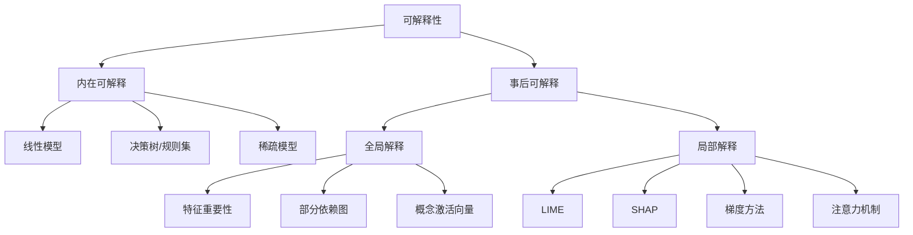
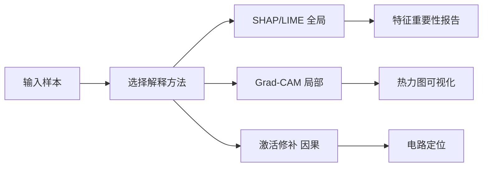

# 可解释性与透明度

## 1. 可解释性分类



### 可解释性方法对比

| 方法 | 类型 | 适用范围 | 计算复杂度 | 稳定性 | 忠实度 |
|------|------|---------|-----------|-------|-------|
| SHAP | 事后/局部 | 任意模型 | O(2^n) → 近似O(n²) | 高 | 高 |
| LIME | 事后/局部 | 任意模型 | O(k·n) | 低 | 中 |
| 特征重要性 | 事后/全局 | 树模型/线性 | O(1) | 中 | 中 |
| 部分依赖图 | 事后/全局 | 任意模型 | O(n·m) | 高 | 高 |
| Grad-CAM | 事后/局部 | CNN | O(1) 前向 | 中 | 中 |
| Integrated Gradients | 事后/局部 | 可微模型 | O(k) 梯度 | 高 | 高 |
| 决策树 | 内在可解释 | 树模型 | O(log n) | 高 | 高 |

## 2. 事后解释方法

### SHAP

- **Shapley 值**：博弈论中每个特征的边际贡献
- **性质**：对称性、可加性、虚拟性
- **问题**：计算成本高（指数级）
- **近似**：TreeSHAP、KernelSHAP

```python
import numpy as np
import pandas as pd
from sklearn.ensemble import RandomForestClassifier
from sklearn.datasets import load_breast_cancer

data = load_breast_cancer()
X = pd.DataFrame(data.data, columns=data.feature_names)
y = data.target

model = RandomForestClassifier(n_estimators=100, max_depth=10)
model.fit(X, y)

def shap_explain(model, X_instance, X_background, feature_names):
    def predict_fn(x):
        return model.predict_proba(x)

    n_features = X_instance.shape[1]
    shap_values = np.zeros(n_features)

    for _ in range(1000):
        mask = np.random.binomial(1, 0.5, n_features)
        x_with = X_instance.copy()
        x_without = X_instance.copy()
        for j in range(n_features):
            idx = np.random.randint(0, X_background.shape[0])
            if mask[j] == 0:
                x_with[j] = X_background[idx, j]
                x_without[j] = X_background[idx, j]
        pred_with = predict_fn(x_with.reshape(1, -1))[0][1]
        pred_without = predict_fn(x_without.reshape(1, -1))[0][1]
        marginal = pred_with - pred_without
        n_included = mask.sum()
        shap_values += marginal / (n_features * (n_features - 1) / (n_included * (n_features - n_included) + 1e-8))

    shap_values = shap_values / 1000
    return dict(zip(feature_names, shap_values))

instance = X.iloc[0:1].values
background = X.sample(100).values
result = shap_explain(model, instance, background, data.feature_names)
sorted_result = sorted(result.items(), key=lambda x: abs(x[1]), reverse=True)
```

### LIME

- **局部代理模型**：在预测点附近训练简单解释模型
- **流程**：采样 → 权重 → 拟合线性/决策树
- **缺点**：局部近似不稳定

```python
from sklearn.linear_model import Ridge
from sklearn.metrics.pairwise import euclidean_distances

def lime_explain(model, X_instance, X_data, feature_names, n_samples=5000, kernel_width=0.75):
    n_features = X_instance.shape[1]
    noise = np.random.normal(0, 0.1, (n_samples, n_features))
    X_perturbed = X_instance + noise
    X_perturbed = np.vstack([X_instance, X_perturbed])

    predictions = model.predict_proba(X_perturbed)[:, 1]
    distances = euclidean_distances(X_perturbed, X_instance.reshape(1, -1)).ravel()
    weights = np.exp(-(distances ** 2) / (kernel_width ** 2))

    surrogate = Ridge(alpha=1.0)
    surrogate.fit(X_perturbed, predictions, sample_weight=weights)

    coefficients = surrogate.coef_
    return dict(zip(feature_names, coefficients))

X_data_np = X.values
instance_2 = X_data_np[2:3]
lime_result = lime_explain(model, instance_2, X_data_np, data.feature_names)
```

### 梯度方法

- **Saliency Map**：输入梯度热力图
- **Grad-CAM**：CNN 类激活映射
- **Integrated Gradients**：路径积分梯度

```python
import torch
import torch.nn.functional as F
from torchvision import models, transforms
from PIL import Image

model_gradcam = models.resnet50(pretrained=True)
model_gradcam.eval()

def saliency_map(model, x, target_class):
    x.requires_grad = True
    logits = model(x)
    score = logits[0, target_class]
    model.zero_grad()
    score.backward()
    saliency = x.grad.abs().max(dim=1)[0]
    return saliency

def grad_cam(model, x, target_class, target_layer="layer4"):
    activations = {}
    gradients = {}

    def forward_hook(module, input, output):
        activations["value"] = output

    def backward_hook(module, grad_input, grad_output):
        gradients["value"] = grad_output[0]

    layer = dict(model.named_modules())[target_layer]
    handle_forward = layer.register_forward_hook(forward_hook)
    handle_backward = layer.register_full_backward_hook(backward_hook)

    logits = model(x)
    score = logits[0, target_class]
    model.zero_grad()
    score.backward()

    weights = gradients["value"].mean(dim=(2, 3), keepdim=True)
    cam = (weights * activations["value"]).sum(dim=1)
    cam = F.relu(cam)
    cam = F.interpolate(cam.unsqueeze(0), size=x.shape[2:], mode="bilinear", align_corners=False)

    handle_forward.remove()
    handle_backward.remove()
    return cam.squeeze()

def integrated_gradients(model, x, target_class, steps=50):
    baseline = torch.zeros_like(x)
    scaled_inputs = [baseline + (i / steps) * (x - baseline) for i in range(steps + 1)]
    grads = []
    for scaled_x in scaled_inputs:
        scaled_x.requires_grad = True
        logits = model(scaled_x)
        score = logits[0, target_class]
        model.zero_grad()
        score.backward()
        grads.append(scaled_x.grad.clone())
    avg_grad = torch.stack(grads).mean(dim=0)
    ig = (x - baseline) * avg_grad
    return ig
```

## 3. LLM 可解释性

### 注意力分析

```python
import torch

def extract_attention_patterns(model, input_ids, layer_idx=-1, head_idx=None):
    outputs = model(input_ids, output_attentions=True)
    attentions = outputs.attentions[layer_idx]
    if head_idx is not None:
        attentions = attentions[:, head_idx:head_idx+1]
    avg_attention = attentions.mean(dim=(0, 1))
    return avg_attention.detach().numpy()

def find_induction_heads(model, input_ids):
    outputs = model(input_ids, output_attentions=True)
    n_layers = len(outputs.attentions)
    n_heads = outputs.attentions[0].size(1)
    induction_scores = []
    for layer in range(n_layers):
        for head in range(n_heads):
            attn = outputs.attentions[layer][0, head]
            prev_token_attn = attn.diagonal(-1)
            induction_score = prev_token_attn.mean().item()
            induction_scores.append((layer, head, induction_score))
    return sorted(induction_scores, key=lambda x: x[2], reverse=True)
```

### 探针分类

- 训练线性探针探测模型内部表示
- **示例**：从中间层提取语法/语义特征

```python
from sklearn.linear_model import LogisticRegression

def train_probe(model, layer_outputs, labels):
    probe = LogisticRegression(max_iter=1000, C=0.1)
    probe.fit(layer_outputs, labels)
    accuracy = probe.score(layer_outputs, labels)
    return probe, accuracy

def layer_representations(model, input_ids, layer_idx):
    outputs = model(input_ids, output_hidden_states=True)
    hidden = outputs.hidden_states[layer_idx]
    return hidden.mean(dim=1).detach().numpy()

def find_interpretable_neurons(model, dataset, concept_fn):
    neuron_scores = {}
    for layer in range(model.config.num_hidden_layers):
        reps = layer_representations(model, dataset["input_ids"], layer)
        concept_labels = concept_fn(dataset)
        probe, acc = train_probe(model, reps, concept_labels)
        neuron_scores[layer] = acc
    return neuron_scores
```

### 激活修补

- 干预特定神经元/层观察行为变化
- **因果追踪**：定位关键计算路径

```python
def activation_patching(model, input_ids, patch_input_ids, target_layer, target_token_idx):
    ref_output = model(patch_input_ids)
    ref_hidden = model(patch_input_ids, output_hidden_states=True).hidden_states[target_layer]

    patched_hidden = model(input_ids, output_hidden_states=True).hidden_states[target_layer]
    patched_hidden[0, target_token_idx] = ref_hidden[0, target_token_idx]

    original_output = model(input_ids)
    patched_output = model(input_ids, patched_hidden=patched_hidden)

    effect = (original_output.logits - patched_output.logits).abs().sum().item()
    return effect

def causal_trace(model, prompt, subject_range, corrupted_prompt):
    clean_states = model(prompt, output_hidden_states=True).hidden_states
    corrupted_states = model(corrupted_prompt, output_hidden_states=True).hidden_states

    effect_scores = {}
    for layer in range(len(clean_states)):
        for token in range(*subject_range):
            patched = [h.clone() for h in corrupted_states]
            patched[layer][0, token] = clean_states[layer][0, token]
            logits = model(input_ids=corrupted_prompt, patched_hidden_states=patched).logits
            effect = logits[0, -1, :].softmax(dim=-1).max().item()
            effect_scores[(layer, token)] = effect
    return effect_scores
```

### 工具库对比

| 工具库 | 支持方法 | 框架 | 可视化 | 适用模型 |
|-------|---------|------|-------|---------|
| SHAP | SHAP, KernelSHAP, TreeSHAP | 通用 | 是 | 任意 |
| LIME | LIME, SP-LIME | 通用 | 是 | 任意 |
| Captum | IG, Saliency, Grad-CAM | PyTorch | 否 | PyTorch |
| Alibi | ALE, PDP, SHAP | 通用 | 是 | 任意 |
| TransformerLens | 激活修补, 探针 | PyTorch | 是 | Transformer |
| OpenAI Microscope | 特征可视化 | 专有 | 是 | GPT-2 |

### 案例：用 Captum 实现 Saliency 与 Integrated Gradients

借助 Captum 库快速为图像分类模型生成像素级显著图，定位模型关注区域。

```python
import torch
import torch.nn.functional as F
from captum.attr import Saliency, IntegratedGradients

def captum_saliency(model, x, target_class):
    saliency = Saliency(model)
    attrs = saliency.attribute(x, target=target_class)
    return attrs.abs().squeeze(0).sum(0).detach()  # 各像素重要度

def captum_ig(model, x, target_class, baseline=None, steps=50):
    ig = IntegratedGradients(model)
    if baseline is None:
        baseline = torch.zeros_like(x)
    attrs = ig.attribute(x, baseline, target=target_class, n_steps=steps)
    return attrs.squeeze(0).detach()
```

### 案例：用 SHAP 解释表格模型预测

直接调用官方 `shap` 库（TreeExplainer）获得忠实且稳定的特征贡献，对比前文手工近似实现。

```python
import shap
import sklearn
import pandas as pd

def shap_tree_explain(model, X_df):
    explainer = shap.TreeExplainer(model)
    shap_values = explainer.shap_values(X_df)
    # 返回每个样本各特征的 SHAP 值（二分类取正类）
    if isinstance(shap_values, list):
        sv = shap_values[1]
    else:
        sv = shap_values
    mean_abs = pd.Series(sv.mean(0), index=X_df.columns).sort_values(key=abs, ascending=False)
    return mean_abs

def force_plot_local(explainer, X_row):
    # 单个预测的力图，展示各特征如何推动预测偏离基线
    return shap.force_plot(explainer.expected_value, explainer.shap_values(X_row), X_row)
```



## 4. 机制可解释性 Mechanistic Interpretability

### 目标

- **逆向工程**：理解神经网络内部计算机制
- **电路发现**：找到特定功能的神经元子图

### 方法

- **激活字典**：稀疏自编码器分解神经元
- **特征可视化**：最大化激活特定神经元
- **自动电路发现**：Edge Attribution Patching

### 可解释性级别对比

| 级别 | 描述 | 方法 | 自动化程度 | 完整度 |
|------|------|------|-----------|-------|
| 行为级 | 输入-输出行为 | 探针、行为测试 | 高 | 低 |
| 表示级 | 神经元/层表示 | 激活字典、特征可视化 | 中 | 中 |
| 电路级 | 计算子图 | 激活修补、因果追踪 | 低 | 高 |
| 算法级 | 完整计算算法 | 自动化电路发现 | 极低 | 极高 |

### 进展

- **Othello-GPT**：发现模型内部学习世界模型
- **Induction Head**：模式复制的注意力机制
- **IOI Circuit**：间接对象识别回路

## 5. 透明度实践

### 文档类型对比

| 文档类型 | 内容 | 目标受众 | 法规要求 | 详细程度 |
|---------|------|---------|---------|---------|
| Model Card | 模型目的、数据、评估、局限 | 开发者/用户 | EU AI Act | 中 |
| Data Sheet | 数据来源、收集、标注、隐私 | 审计/合规 | GDPR | 高 |
| System Card | 系统架构、安全测试、部署 | 技术/安全 | 自愿 | 极高 |
| Impact Assessment | 社会/伦理影响评估 | 监管/公众 | EU AI Act | 高 |

## 6. 2025-2026 趋势

- **稀疏自编码器（SAE）**：GPT-4 内部表示解码
- **自动化可解释性**：LLM 解释 LLM
- **可解释性评估基准**：评估我们理解的正确性
- **透明度法规**：AI 法案要求可解释性报告
- **因果可解释性**：从相关到因果解释
- **交互式可解释性**：用户可以询问模型决策原因
