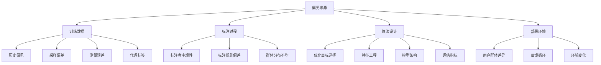
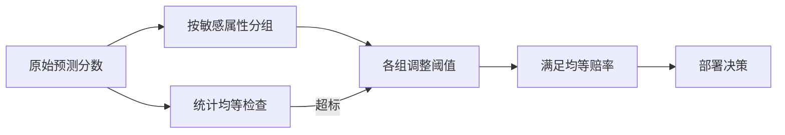
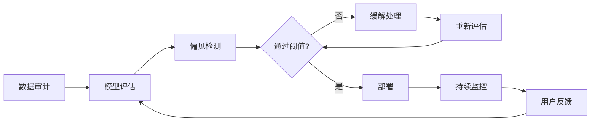

# 偏见与公平性

## 1. 偏见的来源



### 偏见类型对比

| 偏见类型 | 描述 | 常见场景 | 影响程度 | 检测方法 |
|---------|------|---------|---------|---------|
| 种族偏见 | 基于种族的差异 | 面部识别、招聘 | 严重 | BBQ、WinoBias |
| 性别偏见 | 基于性别的差异 | 简历筛选、翻译 | 严重 | WinoBias、StereoSet |
| 地域偏见 | 基于地域的差异 | 方言识别、搜索 | 中 | 地理多样性子集 |
| 年龄偏见 | 基于年龄的差异 | 医疗诊断、信贷 | 中 | 年龄分层评估 |
| 刻板印象 | 强化社会偏见 | 文本生成 | 严重 | StereoSet、CrowS-Pairs |
| 宗教偏见 | 基于宗教的差异 | 内容审核 | 中 | 宗教均衡测试 |
| 外貌偏见 | 基于外表的差异 | 招聘、社交 | 中 | 外貌多样性测试 |

## 2. 公平性指标

| 指标 | 公式 | 定义 | 适用 | 约束强度 |
|------|------|------|------|---------|
| 统计均等 | P(Ŷ=1|A=a) = P(Ŷ=1) | 预测率独立于群体 | 整体均等 | 强 |
| 机会均等 | P(Ŷ=1|Y=1,A=a) = P(Ŷ=1|Y=1) | TPR 在各群体一致 | 真正例率 | 中 |
| 预测均等 | P(Y=1|Ŷ=1,A=a) = P(Y=1|Ŷ=1) | PPV 在各群体一致 | 准确率 | 中 |
| 反事实公平 | Y(do(A=a)) = Y(do(A=a')) | 改变敏感属性后预测不变 | 因果 | 强 |
| 个人均等 | sim(x_i,x_j) → ŷ_i = ŷ_j | 相似个体预测一致 | 相似性 | 弱 |
| 均等赔率 | TPR & FPR 同时相等 | 两组TPR和FPR一致 | 严苛 | 最强 |

```python
import numpy as np
import pandas as pd
from sklearn.metrics import confusion_matrix

def demographic_parity(y_pred, sensitive_attr):
    groups = np.unique(sensitive_attr)
    rates = {}
    for g in groups:
        mask = sensitive_attr == g
        rates[g] = y_pred[mask].mean()
    max_diff = max(rates.values()) - min(rates.values())
    return rates, max_diff

def equal_opportunity(y_true, y_pred, sensitive_attr):
    groups = np.unique(sensitive_attr)
    tprs = {}
    for g in groups:
        mask = (sensitive_attr == g) & (y_true == 1)
        if mask.sum() > 0:
            tprs[g] = y_pred[mask].mean()
        else:
            tprs[g] = np.nan
    max_diff = max([v for v in tprs.values() if not np.isnan(v)]) - min([v for v in tprs.values() if not np.isnan(v)])
    return tprs, max_diff

def equalized_odds(y_true, y_pred, sensitive_attr):
    groups = np.unique(sensitive_attr)
    metrics = {}
    for g in groups:
        mask = sensitive_attr == g
        tn, fp, fn, tp = confusion_matrix(y_true[mask], y_pred[mask]).ravel()
        tpr = tp / (tp + fn) if (tp + fn) > 0 else 0
        fpr = fp / (fp + tn) if (fp + tn) > 0 else 0
        metrics[g] = {"tpr": tpr, "fpr": fpr}
    tpr_diff = max(m["tpr"] for m in metrics.values()) - min(m["tpr"] for m in metrics.values())
    fpr_diff = max(m["fpr"] for m in metrics.values()) - min(m["fpr"] for m in metrics.values())
    return metrics, tpr_diff, fpr_diff

def disparate_impact(y_pred, sensitive_attr, privileged_group=1):
    groups = np.unique(sensitive_attr)
    rates = {}
    for g in groups:
        mask = sensitive_attr == g
        rates[g] = y_pred[mask].mean()
    di_ratio = min(rates.values()) / max(rates.values())
    return di_ratio
```

### 无法同时满足

- **不可能三角**：统计均等、机会均等、预测均等不能同时满足
- **需要业务场景权衡**

### 公平性指标选择指南

| 场景 | 推荐指标 | 理由 |
|------|---------|------|
| 招聘筛选 | 机会均等 | 保证合格者被公平选中 |
| 信贷审批 | 统计均等 | 保证批准率一致 |
| 医疗诊断 | 均等赔率 | TPR 和 FPR 都需公平 |
| 刑事司法 | 反事实公平 | 因果公平要求 |
| 内容推荐 | 个人均等 | 相似用户获相似推荐 |

## 3. 偏见检测与缓解

### 检测基准对比

| 基准 | 维度 | 样本数 | 语言 | 指标 | 局限性 |
|------|------|-------|------|------|-------|
| WinoBias | 职业性别 | 3160 | EN | 共指准确率差 | 仅限性别 |
| StereoSet | 刻板印象 | 170K | EN | SS score | 众包质量 |
| BBQ | 社会偏见 | 58K | EN | 准确率差 | 仅限Q&A |
| CrowS-Pairs | 刻板印象 | 1508 | EN | 模板匹配 | 模板有限 |
| UnQover | 性别/种族 | 30K | EN | 不确定性 | 仅限QA |
| HolisticBias | 多维度 | 460K | EN | 多样性 | 仅英文 |

```python
def winobias_evaluation(model, tokenizer, winobias_data):
    results = {"anti_stereotype": [], "pro_stereotype": []}
    for item in winobias_data:
        pro_text = item["pro_stereotype"]
        anti_text = item["anti_stereotype"]
        pro_tokens = tokenizer(pro_text, return_tensors="pt")
        anti_tokens = tokenizer(anti_text, return_tensors="pt")
        with torch.no_grad():
            pro_loss = model(**pro_tokens, labels=pro_tokens.input_ids).loss
            anti_loss = model(**anti_tokens, labels=anti_tokens.input_ids).loss
        bias_score = (anti_loss - pro_loss) / (anti_loss + pro_loss)
        results[item["type"]].append(bias_score.item())
    avg_pro = np.mean(results["pro_stereotype"])
    avg_anti = np.mean(results["anti_stereotype"])
    overall_bias = (avg_pro + avg_anti) / 2
    return {"pro_stereotype_mean": avg_pro, "anti_stereotype_mean": avg_anti, "overall_bias": overall_bias}

def bbq_evaluation(model, tokenizer, bbq_data):
    results = {"ambiguous": {"acc": [], "bias": []}, "disambiguated": {"acc": [], "bias": []}}
    for item in bbq_data:
        for context_type in ["ambiguous", "disambiguated"]:
            question = item[context_type]["question"]
            answers = item[context_type]["answers"]
            input_ids = tokenizer(question, return_tensors="pt").input_ids
            logits = model(input_ids).logits[:, -1, :]
            probs = torch.softmax(logits, dim=-1)
            ans_probs = [probs[0, tokenizer.encode(a)[-1]].item() for a in answers]
            pred_idx = np.argmax(ans_probs)
            correct = pred_idx == item["correct_idx"]
            results[context_type]["acc"].append(correct)
            bias_label = 1 if pred_idx != item["correct_idx"] and item["bias_group"] in answers[pred_idx] else 0
            results[context_type]["bias"].append(bias_label)
    return {
        "ambiguous_acc": np.mean(results["ambiguous"]["acc"]),
        "ambiguous_bias": np.mean(results["ambiguous"]["bias"]),
        "disambiguated_acc": np.mean(results["disambiguated"]["acc"]),
        "disambiguated_bias": np.mean(results["disambiguated"]["bias"]),
    }
```

### 缓解方法对比

| 阶段 | 方法 | 效果 | 副作用 | 实现复杂度 |
|------|------|------|-------|-----------|
| 数据 | 平衡采样 | 高 | 信息损失 | 低 |
| 数据 | 反偏见数据增强 | 中-高 | 数据失真 | 中 |
| 训练 | 对抗去偏 | 高 | 训练不稳定 | 高 |
| 训练 | 公平正则化 | 中 | 精度下降 | 中 |
| 训练 | 重新加权 | 中 | 方差增大 | 低 |
| 后处理 | 阈值调整 | 中 | 校准偏移 | 低 |
| 部署 | 持续监控 | 检测用 | 无 | 中 |

```python
from torch.utils.data import WeightedRandomSampler, DataLoader, TensorDataset

def balanced_sampling(dataset, sensitive_attr):
    classes, counts = np.unique(sensitive_attr, return_counts=True)
    total = len(sensitive_attr)
    weights = total / (len(classes) * counts)
    sample_weights = np.array([weights[list(classes).index(a)] for a in sensitive_attr])
    sampler = WeightedRandomSampler(sample_weights, len(sample_weights), replacement=True)
    return sampler

def adversarial_debiasing(feature_extractor, classifier, adversary, X, y, sensitive, lambda_adv=1.0):
    opt_feat = torch.optim.Adam(feature_extractor.parameters(), lr=0.001)
    opt_cls = torch.optim.Adam(classifier.parameters(), lr=0.001)
    opt_adv = torch.optim.Adam(adversary.parameters(), lr=0.001)

    for epoch in range(100):
        for batch in DataLoader(TensorDataset(X, y, sensitive), batch_size=64, shuffle=True):
            x_b, y_b, s_b = batch
            features = feature_extractor(x_b)
            y_pred = classifier(features)
            s_pred = adversary(features.detach())
            cls_loss = F.binary_cross_entropy(y_pred, y_b)
            adv_loss = F.binary_cross_entropy(s_pred, s_b)
            opt_feat.zero_grad()
            opt_cls.zero_grad()
            (cls_loss - lambda_adv * adv_loss).backward()
            opt_feat.step()
            opt_cls.step()
            opt_adv.zero_grad()
            adv_loss.backward()
            opt_adv.step()
```

### 数据平衡采样

```python
def reweighing(X, y, sensitive_attr):
    groups = pd.DataFrame({"y": y.numpy(), "s": sensitive_attr.numpy()})
    group_counts = groups.groupby(["y", "s"]).size()
    total = len(groups)
    weights = np.zeros(len(groups))
    for (y_val, s_val), count in group_counts.items():
        prob_y = (y == y_val).float().mean().item()
        prob_s = (sensitive_attr == s_val).float().mean().item()
        expected = total * prob_y * prob_s
        actual = count
        mask = (y.numpy() == y_val) & (sensitive_attr.numpy() == s_val)
        weights[mask] = expected / actual
    return torch.tensor(weights, dtype=torch.float32)

def demographic_parity_constraint(y_pred, sensitive_attr, threshold=0.05):
    groups = np.unique(sensitive_attr)
    rates = {}
    for g in groups:
        mask = sensitive_attr == g
        rates[g] = y_pred[mask].mean()
    overall_rate = y_pred.mean()
    violations = {}
    for g, rate in rates.items():
        violations[g] = abs(rate - overall_rate)
    max_violation = max(violations.values())
    return max_violation < threshold, violations
```

### 案例：交叉性（Intersectionality）公平度量

同时考虑性别与种族两个敏感属性的组合群体，检测单一维度下被掩盖的偏见。

```python
import numpy as np

def intersectional_parity(y_pred, group_a, group_b):
    # group_a / group_b 为两个敏感属性分组 (如 性别, 种族)
    results = {}
    for a in np.unique(group_a):
        for b in np.unique(group_b):
            mask = (group_a == a) & (group_b == b)
            if mask.sum() > 0:
                results[f"{a}-{b}"] = y_pred[mask].mean()
    max_diff = max(results.values()) - min(results.values())
    return results, max_diff
```

### 案例：阈值后处理实现均等赔率

对预测分数按群体分别设定阈值，使各群体的 TPR 一致（以牺牲整体精度为代价）。

```python
import numpy as np

def threshold_by_tpr(y_true, scores, sensitive_attr, target_tpr=0.8):
    thresholds = {}
    for g in np.unique(sensitive_attr):
        mask = sensitive_attr == g
        pos = y_true[mask] == 1
        if pos.sum() == 0:
            thresholds[g] = 0.5
            continue
        # 找到使正类召回率达到 target_tpr 的最低阈值
        sorted_scores = np.sort(scores[mask][pos])
        idx = int((1 - target_tpr) * len(sorted_scores))
        idx = min(idx, len(sorted_scores) - 1)
        thresholds[g] = sorted_scores[idx]
    y_pred = np.zeros_like(scores, dtype=int)
    for g in thresholds:
        mask = sensitive_attr == g
        y_pred[mask] = (scores[mask] >= thresholds[g]).astype(int)
    return y_pred, thresholds
```



## 4. 公平 ML 实践

- **多样性团队**：多视角参与开发
- **影响评估**：部署前做公平性审计
- **透明报告**：公布模型在各群体上的表现
- **纠错机制**：用户申诉和错误修正
- **持续审计**：部署后定期复查偏见指标
- **多方参与**：受影响的社区参与决策

### 偏见审计流程



## 5. 2025-2026 趋势

- **多维公平性**：交叉性（Intersectionality）公平
- **因果公平**：基于因果推理的公平定义
- **联邦公平**：分布式环境下的公平性保障
- **LLM 偏见评估**：更复杂的自动评估框架
- **公平性法规**：更多国家要求公平性审计
