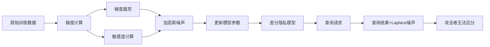
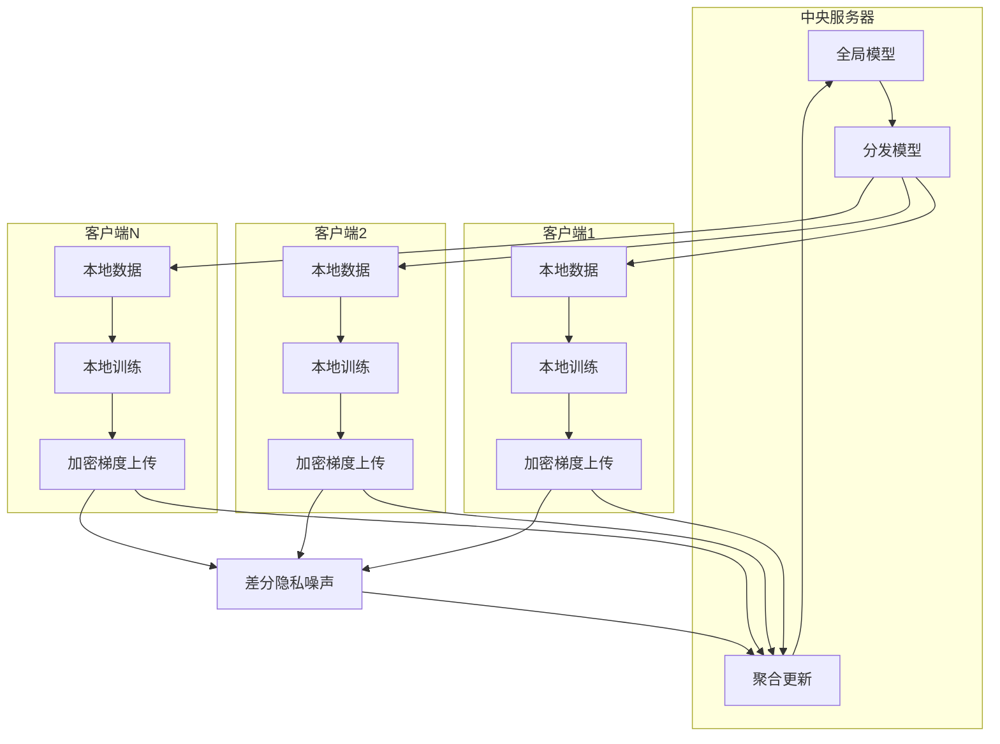
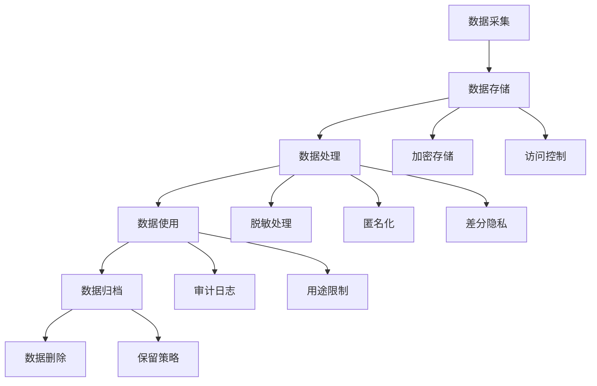
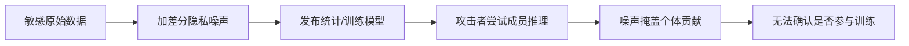

# 隐私与数据治理

## 1. 数据隐私风险

### AI 中的隐私威胁对比

| 攻击类型 | 目标 | 所需信息 | 攻击者知识 | 成功率 | 防御难度 |
|---------|------|---------|-----------|-------|---------|
| 成员推理 | 判断数据是否在训练集 | 模型输出 | 黑盒/白盒 | 60-90% | 中 |
| 属性推理 | 推断群体属性（如疾病） | 模型输出 | 黑盒 | 40-70% | 高 |
| 模型反转 | 重建训练数据样本 | 模型参数/梯度 | 白盒 | 30-60% | 高 |
| 数据抽取 | 从 LLM 抽取原始数据 | 模型 API | 黑盒 | 5-30% | 中 |
| 梯度泄露 | 从梯度还原数据 | 共享梯度 | 白盒 | 80-95% | 高 |

```python
def membership_inference_attack(target_model, shadow_model, shadow_data, target_data):
    shadow_preds = []
    for x in shadow_data:
        shadow_preds.append(shadow_model.predict_proba(x.unsqueeze(0))[0])
    shadow_preds = np.array(shadow_preds)

    attack_model = RandomForestClassifier(n_estimators=100)
    shadow_labels = np.concatenate([np.ones(len(shadow_data)//2), np.zeros(len(shadow_data)//2)])
    attack_model.fit(shadow_preds, shadow_labels)

    target_preds = []
    for x in target_data:
        target_preds.append(target_model.predict_proba(x.unsqueeze(0))[0])
    target_preds = np.array(target_preds)
    membership_preds = attack_model.predict(target_preds)
    return membership_preds

def pii_detection(text, pii_patterns=None):
    import re
    if pii_patterns is None:
        pii_patterns = {
            "email": r"[a-zA-Z0-9._%+-]+@[a-zA-Z0-9.-]+\.[a-zA-Z]{2,}",
            "phone": r"1[3-9]\d{9}",
            "id_card": r"\d{17}[\dXx]",
            "ip_address": r"\d{1,3}\.\d{1,3}\.\d{1,3}\.\d{1,3}",
            "bank_card": r"\d{16,19}",
        }
    detected = {}
    for pii_type, pattern in pii_patterns.items():
        matches = re.findall(pattern, text)
        if matches:
            detected[pii_type] = matches
    return detected

def pii_anonymize(text, pii_patterns=None):
    import re
    if pii_patterns is None:
        pii_patterns = {
            "email": (r"[a-zA-Z0-9._%+-]+@[a-zA-Z0-9.-]+\.[a-zA-Z]{2,}", "[EMAIL]"),
            "phone": (r"1[3-9]\d{9}", "[PHONE]"),
            "id_card": (r"\d{17}[\dXx]", "[ID_CARD]"),
            "ip_address": (r"\d{1,3}\.\d{1,3}\.\d{1,3}\.\d{1,3}", "[IP]"),
            "bank_card": (r"\d{16,19}", "[BANK_CARD]"),
        }
    result = text
    for pii_type, (pattern, replacement) in pii_patterns.items():
        result = re.sub(pattern, replacement, result)
    return result
```

## 2. 隐私保护技术

### 保护技术对比

| 技术 | 隐私保证 | 计算开销 | 通信开销 | 精度损失 | 适用场景 |
|------|---------|---------|---------|---------|---------|
| 差分隐私 DP | 强 (ε-DP) | 2-10x | 1x | 中-高 | 训练/查询 |
| 联邦学习 | 中 (数据本地) | 1.5-3x | 高 | 低-中 | 分布式训练 |
| 同态加密 | 极强 | 100-1000x | 1x | 无 | 推理/小模型 |
| 安全多方计算 | 极强 | 10-100x | 极高 | 无 | 联合计算 |
| 匿名化 | 弱 (重识别风险) | 1-2x | 1x | 低 | 数据发布 |
| 合成数据 | 中 | 高 (生成) | 1x | 中 | 数据共享 |

### 差分隐私 DP



- **核心**：在训练/查询中加入噪声，使单条数据的影响可忽略
- **ε（隐私预算）**：越小越安全
- **DP-SGD**：梯度裁剪 + 高斯噪声

```python
import torch
import torch.nn as nn
from torch.utils.data import DataLoader

class DPSGD:
    def __init__(self, model, lr=0.001, clip_norm=1.0, noise_multiplier=1.1, delta=1e-5):
        self.model = model
        self.lr = lr
        self.clip_norm = clip_norm
        self.noise_multiplier = noise_multiplier
        self.delta = delta

    def compute_epsilon(self, steps, batch_size, dataset_size):
        q = batch_size / dataset_size
        sigma = self.noise_multiplier
        epsilon = np.sqrt(2 * steps * q * np.log(1 / self.delta)) / sigma
        return epsilon

    def train_step(self, x_batch, y_batch, optimizer):
        batch_size = x_batch.size(0)
        per_sample_grads = []
        for i in range(batch_size):
            x_i = x_batch[i:i+1]
            y_i = y_batch[i:i+1]
            output = self.model(x_i)
            loss = nn.CrossEntropyLoss()(output, y_i)
            params = [p for p in self.model.parameters() if p.requires_grad]
            grads = torch.autograd.grad(loss, params, create_graph=False)
            grad_norm = torch.sqrt(sum(torch.sum(g ** 2) for g in grads))
            clipped = [g * min(1, self.clip_norm / (grad_norm + 1e-8)) for g in grads]
            per_sample_grads.append(clipped)

        sum_grads = [torch.zeros_like(p) for p in params]
        for g in per_sample_grads:
            for i, sg in enumerate(g):
                sum_grads[i] += sg

        for i, sg in enumerate(sum_grads):
            noise = torch.normal(0, self.clip_norm * self.noise_multiplier, size=sg.shape)
            sg += noise
            sg /= batch_size

        for p, g in zip(params, sum_grads):
            p.grad = g
        optimizer.step()
        optimizer.zero_grad()

    def train(self, dataset, epochs=10, batch_size=256):
        loader = DataLoader(dataset, batch_size=batch_size, shuffle=True)
        optimizer = torch.optim.SGD(self.model.parameters(), lr=self.lr)
        total_steps = epochs * len(loader)
        eps = self.compute_epsilon(total_steps, batch_size, len(dataset))
        print(f"Total privacy budget: epsilon={eps:.2f}, delta={self.delta}")
        for epoch in range(epochs):
            for x, y in loader:
                self.train_step(x, y, optimizer)

def laplace_mechanism(query_result, sensitivity, epsilon):
    scale = sensitivity / epsilon
    noise = np.random.laplace(0, scale)
    return query_result + noise

def gaussian_mechanism(query_result, sensitivity, epsilon, delta=1e-5):
    sigma = sensitivity * np.sqrt(2 * np.log(1.25 / delta)) / epsilon
    noise = np.random.normal(0, sigma)
    return query_result + noise

def dp_query(counts, epsilon, sensitivity=1.0):
    noisy_counts = []
    for c in counts:
        noisy_c = laplace_mechanism(c, sensitivity, epsilon / len(counts))
        noisy_counts.append(max(0, round(noisy_c)))
    return noisy_counts
```

### 联邦学习



- 数据不共享，只共享模型梯度/参数
- **问题**：梯度也可能泄露信息
- **联邦 + 差分隐私**：梯度发前加噪声

```python
import copy
import torch

def federated_averaging(global_model, client_models, client_weights=None):
    global_dict = global_model.state_dict()
    if client_weights is None:
        client_weights = [1.0 / len(client_models)] * len(client_models)

    for key in global_dict:
        global_dict[key] = sum(
            w * client_models[i].state_dict()[key].float()
            for i, w in enumerate(client_weights)
        )
    global_model.load_state_dict(global_dict)
    return global_model

def local_train(model, train_loader, epochs=5, lr=0.01, dp_noise=0.0, clip_norm=1.0):
    local_model = copy.deepcopy(model)
    optimizer = torch.optim.SGD(local_model.parameters(), lr=lr)
    for _ in range(epochs):
        for x, y in train_loader:
            optimizer.zero_grad()
            loss = nn.CrossEntropyLoss()(local_model(x), y)
            loss.backward()
            if dp_noise > 0:
                for p in local_model.parameters():
                    if p.grad is not None:
                        grad_norm = p.grad.norm()
                        p.grad = p.grad * min(1, clip_norm / (grad_norm + 1e-8))
                        p.grad += torch.normal(0, clip_norm * dp_noise, size=p.grad.shape)
            optimizer.step()
    return local_model

def secure_aggregation(client_updates, threshold=2):
    n = len(client_updates)
    if n < threshold:
        return None
    shuffled = client_updates.copy()
    np.random.shuffle(shuffled)
    aggregated = {}
    for key in shuffled[0].keys():
        aggregated[key] = sum(u[key].float() for u in shuffled) / n
    return aggregated

def fed_avg_round(global_model, clients_data, round_num=1, dp_epsilon=8.0, dp_delta=1e-5):
    client_models = []
    for client_id, (loader, weight) in enumerate(clients_data):
        dp_noise = 1.0 / (dp_epsilon * len(loader)) if dp_epsilon > 0 else 0.0
        local = local_train(global_model, loader, dp_noise=dp_noise)
        client_models.append(local)
    updated = federated_averaging(global_model, client_models)
    return updated
```

### 同态加密与安全多方计算

| 特性 | 同态加密 (HE) | 安全多方计算 (MPC) | 可信执行环境 (TEE) |
|------|-------------|------------------|------------------|
| 计算形式 | 加密数据上计算 | 秘密共享 | 硬件隔离 |
| 安全性 | 密码学 | 密码学 | 硬件信任 |
| 性能开销 | 100-1000x | 10-100x | 1-2x |
| 通信开销 | 低 | 极高 | 低 |
| 适用模型 | 小模型推理 | 小模型 | 任意模型 |
| 部署难度 | 高 | 极高 | 中 |

## 3. 数据治理框架

### 生命周期



### 数据分类

| 分类 | 示例 | 保护措施 | 访问控制 | 保留期限 |
|------|------|---------|---------|---------|
| 公开 | 百科数据、开源代码 | 无限制 | 公开 | 永久 |
| 内部 | 业务报表、内部文档 | 访问控制 | 员工 | 3-5年 |
| 敏感 | 个人信息、行为数据 | 加密+脱敏 | 授权人员 | 1-3年 |
| 极敏感 | 医疗记录、金融账户 | DP+加密+审计 | 最小权限 | 法律要求 |

### 数据治理角色对比

| 角色 | 职责 | 技能要求 | 在组织中的位置 |
|------|------|---------|-------------|
| 数据保护官 (DPO) | GDPR 合规、数据保护 | 法律+技术 | 独立监督 |
| 数据管理员 | 数据资产管理和质量 | 数据管理 | IT/数据部门 |
| 隐私工程师 | 隐私技术实现 | 安全工程 | 工程团队 |
| 伦理委员会 | 伦理审查和决策 | 伦理+法律 | 跨部门 |
| 算法审计员 | 算法公平性和合规 | 技术+法律 | 独立第三方 |

## 4. 合规要求

### 隐私法规对比

| 法规 | 地区 | 核心原则 | 罚则 | 适用范围 |
|------|------|---------|------|---------|
| GDPR | 欧盟 | 数据最小化、被遗忘权 | 全球营收4% | 处理欧盟数据 |
| PIPL | 中国 | 告知同意、目的限制 | 5000万/上年营收5% | 中国境内 |
| CCPA | 加州 | 知情权、删除权 | 每次违规$7500 | 加州居民 |
| LGPD | 巴西 | 类似 GDPR | 营收2% | 巴西 |
| PDPA | 新加坡 | 同意、目的、通知 | 最高$1M | 新加坡 |

### GDPR 核心要求

- **被遗忘权**：用户可以要求删除数据
- **数据可移植性**：用户可以取回数据
- **解释权**：模型决策需要可解释

### 中国法规要求

- **个人信息保护法（PIPL）**
- **数据安全法**
- **算法推荐管理规定**

### 数据最小化原则

- 只收集必要数据
- 设置保留期限
- 脱敏后使用

### 案例：用差分隐私保护文本数据集统计查询

对"各年龄段用户数"这类聚合统计加 Laplace 噪声，满足 ε-DP，防止成员推断。

```python
import numpy as np

def dp_count_by_group(ages, group_bins, epsilon=1.0):
    # 统计各年龄区间人数并加噪
    counts, _ = np.histogram(ages, bins=group_bins)
    sensitivity = 1.0  # 单条记录最多改变一个区间计数 1
    scale = sensitivity / epsilon
    noisy = np.array([
        max(0, int(np.round(c + np.random.laplace(0, scale))))
        for c in counts
    ])
    return noisy

def dp_mean(value, true_mean, epsilon=1.0, bounds=(0, 100)):
    lo, hi = bounds
    sensitivity = (hi - lo)  # 单条记录对均值的影响上界 (经裁剪)
    scale = sensitivity / epsilon
    clipped = np.clip(value, lo, hi)
    return np.mean(clipped) + np.random.laplace(0, scale / len(clipped))
```

### 案例：成员推理攻击复现与评估

训练影子模型模拟目标行为，再用攻击分类器判断样本是否属于训练集。

```python
from sklearn.linear_model import LogisticRegression
import numpy as np

def membership_inference_eval(target_model, shadow_model, X_train, X_test):
    # 用影子模型的预测向量训练攻击器
    pred_train = shadow_model.predict_proba(X_train)
    pred_test = shadow_model.predict_proba(X_test)
    X_attack = np.vstack([pred_train, pred_test])
    y_attack = np.hstack([np.ones(len(pred_train)), np.zeros(len(pred_test))])
    attacker = LogisticRegression().fit(X_attack, y_attack)
    # 在目标模型预测上评估攻击成功率
    target_pred = target_model.predict_proba(X_test)
    attack_acc = attacker.score(target_pred, y_attack[len(pred_train):])
    return attack_acc
```



## 5. 2025-2026 趋势

- **AI 训练数据版权**：LLM 训练数据合规
- **合成数据**：替代真实隐私数据
- **联邦 LLM**：联邦微调
- **隐私计算商业化**：隐私保护 AI 推理服务
- **隐私法规趋同**：全球隐私标准整合
- **后量子密码**：量子计算对加密的威胁
