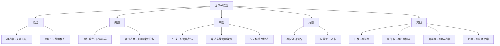
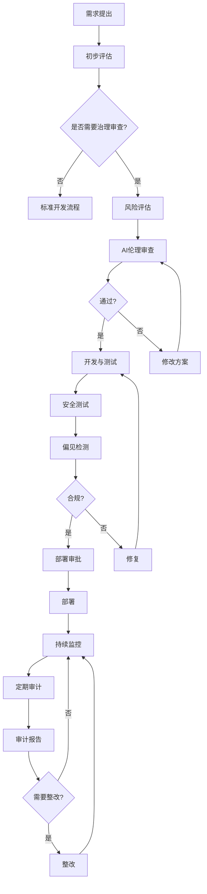
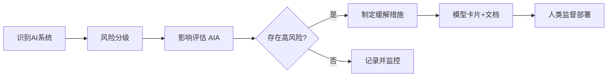

# AI 治理与法规

## 1. 全球 AI 法规概览



### 各国法规对比

| 国家/地区 | 主要法规 | 生效时间 | 核心监管思路 | 处罚力度 | 监管机构 |
|----------|---------|---------|------------|---------|---------|
| 欧盟 | AI Act | 2025-2027 | 风险分级、事前合规 | 全球营收7% | AI Office |
| 中国 | 生成式AI办法 | 2023.8 | 内容合规、算法备案 | 吊销许可 | 网信办 |
| 美国 | AI 行政令 | 2023.10 | 自愿承诺+安全测试 | 合同约束 | AI Safety Institute |
| 英国 | AI 白皮书 | 2023.3 | 创新友好、部门监管 | 部门监管 | 分散式 |
| 日本 | AI 指南 | 2024 | 软法治理 | 无 | 经产省 |
| 新加坡 | AI Verify | 2023 | 自评估框架 | 无 | IMDA |

## 2. 欧盟 AI 法案

### 风险分级

| 级别 | 描述 | 示例 | 要求 | 惩罚 |
|------|------|------|------|------|
| 不可接受风险 | 禁止 | 社会信用评分、实时人脸识别 | 全面禁止 | 全球营收7%或3500万欧 |
| 高风险 | 严格合规 | 医疗设备、招聘、司法 | 风险评估+人类监督+文档 | 全球营收3%或1500万欧 |
| 有限风险 | 透明度义务 | 聊天机器人、情感识别 | 告知用户正在与AI交互 | 营收1.5%或750万欧 |
| 最低风险 | 无要求 | 垃圾邮件过滤、AI游戏 | 自愿行为准则 | 无 |

```python
from enum import Enum
from dataclasses import dataclass, field
from typing import List, Dict
import json
import datetime

class RiskLevel(Enum):
    UNACCEPTABLE = "不可接受风险"
    HIGH = "高风险"
    LIMITED = "有限风险"
    MINIMAL = "最低风险"

@dataclass
class AIApplication:
    name: str
    description: str
    use_case: str
    sector: str
    data_types: List[str]
    decision_impact: str
    human_oversight: bool

class EUAIComplianceChecker:
    def __init__(self):
        self.high_risk_sectors = [
            "医疗诊断", "招聘", "司法", "信贷", "教育",
            "移民", "生物识别", "关键基础设施"
        ]
        self.unacceptable_use_cases = [
            "社会信用评分", "实时人脸识别(执法)", "诱导行为",
            "基于种族的预测性警务"
        ]

    def classify_risk(self, app: AIApplication) -> RiskLevel:
        if any(u in app.use_case for u in self.unacceptable_use_cases):
            return RiskLevel.UNACCEPTABLE
        if app.sector in self.high_risk_sectors:
            return RiskLevel.HIGH
        if app.decision_impact in ["中", "高"]:
            return RiskLevel.HIGH
        if any(dt in ["个人敏感信息", "生物特征"] for dt in app.data_types):
            return RiskLevel.LIMITED
        return RiskLevel.MINIMAL

    def check_requirements(self, app: AIApplication) -> Dict[str, bool]:
        risk = self.classify_risk(app)
        requirements = {
            "risk_assessment_done": False,
            "data_governance": False,
            "technical_documentation": False,
            "human_oversight": False,
            "transparency": False,
            "accuracy_robustness": False,
        }
        if risk == RiskLevel.HIGH:
            requirements["risk_assessment_done"] = True
            requirements["data_governance"] = True
            requirements["technical_documentation"] = True
            requirements["human_oversight"] = app.human_oversight
            requirements["transparency"] = True
            requirements["accuracy_robustness"] = True
        elif risk == RiskLevel.LIMITED:
            requirements["transparency"] = True
        return requirements

checker = EUAIComplianceChecker()
medical_app = AIApplication(
    name="AI诊断系统",
    description="基于影像的疾病诊断",
    use_case="医疗影像分析",
    sector="医疗诊断",
    data_types=["医疗影像", "个人健康信息"],
    decision_impact="高",
    human_oversight=True
)
print(checker.classify_risk(medical_app))
print(checker.check_requirements(medical_app))
```

### 生效时间线

- 2024 年 3 月通过
- 2025 年逐步实施（不可接受风险条款立即生效）
- 2026 年高风险规则生效
- 2027 年全面执行（通用 AI 规则生效）

## 3. 中国 AI 监管

### 主要法规对比

| 法规 | 发布时间 | 监管对象 | 核心要求 | 监管机构 |
|------|---------|---------|---------|---------|
| 生成式AI服务管理办法 | 2023.8 | 生成式AI服务 | 内容合规、算法备案、数据合法 | 网信办 |
| 算法推荐管理规定 | 2022.3 | 算法推荐服务 | 算法透明、用户标签管理 | 网信办 |
| 个人信息保护法 (PIPL) | 2021.11 | 个人信息处理 | 告知同意、敏感信息保护 | 网信办 |
| 数据安全法 | 2021.9 | 数据处理活动 | 数据分类分级、出境安全 | 网信办 |
| 深度合成管理规定 | 2023.1 | 深度合成服务 | 标识要求、内容管理 | 网信办 |

### 核心要求

- 内容合规（安全护栏）
- 算法备案
- 数据来源合法
- 标签标识要求
- 未成年人保护

```python
class ChinaAICompliance:
    def __init__(self):
        self.required_labels = ["AI生成内容", "合成内容", "虚拟形象"]
        self.banned_content = [
            "危害国家安全", "分裂国家", "恐怖主义",
            "民族仇恨", "色情内容", "赌博诈骗",
            "暴力犯罪", "侵犯他人权益"
        ]

    def check_content_compliance(self, content: str) -> dict:
        violations = []
        for banned in self.banned_content:
            if banned in content:
                violations.append(banned)
        return {
            "compliant": len(violations) == 0,
            "violations": violations,
            "needs_label": any(l in content for l in self.required_labels)
        }

    def generate_algorithm_registration(self, model_name, purpose, data_sources, risk_level):
        registration = {
            "model_name": model_name,
            "purpose": purpose,
            "data_sources": data_sources,
            "risk_level": risk_level,
            "submission_date": datetime.datetime.now().isoformat(),
            "status": "pending_review"
        }
        return registration

class AuditLogger:
    def __init__(self, log_file="audit_log.jsonl"):
        self.log_file = log_file

    def log_event(self, event_type, user_id, action, details, status="success"):
        entry = {
            "timestamp": datetime.datetime.now().isoformat(),
            "event_type": event_type,
            "user_id": user_id,
            "action": action,
            "details": details,
            "status": status
        }
        with open(self.log_file, "a", encoding="utf-8") as f:
            f.write(json.dumps(entry, ensure_ascii=False) + "\n")
        return entry

    def query_logs(self, event_type=None, user_id=None, start_time=None, end_time=None):
        results = []
        with open(self.log_file, "r", encoding="utf-8") as f:
            for line in f:
                entry = json.loads(line)
                if event_type and entry["event_type"] != event_type:
                    continue
                if user_id and entry["user_id"] != user_id:
                    continue
                if start_time and entry["timestamp"] < start_time:
                    continue
                if end_time and entry["timestamp"] > end_time:
                    continue
                results.append(entry)
        return results

    def generate_compliance_report(self, start_date, end_date):
        logs = self.query_logs(start_time=start_date, end_time=end_date)
        report = {
            "period": f"{start_date} to {end_date}",
            "total_events": len(logs),
            "by_type": {},
            "by_status": {},
            "violations": []
        }
        for entry in logs:
            et = entry["event_type"]
            report["by_type"][et] = report["by_type"].get(et, 0) + 1
            st = entry["status"]
            report["by_status"][st] = report["by_status"].get(st, 0) + 1
            if st == "violation":
                report["violations"].append(entry)
        return report

audit = AuditLogger()
audit.log_event("model_deployment", "user123", "deploy", {"model": "gpt-v1", "environment": "prod"})
audit.log_event("data_access", "user456", "query", {"dataset": "user_profiles", "records": 1000})
audit.log_event("compliance_check", "system", "auto_audit", {"risk_level": "high", "passed": True})
report = audit.generate_compliance_report("2025-01-01", "2025-12-31")
```

## 4. 企业治理框架

### AI 治理委员会

| 角色 | 来源 | 职责 | 决策权 |
|------|------|------|-------|
| 首席AI官 | 高管 | AI战略、治理框架 | 战略级 |
| 法务代表 | 法务部 | 法规合规、合同审查 | 合规否决权 |
| 技术负责人 | 工程团队 | 技术实现、安全测试 | 技术决策 |
| 伦理官 | 独立 | 伦理审查、原则制定 | 伦理否决权 |
| 隐私官 | 法务/合规 | 数据保护、隐私影响评估 | 数据决策 |
| 业务代表 | 业务部门 | 业务需求、风险评估 | 业务决策 |

### 治理流程



### 文档要求对比

| 文档类型 | 内容 | 目的 | 法规依据 | 更新频率 |
|---------|------|------|---------|---------|
| Model Card | 模型性能、局限、偏见 | 透明报告 | EU AI Act | 每次版本更新 |
| Data Sheet | 数据来源、标注、隐私 | 数据治理 | GDPR | 每次数据更新 |
| Impact Assessment | 社会/伦理影响 | 风险评估 | EU AI Act | 部署前+年度 |
| Audit Log | 操作记录、决策追踪 | 可追溯 | 多法规 | 实时 |
| Compliance Report | 合规状态总览 | 监管报告 | 多法规 | 季度/年度 |

### 企业合规检查

```python
class ComplianceRuleEngine:
    def __init__(self):
        self.rules = []

    def add_rule(self, rule_id, description, check_fn, severity="medium"):
        self.rules.append({
            "rule_id": rule_id,
            "description": description,
            "check_fn": check_fn,
            "severity": severity
        })

    def check_all(self, context):
        results = []
        for rule in self.rules:
            try:
                passed = rule["check_fn"](context)
                results.append({
                    "rule_id": rule["rule_id"],
                    "description": rule["description"],
                    "passed": passed,
                    "severity": rule["severity"]
                })
            except Exception as e:
                results.append({
                    "rule_id": rule["rule_id"],
                    "description": rule["description"],
                    "passed": False,
                    "severity": rule["severity"],
                    "error": str(e)
                })
        return results

    def generate_report(self, context, min_severity="low"):
        results = self.check_all(context)
        severity_order = {"low": 0, "medium": 1, "high": 2, "critical": 3}
        threshold = severity_order.get(min_severity, 0)
        filtered = [r for r in results if severity_order.get(r["severity"], 0) >= threshold]
        passed = sum(1 for r in filtered if r["passed"])
        total = len(filtered)
        return {
            "total_rules": total,
            "passed": passed,
            "failed": total - passed,
            "pass_rate": passed / total if total > 0 else 1.0,
            "details": filtered
        }

engine = ComplianceRuleEngine()
engine.add_rule("DATA-001", "训练数据不含PII", lambda ctx: not ctx.get("has_pii", False), "critical")
engine.add_rule("BIAS-001", "偏见指标在阈值内", lambda ctx: ctx.get("bias_score", 1.0) < 0.1, "high")
engine.add_rule("TRANS-001", "模型卡片已发布", lambda ctx: ctx.get("model_card_published", False), "medium")
engine.add_rule("AUDIT-001", "审计日志已启用", lambda ctx: ctx.get("audit_enabled", True), "medium")
engine.add_rule("HUMAN-001", "高风险决策有人类监督", lambda ctx: not ctx.get("high_risk", False) or ctx.get("human_oversight", False), "critical")

context = {
    "has_pii": False,
    "bias_score": 0.05,
    "model_card_published": True,
    "audit_enabled": True,
    "high_risk": True,
    "human_oversight": True
}
report = engine.generate_report(context, min_severity="low")
```

### 案例：模型卡片（Model Card）自动生成

依据 EU AI Act 高风险要求，从元数据自动产出结构化 Model Card 片段。

```python
from dataclasses import dataclass, asdict
from typing import List

@dataclass
class ModelCard:
    model_name: str
    version: str
    intended_use: str
    training_data: str
    fairness_metrics: dict
    risk_level: str
    human_oversight: bool

def generate_model_card(card: ModelCard) -> str:
    lines = [
        "# Model Card",
        f"- 模型名称: {card.model_name} (v{card.version})",
        f"- 预期用途: {card.intended_use}",
        f"- 训练数据: {card.training_data}",
        f"- 风险等级: {card.risk_level}",
        f"- 人类监督: {'是' if card.human_oversight else '否'}",
        "- 公平性指标:",
    ]
    for k, v in card.fairness_metrics.items():
        lines.append(f"  - {k}: {v}")
    return "\n".join(lines)

card = ModelCard(
    model_name="简历筛选模型",
    version="1.2",
    intended_use="初筛技术岗位候选人",
    training_data="10万份历史简历（已脱敏）",
    fairness_metrics={"性别差异(TPR)": 0.03, "统计均等差": 0.04},
    risk_level="高风险",
    human_oversight=True,
)
print(generate_model_card(card))
```

### 案例：AI 影响评估（AIA）流程

针对高风险部署，执行社会/伦理影响评估并输出整改清单。

```python
def run_impact_assessment(app_name, risks: List[dict], threshold="high"):
    findings = []
    for r in risks:
        flagged = r["severity"] in (threshold, "critical")
        findings.append({
            "risk": r["desc"],
            "severity": r["severity"],
            "action": r["mitigation"] if flagged else "持续监控",
            "flagged": flagged,
        })
    summary = {
        "app": app_name,
        "total_risks": len(risks),
        "flagged": sum(1 for f in findings if f["flagged"]),
        "findings": findings,
    }
    return summary

risks = [
    {"desc": "招聘模型存在性别偏差", "severity": "high", "mitigation": "重新加权训练数据"},
    {"desc": "缺乏可解释性", "severity": "medium", "mitigation": "补充 SHAP 报告"},
    {"desc": "实时人脸识别", "severity": "critical", "mitigation": "禁止部署"},
]
print(run_impact_assessment("智能招聘系统", risks))
```



## 5. 伦理原则

| 原则 | 含义 | 实践要求 | 评估方法 | 常见失败 |
|------|------|---------|---------|---------|
| 透明度 | 可解释、可溯源 | Model Card、审计日志 | 可解释性评分 | 黑箱模型 |
| 公平性 | 无歧视、包容性 | 偏见检测、平衡数据 | 公平性指标 | 群体偏差 |
| 安全性 | 鲁棒、可依赖 | 对抗训练、红队测试 | 鲁棒性基准 | 对抗脆弱 |
| 隐私 | 数据保护 | 差分隐私、数据脱敏 | 隐私预算ε | 数据泄露 |
| 问责 | 有主体负责 | 治理委员会、责任归属 | 流程审计 | 责任模糊 |
| 人类控制 | 人类最终决策 | 人工审核、紧急停止 | 干预率 | 自动化过度 |

## 6. 2025-2026 趋势

- **全球协调**：OECD / G7 / G20 AI 治理共识
- **AI 安全研究所**：各国设立安全机构
- **开源模型治理**：开源 AI 的监管挑战
- **前沿 AI 事前审批**：超过算力阈值需许可
- **AI 保险**：AI 责任保险产品兴起
- **跨境数据治理**：数据流合规框架
- **AI 审计标准化**：第三方 AI 审计标准
- **实时合规监控**：自动化合规分析平台
