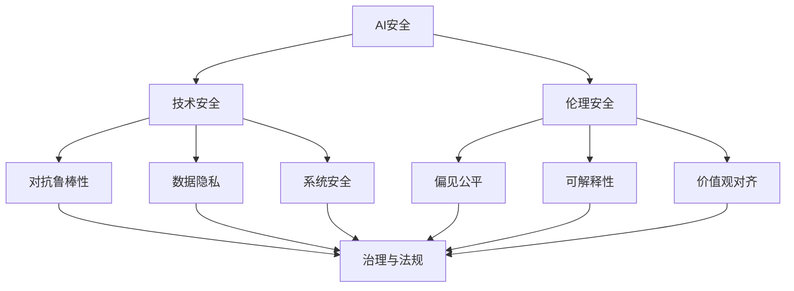

# AI 安全与伦理

## 概述

随着 AI 能力快速提升，安全、伦理和治理成为不可忽视的核心议题。本模块覆盖从技术红队到政策法规的完整知识体系。

## 目录

```
08-AI安全与伦理/
├── README.md
├── 01-模型安全.md          # 对抗攻击/越狱/提示注入/后门
├── 02-AI对齐.md            # RLHF/DPO/Constitutional AI/价值观对齐
├── 03-可解释性与透明度.md  # SHAP/LIME/注意力可解释/AAAI
├── 04-偏见与公平性.md      # 数据偏见/算法公平/测量指标
├── 05-隐私与数据治理.md    # 差分隐私/联邦学习/数据脱敏
└── 06-AI治理与法规.md      # AI法案/监管/治理框架
```

## 核心议题关系



## 关键风险分类

| 风险类型 | 说明 | 示例 |
|---------|------|------|
| 越狱 Jailbreak | 绕过安全限制 | DAN 提示攻击 |
| 提示注入 | 恶意输入控制 | 间接提示注入 |
| 数据中毒 | 训练数据被操控 | 后门触发 |
| 隐私泄露 | 个人信息提取 | 训练数据记忆 |
| 偏见歧视 | 不公平对待 | 种族/性别偏见 |
| 幻觉 | 生成虚假信息 | 法律/医疗事实错误 |
