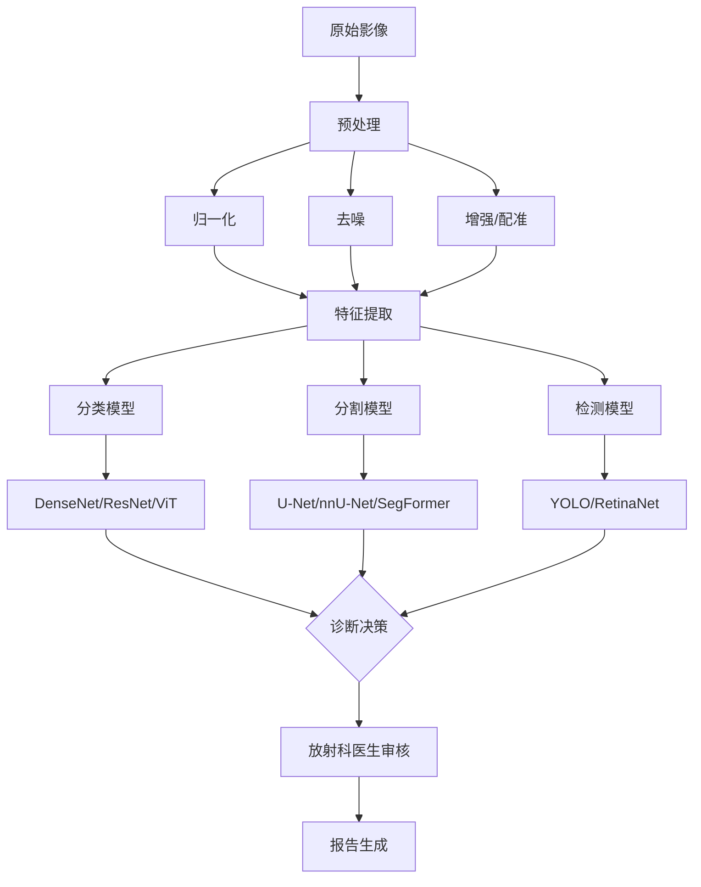

# 医疗 AI

## 1. 医学影像

### 肺部疾病分类 (DenseNet)

```python
import torch
import torch.nn as nn
import torchvision.models as models
from torch.utils.data import Dataset, DataLoader
import torchvision.transforms as transforms
from PIL import Image
import numpy as np
import pandas as pd
from sklearn.metrics import roc_auc_score

class ChestXRayDataset(Dataset):
    def __init__(self, image_paths, labels, transform=None):
        self.image_paths = image_paths
        self.labels = labels
        self.transform = transform or transforms.Compose([
            transforms.Resize((224, 224)),
            transforms.ToTensor(),
            transforms.Normalize([0.485, 0.456, 0.406], [0.229, 0.224, 0.225])
        ])

    def __len__(self):
        return len(self.image_paths)

    def __getitem__(self, idx):
        image = Image.open(self.image_paths[idx]).convert('RGB')
        label = torch.tensor(self.labels[idx], dtype=torch.float32)
        return self.transform(image), label

class DenseNetClassifier(nn.Module):
    def __init__(self, num_classes=14):
        super().__init__()
        self.backbone = models.densenet121(weights='DEFAULT')
        in_features = self.backbone.classifier.in_features
        self.backbone.classifier = nn.Sequential(
            nn.Linear(in_features, 512),
            nn.ReLU(),
            nn.Dropout(0.3),
            nn.Linear(512, num_classes)
        )

    def forward(self, x):
        return self.backbone(x)

model = DenseNetClassifier(num_classes=14)
criterion = nn.BCEWithLogitsLoss()
optimizer = torch.optim.AdamW(model.parameters(), lr=1e-4, weight_decay=1e-5)
scheduler = torch.optim.lr_scheduler.CosineAnnealingLR(optimizer, T_max=50)

for epoch in range(50):
    model.train()
    train_loss = 0.0
    for images, labels in DataLoader(ChestXRayDataset(train_paths, train_labels), batch_size=32, shuffle=True):
        optimizer.zero_grad()
        outputs = model(images)
        loss = criterion(outputs, labels)
        loss.backward()
        torch.nn.utils.clip_grad_norm_(model.parameters(), max_norm=1.0)
        optimizer.step()
        train_loss += loss.item()
    scheduler.step()
    model.eval()
    all_preds, all_labels = [], []
    with torch.no_grad():
        for images, labels in DataLoader(ChestXRayDataset(val_paths, val_labels), batch_size=32):
            outputs = torch.sigmoid(model(images))
            all_preds.append(outputs.numpy())
            all_labels.append(labels.numpy())
    auc = roc_auc_score(np.vstack(all_labels), np.vstack(all_preds), average='macro')
    print(f"Epoch {epoch}: Loss={train_loss:.3f}, Val AUC={auc:.4f}")
```

### 肺结节分割 (U-Net)

```python
import torch
import torch.nn as nn

class DoubleConv(nn.Module):
    def __init__(self, in_c, out_c):
        super().__init__()
        self.conv = nn.Sequential(
            nn.Conv2d(in_c, out_c, 3, padding=1),
            nn.BatchNorm2d(out_c),
            nn.ReLU(),
            nn.Conv2d(out_c, out_c, 3, padding=1),
            nn.BatchNorm2d(out_c),
            nn.ReLU()
        )

    def forward(self, x):
        return self.conv(x)

class UNet(nn.Module):
    def __init__(self, in_channels=1, out_channels=1, features=[64, 128, 256, 512]):
        super().__init__()
        self.downs = nn.ModuleList()
        self.ups = nn.ModuleList()
        self.pool = nn.MaxPool2d(2)

        for feature in features:
            self.downs.append(DoubleConv(in_channels, feature))
            in_channels = feature

        self.bottleneck = DoubleConv(features[-1], features[-1]*2)

        for feature in reversed(features):
            self.ups.append(nn.ConvTranspose2d(feature*2, feature, 2, 2))
            self.ups.append(DoubleConv(feature*2, feature))

        self.final = nn.Conv2d(features[0], out_channels, 1)

    def forward(self, x):
        skip = []
        for down in self.downs:
            x = down(x)
            skip.append(x)
            x = self.pool(x)

        x = self.bottleneck(x)
        skip = skip[::-1]

        for idx in range(0, len(self.ups), 2):
            x = self.ups[idx](x)
            x = self.ups[idx+1](torch.cat((x, skip[idx//2]), dim=1))

        return torch.sigmoid(self.final(x))

def dice_loss(pred, target):
    smooth = 1e-6
    intersection = (pred * target).sum(dim=(2,3))
    union = pred.sum(dim=(2,3)) + target.sum(dim=(2,3))
    return 1 - (2 * intersection + smooth).mean() / (union + smooth).mean()

model = UNet(in_channels=1, out_channels=1)
optimizer = torch.optim.Adam(model.parameters(), lr=1e-3)

for epoch in range(100):
    for ct_img, mask in DataLoader(ct_dataset, batch_size=8, shuffle=True):
        optimizer.zero_grad()
        pred = model(ct_img)
        loss = dice_loss(pred, mask) + nn.BCELoss()(pred, mask)
        loss.backward()
        optimizer.step()
```

### 临床 NLP：病历实体抽取

```python
from transformers import AutoTokenizer, AutoModelForTokenClassification
import torch
import numpy as np

tokenizer = AutoTokenizer.from_pretrained("dmis-lab/biobert-base-cased-v1.1")
model = AutoModelForTokenClassification.from_pretrained(
    "dmis-lab/biobert-base-cased-v1.1", num_labels=5
)

label_map = {0: "O", 1: "B-DIAG", 2: "I-DIAG", 3: "B-MED", 4: "I-MED"}

ehr_text = "Patient was diagnosed with acute myocardial infarction and prescribed Aspirin 81mg daily and Atorvastatin 40mg. History of hypertension and hyperlipidemia."

inputs = tokenizer(ehr_text, return_tensors="pt", truncation=True, max_length=512, return_offsets_mapping=True)
offsets = inputs.pop("offset_mapping")

with torch.no_grad():
    outputs = model(**inputs)
    predictions = torch.argmax(outputs.logits, dim=-1).squeeze().tolist()

tokens = tokenizer.convert_ids_to_tokens(inputs["input_ids"].squeeze().tolist())
entities = []
current_entity = None

for i, (pred, token) in enumerate(zip(predictions, tokens)):
    if token.startswith("##"):
        if current_entity:
            current_entity["text"] += token[2:]
        continue
    label = label_map[pred]
    if label.startswith("B-"):
        if current_entity:
            entities.append(current_entity)
        current_entity = {"type": label[2:], "text": token, "start": offsets[0][i][0].item(), "end": offsets[0][i][1].item()}
    elif label.startswith("I-") and current_entity and current_entity["type"] == label[2:]:
        current_entity["text"] += " " + token
        current_entity["end"] = offsets[0][i][1].item()
    else:
        if current_entity:
            entities.append(current_entity)
            current_entity = None

for e in entities:
    print(f"{e['type']}: {e['text']} ({e['start']}-{e['end']})")
```

### 影像分割模型对比

| 模型 | 参数量 | 精度 (Dice) | 推理速度 | 适用场景 |
|------|--------|-------------|----------|----------|
| U-Net | 31M | 0.89 | 15ms | 通用医学分割 |
| nnU-Net | 44M | 0.92 | 25ms | 自适应最优配置 |
| SegFormer-B3 | 46M | 0.91 | 20ms | Transformer 分割 |
| SwinUNetR | 62M | 0.93 | 35ms | 3D 医学影像 |

### 分类模型对比

| 模型 | Top-1 Acc | Top-5 Acc | 推理时间 | 预训练数据 |
|------|-----------|-----------|----------|------------|
| DenseNet-121 | 0.87 | 0.96 | 8ms | ImageNet |
| ResNet-152 | 0.89 | 0.97 | 12ms | ImageNet |
| ViT-L/16 | 0.91 | 0.98 | 30ms | ImageNet-21K |
| Swin-B | 0.92 | 0.98 | 25ms | ImageNet-21K |

### 医疗 NLP 模型对比

| 模型 | 参数量 | 预训练语料 | NER F1 | QA F1 | 特点 |
|------|--------|------------|--------|-------|------|
| BioBERT v1.1 | 110M | PubMed 4.5B | 0.89 | 0.83 | 领域基座 |
| PubMedBERT | 110M | PubMed 14B | 0.91 | 0.85 | 从头预训练 |
| ClinicalBERT | 110M | MIMIC-III | 0.88 | 0.81 | 临床笔记 |
| Med-PaLM 2 | 540B | 多模态医疗 | 0.93 | 0.91 | 大模型对话 |

### 医学影像分析流程



### 药物发现流程


## 2. 关键挑战与解决方案

| 挑战 | 描述 | AI 解决方案 |
|------|------|------------|
| 数据稀缺 | 医疗标注成本极高 | 半监督学习 / 自监督预训练 (SimCLR, MAE) |
| 域迁移 | 不同医院设备分布差异 | 域适应 (Domain Adaptation / FDA) |
| 类别不平衡 | 罕见病样本极少 | Focal Loss / 数据增强 / 合成数据 |
| 可解释性 | 临床需要决策理由 | Grad-CAM / LIME / 概念瓶颈模型 |
| 隐私合规 | 患者数据不能出医院 | 联邦学习 / 差分隐私 / 安全多方计算 |

## 3. 临床应用评估指标

| 指标 | 定义 | 医疗场景意义 |
|------|------|-------------|
| Sensitivity | TP/(TP+FN) | 不漏诊能力，高优先级 |
| Specificity | TN/(TN+FP) | 不误诊能力 |
| AUC-ROC | 判别能力综合 | 模型排序能力 |
| Dice Score | 2TP/(2TP+FP+FN) | 分割重叠度 |
| F1 Score | 2/(1/Prec+1/Rec) | 分类综合表现 |

## 4. 2025-2026 趋势
- **多模态诊断**：影像+病历+基因组融合分析
- **AI 辅助手术**：实时影像引导机器人手术
- **FDA AI 审批加速**：510(k) 和 De Novo 分类
- **大模型在医疗合规**：HIPAA/GDPR 合规 LLM 部署
- **群体智能**：多家医院联邦学习模型聚合
