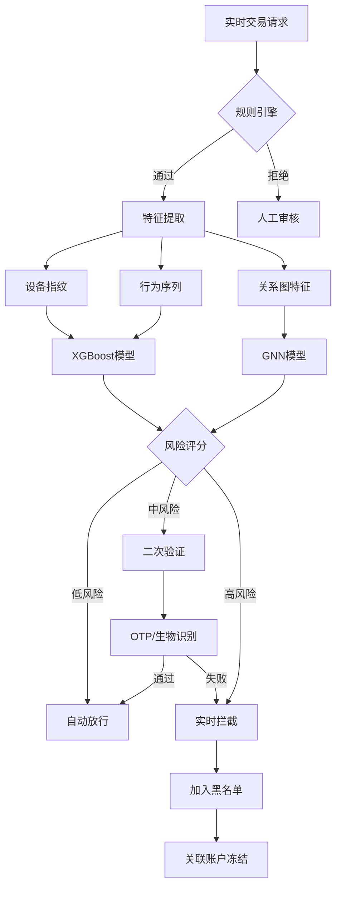

# 金融 AI

## 1. 信用评分模型

### LightGBM 信用评分

```python
import lightgbm as lgb
import pandas as pd
import numpy as np
from sklearn.model_selection import train_test_split
from sklearn.metrics import roc_auc_score, accuracy_score, classification_report

data = pd.read_csv("credit_data.csv")
features = ["age", "income", "loan_amount", "loan_term", "debt_ratio",
            "credit_history_len", "num_credit_cards", "utilization_rate",
            "num_late_payments", "num_inquiries", "employment_years"]
target = "default_flag"

X_train, X_test, y_train, y_test = train_test_split(
    data[features], data[target], test_size=0.2, random_state=42, stratify=data[target]
)

lgb_params = {
    "objective": "binary",
    "metric": "auc",
    "boosting_type": "gbdt",
    "num_leaves": 63,
    "learning_rate": 0.05,
    "feature_fraction": 0.8,
    "bagging_fraction": 0.8,
    "bagging_freq": 5,
    "reg_alpha": 1.0,
    "reg_lambda": 1.0,
    "min_child_samples": 20,
    "verbose": -1,
}

train_data = lgb.Dataset(X_train, label=y_train)
val_data = lgb.Dataset(X_test, label=y_test, reference=train_data)

model = lgb.train(
    lgb_params,
    train_data,
    num_boost_round=1000,
    valid_sets=[val_data],
    callbacks=[lgb.early_stopping(50), lgb.log_evaluation(100)]
)

y_pred = model.predict(X_test)
y_pred_binary = (y_pred >= 0.5).astype(int)

auc = roc_auc_score(y_test, y_pred)
print(f"AUC: {auc:.4f}")
print(classification_report(y_test, y_pred_binary))

importance = pd.DataFrame({
    "feature": features,
    "importance": model.feature_importance("gain")
}).sort_values("importance", ascending=False)
print(importance)
```

### 神经网络信用评分

```python
import torch
import torch.nn as nn
import numpy as np
from sklearn.preprocessing import StandardScaler

class CreditScoringNN(nn.Module):
    def __init__(self, input_dim):
        super().__init__()
        self.net = nn.Sequential(
            nn.Linear(input_dim, 256),
            nn.BatchNorm1d(256),
            nn.ReLU(),
            nn.Dropout(0.3),
            nn.Linear(256, 128),
            nn.BatchNorm1d(128),
            nn.ReLU(),
            nn.Dropout(0.3),
            nn.Linear(128, 64),
            nn.ReLU(),
            nn.Linear(64, 1),
        )

    def forward(self, x):
        return torch.sigmoid(self.net(x)).squeeze()

scaler = StandardScaler()
X_train_scaled = scaler.fit_transform(X_train)
X_test_scaled = scaler.transform(X_test)

model_nn = CreditScoringNN(input_dim=X_train.shape[1])
criterion = nn.BCELoss()
optimizer = torch.optim.Adam(model_nn.parameters(), lr=1e-3, weight_decay=1e-4)

X_train_t = torch.FloatTensor(X_train_scaled)
y_train_t = torch.FloatTensor(y_train.values)
X_test_t = torch.FloatTensor(X_test_scaled)
y_test_t = torch.FloatTensor(y_test.values)

for epoch in range(200):
    model_nn.train()
    optimizer.zero_grad()
    outputs = model_nn(X_train_t)
    loss = criterion(outputs, y_train_t)
    loss.backward()
    optimizer.step()

    if epoch % 20 == 19:
        model_nn.eval()
        with torch.no_grad():
            val_preds = model_nn(X_test_t)
            val_auc = roc_auc_score(y_test_t.numpy(), val_preds.numpy())
        print(f"Epoch {epoch}: Loss={loss.item():.4f}, Val AUC={val_auc:.4f}")
```

### 欺诈检测 (XGBoost)

```python
import xgboost as xgb
import pandas as pd
import numpy as np
from sklearn.model_selection import StratifiedKFold
from sklearn.metrics import precision_recall_curve, average_precision_score

txn_data = pd.read_parquet("transactions.parquet")
txn_features = ["amount", "txn_hour", "txn_dow", "days_since_last_txn",
                "avg_amount_30d", "txn_count_30d", "merchant_category",
                "distance_from_home", "device_risk_score", "ip_country_match"]

skf = StratifiedKFold(n_splits=5, shuffle=True, random_state=42)
fold_scores = []

for fold, (train_idx, val_idx) in enumerate(skf.split(txn_data[txn_features], txn_data["is_fraud"])):
    X_tr, X_val = txn_data.iloc[train_idx][txn_features], txn_data.iloc[val_idx][txn_features]
    y_tr, y_val = txn_data.iloc[train_idx]["is_fraud"], txn_data.iloc[val_idx]["is_fraud"]

    dtrain = xgb.DMatrix(X_tr, label=y_tr)
    dval = xgb.DMatrix(X_val, label=y_val)

    params = {
        "objective": "binary:logistic",
        "eval_metric": "aucpr",
        "max_depth": 8,
        "learning_rate": 0.1,
        "subsample": 0.8,
        "colsample_bytree": 0.8,
        "scale_pos_weight": sum(y_tr == 0) / sum(y_tr == 1),
        "min_child_weight": 5,
        "gamma": 0.1,
        "seed": 42,
    }

    model_xgb = xgb.train(
        params, dtrain, num_boost_round=500,
        evals=[(dval, "val")],
        early_stopping_rounds=30,
        verbose_eval=False
    )

    y_pred_xgb = model_xgb.predict(dval)
    ap = average_precision_score(y_val, y_pred_xgb)
    fold_scores.append(ap)
    print(f"Fold {fold}: AP={ap:.4f}")

print(f"Avg AP: {np.mean(fold_scores):.4f} +/- {np.std(fold_scores):.4f}")
```

### 量化因子计算与回测

```python
import pandas as pd
import numpy as np
import talib

price_data = pd.read_csv("stock_daily.csv", parse_dates=["date"], index_col="date")

def compute_alpha_factors(df):
    factors = pd.DataFrame(index=df.index)
    factors["ma5"] = df["close"].rolling(5).mean() / df["close"]
    factors["ma20"] = df["close"].rolling(20).mean() / df["close"]
    factors["ma60"] = df["close"].rolling(60).mean() / df["close"]
    factors["volume_ratio"] = df["volume"] / df["volume"].rolling(20).mean()
    factors["volatility"] = df["returns"].rolling(20).std()
    factors["rsi"] = talib.RSI(df["close"].values, timeperiod=14)
    factors["macd"] = talib.MACD(df["close"].values)[0] / df["close"]
    factors["bb_position"] = (df["close"] - talib.BBANDS(df["close"].values)[2]) / (
        talib.BBANDS(df["close"].values)[0] - talib.BBANDS(df["close"].values)[2]
    )
    factors["obv"] = talib.OBV(df["close"].values, df["volume"].values)
    factors["obv_ma_ratio"] = factors["obv"] / factors["obv"].rolling(20).mean()
    factors["momentum_1m"] = df["close"].pct_change(21)
    factors["momentum_3m"] = df["close"].pct_change(63)
    factors["turnover"] = df["volume"] * df["close"] / 1e8
    factors["price_to_ma20"] = df["close"] / df["close"].rolling(20).mean()
    return factors.fillna(0)

def simple_factor_backtest(factors, forward_returns, factor_name):
    ranked = factors[factor_name].rank(pct=True)
    long = ranked >= 0.8
    short = ranked <= 0.2
    long_ret = forward_returns[long].mean(axis=1)
    short_ret = forward_returns[short].mean(axis=1)
    pnl = long_ret - short_ret
    sharpe = np.sqrt(252) * pnl.mean() / pnl.std()
    return {"factor": factor_name, "sharpe": sharpe, "avg_return": pnl.mean(), "win_rate": (pnl > 0).mean()}

df["returns"] = df["close"].pct_change()
forward_5d = df["returns"].shift(-5).rolling(5).sum()
all_factors = compute_alpha_factors(df)
results = [simple_factor_backtest(all_factors, forward_5d, col) for col in all_factors.columns]
results_df = pd.DataFrame(results).sort_values("sharpe", ascending=False)
print(results_df)
```

### 信用评分模型对比

| 模型 | AUC | Precision@5% | 训练时间 | 可解释性 | 适用场景 |
|------|-----|-------------|----------|----------|----------|
| Logistic Regression | 0.72 | 0.35 | 10s | 高 | 合规要求高 |
| Random Forest | 0.83 | 0.52 | 120s | 中 | 通用评分 |
| LightGBM | 0.87 | 0.58 | 45s | 中 | 大规模数据 |
| TabNet | 0.86 | 0.56 | 300s | 低 | 非结构化特征 |

### 欺诈检测方法对比

| 方法 | Recall | FPR | 实时性 | 特点 |
|------|--------|-----|--------|------|
| 规则引擎 | 0.60 | 0.5% | 1ms | 可解释强，覆盖有限 |
| Isolation Forest | 0.72 | 1.2% | 5ms | 无监督异常检测 |
| XGBoost | 0.88 | 0.8% | 3ms | 梯度提升最佳实践 |
| GNN (GraphSAGE) | 0.91 | 0.6% | 15ms | 关系图反欺诈 |
| AutoEncoder | 0.76 | 1.5% | 2ms | 无监督重建误差 |

### 量化因子类型对比

| 因子类型 | 举例 | IC均值 | 换手率 | 容量 |
|----------|------|--------|--------|------|
| 动量因子 | 过去1月收益率 | 0.04 | 高 | 大 |
| 反转因子 | 过去5日跌幅 | -0.03 | 高 | 中 |
| 质量因子 | ROE / 毛利率 | 0.05 | 低 | 大 |
| 低波因子 | 过去60日波动率 | 0.03 | 低 | 大 |
| 机器学习合成因子 | AutoAlpha 组合 | 0.08 | 中 | 中 |

### 欺诈检测流程



### 量化交易流程


### 量化交易策略评估指标

| 指标 | 定义 | 优秀标准 |
|------|------|---------|
| Sharpe Ratio | (Rp-Rf)/σp | >2.0 |
| Max Drawdown | 最大回撤 | <15% |
| Calmar Ratio | 年化收益/最大回撤 | >3.0 |
| Win Rate | 交易胜率 | >55% |
| Profit Factor | 总盈利/总亏损 | >2.0 |
| Information Ratio | 超额收益/跟踪误差 | >1.5 |

## 2. 大模型在金融

| 应用 | 方法 | 效果 | 模型 |
|------|------|------|------|
| 研报分析 | 长文档 RAG 摘要 | 10min→10s | GPT-4 / Claude 4 |
| 客服问答 | 知识库 RAG + LLM | 24h 在线 | FinBERT + LLM |
| 风控审核 | 文档分类+合规检查 | 减少80%人工 | BloombergGPT |
| 投研助手 | Agent 多工具编排 | 辅助决策 | DeepSeek / GPT-4 |
| 合规监控 | 法规变化语义匹配 | 实时预警 | 微调法律 LLM |

## 3. 2025-2026 趋势
- **Agentic 投研**：自主信息收集-分析-交易闭环
- **AI 合规助手**：法规变化自动追踪与影响评估
- **合成金融数据**：差分隐私生成替代真实数据
- **可解释AI评分**：SHAP+LIME 满足监管可解释性
- **多模态金融分析**：财报图表+新闻+价格序列联合建模
