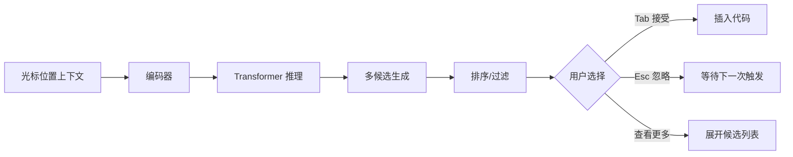
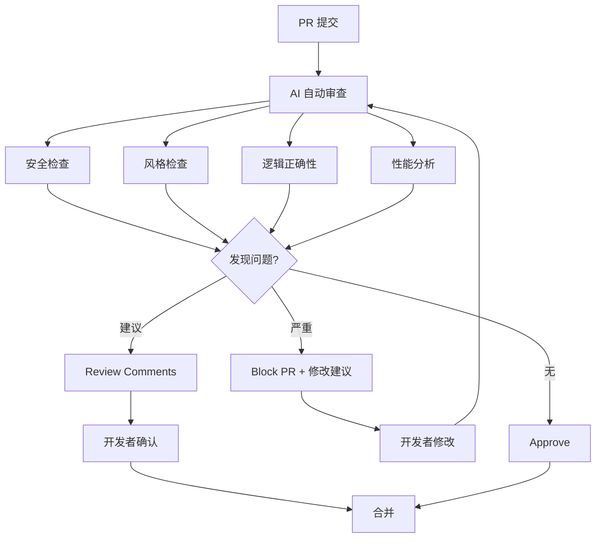
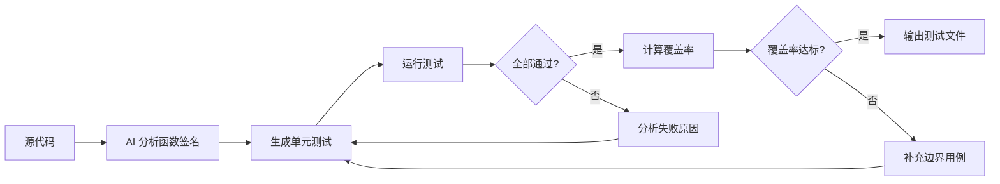
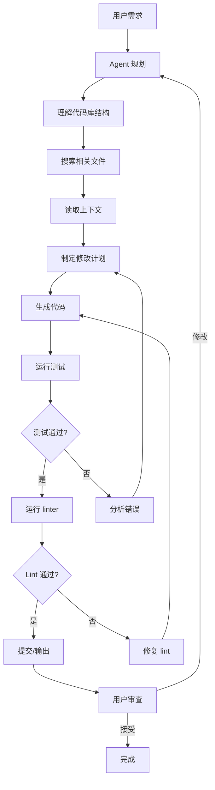

# AI 编程

## 1. 代码大模型

### 主流模型 (2026)

| 模型 | 开发商 | 参数量 | 上下文 | HumanEval | SWE-bench | 特点 |
|------|--------|--------|--------|-----------|-----------|------|
| GPT-4o | OpenAI | ~1.8T | 128K | 96.2% | 72.1% | 多模态编程，工具生态完善 |
| Claude 4 Opus | Anthropic | ~2T | 200K | 97.1% | 80.3% | 代码重构与长上下文最强 |
| DeepSeek-V4 | DeepSeek | 671B MoE | 128K | 95.8% | 68.5% | 开源性价比最高 |
| Qwen 3 Code | Alibaba | 235B | 128K | 94.5% | 62.3% | 中文优化，Agent 能力强 |
| Gemini 3 Pro | Google | ~1.5T | 1M | 95.0% | 70.1% | 超长上下文，多模态 |
| Code Llama 70B | Meta | 70B | 100K | 67.8% | 28.4% | 开源基座，可本地部署 |
| StarCoder 3 20B | BigCode | 20B | 32K | 52.3% | 18.7% | 轻量许可友好 |

### 代码能力评估基准

| 基准 | 说明 | 2026 顶尖 | 评估维度 |
|------|------|-----------|----------|
| HumanEval+ | 164 题 + 扩展测试 | 94.1% | 功能正确性 |
| SWE-bench Verified | 500 个真实 GitHub Issue | 80.3% | 工程能力 |
| SWE-bench Pro | 抗污染版本 | 72.5% | 泛化能力 |
| BigCodeBench | 1140 个综合任务 | 68.4% | 多语言多领域 |
| Codeforces Rating | 竞赛级编程 | 3450 | 算法能力 |
| CRUXEval | 代码执行推理 | 91.5% | 语义理解 |
| CyberSecEval | 安全代码生成 | 88.2% | 安全性 |

## 2. 编程范式对比

| 范式 | 交互方式 | 适用场景 | 典型工具 | 效率提升 |
|------|---------|---------|----------|---------|
| **代码补全** | 行内建议 Tab 接受 | 日常编码、模板代码 | Copilot / Codeium | 30-40% |
| **对话编程** | Chat 问答式 | 调试、重构、查文档 | ChatGPT / Claude | 40-50% |
| **Agent 编程** | 自然语言描述任务 | 功能开发、修复 Bug | Claude Code / OpenCode | 60-70% |
| **全自动编程** | 需求文档 → 完整项目 | 原型搭建、CRUD 应用 | Devin / Factory | 80%+ |

## 3. 代码补全

### 工作流



### 本地代码补全 (Continue + Ollama)

```python
from openai import OpenAI

# 使用本地模型进行代码补全
local_client = OpenAI(base_url="http://localhost:11434/v1", api_key="ollama")

def complete_code(context: str, language: str = "python") -> str:
    prompt = f"""<|fim_prefix|>{context}<|fim_suffix|>"""

    response = local_client.completions.create(
        model="deepseek-coder-v2",
        prompt=prompt,
        max_tokens=128,
        temperature=0.0,
        stop=["\n\n", "<|fim_middle|>"],
        extra_body={"stop_token_ids": [32014]}  # FIM 特殊 token
    )
    return response.choices[0].text.strip()

# 多行补全
def multi_line_completion(context_before: str, cursor_line: str, language: str = "python") -> str:
    prompt = f"""[INST] 补全以下代码，输出仅包含补全内容：[/INST]
```{language}
{context_before}{cursor_line}"""

    response = local_client.chat.completions.create(
        model="qwen3-code",
        messages=[{"role": "user", "content": prompt}],
        max_tokens=256,
        temperature=0.05,
        stop=["```", "\n\n\n"]
    )
    return response.choices[0].message.content.strip()
```

## 4. 代码审查与质量保障

### 自动化审查流程



### 代码审查实现

提供三个层次的审查能力：单文件审查、变更差异审查、安全专项审查，均返回结构化 JSON 便于集成 CI/CD。

#### 数据模型

```python
from enum import Enum
from dataclasses import dataclass
from typing import Optional

class Severity(str, Enum):
    CRITICAL = "critical"; HIGH = "high"; MEDIUM = "medium"
    LOW = "low"; INFO = "info"

class Category(str, Enum):
    BUG = "bug"; SECURITY = "security"; PERFORMANCE = "performance"
    STYLE = "style"; ERROR_HANDLING = "error_handling"; MAINTAINABILITY = "maintainability"

@dataclass
class ReviewIssue:
    line: int
    severity: Severity
    category: Category
    description: str
    suggestion: str
    code_example: Optional[str] = None

@dataclass
class ReviewReport:
    summary: str
    overall_score: int
    issues: list[ReviewIssue]
    strengths: list[str]
    critical_count: int
    high_count: int
```

#### 单文件审查

对代码进行多维度的审查，覆盖 bug、安全、性能、风格、错误处理。

```python
import json
from openai import OpenAI

client = OpenAI()

def review_code(code: str, language: str = "python") -> dict:
    prompt = (
        f"作为高级工程师，审查以下 {language} 代码。\n"
        f"按严重程度从高到低列出所有问题，输出 JSON。\n\n"
        f"审查维度：\n"
        f"1. Bug 与逻辑错误\n"
        f"2. 安全漏洞（SQL 注入、XSS、路径遍历等）\n"
        f"3. 性能瓶颈（不必要的循环、N+1 查询等）\n"
        f"4. 可维护性（命名、复杂度、重复代码）\n"
        f"5. 错误处理（缺少 try-catch、边缘 case）\n"
        f"6. 代码风格\n\n"
        f"代码：\n```{language}\n{code}\n```\n\n"
        f"输出 JSON，包含 summary、overall_score(0-100)、"
        f"issues(数组，含 line、severity、category、description、suggestion、code_example)"
        f"、strengths、critical_count、high_count。"
    )
    response = client.chat.completions.create(
        model="gpt-4o",
        messages=[
            {"role": "system", "content": "你是资深代码审查专家，输出严格 JSON。"},
            {"role": "user", "content": prompt}
        ],
        response_format={"type": "json_object"},
        temperature=0.0,
        max_tokens=4096
    )
    return json.loads(response.choices[0].message.content)
```

#### Diff 审查

审查 git diff，评估变更的正确性、安全风险、兼容性，适用于 PR 自动化审查。

```python
def diff_review(diff_text: str) -> dict:
    prompt = (
        f"审查以下 git diff 变更：\n\n"
        f"评估维度：\n"
        f"- 修改是否解决目标问题？\n"
        f"- 是否遗漏边界情况？\n"
        f"- 是否需要补充测试？\n"
        f"- 是否破坏向后兼容？\n"
        f"- 是否引入安全风险？\n\n"
        f"Diff：\n```diff\n{diff_text}\n```\n\n"
        f"输出 JSON，包含 summary、risk_level、correctness(bool)、"
        f"issues(数组，含 line、severity、type、description、suggestion)、"
        f"needs_testing(bool)、test_suggestions、approved(bool)。"
    )
    response = client.chat.completions.create(
        model="gpt-4o",
        messages=[
            {"role": "system", "content": "你是高级工程师，负责 PR 审查，输出 JSON。"},
            {"role": "user", "content": prompt}
        ],
        response_format={"type": "json_object"},
        temperature=0.0,
        max_tokens=2048
    )
    return json.loads(response.choices[0].message.content)
```

#### 安全专项审查

基于 OWASP Top 10 / CWE 标准进行深度安全扫描。

```python
def security_audit(code: str, language: str = "python") -> dict:
    prompt = (
        f"作为安全工程师，对以下 {language} 代码进行安全审计。\n\n"
        f"检查项：\n"
        f"- 注入攻击（SQL、NoSQL、命令、LDAP）\n"
        f"- XSS（反射型、存储型、DOM 型）\n"
        f"- CSRF / SSRF\n"
        f"- 路径遍历与文件包含\n"
        f"- 不安全的反序列化\n"
        f"- 敏感信息泄露（密钥硬编码、日志泄露）\n"
        f"- 认证与授权缺陷\n\n"
        f"代码：\n```{language}\n{code}\n```\n\n"
        f"输出 JSON，包含 summary、risk_level、"
        f"vulnerabilities(数组，含 cwe_id、severity、line、vulnerability、"
        f"description、impact、fix、fix_code)、secure_count、vuln_count。"
    )
    response = client.chat.completions.create(
        model="gpt-4o",
        messages=[
            {"role": "system", "content": "你是安全审计专家，精通 OWASP 标准，输出 JSON。"},
            {"role": "user", "content": prompt}
        ],
        response_format={"type": "json_object"},
        temperature=0.0,
        max_tokens=4096
    )
    return json.loads(response.choices[0].message.content)
```

#### 批量审查

支持多文件一次性扫描，输出跨文件问题和全局改进建议。

```python
def batch_review(files: list[dict]) -> dict:
    descs = "\n---\n".join(
        f"文件: {f['path']}\n```{f.get('language', 'python')}\n{f['code']}\n```"
        for f in files
    )
    prompt = (
        f"审查以下多个文件：\n{descs}\n\n"
        f"对每个文件输出问题列表，最后给出跨文件的全局建议。\n"
        f"输出 JSON，包含 files(数组，含 path、score、issues)、"
        f"cross_file_issues、global_suggestions、critical_total、high_total。"
    )
    response = client.chat.completions.create(
        model="gpt-4o",
        messages=[{"role": "user", "content": prompt}],
        response_format={"type": "json_object"},
        temperature=0.0,
        max_tokens=8192
    )
    return json.loads(response.choices[0].message.content)
```

#### 使用示例

```python
if __name__ == "__main__":
    sample_code = """
def fetch_user(db, user_id):
    query = f"SELECT * FROM users WHERE id = {user_id}"
    return db.execute(query).fetchall()
"""
    report = review_code(sample_code)
    print(f"评分: {report['overall_score']}/100")
    print(f"严重问题: {report['critical_count']}个")
    for issue in report['issues']:
        print(f"  [{issue['severity']}] 行{issue['line']}: {issue['description']}")
```

### Bug 类型与 AI 检测率

| Bug 类型 | 描述 | AI 检测率 | 人类检测率 | 典型修复方式 |
|----------|------|----------|-----------|-------------|
| Null Pointer | 空引用异常 | 92% | 85% | 类型注解 + Optional |
| Off-by-one | 边界条件错误 | 78% | 70% | 单元测试覆盖边界 |
| Race Condition | 并发竞态 | 55% | 45% | 形式化验证 |
| SQL Injection | 注入攻击 | 95% | 80% | 参数化查询 |
| Memory Leak | 内存泄露 | 60% | 55% | RAII / GC 调优 |
| Logic Error | 逻辑错误 | 70% | 75% | 逐行解释 + 测试 |

## 5. 测试生成

### 测试生成工作流



#### 单元测试生成

```python
def generate_unit_tests(source_code: str, framework: str = "pytest") -> str:
    """AI 生成单元测试"""
    prompt = (
        f"使用 {framework} 为以下代码生成单元测试。\n\n"
        f"要求：\n"
        f"- 覆盖所有公开函数和方法\n"
        f"- 包含正常 case、边界 case、异常 case\n"
        f"- 对外部依赖使用 Mock\n"
        f"- 覆盖率 >90%\n"
        f"- 使用 fixture 和 parametrize\n\n"
        f"源代码：\n"
        f"```{framework}\n{source_code}\n```\n\n"
        f"仅输出测试代码。"
    )
    response = client.chat.completions.create(
        model="gpt-4o",
        messages=[
            {"role": "system", "content": "你是测试专家，生成可直接运行的测试代码。"},
            {"role": "user", "content": prompt}
        ],
        max_tokens=2000,
        temperature=0.2
    )
    return response.choices[0].message.content.strip()
```

#### 运行与验证

```python
def run_and_validate(code: str, test_code: str) -> dict:
    """运行测试并验证结果"""
    import tempfile, subprocess
    with tempfile.NamedTemporaryFile(suffix=".py", mode="w", delete=False) as f:
        f.write(f"{code}\n\n{test_code}")
        fpath = f.name
    result = subprocess.run(
        ["python", "-m", "pytest", fpath, "-v", "--tb=short"],
        capture_output=True, text=True
    )
    return {"passed": result.returncode == 0, "output": result.stdout + result.stderr}
```

## 6. AI 编程工具对比

当前主流 AI 编程工具的能力对比，按交互方式分为 IDE 插件、AI IDE、CLI Agent 三类。

| 工具 | 类型 | 代码补全 | 整文件编辑 | Agent 模式 | 价格 |
|------|------|---------|-----------|-----------|------|
| GitHub Copilot | IDE 插件 | 优秀 | 一般 | 有限 | $10/月 |
| Cursor | AI IDE | 优秀 | 优秀 | 优秀 | $20/月 |
| Windsurf | AI IDE | 优秀 | 优秀 | 优秀 | $15/月 |
| Claude Code | CLI Agent | 不适用 | 优秀 | 最佳 | $20/月 |
| OpenCode | CLI Agent | 不适用 | 优秀 | 优秀 | 免费 |
| Devin | Web Agent | 不适用 | 优秀 | 最佳 | $500/月 |
| Aider | CLI Agent | 有限 | 优秀 | 优秀 | 免费 |
| Codex CLI | CLI Agent | 不适用 | 良好 | 优秀 | 按量付费 |

## 7. Agent 编程工作流

### 通用 Agent 流程



### Agent 编程实现

```python
class CodingAgent:
    """自主编程 Agent 核心框架"""

    def __init__(self, model: str = "gpt-4o"):
        self.client = OpenAI()
        self.model = model
        self.messages = []

    def plan(self, task: str) -> list:
        """分解任务为执行步骤"""
        prompt = f"""将以下编程任务分解为具体步骤：
{task}

输出 JSON 数组，每个元素包含 step(步骤描述)、files(需修改的文件)、
dependencies(前置步骤索引)。"""
        resp = self.client.chat.completions.create(
            model=self.model,
            messages=[{"role": "user", "content": prompt}],
            response_format={"type": "json_object"}
        )
        return json.loads(resp.choices[0].message.content)

    def implement(self, specification: dict) -> str:
        """根据规格生成代码"""
        prompt = f"""根据以下规格实现代码：
{json.dumps(specification, ensure_ascii=False, indent=2)}

要求：
- 遵循项目现有代码风格
- 添加完整类型注解
- 包含异常处理
- 附带单元测试"""
        resp = self.client.chat.completions.create(
            model=self.model,
            messages=[{"role": "user", "content": prompt}],
            max_tokens=4096,
            temperature=0.1
        )
        return resp.choices[0].message.content

    def fix(self, error: str, context: str) -> str:
        """根据错误信息修复代码"""
        prompt = f"""错误信息：{error}
相关代码：{context}
请分析错误原因并给出修复后的代码。"""
        resp = self.client.chat.completions.create(
            model=self.model,
            messages=[{"role": "user", "content": prompt}],
            max_tokens=2048
        )
        return resp.choices[0].message.content

agent = CodingAgent()
steps = agent.plan("添加用户注册 API，包含邮箱验证和密码强度检查")
print(json.dumps(steps, ensure_ascii=False, indent=2))
```

## 8. Prompt 工程模式

| 模式 | 说明 | 示例 |
|------|------|------|
| **FIM (Fill-in-Middle)** | 根据前后文补全中间代码 | `prefix + <FIM> + suffix` |
| **Chain-of-Thought** | 分步推理再生成代码 | "先分析需求，再设计接口，最后实现" |
| **Test-Driven** | 先生成测试再实现 | "先写测试，再让 AI 实现通过测试的代码" |
| **Self-Refine** | 生成 → 审查 → 改进循环 | "检查生成的代码，找出问题后重新生成" |
| **Spec-to-Code** | 从规格说明到实现 | "根据 API 文档生成完整实现" |
| **Few-Shot** | 提供示例引导输出格式 | "参考以下示例的代码风格..." |

## 9. 最佳实践与陷阱

### ✅ 推荐做法
- **分步引导**：复杂逻辑拆解为子任务，逐步引导 AI 完成
- **类型优先**：提供类型签名大幅提升准确率
- **上下文丰富**：展示相关现有代码、依赖、配置文件
- **测试约束**：明确测试框架和覆盖率要求
- **渐进式**：先写核心逻辑，再完善错误处理和边界 case
- **版本控制**：AI 生成的代码必须经过 diff 审查后提交

### ⚠️ 常见陷阱
- **盲目接受**：始终审查 AI 生成的代码，特别是安全性
- **幻觉 API**：AI 可能编造不存在的 API、库或函数签名
- **上下文遗忘**：长对话中 Agent 可能丢失早期上下文
- **安全漏洞**：AI 可能生成 SQL 注入、XSS 等不安全代码
- **许可证问题**：注意训练数据版权（如 Copilot GPL 争议）
- **过度工程**：AI 倾向于过度抽象和泛化，保持 KISS

## 10. 语言支持对比

| 语言 | Copilot | Claude Code | Cursor | 开源模型 |
|------|---------|-------------|--------|---------|
| Python | 优秀 | 优秀 | 优秀 | StarCoder 3 |
| TypeScript/JS | 优秀 | 优秀 | 优秀 | DeepSeek Coder |
| Rust | 良好 | 优秀 | 良好 | Code Llama |
| Go | 良好 | 优秀 | 良好 | Qwen 3 Code |
| Java | 良好 | 良好 | 良好 | CodeGeeX4 |
| C++ | 良好 | 良好 | 良好 | 通用模型 |
| SQL | 优秀 | 优秀 | 优秀 | SQLCoder 2 |
| Swift/Kotlin | 中等 | 良好 | 中等 | 通用模型 |

## 11. 2025-2026 趋势
- **自主编程 Agent**：从代码补全到自主修复 Issue 到完整功能开发
- **多文件编辑**：跨文件理解与协同修改，系统性重构
- **测试优先循环**：AI 自动编写测试 → 验证 → 修复 → 回归
- **代码审查 AI**：自动 PR Review、安全审计、合规检查
- **领域专用 Agent**：数据库/SRE/前端/移动端专项优化
- **SWE-bench 标准**：真实场景评估成为行业基准
- **MCP 协议**：标准化 AI 与工具/API 的交互协议
- **本地化模型**：Qwen3-Code/DeepSeek-Coder 本地部署保护代码隐私
