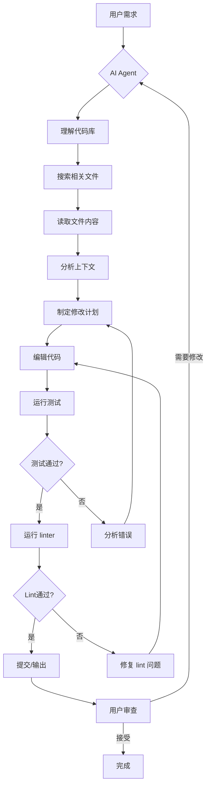
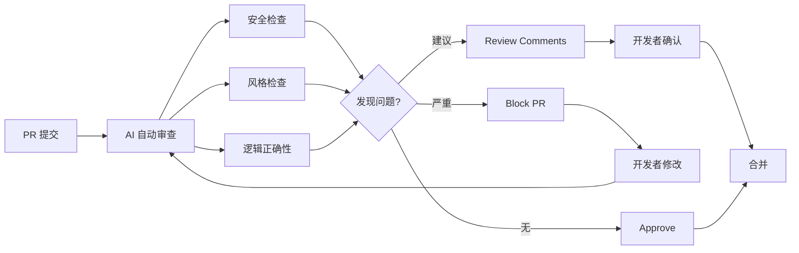

# AI 编程

## 1. 代码大模型

### 主流模型

| 模型 | 开发商 | 参数量 | 上下文窗口 | HumanEval | 特点 |
|------|--------|--------|-----------|-----------|------|
| GPT-4o | OpenAI | ~1.8T | 128K | 96.2% | 多模态编程 |
| Claude 4 Opus | Anthropic | ~2T | 200K | 97.1% | 代码重构最强 |
| DeepSeek-V4 | DeepSeek | 671B MoE | 128K | 95.8% | 开源性价比 |
| Qwen 3 Code | Alibaba | 235B | 128K | 94.5% | 中文优化 |
| Code Llama 70B | Meta | 70B | 100K | 67.8% | 开源基座 |
| StarCoder 2 15B | BigCode | 15B | 16K | 46.1% | 轻量许可友好 |
| Mixtral 8x22B | Mistral | 141B MoE | 64K | 80.5% | 推理高效 |

### 代码能力评估基准

| 基准 | 说明 | 2026 顶尖表现 | 评估难度 |
|------|------|---------------|----------|
| HumanEval | 164 个函数级 Python 题 | 97.2% | 中等 |
| HumanEval+ | 扩展测试用例 | 94.1% | 中等 |
| SWE-bench Verified | 500 个真实 GitHub Issue | 80.3% | 高 |
| SWE-bench Pro | 抗污染版本 | 72.5% | 高 |
| BigCodeBench | 1140 个综合编程任务 | 68.4% | 中高 |
| Codeforces (Rating) | 竞赛级编程 | 3450 | 极高 |
| CRUXEval | 代码执行推理 | 91.5% | 中 |

### LLM 代码补全示例

```python
import openai
import os
from typing import List, Optional

client = openai.OpenAI(api_key=os.environ["OPENAI_API_KEY"])

def generate_completion(context_before: str, cursor_position: int) -> str:
    prompt = f"""You are a code completion engine. Given the code before cursor, suggest the most likely continuation.

```python
{context_before}
<CURSOR>"""

    response = client.chat.completions.create(
        model="gpt-4o",
        messages=[
            {"role": "system", "content": "Complete the code at CURSOR. Output only the completion code."},
            {"role": "user", "content": prompt}
        ],
        max_tokens=256,
        temperature=0.1,
        stop=["\n\n\n", "def ", "class "]
    )
    return response.choices[0].message.content.strip()

def streaming_completion(context_before: str) -> str:
    stream = client.chat.completions.create(
        model="gpt-4o",
        messages=[
            {"role": "system", "content": "You are a code completion assistant. Complete the code naturally."},
            {"role": "user", "content": f"```python\n{context_before}\n```"}
        ],
        max_tokens=512,
        temperature=0.05,
        stream=True
    )
    result = []
    for chunk in stream:
        if chunk.choices[0].delta.content:
            result.append(chunk.choices[0].delta.content)
    return "".join(result)

def suggest_imports(module_name: str) -> List[str]:
    prompt = f"List all commonly used submodules and functions from {module_name} for data science tasks."
    response = client.chat.completions.create(
        model="gpt-4o",
        messages=[{"role": "user", "content": prompt}],
        max_tokens=200,
        temperature=0.0
    )
    return [line.strip("- ") for line in response.choices[0].message.content.strip().split("\n") if line]
```

### 代码审查 Prompt

```python
import openai
import os

client = openai.OpenAI(api_key=os.environ["OPENAI_API_KEY"])

def review_code(code_snippet: str, language: str = "python") -> dict:
    prompt = f"""Review the following {language} code for issues. Provide structured feedback on:

1. Bugs and logic errors
2. Security vulnerabilities (SQL injection, XSS, path traversal, etc.)
3. Performance bottlenecks
4. Style and maintainability
5. Missing error handling

Code to review:
```{language}
{code_snippet}
```

Return in JSON format with severity (critical/high/medium/low) for each issue."""

    response = client.chat.completions.create(
        model="gpt-4o",
        messages=[
            {"role": "system", "content": "You are a senior software engineer conducting a code review. Be thorough and precise."},
            {"role": "user", "content": prompt}
        ],
        max_tokens=1500,
        temperature=0.0,
        response_format={"type": "json_object"}
    )
    return response.choices[0].message.content

def diff_review(diff_text: str) -> str:
    prompt = f"""Review this git diff. Focus on:
- Does the change correctly address the issue?
- Are there edge cases not handled?
- Are tests needed?
- Is the change backwards compatible?

Diff:
```diff
{diff_text}
```"""

    response = client.chat.completions.create(
        model="gpt-4o",
        messages=[{"role": "user", "content": prompt}],
        max_tokens=1000,
        temperature=0.2
    )
    return response.choices[0].message.content

def check_security_vulnerabilities(code: str, language: str = "python") -> list:
    prompt = f"List all security vulnerabilities in this {language} code. Return as JSON array of {severity, line, description, fix}."
    response = client.chat.completions.create(
        model="gpt-4o",
        messages=[{"role": "user", "content": f"```{language}\n{code}\n```\n\n{prompt}"}],
        max_tokens=1000,
        temperature=0.0,
        response_format={"type": "json_object"}
    )
    return response.choices[0].message.content
```

### 测试生成 Prompt

```python
import openai
import os
import json

client = openai.OpenAI(api_key=os.environ["OPENAI_API_KEY"])

def generate_unit_tests(source_code: str, framework: str = "pytest") -> str:
    prompt = f"""Generate comprehensive unit tests for the following code using {framework}.

Requirements:
- Cover all public functions and methods
- Include normal cases, edge cases, and error cases
- Use mocking for external dependencies
- Achieve >90% line coverage
- Follow {framework} best practices with fixtures and parametrize

Source code:
```python
{source_code}
```

Output only the test code."""

    response = client.chat.completions.create(
        model="gpt-4o",
        messages=[
            {"role": "system", "content": "You are a test automation expert. Generate thorough, production-quality tests."},
            {"role": "user", "content": prompt}
        ],
        max_tokens=2000,
        temperature=0.2,
        stop=["```"]
    )
    return response.choices[0].message.content.strip()

def generate_property_tests(source_code: str) -> str:
    prompt = f"""Generate property-based tests using Hypothesis for this code:
```python
{source_code}
```

Focus on invariants that should always hold true regardless of input."""

    response = client.chat.completions.create(
        model="gpt-4o",
        messages=[{"role": "user", "content": prompt}],
        max_tokens=1500,
        temperature=0.2
    )
    return response.choices[0].message.content

def generate_mutation_tests(source_code: str, function_name: str) -> str:
    prompt = f"Generate edge case tests for function {function_name} that would catch common logical errors."
    response = client.chat.completions.create(
        model="gpt-4o",
        messages=[{"role": "user", "content": f"```python\n{source_code}\n```\n\n{prompt}"}],
        max_tokens=1000,
        temperature=0.3
    )
    return response.choices[0].message.content

def run_and_validate(code: str, test_code: str) -> dict:
    import tempfile
    import subprocess
    with tempfile.NamedTemporaryFile(suffix=".py", mode="w", delete=False) as f:
        f.write(f"{code}\n\n{test_code}")
        fpath = f.name
    result = subprocess.run(["python", "-m", "pytest", fpath, "-v", "--tb=short"], capture_output=True, text=True)
    return {"passed": result.returncode == 0, "output": result.stdout + result.stderr}
```

### AI 编程工具对比

| 工具 | 类型 | 代码补全 | 整文件编辑 | Agent 模式 | 价格 |
|------|------|---------|-----------|-----------|------|
| GitHub Copilot | IDE 插件 | 优秀 | 一般 | 有限 | $10/月 |
| Cursor | AI IDE | 优秀 | 优秀 | 优秀 | $20/月 |
| Windsurf | AI IDE | 优秀 | 优秀 | 优秀 | $15/月 |
| Claude Code | CLI Agent | 不适用 | 优秀 | 最佳 | $20/月 |
| OpenCode | CLI Agent | 不适用 | 优秀 | 优秀 | 免费 |
| Devin | Web Agent | 不适用 | 优秀 | 最佳 | $500/月 |
| Codex CLI | CLI Agent | 不适用 | 良好 | 优秀 | 按量付费 |

### AI 编程工作流



### 代码审查流程



### 编程语言支持对比

| 语言 | Copilot | Claude Code | Cursor | 专用模型 |
|------|---------|-------------|--------|---------|
| Python | 优秀 | 优秀 | 优秀 | StarCoder 2 |
| TypeScript/JS | 优秀 | 优秀 | 优秀 | DeepSeek Coder |
| Rust | 良好 | 优秀 | 良好 | Code Llama |
| Go | 良好 | 优秀 | 良好 | 通用模型 |
| Java | 良好 | 良好 | 良好 | CodeGeeX |
| C++ | 良好 | 良好 | 良好 | 通用模型 |
| SQL | 优秀 | 优秀 | 优秀 | SQLCoder |

### 常见 Bug 类型与 AI 检测率

| Bug 类型 | 描述 | AI 检测率 | 人类检测率 |
|----------|------|----------|-----------|
| Null Pointer | 空引用异常 | 92% | 85% |
| Off-by-one | 边界条件错误 | 78% | 70% |
| Race Condition | 并发竞态 | 55% | 45% |
| SQL Injection | 注入攻击 | 95% | 80% |
| Memory Leak | 内存泄露 | 60% | 55% |
| Logic Error | 逻辑错误 | 70% | 75% |

## 2. 最佳实践

### Prompt 工程技巧
- **分步引导**：复杂逻辑拆解为子任务
- **类型优先**：提供类型签名提升准确率
- **上下文丰富**：展示相关现有代码和依赖
- **测试约束**：明确测试框架和覆盖率要求
- **少样本示例**：提供 2-3 个输入输出示例

### 常见陷阱
- **接受盲目**：总是审查生成的代码
- **安全漏洞**：AI 可能生成 SQL 注入等不安全代码
- **许可证问题**：注意训练数据的版权 (Copilot GPL 争议)
- **幻觉 API**：AI 可能编造不存在的 API 或库
- **上下文遗忘**：长会话中 Agent 可能丢失上下文

## 3. 2025-2026 趋势
- **自主编程 Agent**：从补全到自主修复 Issue 再到功能开发
- **多文件编辑**：跨文件理解和协同修改
- **测试优先循环**：AI 自动编写测试→验证→修复
- **代码审查 AI**：自动 PR Review 与安全审计
- **领域专用**：数据库/SRE/前端/移动端专项 Agent
- **SWE-bench 作为标准**：真实场景评估成为行业规范
