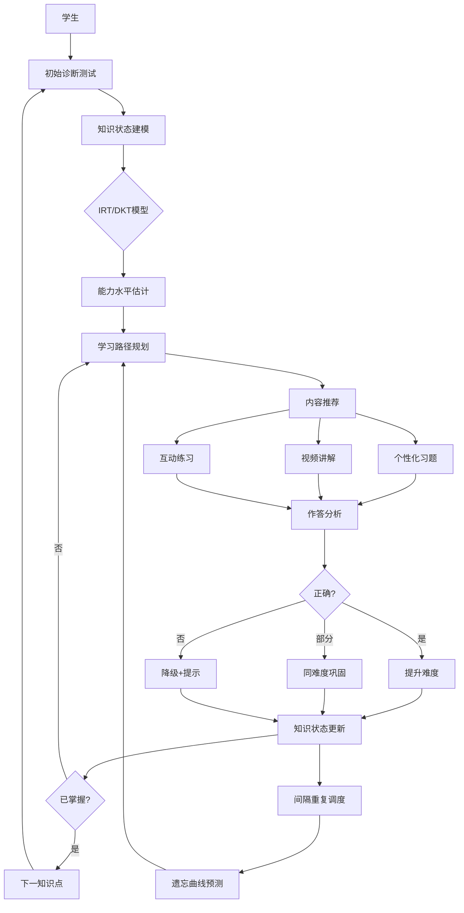
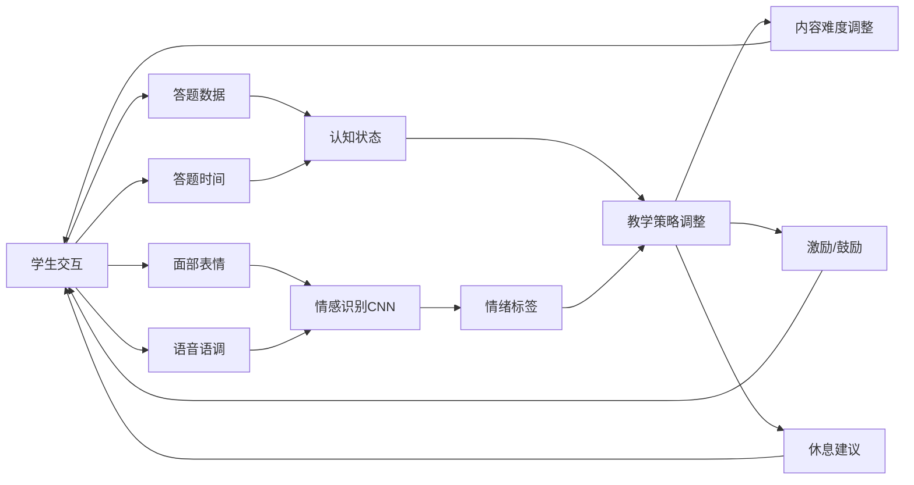

# AI 教育

## 1. 知识追踪模型

### IRT (项目反应理论)

```python
import numpy as np
import pandas as pd
from scipy.optimize import minimize
from scipy.special import expit

class IRTModel:
    def __init__(self, n_students, n_items):
        self.n_students = n_students
        self.n_items = n_items
        self.theta = np.zeros(n_students)
        self.a = np.ones(n_items)
        self.b = np.zeros(n_items)
        self.c = np.full(n_items, 0.25)

    def probability(self, theta, a, b, c):
        return c + (1 - c) * expit(a * (theta - b))

    def log_likelihood(self, params, responses):
        n_s, n_i = responses.shape
        theta = params[:n_s]
        a = params[n_s:n_s+n_i]
        b = params[n_s+n_i:n_s+2*n_i]
        c = expit(params[n_s+2*n_i:n_s+3*n_i])

        p = self.probability(theta[:, None], a[None, :], b[None, :], c[None, :])
        p = np.clip(p, 1e-15, 1 - 1e-15)
        return -np.sum(responses * np.log(p) + (1 - responses) * np.log(1 - p))

    def fit(self, response_matrix):
        n_s, n_i = response_matrix.shape
        x0 = np.concatenate([
            np.zeros(n_s),
            np.ones(n_i),
            np.zeros(n_i),
            np.zeros(n_i)
        ])
        bounds = [(None, None)] * n_s + [(0.1, 3.0)] * n_i + [(-4, 4)] * n_i + [(None, None)] * n_i
        result = minimize(self.log_likelihood, x0, args=(response_matrix,),
                         method="L-BFGS-B", bounds=bounds)
        params = result.x
        self.theta = params[:n_s]
        self.a = params[n_s:n_s+n_i]
        self.b = params[n_s+n_i:n_s+2*n_i]
        self.c = expit(params[n_s+2*n_i:n_s+3*n_i])
        return result.fun

    def estimate_ability(self, responses_to_items):
        def neg_log_lik(theta):
            p = self.probability(theta, self.a, self.b, self.c)
            p = np.clip(p, 1e-15, 1 - 1e-15)
            return -np.sum(responses_to_items * np.log(p) + (1 - responses_to_items) * np.log(1 - p))

        result = minimize(neg_log_lik, x0=0.0, method="BFGS")
        return result.x[0]

    def item_information(self, theta, item_idx):
        p = self.probability(theta, self.a[item_idx], self.b[item_idx], self.c[item_idx])
        q = 1 - p
        info = (self.a[item_idx]**2 * (p - self.c[item_idx])**2 * q) / (p * (1 - self.c[item_idx])**2)
        return info

irt = IRTModel(n_students=500, n_items=30)
responses = np.random.binomial(1, 0.5, (500, 30))
irt.fit(responses)

student_theta = irt.estimate_ability(np.array([1, 0, 1, 1, 0, 1]))
print(f"Estimated ability: {student_theta:.3f}")

item_idx = 5
theta_range = np.linspace(-3, 3, 100)
info = [irt.item_information(t, item_idx) for t in theta_range]
best_theta = theta_range[np.argmax(info)]
print(f"Item {item_idx} most informative at ability level {best_theta:.2f}")
```

### DKT (深度知识追踪)

```python
import torch
import torch.nn as nn
import torch.nn.functional as F
import numpy as np

class DKTModel(nn.Module):
    def __init__(self, n_skills, n_questions, hidden_dim=200, dropout=0.3):
        super().__init__()
        self.n_skills = n_skills
        self.n_questions = n_questions
        self.input_dim = 2 * n_questions
        self.hidden_dim = hidden_dim

        self.input_layer = nn.Sequential(
            nn.Linear(self.input_dim, hidden_dim),
            nn.ReLU(),
            nn.Dropout(dropout)
        )
        self.gru = nn.GRU(hidden_dim, hidden_dim, batch_first=True, num_layers=2, dropout=dropout)
        self.output_layer = nn.Sequential(
            nn.Linear(hidden_dim, n_skills),
            nn.Sigmoid()
        )

    def forward(self, x, hidden=None):
        x = self.input_layer(x)
        output, hidden = self.gru(x, hidden)
        return self.output_layer(output), hidden

    def predict_step(self, x, hidden=None):
        with torch.no_grad():
            pred, hidden = self.forward(x, hidden)
        return pred, hidden

class DKTTrainer:
    def __init__(self, model, lr=1e-3, device="cpu"):
        self.model = model.to(device)
        self.device = device
        self.optimizer = torch.optim.Adam(model.parameters(), lr=lr)
        self.criterion = nn.BCELoss()

    def prepare_input(self, question_ids, correct_flags, n_questions):
        batch_size, seq_len = question_ids.shape
        x = torch.zeros(batch_size, seq_len, 2 * n_questions)
        for b in range(batch_size):
            for t in range(seq_len):
                q = question_ids[b, t]
                c = correct_flags[b, t]
                x[b, t, q + (0 if c == 0 else n_questions)] = 1.0
        return x

    def train_epoch(self, question_seq, correct_seq, skill_seq):
        self.model.train()
        total_loss = 0.0
        n_questions = self.model.n_questions
        x = self.prepare_input(question_seq, correct_seq, n_questions).to(self.device)
        y = F.one_hot(skill_seq, num_classes=self.model.n_skills).float().to(self.device)

        pred, _ = self.model(x)
        mask = (skill_seq != -1).float().unsqueeze(-1).to(self.device)
        loss = (self.criterion(pred, y) * mask).sum() / mask.sum()
        self.optimizer.zero_grad()
        loss.backward()
        torch.nn.utils.clip_grad_norm_(self.model.parameters(), max_norm=1.0)
        self.optimizer.step()
        return loss.item()

    def evaluate(self, question_seq, correct_seq, skill_seq):
        self.model.eval()
        n_questions = self.model.n_questions
        x = self.prepare_input(question_seq, correct_seq, n_questions).to(self.device)
        y = F.one_hot(skill_seq, num_classes=self.model.n_skills).float().to(self.device)

        with torch.no_grad():
            pred, _ = self.model(x)

        mask = (skill_seq != -1).float().unsqueeze(-1).to(self.device)
        pred_flat = pred[mask.bool()].cpu().numpy()
        y_flat = y[mask.bool()].cpu().numpy()
        auc = roc_auc_score(y_flat, pred_flat) if len(np.unique(y_flat)) > 1 else 0.5
        return auc

n_skills, n_questions = 50, 100
model = DKTModel(n_skills, n_questions, hidden_dim=256)
trainer = DKTTrainer(model, lr=1e-3)

q_seq = torch.randint(0, n_questions, (64, 50))
c_seq = torch.randint(0, 2, (64, 50))
s_seq = torch.randint(0, n_skills, (64, 50))

for epoch in range(30):
    loss = trainer.train_epoch(q_seq, c_seq, s_seq)
    print(f"Epoch {epoch}: Loss={loss:.4f}")
```

### 自适应学习推荐系统

```python
import numpy as np
from typing import List, Dict, Tuple
from dataclasses import dataclass

@dataclass
class StudentState:
    student_id: str
    knowledge_level: Dict[str, float]
    mastery_threshold: float = 0.8
    forgetting_rate: float = 0.05

@dataclass
class LearningItem:
    item_id: str
    skill: str
    difficulty: float
    content_type: str
    prerequisites: List[str]

class AdaptiveLearningSystem:
    def __init__(self):
        self.students: Dict[str, StudentState] = {}
        self.items: Dict[str, LearningItem] = {}
        self.interaction_log: List[Dict] = []

    def register_student(self, student_id: str, initial_skills: Dict[str, float] = None):
        self.students[student_id] = StudentState(
            student_id=student_id,
            knowledge_level=initial_skills or {}
        )

    def add_learning_item(self, item: LearningItem):
        self.items[item.item_id] = item

    def update_knowledge(self, student_id: str, skill: str, correct: bool, difficulty: float):
        student = self.students[student_id]
        k = student.knowledge_level.get(skill, 0.0)
        if correct:
            gain = (1 - k) * (1 - difficulty)
            student.knowledge_level[skill] = min(k + gain, 1.0)
        else:
            student.knowledge_level[skill] = max(k * 0.5, 0.0)

    def apply_forgetting(self, student_id: str, days_elapsed: int):
        student = self.students[student_id]
        for skill in student.knowledge_level:
            student.knowledge_level[skill] *= np.exp(-student.forgetting_rate * days_elapsed)

    def recommend_next(self, student_id: str, top_k: int = 5) -> List[Tuple[str, float]]:
        student = self.students[student_id]
        scores = []

        for item_id, item in self.items.items():
            skill_level = student.knowledge_level.get(item.skill, 0.0)
            if skill_level >= student.mastery_threshold:
                continue

            prereq_score = 1.0
            for prereq in item.prerequisites:
                prereq_level = student.knowledge_level.get(prereq, 0.0)
                if prereq_level < 0.5:
                    prereq_score *= 0.3

            difficulty_gap = abs(skill_level - (1 - item.difficulty))
            zone_of_proximal = np.exp(-difficulty_gap**2 / 0.1)

            item_freshness = 1.0
            recent_logs = [log for log in self.interaction_log
                          if log["student_id"] == student_id and log["item_id"] == item_id]
            if recent_logs:
                last_log = recent_logs[-1]
                if last_log["correct"]:
                    item_freshness = 0.3

            score = zone_of_proximal * prereq_score * item_freshness
            scores.append((item_id, score))

        scores.sort(key=lambda x: -x[1])
        return scores[:top_k]

    def record_interaction(self, student_id: str, item_id: str, correct: bool, response_time: float):
        item = self.items[item_id]
        self.update_knowledge(student_id, item.skill, correct, item.difficulty)
        self.interaction_log.append({
            "student_id": student_id, "item_id": item_id,
            "correct": correct, "response_time": response_time,
            "timestamp": len(self.interaction_log)
        })

    def get_learning_progress(self, student_id: str) -> Dict:
        student = self.students[student_id]
        skills_above_threshold = sum(
            1 for v in student.knowledge_level.values() if v >= student.mastery_threshold
        )
        total_skills = max(len(student.knowledge_level), 1)
        return {
            "mastery_rate": skills_above_threshold / total_skills,
            "weakest_skills": sorted(student.knowledge_level.items(), key=lambda x: x[1])[:3],
            "strongest_skills": sorted(student.knowledge_level.items(), key=lambda x: -x[1])[:3],
            "total_interactions": len([l for l in self.interaction_log if l["student_id"] == student_id])
        }

system = AdaptiveLearningSystem()
system.register_student("S001", {})

for i in range(20):
    system.add_learning_item(LearningItem(
        item_id=f"Q{i:03d}", skill=f"skill_{i % 5}",
        difficulty=np.random.uniform(0.2, 0.9),
        content_type="practice", prerequisites=[]
    ))

student_id = "S001"
items = list(system.items.values())
for i in range(50):
    item = items[i % len(items)]
    correct = np.random.random() > item.difficulty * 0.6
    system.record_interaction(student_id, item.item_id, correct, np.random.uniform(5, 60))

recommendations = system.recommend_next(student_id)
progress = system.get_learning_progress(student_id)
print(f"Progress: {progress}")

for item_id, score in recommendations[:5]:
    item = system.items[item_id]
    print(f"Recommend: {item_id} (skill={item.skill}, score={score:.3f})")
```

### 知识追踪模型对比

| 模型 | 基础架构 | 输入 | 输出 | AUC | 可解释性 | 适用场景 |
|------|---------|------|------|-----|---------|----------|
| IRT | 逻辑函数 | 题目-学生 | 能力值θ | 0.72 | 高 | 标准化考试 |
| DKT | GRU/LSTM | 作答序列 | 掌握概率 | 0.85 | 低 | 在线学习序列 |
| DKVMN | Memory Network | 概念-作答 | 概念状态 | 0.87 | 中 | 细粒度追踪 |
| SKT | 贝叶斯网络 | 技能图谱 | 技能掌握 | 0.80 | 高 | 结构化课程 |
| SAKT | Transformer | 注意力序列 | 预测正确率 | 0.86 | 中 | 长序列建模 |
| AKT | 自注意力+IRT | 问答时间序列 | 交互预测 | 0.88 | 中 | 大规模平台 |

### 自适应学习参数对比

| 策略 | 探索率 | 收敛速度 | 学生满意度 | 适用阶段 |
|------|--------|---------|-----------|---------|
| 知识驱动 | 0.1 | 快 | 高 | 基础巩固 |
| 难度递增 | 0.05 | 中 | 中 | 新知识引入 |
| 间隔重复 | 0.0 | 慢 | 高 | 长期记忆 |
| 多臂老虎机 | 0.2 | 快 | 中 | 冷启动 |
| 贝叶斯优化 | 0.15 | 中 | 高 | 自适应巡航 |

### AI 辅导工具对比

| 工具 | 类型 | 交互方式 | 学科覆盖 | 特色功能 |
|------|------|---------|---------|---------|
| Khanmigo | 对话辅导 | 苏格拉底式 | K-12 全科 | 不直接给答案 |
| Duolingo Max | 语言学习 | 角色扮演 | 40+ 语言 | 错误解释 |
| Quizlet Q-Chat | 学习助手 | 自适应测验 | 多学科 | 闪卡生成 |
| Photomath | 数学解题 | 拍照+步骤 | 数学 | 分步推导 |
| ChatGPT Edu | 通用辅导 | 对话 | 全科 | 内容生成 |

### 自适应学习循环



### 情感感知教学流程



### 教育 AI 评估指标

| 指标 | 定义 | 目标值 |
|------|------|--------|
| AUC | 知识追踪预测准确度 | >0.85 |
| RMSE | 预测能力值与真实误差 | <0.3 |
| Learning Gain | 前后测提升 | >30% |
| Engagement Rate | 日均学习时长 | >30min |
| Retention Rate | 7天后知识保持率 | >70% |
| Dropout Rate | 用户流失率 | <10% |

## 2. 2025-2026 趋势
- **沉浸式 VR+AI 教学**：社交化虚拟课堂
- **情感感知辅导**：检测学生情绪调整教学策略
- **AI 助教普及**：每个学生专属个性化 AI 导师
- **教育公平**：AI 缩小城乡/跨国教育资源差距
- **终身学习追踪**：从 K-12 到职业教育全生命周期能力图谱
