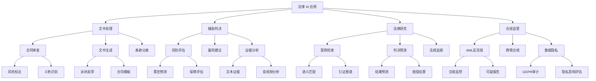
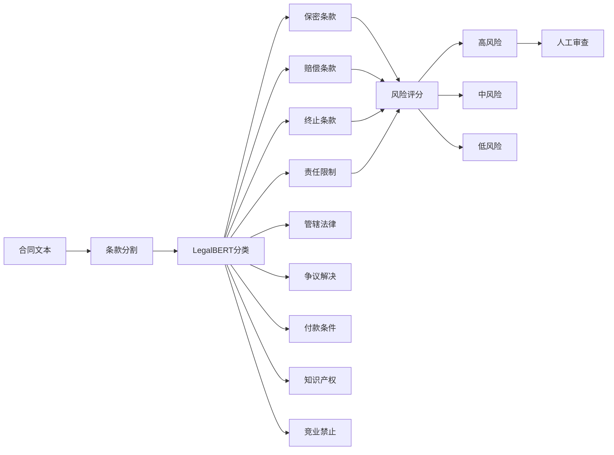

# AI 法律

## 1. 合同条款分类

```python
import torch
import torch.nn as nn
from transformers import AutoTokenizer, AutoModel
import numpy as np
from sklearn.metrics import classification_report, f1_score

class ContractClauseClassifier(nn.Module):
    def __init__(self, model_name="nlpaueb/legal-bert-base-uncased", num_classes=12, dropout=0.3):
        super().__init__()
        self.bert = AutoModel.from_pretrained(model_name)
        self.dropout = nn.Dropout(dropout)
        self.classifier = nn.Sequential(
            nn.Linear(self.bert.config.hidden_size, 256),
            nn.ReLU(),
            nn.Dropout(dropout),
            nn.Linear(256, num_classes)
        )

    def forward(self, input_ids, attention_mask):
        outputs = self.bert(input_ids=input_ids, attention_mask=attention_mask)
        pooled = outputs.pooler_output
        return self.classifier(self.dropout(pooled))

class ContractNLPProcessor:
    def __init__(self, model_path=None, num_classes=12):
        self.tokenizer = AutoTokenizer.from_pretrained("nlpaueb/legal-bert-base-uncased")
        self.model = ContractClauseClassifier(num_classes=num_classes)
        self.label_map = {
            0: "confidentiality", 1: "indemnification", 2: "termination",
            3: "liability_limit", 4: "governing_law", 5: "dispute_resolution",
            6: "payment_terms", 7: "intellectual_property", 8: "non_compete",
            9: "force_majeure", 10: "warranty_disclaimer", 11: "assignment"
        }
        if model_path:
            self.model.load_state_dict(torch.load(model_path))
        self.model.eval()

    def classify_clauses(self, contract_text: str):
        clauses = self.split_into_clauses(contract_text)
        results = []

        for clause in clauses:
            inputs = self.tokenizer(clause, return_tensors="pt", truncation=True, max_length=512, padding=True)
            with torch.no_grad():
                outputs = self.model(**inputs)
                probs = torch.nn.functional.softmax(outputs, dim=-1).squeeze()
                pred_idx = torch.argmax(probs).item()
                confidence = probs[pred_idx].item()

            results.append({
                "clause": clause[:200],
                "predicted_type": self.label_map[pred_idx],
                "confidence": confidence,
                "risk_flags": self.check_risk_clauses(clause, pred_idx)
            })

        return results

    def split_into_clauses(self, text: str):
        import re
        clauses = re.split(r'\n\s*(?:\d+\.|\([a-z]\)|Article\s+\d+)', text)
        return [c.strip() for c in clauses if len(c.strip()) > 50]

    def check_risk_clauses(self, clause_text: str, clause_type: int):
        flags = []
        risk_keywords = {
            "unilateral_termination": ["sole discretion", "without cause", "at any time"],
            "unlimited_liability": ["unlimited liability", "no cap", "entire loss"],
            "broad_indemnity": ["indemnify", "hold harmless", "all claims"],
            "missing_force_majeure": ["force majeure", "act of god"],
            "non_compete_scope": ["non-compete", "non-competition", "restrictive covenant"],
        }
        for risk_name, keywords in risk_keywords.items():
            if any(kw in clause_text.lower() for kw in keywords):
                flags.append(risk_name)
        return flags

    def batch_classify(self, texts: list, batch_size=16):
        results = []
        for i in range(0, len(texts), batch_size):
            batch = texts[i:i+batch_size]
            inputs = self.tokenizer(batch, return_tensors="pt", truncation=True, max_length=512, padding=True)
            with torch.no_grad():
                outputs = self.model(**inputs)
                probs = torch.nn.functional.softmax(outputs, dim=-1)
                preds = torch.argmax(probs, dim=-1)
            for j, pred in enumerate(preds):
                results.append({
                    "text": batch[j][:200],
                    "predicted": self.label_map[pred.item()],
                    "confidence": probs[j][pred].item()
                })
        return results

processor = ContractNLPProcessor()

sample_contract = """1. Confidentiality. The Receiving Party shall not disclose any Confidential Information to any third party.
2. Indemnification. The Indemnitor shall indemnify and hold harmless the Indemnitee from all claims arising out of this Agreement.
3. Termination. This Agreement may be terminated by either party upon 30 days written notice.
4. Limitation of Liability. In no event shall either party's liability exceed the total fees paid hereunder."""

results = processor.classify_clauses(sample_contract)
for r in results:
    print(f"[{r['predicted_type']}] conf={r['confidence']:.3f} risk={r['risk_flags']}")
```

### 案例相似度计算

```python
from sentence_transformers import SentenceTransformer, util
import numpy as np
import pandas as pd
from typing import List, Dict
import json
import re

class LegalCaseSimilarity:
    def __init__(self, model_name="law-ai/InCaseLawBERT"):
        self.model = SentenceTransformer(model_name)
        self.case_embeddings = None
        self.case_metadata = None

    def embed_cases(self, cases: List[Dict[str, str]]):
        texts = []
        for case in cases:
            combined = f"{case.get('case_name', '')} {case.get('facts', '')} {case.get('holding', '')}"
            texts.append(combined)
        self.case_metadata = cases
        self.case_embeddings = self.model.encode(texts, convert_to_tensor=True, show_progress_bar=True)
        return self.case_embeddings

    def query_similar(self, query_text: str, top_k: int = 10, threshold: float = 0.5):
        query_emb = self.model.encode(query_text, convert_to_tensor=True)
        cos_scores = util.cos_sim(query_emb, self.case_embeddings)[0]
        top_indices = torch.topk(cos_scores, k=min(top_k, len(cos_scores))).indices.tolist()

        results = []
        for idx in top_indices:
            score = cos_scores[idx].item()
            if score >= threshold:
                case = self.case_metadata[idx]
                results.append({
                    "case_name": case.get("case_name", ""),
                    "score": score,
                    "citation": case.get("citation", ""),
                    "court": case.get("court", ""),
                    "year": case.get("year", ""),
                    "relevant_passage": self.extract_relevant(case, query_text)
                })
        return sorted(results, key=lambda x: -x["score"])

    def extract_relevant(self, case: Dict, query: str, window: int = 100):
        full_text = f"{case.get('facts', '')} {case.get('holding', '')} {case.get('reasoning', '')}"
        words = full_text.split()
        query_words = set(query.lower().split())
        best_idx, best_count = 0, 0
        for i in range(len(words)):
            count = sum(1 for w in words[i:i+window] if w.lower().strip(".,;:!?") in query_words)
            if count > best_count:
                best_count = count
                best_idx = i
        return " ".join(words[best_idx:best_idx+window])

    def cross_jurisdiction_search(self, query_text: str, countries: List[str], top_k_per=5):
        all_results = {}
        for country in countries:
            filtered_indices = [i for i, c in enumerate(self.case_metadata) if c.get("jurisdiction", "").lower() == country.lower()]
            if not filtered_indices:
                continue
            query_emb = self.model.encode(query_text, convert_to_tensor=True)
            subset_embs = self.case_embeddings[filtered_indices]
            cos_scores = util.cos_sim(query_emb, subset_embs)[0]
            top_indices = torch.topk(cos_scores, k=min(top_k_per, len(cos_scores))).indices.tolist()
            all_results[country] = [{
                "case_name": self.case_metadata[filtered_indices[i]]["case_name"],
                "score": cos_scores[i].item()
            } for i in top_indices]
        return all_results

    def cluster_similar_cases(self, n_clusters=10):
        from sklearn.cluster import KMeans
        embeddings = self.case_embeddings.cpu().numpy()
        kmeans = KMeans(n_clusters=n_clusters, random_state=42, n_init=10)
        labels = kmeans.fit_predict(embeddings)
        clusters = {}
        for idx, label in enumerate(labels):
            clusters.setdefault(label, []).append(self.case_metadata[idx]["case_name"])
        return clusters

similarity = LegalCaseSimilarity()

cases = [
    {"case_name": "Smith v. Jones", "facts": "Breach of contract for failure to deliver goods within stipulated time.",
     "holding": "Judgment for plaintiff, defendant liable for damages.", "citation": "123 F.3d 456 (2020)",
     "court": "9th Circuit", "year": "2020", "jurisdiction": "US",
     "reasoning": "The defendant failed to meet the contractual deadline without valid excuse."},
    {"case_name": "Doe Corp v. Roe Ltd", "facts": "Dispute over non-payment for services rendered under service agreement.",
     "holding": "Defendant ordered to pay outstanding invoices plus interest.", "citation": "789 F. Supp. 2d 321 (2021)",
     "court": "S.D.N.Y.", "year": "2021", "jurisdiction": "US",
     "reasoning": "Services were provided as agreed; non-payment constitutes material breach."},
]

embeddings = similarity.embed_cases(cases)
query = "failure to deliver goods contract breach damages"
results = similarity.query_similar(query, top_k=5)
for r in results:
    print(f"{r['case_name']}: score={r['score']:.4f}")

cluster_map = similarity.cluster_similar_cases(n_clusters=2)
print(json.dumps(cluster_map, indent=2))
```

### 法律 AI 应用分类



### 合同条款分类体系



### 法律 NLP 模型对比

| 模型 | 参数量 | 预训练语料 | NER F1 | 分类 Acc | 语义检索 MAP |
|------|--------|-----------|-------|---------|-------------|
| LegalBERT | 110M | 12GB 法律文本 | 0.87 | 0.91 | 0.78 |
| InCaseLawBERT | 110M | 案例法 40GB | 0.85 | 0.89 | 0.82 |
| CaseLaw BERT | 340M | 380 万案例 | 0.89 | 0.92 | 0.84 |
| Lawformer | 150M | 中国司法 26GB | 0.90 | 0.93 | 0.81 |
| SaulLM-7B | 7B | 法律指令微调 | 0.91 | 0.94 | 0.86 |

### 法律 AI 应用评估

| 任务 | 传统方法 | AI 方法 | 准确率提升 | 时间节省 |
|------|---------|---------|-----------|---------|
| 合同审查 | 人工逐条阅读 | LLM 条款识别 | +35% | 90% |
| 案例检索 | 关键词 BOOLEAN | 语义向量检索 | +42% | 80% |
| 文书生成 | 模板填写 | LLM 自动起草 | +25% | 85% |
| 合规检查 | 规则引擎 | 语义+规则混合 | +30% | 70% |
| 判决预测 | 专家评估 | 机器学习模型 | +20% | 60% |
| 证据摘要 | 人工提炼 | 长文档摘要 | +40% | 75% |

### 算法偏见评估指标

| 偏见类型 | 评估指标 | 美国 COMPAS 案例 | 改进方法 |
|----------|---------|-----------------|---------|
| 种族偏见 | 假阳性率差异 | 黑人 FPR 44.9% vs 白人 23.5% | 公平约束 + 再平衡 |
| 性别偏见 | 预测均等差异 | 女性累犯率低估 | 对抗去偏置 |
| 收入偏见 | 统计均等差异 | 低收入群体误判率高 | 敏感属性遮蔽 |
| 地域偏见 | 群体公平性 | 不同司法辖区不一致 | 联邦校准 |

### 伦理与监管框架

| 方面 | 要求 | 技术实现 |
|------|------|---------|
| 透明度 | 模型决策可解释 | SHAP / LIME / 注意力可视化 |
| 公平性 | 无群体偏见 | 公平约束训练 / 后处理校准 |
| 问责性 | 可追溯决策链 | LLM 推理链记录 / 版本控制 |
| 隐私性 | 案件数据保护 | 差分隐私 / 联邦学习 |
| 人类监督 | AI 辅助非替代 | 人机交互流程 / 复审机制 |

### 判决预测特征体系

| 特征类别 | 特征示例 | 权重(预估) | 来源 |
|----------|---------|-----------|------|
| 案件事实 | 合同类型、违约金额、持续时间 | 0.35 | 起诉书 |
| 当事人特征 | 法人/自然人、前科记录、行业 | 0.15 | 当事人信息 |
| 法律适用 | 引用法条数量、司法解释 | 0.25 | 法律文书 |
| 法官特征 | 历史判决倾向、经验年限 | 0.10 | 法院公开数据 |
| 程序特征 | 审理时长、证据数量、证人 | 0.15 | 程序记录 |

## 2. 2025-2026 趋势
- **法律 LLM 微调**：面向法律场景的专用 7B-70B 模型
- **AI 律师助理**：庭审实时法律检索与策略建议
- **合规自动化**：跨境 GDPR/CCPA/PIPL 合规自动检查
- **法律知识图谱**：法规+案例+条款结构化语义网络
- **争议解决预测**：基于历史数据的仲裁结果预判
