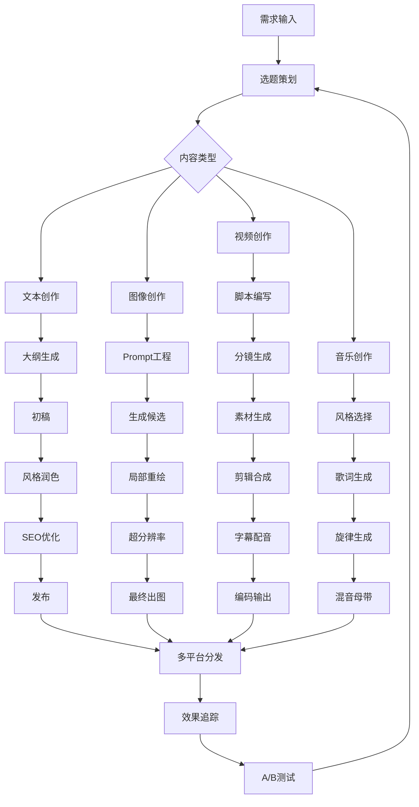
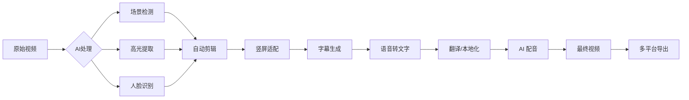

# AI 内容创作

## 1. 文本生成

### LLM 文本生成 Prompt 工程

```python
import openai
import os
from typing import List, Dict
import json

client = openai.OpenAI(api_key=os.environ["OPENAI_API_KEY"])

class TextGenerator:
    def __init__(self, model="gpt-4o"):
        self.model = model

    def generate_article(self, topic: str, tone: str = "professional", length: int = 1000) -> str:
        prompt = f"""Write a {tone} article about "{topic}".

Requirements:
- Length: approximately {length} words
- Structure: engaging introduction, 3-5 body sections with subheadings, conclusion
- Include specific examples, data points, and actionable takeaways
- Target audience: educated professionals
- Tone: {tone}"""

        response = client.chat.completions.create(
            model=self.model,
            messages=[
                {"role": "system", "content": "You are a professional content writer. Write original, well-researched content."},
                {"role": "user", "content": prompt}
            ],
            max_tokens=length * 2,
            temperature=0.7
        )
        return response.choices[0].message.content

    def style_transfer(self, text: str, target_style: str) -> str:
        prompt = f"""Rewrite the following text in the style of {target_style}.

Original:
{text}

Guidelines:
- Preserve all factual information
- Adapt vocabulary, sentence structure, and tone to match {target_style}
- Maintain the original length ±20%"""

        response = client.chat.completions.create(
            model=self.model,
            messages=[{"role": "user", "content": prompt}],
            max_tokens=len(text) * 2,
            temperature=0.6
        )
        return response.choices[0].message.content

    def generate_outline(self, topic: str, sections: int = 5) -> List[Dict]:
        prompt = f"""Create a detailed outline for an article about "{topic}" with {sections} main sections.

For each section provide:
- Section title
- 3-5 key points
- 1 example or data point
- Target word count

Return as JSON array."""

        response = client.chat.completions.create(
            model=self.model,
            messages=[{"role": "user", "content": prompt}],
            max_tokens=1000,
            temperature=0.3,
            response_format={"type": "json_object"}
        )
        return json.loads(response.choices[0].message.content)

    def rewrite_for_platform(self, text: str, platform: str) -> str:
        prompts = {
            "linkedin": "Rewrite this as a LinkedIn post. Professional, concise, with relevant hashtags. Max 1500 chars.",
            "twitter": "Summarize this as a Twitter thread in 5-7 tweets. Each tweet under 280 characters.",
            "blog": "Expand this into a comprehensive blog post with SEO optimization, headings, and meta description.",
            "newsletter": "Convert this into a newsletter format with a personal tone, greeting, and call-to-action.",
        }
        prompt = f"""{prompts.get(platform, 'Rewrite professionally')}

Text: {text}"""

        response = client.chat.completions.create(
            model=self.model,
            messages=[{"role": "user", "content": prompt}],
            max_tokens=2000,
            temperature=0.5
        )
        return response.choices[0].message.content

    def generate_meta_description(self, text: str, max_length: int = 160) -> str:
        prompt = f"Generate an SEO meta description (max {max_length} chars) for this content, include target keywords naturally:\n\n{text[:500]}"
        response = client.chat.completions.create(
            model=self.model,
            messages=[{"role": "user", "content": prompt}],
            max_tokens=100,
            temperature=0.2
        )
        return response.choices[0].message.content.strip()

gen = TextGenerator()
article = gen.generate_article("The Future of AI in Content Creation", tone="engaging", length=800)
print(article[:500])

outline = gen.generate_outline("AI video generation", sections=4)
post = gen.rewrite_for_platform(article, "linkedin")
print(post)
```

### Stable Diffusion 图像生成 Pipeline

```python
import torch
from diffusers import StableDiffusionXLPipeline, EulerAncestralDiscreteScheduler, DPMSolverMultistepScheduler
from diffusers import AutoPipelineForText2Image, AutoPipelineForImage2Image
from PIL import Image
import numpy as np

class ImageGenerationPipeline:
    def __init__(self, model_id="stabilityai/stable-diffusion-xl-base-1.0", device="cuda"):
        self.device = device
        self.pipe = AutoPipelineForText2Image.from_pretrained(
            model_id,
            torch_dtype=torch.float16 if device == "cuda" else torch.float32,
            variant="fp16" if device == "cuda" else None,
            use_safetensors=True
        ).to(device)

        self.pipe.scheduler = DPMSolverMultistepScheduler.from_config(
            self.pipe.scheduler.config,
            use_karras_sigmas=True,
            algorithm_type="sde-dpmsolver++"
        )

    def generate_from_prompt(self, prompt: str, negative_prompt: str = "",
                              width: int = 1024, height: int = 1024,
                              steps: int = 25, guidance_scale: float = 7.0,
                              seed: int = None) -> Image.Image:
        if seed is not None:
            generator = torch.Generator(device=self.device).manual_seed(seed)
        else:
            generator = None

        image = self.pipe(
            prompt=prompt,
            negative_prompt=negative_prompt,
            width=width,
            height=height,
            num_inference_steps=steps,
            guidance_scale=guidance_scale,
            generator=generator,
        ).images[0]
        return image

    def img2img_generation(self, prompt: str, init_image: Image.Image,
                            strength: float = 0.7, steps: int = 20) -> Image.Image:
        img2img_pipe = AutoPipelineForImage2Image.from_pipe(self.pipe).to(self.device)
        image = img2img_pipe(
            prompt=prompt,
            image=init_image.resize((1024, 1024)),
            strength=strength,
            num_inference_steps=steps,
        ).images[0]
        return image

    def inpainting(self, prompt: str, image: Image.Image, mask: Image.Image,
                    steps: int = 30) -> Image.Image:
        from diffusers import AutoPipelineForInpainting
        inpaint_pipe = AutoPipelineForInpainting.from_pipe(self.pipe).to(self.device)
        result = inpaint_pipe(
            prompt=prompt,
            image=image,
            mask_image=mask,
            num_inference_steps=steps,
        ).images[0]
        return result

    def controlnet_generation(self, prompt: str, control_image: Image.Image,
                               control_type: str = "canny") -> Image.Image:
        from diffusers import ControlNetModel, StableDiffusionXLControlNetPipeline
        from diffusers.utils import load_image

        controlnet = ControlNetModel.from_pretrained(
            f"diffusers/controlnet-canny-sdxl-1.0",
            torch_dtype=torch.float16
        ).to(self.device)

        control_pipe = StableDiffusionXLControlNetPipeline.from_pretrained(
            "stabilityai/stable-diffusion-xl-base-1.0",
            controlnet=controlnet,
            torch_dtype=torch.float16
        ).to(self.device)

        image = control_pipe(
            prompt=prompt,
            image=control_image,
            num_inference_steps=25,
        ).images[0]
        return image

    def batch_generate(self, prompts: List[str], **kwargs) -> List[Image.Image]:
        return [self.generate_from_prompt(p, **kwargs) for p in prompts]

    def generate_with_lora(self, prompt: str, lora_path: str, lora_scale: float = 0.8) -> Image.Image:
        self.pipe.load_lora_weights(lora_path)
        image = self.pipe(
            prompt=prompt,
            cross_attention_kwargs={"scale": lora_scale},
        ).images[0]
        self.pipe.unload_lora_weights()
        return image

pipeline = ImageGenerationPipeline(device="cuda" if torch.cuda.is_available() else "cpu")

image = pipeline.generate_from_prompt(
    prompt="A serene mountain landscape at sunset, digital art, vibrant colors, highly detailed",
    negative_prompt="blurry, low quality, distorted, ugly, bad anatomy",
    width=1024, height=1024, steps=30, seed=42
)
image.save("output.png")

prompts = [
    "Futuristic city with neon lights, cyberpunk style",
    "Watercolor painting of a Japanese garden in spring",
]
images = pipeline.batch_generate(prompts, steps=20)
for i, img in enumerate(images):
    img.save(f"batch_{i}.png")
```

### 视频编辑

```python
from moviepy.editor import VideoFileClip, AudioFileClip, TextClip, CompositeVideoClip, concatenate_videoclips
from moviepy.video.fx.all import resize, speedx, rotate
from moviepy.audio.fx.all import audio_fadein, audio_fadeout
import numpy as np
from pathlib import Path
import json

class VideoEditor:
    def __init__(self):
        self.clips = []

    def load_video(self, path: str) -> VideoFileClip:
        return VideoFileClip(path)

    def auto_highlight(self, video_path: str, method: str = "audio_energy", top_k: int = 5) -> list:
        clip = self.load_video(video_path)
        duration = clip.duration

        if method == "audio_energy":
            audio = clip.audio.to_soundarray(fps=16000)
            energy = np.sum(audio ** 2, axis=1)
            window = int(16000 * 2)
            smoothed = np.convolve(energy, np.ones(window)/window, mode='same')
            segments = []
            threshold = np.percentile(smoothed, 90)
            in_highlight = False
            start = 0
            for i, e in enumerate(smoothed):
                t = i / 16000
                if e > threshold and not in_highlight:
                    start = t
                    in_highlight = True
                elif e <= threshold and in_highlight:
                    if t - start > 1.0:
                        segments.append({"start": start, "end": t, "energy": float(e)})
                    in_highlight = False
            segments.sort(key=lambda x: -x["energy"])
            return segments[:top_k]

        elif method == "motion":
            import cv2
            cap = cv2.VideoCapture(video_path)
            ret, prev = cap.read()
            prev_gray = cv2.cvtColor(prev, cv2.COLOR_BGR2GRAY)
            motion_scores = []
            fps = cap.get(cv2.CAP_PROP_FPS)
            frame_count = 0
            while True:
                ret, frame = cap.read()
                if not ret:
                    break
                gray = cv2.cvtColor(frame, cv2.COLOR_BGR2GRAY)
                diff = cv2.absdiff(prev_gray, gray)
                motion_score = np.mean(diff)
                motion_scores.append({"frame": frame_count, "time": frame_count/fps, "score": motion_score})
                prev_gray = gray
                frame_count += 1
            cap.release()
            motion_scores.sort(key=lambda x: -x["score"])
            top_frames = motion_scores[:top_k]
            highlights = []
            for m in top_frames:
                t = m["time"]
                highlights.append({"start": max(0, t-1), "end": min(duration, t+2), "score": m["score"]})
            return highlights

    def create_short(self, video_path: str, segments: list, output_path: str = "short.mp4",
                     add_captions: bool = True, target_aspect: str = "9:16") -> str:
        clip = self.load_video(video_path)
        subclips = [clip.subclip(s["start"], s["end"]) for s in segments]
        final = concatenate_videoclips(subclips)

        if add_captions:
            from vosk import Model, KaldiRecognizer
            import wave
            audio_path = "temp_audio.wav"
            final.audio.write_audiofile(audio_path, logger=None)
            wf = wave.open(audio_path, "rb")
            rec = KaldiRecognizer(Model("vosk-model-small-en-us-0.15"), wf.getframerate())
            captions = []
            while True:
                data = wf.readframes(4000)
                if len(data) == 0:
                    break
                if rec.AcceptWaveform(data):
                    result = json.loads(rec.Result())
                    if result.get("text"):
                        captions.append(result["text"])
            wf.close()

            caption_clips = []
            for i, text in enumerate(captions):
                txt_clip = TextClip(text, fontsize=40, color='white', font='Arial',
                                    stroke_color='black', stroke_width=2)
                txt_clip = txt_clip.set_position(('center', 'bottom')).set_duration(2).set_start(i * 2)
                caption_clips.append(txt_clip)
            final = CompositeVideoClip([final] + caption_clips)

        if target_aspect == "9:16":
            w, h = final.size
            target_w = int(h * 9 / 16)
            x_center = w // 2
            final = final.crop(x1=x_center - target_w // 2, x2=x_center + target_w // 2)

        final.write_videofile(output_path, codec='libx264', audio_codec='aac', logger=None)
        Path("temp_audio.wav").unlink(missing_ok=True)
        return output_path

    def add_subtitles(self, video_path: str, srt_path: str, output_path: str = "subtitled.mp4") -> str:
        clip = self.load_video(video_path)
        import pysrt
        subs = pysrt.open(srt_path)
        txt_clips = []
        for sub in subs:
            txt = TextClip(sub.text, fontsize=36, color='white', font='Arial',
                           stroke_color='black', stroke_width=2)
            start = sub.start.hours * 3600 + sub.start.minutes * 60 + sub.start.seconds
            end = sub.end.hours * 3600 + sub.end.minutes * 60 + sub.end.seconds
            txt = txt.set_start(start).set_duration(end - start).set_position(('center', 'bottom'))
            txt_clips.append(txt)
        final = CompositeVideoClip([clip] + txt_clips)
        final.write_videofile(output_path, codec='libx264', audio_codec='aac')
        return output_path

    def concatenate_clips(self, video_paths: list, output_path: str = "concat.mp4",
                           transition: str = "fade", transition_duration: float = 0.5) -> str:
        clips = [self.load_video(p) for p in video_paths]
        if transition == "fade":
            from moviepy.video.fx.all import fadein, fadeout
            processed = []
            for i, c in enumerate(clips):
                fc = fadein(c, transition_duration)
                fc = fadeout(fc, transition_duration)
                processed.append(fc)
            final = concatenate_videoclips(processed, method="compose")
        else:
            final = concatenate_videoclips(clips)
        final.write_videofile(output_path, codec='libx264', audio_codec='aac')
        return output_path

editor = VideoEditor()
highlights = editor.auto_highlight("input_video.mp4", method="audio_energy", top_k=3)
editor.create_short("input_video.mp4", highlights, output_path="highlight_short.mp4")
```

### 内容创作工具对比

| 工具 | 类型 | 核心能力 | 价格 | 适用场景 |
|------|------|---------|------|---------|
| ChatGPT/GPT-4o | 文本生成 | 长文/创意/摘要 | $20/月 | 通用写作 |
| Claude 4 Opus | 文本生成 | 长上下文/分析 | $20/月 | 研究报告 |
| Midjourney V7 | 图像生成 | 美学质量最高 | $10-120/月 | 艺术设计 |
| DALL-E 3 | 图像生成 | 文本理解强 | 按量 | 商业插图 |
| Stable Diffusion 3 | 图像生成 | 开源可控 | 免费 | 定制化工作流 |
| Suno V4 | 音乐生成 | 文生音乐 | $10/月 | 背景音乐 |
| Runway Gen-3 | 视频生成 | 文生视频 | $15/月 | 创意视频 |
| HeyGen | 数字人 | AI 主播 | $29/月 | 企业视频 |

### 图像生成模型对比

| 模型 | 参数量 | 分辨率 | FID | 文本对齐 CLIP | 推理速度 |
|------|--------|--------|-----|--------------|---------|
| SD 1.5 | 860M | 512x512 | 12.6 | 0.32 | 2s |
| SD XL | 2.6B | 1024x1024 | 8.2 | 0.35 | 4s |
| SD 3 | 8B | 1024x1024 | 6.5 | 0.37 | 6s |
| FLUX.1 Pro | 12B | 1024x1024 | 5.3 | 0.39 | 8s |
| DALL-E 3 | ~10B | 1792x1792 | 4.8 | 0.40 | API |
| Midjourney V7 | ~8B | 2048x2048 | 4.2 | 0.38 | API |

### 视频生成模型对比

| 模型 | 最大时长 | 分辨率 | 一致性 | 运动质量 | 可控性 |
|------|---------|--------|-------|---------|-------|
| Sora | 60s | 1920x1080 | 优秀 | 优秀 | 低 |
| Runway Gen-3 | 30s | 1280x720 | 良好 | 良好 | 中 |
| Pika 2.0 | 10s | 1080x720 | 一般 | 良好 | 高 |
| Kling 1.5 | 30s | 1920x1080 | 优秀 | 良好 | 中 |
| Veo 2 | 120s | 4K | 优秀 | 优秀 | 中 |
| Luma Dream Machine | 15s | 1080x1080 | 良好 | 良好 | 低 |

### 内容创作工作流



### 视频制作流程



### 文本生成质量评估

| 维度 | 指标 | 优秀标准 | 评估方法 |
|------|------|---------|---------|
| 流畅度 | Perplexity | <15 | 语言模型评估 |
| 相关性 | BERTScore F1 | >0.85 | 语义相似度 |
| 原创性 | Self-BLEU | <0.5 | N-gram 重复率 |
| 事实性 | FactScore | >0.8 | 知识库检索验证 |
| 有用性 | 人工评分 | >4.0/5.0 | A/B 测试 |

## 2. 2025-2026 趋势
- **端到端视频生成**：直接生成 1 分钟+高质量、情节连贯视频
- **3D 资产生成**：从文本/单图到可编辑 3D 模型 (InstantMesh, TripoSR)
- **AI 协作创作**：人机共创工作流 (编剧→分镜→生成→精修)
- **版权保护**：C2PA 内容来源认证 + 区块链版权登记
- **实时生成**：直播中实时 AI 生成图文/视频内容
- **个性化媒体**：根据用户偏好实时生成定制化内容
