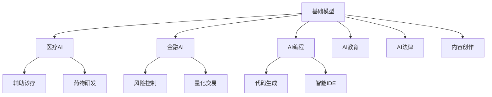

# AI 行业应用

## 概述

AI 技术在各行各业落地应用，本模块覆盖主要应用领域的最佳实践和解决方案。

## 目录

```
09-行业应用/
├── README.md
├── 01-医疗AI.md            # 影像诊断/药物发现/电子病历
├── 02-金融AI.md            # 风控/量化交易/智能客服/反欺诈
├── 03-AI编程.md            # 代码生成/AI IDE/代码审查
├── 04-AI教育.md            # 智能辅导/自适应学习/评估
├── 05-AI法律.md            # 合同审查/法律检索/合规
└── 06-AI内容创作.md        # 营销/文案/视频/设计
```



## 核心应用模式

| 行业 | 核心需求 | AI 方案 | 效果 |
|------|---------|---------|------|
| 医疗 | 辅助诊断 | 医学影像 AI | 准确率>90% |
| 金融 | 风险控制 | 反欺诈模型 | 降低 80% 欺诈 |
| 编程 | 提效 | AI 代码生成 | 提升 2-5× |
| 教育 | 个性化 | 自适应学习 | 效率提升 30% |
| 法律 | 文档处理 | RAG+合同审查 | 节省 80% 时间 |
| 内容 | 创意生成 | 文生图/视频 | 降低 90% 成本 |
