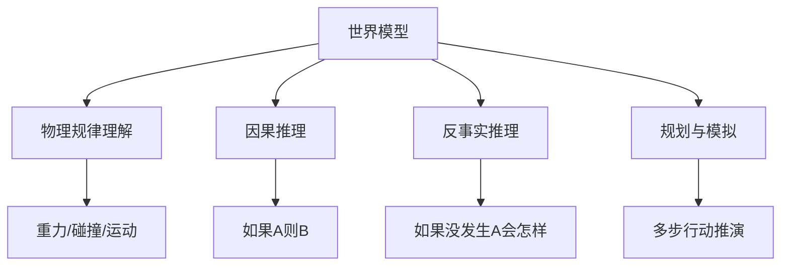

# 世界模型

## 1. 定义
世界模型是 AI 系统对世界运行方式的内部表征，能预测行动后果、模拟未来状态。

## 2. 关键能力



## 3. 数学模型

世界模型基于潜在状态空间建模。给定观测 $o_t$ 和动作 $a_t$，世界模型学习：

- **表征模型**：$z_t \sim p(z_t \mid o_t)$
- **转移模型**：$\hat{z}_{t+1} \sim p(z_{t+1} \mid z_t, a_t)$
- **奖励模型**：$\hat{r}_t \sim p(r_t \mid z_t)$
- **观测模型**：$\hat{o}_t \sim p(o_t \mid z_t)$

## 4. 代表工作

### Dreamer 系列（DeepMind）
- **DreamerV1**：从图像序列学习潜在世界模型
- **DreamerV2**：RSSM 循环状态空间模型
- **DreamerV3**：无需调参，Atari/DMC/Minecraft SOTA

```mermaid
graph TB
    subgraph Dreamer 架构
        A[观测 o_t] --> B[编码器]
        B --> C[潜在状态 z_t]
        C --> D[转移模型]
        D --> E[预测 z_{t+1}]
        E --> F[解码器]
        F --> G[重建 o_{t+1}]
        C --> H[奖励模型]
        D --> I[行动者]
        I --> J[动作 a_t]
        J --> D
    end
```

### DayDreamer
- 在真实机器人上实时训练世界模型
- 无需模拟器直接学习

### 物理世界模型
- **Physics Learning**：从未标记视频学习物理
- **3D 场景理解**：NeRF/Gaussian Splatting 重建
- **物体交互**：推/拉/堆叠预测

## 5. 代码示例

### RSSM 世界模型实现

```python
import torch
import torch.nn as nn

class RSSMCell(nn.Module):
    def __init__(self, state_dim=256, action_dim=32, hidden_dim=256):
        super().__init__()
        self.state_dim = state_dim
        self.rnn = nn.GRUCell(state_dim, hidden_dim)
        self.fc_state = nn.Linear(hidden_dim + action_dim, state_dim)
        self.fc_obs = nn.Linear(hidden_dim, state_dim)

    def forward(self, prev_state, action, obs_embed):
        rnn_input = self.fc_obs(obs_embed) + prev_state
        rnn_hidden = self.rnn(rnn_input, torch.zeros_like(rnn_input))
        action_embed = nn.Linear(action.shape[-1], self.state_dim).to(action.device)(action)
        next_state = self.fc_state(torch.cat([rnn_hidden, action_embed], dim=-1))
        return next_state

class DreamerWorldModel(nn.Module):
    def __init__(self, obs_dim=1024, action_dim=32, state_dim=256):
        super().__init__()
        self.encoder = nn.Linear(obs_dim, 512)
        self.rssm = RSSMCell(state_dim, action_dim)
        self.decoder = nn.Linear(state_dim, obs_dim)
        self.reward = nn.Linear(state_dim, 1)

    def forward(self, obs_seq, action_seq):
        batch, seq_len = obs_seq.shape[:2]
        state = torch.zeros(batch, self.rssm.state_dim).to(obs_seq.device)
        states, preds, rewards = [], [], []
        for t in range(seq_len):
            obs_embed = torch.relu(self.encoder(obs_seq[:, t]))
            state = self.rssm(state, action_seq[:, t], obs_embed)
            pred = self.decoder(state)
            r = self.reward(state)
            states.append(state)
            preds.append(pred)
            rewards.append(r)
        return torch.stack(states, dim=1), torch.stack(preds, dim=1), torch.stack(rewards, dim=1)
```

### DreamerV3 简化版训练循环

```python
import torch
import torch.nn.functional as F

def train_dreamer_v3(world_model, actor, critic, replay_buffer, batch_size=64, horizon=15):
    obs, actions, rewards, dones = replay_buffer.sample(batch_size)
    obs = torch.tensor(obs, dtype=torch.float32)
    actions = torch.tensor(actions, dtype=torch.float32)
    rewards = torch.tensor(rewards, dtype=torch.float32)

    states, preds, pred_rewards = world_model(obs, actions)
    recon_loss = F.mse_loss(preds, obs)
    reward_loss = F.mse_loss(pred_rewards.squeeze(-1), rewards)

    imag_states = states[:, -1].detach()
    imag_rewards = []
    for h in range(horizon):
        imag_action = actor(imag_states)
        imag_obs_embed = torch.zeros_like(world_model.encoder(obs[:, 0]))
        imag_states = world_model.rssm(imag_states, imag_action, imag_obs_embed)
        imag_rewards.append(world_model.reward(imag_states))
    imag_rewards = torch.stack(imag_rewards, dim=1)
    imag_values = critic(imag_states)
    actor_loss = -imag_rewards.mean() - imag_values.mean()
    world_loss = recon_loss + 0.1 * reward_loss

    return world_loss, actor_loss
```

### 物理模拟预测

```python
import numpy as np

class PhysicsPredictor:
    def __init__(self, dt=0.02, g=9.81):
        self.dt = dt
        self.g = g

    def simulate_trajectory(self, pos, vel, mass=1.0, force_fn=None, steps=100):
        trajectory = [pos.copy()]
        for _ in range(steps):
            if force_fn:
                f = force_fn(pos, vel)
            else:
                f = np.array([0.0, -self.g * mass])
            acc = f / mass
            vel = vel + acc * self.dt
            pos = pos + vel * self.dt
            trajectory.append(pos.copy())
        return np.array(trajectory)

    def collision_response(self, pos, vel, bounds):
        for i in range(len(pos)):
            if pos[i] < bounds[i][0]:
                pos[i] = bounds[i][0]
                vel[i] = -0.8 * vel[i]
            elif pos[i] > bounds[i][1]:
                pos[i] = bounds[i][1]
                vel[i] = -0.8 * vel[i]
        return pos, vel

    def n_body_gravity(self, positions, masses, steps=200):
        n = len(positions)
        traj = [positions.copy()]
        vel = np.zeros_like(positions)
        for _ in range(steps):
            acc = np.zeros_like(positions)
            for i in range(n):
                for j in range(n):
                    if i == j: continue
                    r = positions[j] - positions[i]
                    dist = np.linalg.norm(r) + 1e-6
                    acc[i] += self.g * masses[j] * r / (dist ** 3)
            vel = vel + acc * self.dt
            positions = positions + vel * self.dt
            traj.append(positions.copy())
        return np.array(traj)
```

### 逆动力学模型

```python
import torch
import torch.nn as nn

class InverseDynamicsModel(nn.Module):
    def __init__(self, obs_dim=64, action_dim=8, hidden_dim=256):
        super().__init__()
        self.net = nn.Sequential(
            nn.Linear(obs_dim * 2, hidden_dim),
            nn.ReLU(),
            nn.Linear(hidden_dim, hidden_dim),
            nn.ReLU(),
            nn.Linear(hidden_dim, action_dim),
            nn.Tanh()
        )

    def forward(self, obs_t, obs_t1):
        return self.net(torch.cat([obs_t, obs_t1], dim=-1))

    def collect_expert_data(self, env, policy, num_episodes=100):
        obs_sequences, action_sequences = [], []
        for _ in range(num_episodes):
            obs = env.reset()
            episode_obs, episode_actions = [], []
            done = False
            while not done:
                action = policy(obs)
                next_obs, _, done, _ = env.step(action)
                episode_obs.append(obs)
                episode_actions.append(action)
                obs = next_obs
            obs_sequences.append(np.array(episode_obs))
            action_sequences.append(np.array(episode_actions))
        return obs_sequences, action_sequences

    def train_from_demonstrations(self, obs_seq, act_seq, epochs=100, lr=1e-3):
        opt = torch.optim.Adam(self.parameters(), lr=lr)
        for epoch in range(epochs):
            total_loss = 0.0
            for obs, act in zip(obs_seq, act_seq):
                obs_t = torch.tensor(obs[:-1], dtype=torch.float32)
                obs_t1 = torch.tensor(obs[1:], dtype=torch.float32)
                act_pred = self(obs_t, obs_t1)
                act_target = torch.tensor(act, dtype=torch.float32)
                loss = nn.MSELoss()(act_pred, act_target)
                opt.zero_grad()
                loss.backward()
                opt.step()
                total_loss += loss.item()
            if epoch % 20 == 0:
                print(f"Epoch {epoch}, Loss: {total_loss:.4f}")
```

## 6. 模型对比

| 模型 | 状态表示 | 转移方式 | 训练数据 | 是否在线 |
|------|---------|---------|---------|---------|
| DreamerV1 | 确定+随机 | GRU+CNN | 图像序列 | 离线 |
| DreamerV2 | RSSM 离散 | 循环SSM | 图像序列 | 离线 |
| DreamerV3 | RSSM 连续 | 循环SSM | 图像+奖励 | 离线 |
| DayDreamer | RSSM 连续 | 循环SSM | 真实传感器 | 在线 |
| World Models | VAE+RNN | 混合密度网络 | 图像+动作 | 离线 |

## 7. 评估对比

| 基准 | DreamerV1 | DreamerV2 | DreamerV3 |
|------|-----------|-----------|-----------|
| Atari 人类归一化 | 121% | 208% | 318% |
| DMC (1000帧) | 48% | 66% | 89% |
| Minecraft | - | - | 钻石收集 |
| 参数数量 | 5M | 10M | 20M |
| 训练步数 | 5M | 10M | 50M |

## 8. 世界模型方法对比

| 方法 | 预测粒度 | 可执行规划 | 物理准确性 | 计算成本 |
|------|---------|-----------|-----------|---------|
| RSSM (Dreamer) | 潜在状态 | ✓ | 中 | 低 |
| 像素级预测 | 像素 | ✓ | 高 | 极高 |
| 物理引擎微分 | 物理参数 | ✓ | 极高 | 高 |
| NeRF/Gaussian | 3D场景 | ✗ | 高 | 高 |
| 视频生成模型 | 像素 | ✗ | 中 | 极高 |

## 9. 世界模型循环预测

```mermaid
graph LR
    subgraph 预测循环
        A[观测 o_t] --> B[编码 z_t]
        B --> C[动作 a_t]
        C --> D[转移模型]
        D --> E[预测 z_{t+1}]
        E --> F[解码 o_{t+1}]
        F --> G[对比真实 o_{t+1}]
        G --> H[更新模型]
    end
```

## 10. LLM 的世界模型

### 争论
- **LLM 有世界模型吗？**取决于定义
- **Othello-GPT**：发现内部棋盘结构
- **Transformer 学习概念结构**：层次因果结构

### 局限
- 缺乏物理直觉（如平衡/碰撞）
- 反事实推理弱
- 本质是文本分布，不是场景

## 11. 世界模型 vs 语言模型

| 维度 | 传统世界模型 | LLM 作为世界模型 |
|------|-------------|-----------------|
| 输入模态 | 图像/状态 | 文本 |
| 输出 | 状态预测 | Token预测 |
| 潜在表征 | 结构化潜空间 | 非结构化嵌入 |
| 物理一致性 | 高 | 低 |
| 泛化能力 | 窄（单任务） | 宽（任意任务） |
| 可解释性 | 中等 | 低 |

## 12. 案例：视频生成作为世界模型（World Model Rollout）

以像素级视频扩散世界模型为例，在潜在空间中"想象"未来帧并执行无模型规划（如 Dreamer 的想象 rollout）。下面给出一个极小可运行的世界模型 rollout 示例：基于学到的RSSM在想象轨迹上用随机 shooting 选最优动作序列。

```python
import torch
import torch.nn as nn
import torch.nn.functional as F

class TinyWorldModelRollout:
    def __init__(self, state_dim=64, action_dim=4, horizon=12):
        self.state_dim = state_dim
        self.action_dim = action_dim
        self.horizon = horizon
        # 简化的转移 / 奖励模型（实际应由 RSSM 学习）
        self.transition = nn.Linear(state_dim + action_dim, state_dim)
        self.reward = nn.Linear(state_dim, 1)

    def imagine(self, init_state, action_seq):
        # action_seq: [horizon, batch, action_dim]
        state = init_state
        total_reward = torch.zeros(state.shape[0], 1)
        for t in range(self.horizon):
            inp = torch.cat([state, action_seq[t]], dim=-1)
            state = self.transition(inp)
            total_reward += self.reward(state)
        return total_reward

    def plan(self, init_state, candidates=64):
        # 随机 shooting：采样多组动作序列，选累计奖励最高者
        best_reward, best_seq = None, None
        for _ in range(candidates):
            acts = torch.randn(self.horizon, init_state.shape[0], self.action_dim)
            r = self.imagine(init_state, acts)
            if best_reward is None or r.mean() > best_reward.mean():
                best_reward, best_seq = r, acts
        return best_seq, best_reward

# 用法示例
wm = TinyWorldModelRollout()
init = torch.randn(1, 64)
best_actions, best_r = wm.plan(init)
print("规划动作序列形状:", best_actions.shape, "预期累计奖励:", best_r.item())
```

### 案例：世界模型在控制任务中的想象规划流程

```mermaid
graph TD
    A[当前真实观测 o_t] --> B[编码为潜在状态 z_t]
    B --> C[行动者/规划器生成动作序列 a_{t..t+H}]
    C --> D[世界模型在想象中滚动]
    D --> E[预测未来状态 z_{t+1..t+H}]
    E --> F[累计想象奖励 R]
    F --> G{奖励最大化?}
    G -->|否| C
    G -->|是| H[执行第一步动作 a_t]
    H --> I[真实环境反馈 o_{t+1}]
    I --> B
```

## 13. 案例：Diffusion World Model 采样循环

将扩散模型用作像素级世界模型时，可用"预测-观测"闭环不断校正想象轨迹。下面是极简的扩散采样循环（带重规划）：

```python
import torch

def simple_diffusion_step(x, model, t, noise_scale=0.1):
    # 简化版本：模型预测去噪方向，逐步逼近干净帧
    pred = model(x, t)
    noise = torch.randn_like(x) * noise_scale if t > 0 else 0.0
    return x - 0.1 * pred + noise

def world_model_diffusion_rollout(model, cond_obs, action_cond, steps=50, horizon=8):
    frames = []
    x = torch.randn_like(cond_obs)  # 从噪声开始想象
    for h in range(horizon):
        for s in reversed(range(steps)):
            t = s / steps
            # 把动作条件拼接到输入（简化）
            x_in = torch.cat([x, action_cond[h]], dim=-1)
            x = simple_diffusion_step(x, model, t)
        frames.append(x)
    return frames

# 说明：真实模型需将文本/动作编码后做 cross-attention 条件控制
```

## 14. 2025-2026 趋势
- **视频生成作为世界模型**：Sora/Veo 生成能力暗示物理理解
- **3D 世界模型**：从 2D 视频学习 3D 物理
- **世界模型 + Agent**：先在"脑海"中规划再行动
- **抽象推理**：超越具体场景的因果模型
