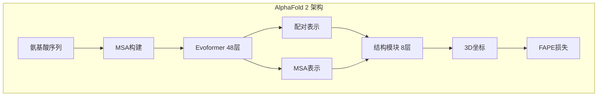
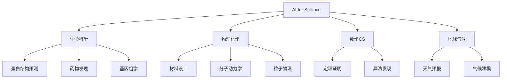

# AI for Science

## 1. 蛋白质与生物学

### AlphaFold 系列
| 版本 | 年份 | 创新 | 覆盖 |
|------|------|------|------|
| AlphaFold | 2018 | CNN 预测 | CASP13 冠军 |
| AlphaFold 2 | 2020 | Evoformer + 结构模块 | 原子级精度 |
| AlphaFold 3 | 2024 | 扩散模型统一预测蛋白+配体+DNA | 多分子复合物 |



### 生物学 AI
- **ESMFold**：语言模型学习蛋白折叠
- **Meta AI 蛋白组**：6 亿蛋白结构预测
- **分子生成**：扩散模型生成药物分子

### AI for Science 分类



## 2. 物理与化学

### 材料科学
- **GNOME**：图神经网络预测材料性质
- **MatterGen**：生成满足条件的无机材料
- **晶体结构预测**：扩散模型生成晶格

### 物理模拟（ML Interatomic Potentials）
- **MACE / NequIP**：等变神经网络势
- **ANI / SchNet**：分子能量预测
- **温度/压力→性质**：加速分子动力学

### 粒子物理
- **分类**：喷注标记
- **探测器模拟**：生成式 AI 加速模拟
- **异常检测**：新物理信号发现

## 3. 代码示例

### AlphaFold Evoformer 简化

```python
import torch
import torch.nn as nn
import torch.nn.functional as F

class EvoformerBlock(nn.Module):
    def __init__(self, msa_dim=64, pair_dim=64):
        super().__init__()
        self.msa_norm = nn.LayerNorm(msa_dim)
        self.pair_norm = nn.LayerNorm(pair_dim)
        self.msa_transition = nn.Sequential(
            nn.Linear(msa_dim, msa_dim * 4), nn.ReLU(), nn.Linear(msa_dim * 4, msa_dim))
        self.pair_transition = nn.Sequential(
            nn.Linear(pair_dim, pair_dim * 4), nn.ReLU(), nn.Linear(pair_dim * 4, pair_dim))
        self.msa_attn = nn.MultiheadAttention(msa_dim, num_heads=4, batch_first=True)
        self.pair_attn = nn.MultiheadAttention(pair_dim, num_heads=4, batch_first=True)
        self.outer_mean = nn.Linear(msa_dim, pair_dim)

    def forward(self, msa, pair):
        msa = msa + self.msa_attn(self.msa_norm(msa), self.msa_norm(msa), self.msa_norm(msa))[0]
        msa = msa + self.msa_transition(self.msa_norm(msa))
        pair_update = self.outer_mean(msa.mean(dim=1))
        pair = pair + pair_update
        pair = pair + self.pair_attn(self.pair_norm(pair), self.pair_norm(pair), self.pair_norm(pair))[0]
        pair = pair + self.pair_transition(self.pair_norm(pair))
        return msa, pair

class SimplifiedAlphaFold(nn.Module):
    def __init__(self, n_blocks=8, msa_dim=64, pair_dim=64, seq_len=256):
        super().__init__()
        self.blocks = nn.ModuleList([EvoformerBlock(msa_dim, pair_dim) for _ in range(n_blocks)])
        self.structure_module = nn.Sequential(
            nn.Linear(pair_dim, 128), nn.ReLU(), nn.Linear(128, 3))

    def forward(self, msa, pair):
        for block in self.blocks:
            msa, pair = block(msa, pair)
        coords = self.structure_module(pair)
        return coords
```

### 分子生成（扩散模型）

```python
import torch
import torch.nn as nn
import math

def sinusoidal_embedding(t, dim=256):
    half = dim // 2
    freqs = torch.exp(-math.log(10000.0) * torch.arange(0, half, dtype=torch.float32) / half)
    args = t[:, None] * freqs[None, :]
    return torch.cat([torch.sin(args), torch.cos(args)], dim=-1)

class MolecularDiffusion(nn.Module):
    def __init__(self, atom_dim=16, hidden_dim=512, n_layers=4):
        super().__init__()
        self.atom_embed = nn.Linear(atom_dim, hidden_dim)
        self.time_mlp = nn.Sequential(nn.Linear(256, hidden_dim), nn.SiLU(), nn.Linear(hidden_dim, hidden_dim))
        self.layers = nn.ModuleList()
        for _ in range(n_layers):
            self.layers.append(nn.Sequential(
                nn.Linear(hidden_dim, hidden_dim), nn.SiLU(), nn.Linear(hidden_dim, hidden_dim)))
        self.output = nn.Linear(hidden_dim, atom_dim)

    def forward(self, x, t, context=None):
        t_embed = self.time_mlp(sinusoidal_embedding(t))
        h = self.atom_embed(x) + t_embed
        for layer in self.layers:
            h = h + layer(h)
        return self.output(h)

    def sample(self, num_atoms=50, atom_dim=16, steps=100):
        x = torch.randn(1, num_atoms, atom_dim)
        for s in reversed(range(steps)):
            t = torch.full((1,), s / steps)
            pred = self.forward(x, t)
            noise = torch.randn_like(x) if s > 0 else 0
            x = x - 0.1 * pred + 0.1 * noise
        return x
```

### 蛋白质结构预测简化

```python
import torch
import torch.nn as nn

class ProteinStructurePredictor(nn.Module):
    def __init__(self, vocab_size=20, max_len=512, d_model=128):
        super().__init__()
        self.embedding = nn.Embedding(vocab_size, d_model)
        self.pos_encoding = nn.Parameter(torch.randn(1, max_len, d_model))
        encoder_layer = nn.TransformerEncoderLayer(d_model, nhead=8, dim_feedforward=512, batch_first=True)
        self.encoder = nn.TransformerEncoder(encoder_layer, num_layers=6)
        self.distance_head = nn.Linear(d_model, 64)
        self.angle_head = nn.Linear(d_model, 6)
        self.coord_head = nn.Sequential(nn.Linear(d_model, 128), nn.ReLU(), nn.Linear(128, 3))

    def forward(self, sequence):
        x = self.embedding(sequence) + self.pos_encoding[:, :sequence.shape[1]]
        x = self.encoder(x)
        coords = self.coord_head(x)
        distances = self.distance_head(x)
        angles = torch.tanh(self.angle_head(x))
        return coords, distances, angles

    def predict_plddt(self, sequence):
        with torch.no_grad():
            coords, distances, angles = self.forward(sequence)
            confidence = torch.sigmoid(torch.norm(distances, dim=-1).mean(-1))
        return coords, confidence
```

### 材料性质预测 GNN

```python
import torch
import torch.nn as nn
import torch.nn.functional as F

class CrystalGNN(nn.Module):
    def __init__(self, node_dim=16, edge_dim=8, hidden_dim=128):
        super().__init__()
        self.node_embed = nn.Linear(node_dim, hidden_dim)
        self.edge_mlp = nn.Sequential(nn.Linear(edge_dim + hidden_dim * 2, hidden_dim), nn.ReLU())
        self.message_layers = nn.ModuleList([
            nn.Sequential(nn.Linear(hidden_dim, hidden_dim), nn.ReLU()) for _ in range(3)])
        self.readout = nn.Sequential(
            nn.Linear(hidden_dim, hidden_dim), nn.ReLU(), nn.Linear(hidden_dim, 1))

    def forward(self, node_feats, edge_index, edge_feats, batch):
        h = self.node_embed(node_feats)
        for layer in self.message_layers:
            src, dst = edge_index[:, 0], edge_index[:, 1]
            edge_input = torch.cat([h[src], h[dst], edge_feats], dim=-1)
            messages = self.edge_mlp(edge_input)
            h_new = torch.zeros_like(h)
            idx = dst.unsqueeze(-1).expand(-1, h.shape[-1])
            h_new = h_new.scatter_add(0, idx, messages)
            h = F.relu(layer(h_new + h))
        h = F.relu(h)
        summed = torch.zeros(batch.max() + 1, h.shape[-1], device=h.device)
        summed = summed.scatter_add(0, batch.unsqueeze(-1).expand(-1, h.shape[-1]), h)
        return self.readout(summed).squeeze(-1)

    def predict_bandgap(self, crystal_graph):
        return self.forward(crystal_graph.node_feats, crystal_graph.edge_index,
                           crystal_graph.edge_feats, crystal_graph.batch)
```

## 4. 蛋白质预测方法对比

| 方法 | 输入 | 输出 | 精度 (LDDT) | 速度 |
|------|------|------|-------------|------|
| AlphaFold 2 | MSA+模板 | 3D坐标 | 92+ | 小时级 |
| AlphaFold 3 | 序列+配体 | 多分子结构 | 新高 | 小时级 |
| ESMFold | 单序列 | 3D坐标 | 85 | 分钟级 |
| OmegaFold | 单序列 | 3D坐标 | 87 | 分钟级 |
| RoseTTAFold | MSA | 3D坐标 | 88 | 小时级 |

## 5. 分子生成方法对比

| 方法 | 生成类型 | 化学有效性 | 多样性 | 目标优化 |
|------|---------|-----------|--------|---------|
| 扩散模型 | 连续坐标 | 高 | 高 | ✓ |
| GFlowNet | 离散图 | 高 | 极高 | ✓ |
| VAE | 隐空间 | 中 | 中 | ✓ |
| GAN | 图/分子 | 低 | 高 | ✗ |
| REINVENT (RL) | SMILES | 中 | 中 | ✓ |

## 6. 材料性质预测方法对比

| 材料属性 | GNN | 密度泛函 | 分子动力学 | AI加速比 |
|---------|-----|---------|-----------|---------|
| 带隙 | 0.05 eV | 0.01 eV | - | 10^6× |
| 弹性模量 | 5% 误差 | 2% 误差 | 3% 误差 | 10^5× |
| 形成能 | 0.03 eV/atom | 0.001 eV/atom | - | 10^6× |
| 热导率 | 15% 误差 | - | 5% 误差 | 10^4× |
| 磁性质 | 定性 | 定量 | 定量 | 10^5× |

## 7. 物理模拟方法对比

| 方法 | 适用尺度 | 精度 | 计算成本 | 数据需求 |
|------|---------|------|---------|---------|
| DFT | 原子(100) | 极高 | 极高 | 无 |
| 经典力场 | 分子(10^6) | 中 | 低 | 参数化 |
| ML势(MACE) | 原子(10^5) | 高 | 中 | 10^5帧 |
| 等变GNN | 原子(10^4) | 高 | 中 | 10^4帧 |
| 粗粒化ML | 分子(10^8) | 低-中 | 极低 | 10^6帧 |

## 8. 数学与计算机科学

- **AlphaTensor**：矩阵乘法新算法发现
- **AlphaGeometry**：IMO 几何问题求解
- **FunSearch**：LLM 搜索数学函数解
- **定理证明**：Lean 自动证明

## 9. 气候与环境

- **天气预报**：GraphCast / FourCastNet / Pangu 天气
- **气候模拟**：AI 加速气候模型
- **碳追踪**：遥感 + AI 碳排放监测

### AI 天气预测对比

| 模型 | 分辨率 | 提前期 | 精度(优于IFS) | 速度 |
|------|-------|--------|--------------|------|
| GraphCast | 0.25° | 10天 | 90% 指标 | 1分钟 |
| Pangu-Weather | 0.25° | 7天 | 较高 | 秒级 |
| FourCastNet | 0.25° | 7天 | 部分指标 | 秒级 |
| IFS (传统) | 0.1° | 15天 | 基线 | 数小时 |

## 10. 2025-2026 趋势
- **AI 科学家**：端到端自动化科研发现
- **机器人实验室**：AI 设计-执行-分析闭环
- **多尺度模拟**：量子→分子→连续统一
- **科学研究多模态基础模型**
