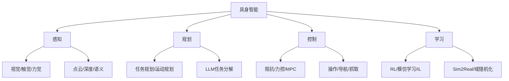
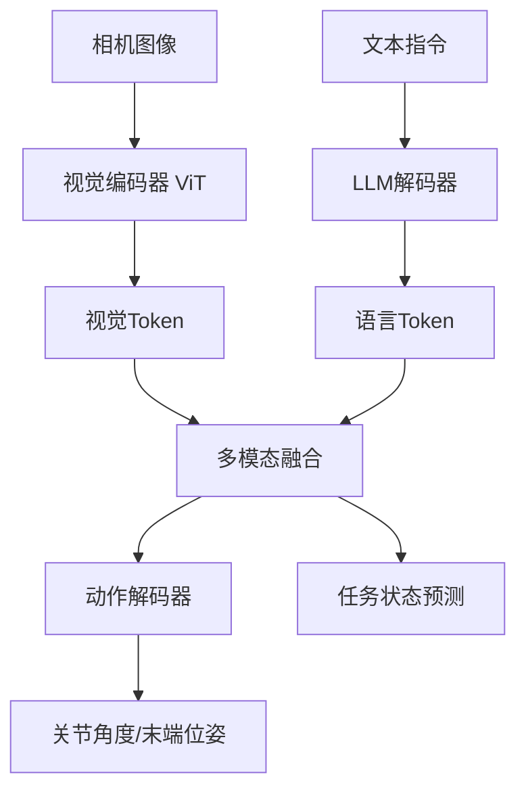

# 具身智能

## 1. 核心定义
具身智能（Embodied AI）是 AI 通过与物理世界交互来学习、推理和行动的能力，强调身体（传感器+执行器）与环境交互的重要性。

## 2. 关键技术栈



### VLA 架构



## 3. 核心方法

### 模仿学习
- **行为克隆**：直接学习专家轨迹
- **逆强化学习**：从专家行为推断奖励函数
- **扩散策略**：条件扩散模型生成动作序列

### 视觉-语言-动作模型 VLA
| 模型 | 开发方 | 特点 |
|------|--------|------|
| RT-2 | Google | 从互联网图文→机器人指令 |
| Octo | Berkeley | 开源机器人基础模型 |
| π0 | Physical AI | 流匹配动作生成 |
| RoboBrief | 多机构 | 语言条件动作生成 |

### 模拟到现实 Sim2Real
- **域随机化**：改变模拟参数匹配真实
- **虚实迁移**：策略从模拟→真实泛化

## 4. 代码示例

### 模仿学习策略 (行为克隆 BC)

```python
import torch
import torch.nn as nn
import numpy as np

class BehaviorCloningPolicy(nn.Module):
    def __init__(self, obs_dim=32, action_dim=8, hidden_dim=256):
        super().__init__()
        self.net = nn.Sequential(
            nn.Linear(obs_dim, hidden_dim),
            nn.ReLU(),
            nn.Linear(hidden_dim, hidden_dim),
            nn.ReLU(),
            nn.Linear(hidden_dim, action_dim)
        )

    def forward(self, obs):
        return self.net(obs)

class BCTrainer:
    def __init__(self, policy, lr=1e-3):
        self.policy = policy
        self.optimizer = torch.optim.Adam(policy.parameters(), lr=lr)

    def train_step(self, obs_batch, act_batch):
        obs = torch.tensor(obs_batch, dtype=torch.float32)
        acts = torch.tensor(act_batch, dtype=torch.float32)
        pred = self.policy(obs)
        loss = nn.MSELoss()(pred, acts)
        self.optimizer.zero_grad()
        loss.backward()
        self.optimizer.step()
        return loss.item()

    def collect_and_train(self, env, expert_policy, epochs=100, episodes_per_epoch=10):
        for epoch in range(epochs):
            all_obs, all_acts = [], []
            for _ in range(episodes_per_epoch):
                obs = env.reset()
                done = False
                while not done:
                    act = expert_policy(obs)
                    next_obs, _, done, _ = env.step(act)
                    all_obs.append(obs)
                    all_acts.append(act)
                    obs = next_obs
            idxs = np.random.permutation(len(all_obs))
            batch_size = 64
            for i in range(0, len(idxs), batch_size):
                batch_idx = idxs[i:i+batch_size]
                loss = self.train_step([all_obs[j] for j in batch_idx],
                                       [all_acts[j] for j in batch_idx])
            if epoch % 20 == 0:
                print(f"Epoch {epoch}, Loss: {loss:.6f}")
```

### RT-2 VLA 简化

```python
import torch
import torch.nn as nn

class PatchEmbed(nn.Module):
    def __init__(self, img_size=224, patch_size=16, in_chans=3, embed_dim=512):
        super().__init__()
        self.proj = nn.Conv2d(in_chans, embed_dim, kernel_size=patch_size, stride=patch_size)

    def forward(self, x):
        return self.proj(x).flatten(2).transpose(1, 2)

class SimplifiedRT2(nn.Module):
    def __init__(self, vocab_size=32000, image_embed_dim=512, text_embed_dim=512,
                 action_dim=7, num_layers=6):
        super().__init__()
        self.patch_embed = PatchEmbed(embed_dim=image_embed_dim)
        self.text_embed = nn.Embedding(vocab_size, text_embed_dim)
        self.image_proj = nn.Linear(image_embed_dim, text_embed_dim)

        decoder_layer = nn.TransformerDecoderLayer(
            d_model=text_embed_dim, nhead=8, batch_first=True)
        self.decoder = nn.TransformerDecoder(decoder_layer, num_layers=num_layers)

        self.action_head = nn.Sequential(
            nn.Linear(text_embed_dim, 256), nn.ReLU(), nn.Linear(256, action_dim))
        self.task_head = nn.Linear(text_embed_dim, vocab_size)

    def forward(self, image, text_tokens):
        img_feats = self.patch_embed(image)
        img_feats = self.image_proj(img_feats)
        txt_feats = self.text_embed(text_tokens)
        memory = torch.cat([img_feats, txt_feats], dim=1)
        tgt = txt_feats
        out = self.decoder(tgt, memory)
        action = torch.tanh(self.action_head(out[:, -1]))
        text_out = self.task_head(out)
        return action, text_out

    def predict_action(self, image, instruction_tokens):
        with torch.no_grad():
            action, _ = self.forward(image, instruction_tokens)
        return action.cpu().numpy()
```

### Sim2Real 域随机化

```python
import numpy as np
from dataclasses import dataclass

@dataclass
class DomainRandomizationConfig:
    friction_range = (0.2, 1.5)
    mass_range = (0.5, 2.0)
    gravity_range = (8.0, 11.0)
    joint_damping_range = (0.0, 0.1)
    control_latency_range = (0.0, 0.05)
    sensor_noise_std = 0.01
    light_position_range = ((0.5, 1.0), (0.5, 1.0), (0.5, 1.0))
    texture_randomization = True

def randomize_physics(env, config):
    params = {}
    params['friction'] = np.random.uniform(*config.friction_range)
    params['mass'] = np.random.uniform(*config.mass_range)
    params['gravity'] = np.random.uniform(*config.gravity_range)
    params['joint_damping'] = np.random.uniform(*config.joint_damping_range)
    params['control_latency'] = np.random.uniform(*config.control_latency_range)
    env.set_physics_parameters(**params)
    return params

def add_sensor_noise(observation, noise_std=0.01):
    return observation + np.random.normal(0, noise_std, size=observation.shape)

class Sim2RealTrainer:
    def __init__(self, sim_env, policy, config):
        self.sim_env = sim_env
        self.policy = policy
        self.config = config

    def train_episode(self):
        params = randomize_physics(self.sim_env, self.config)
        obs = self.sim_env.reset()
        done = False
        total_reward = 0
        while not done:
            noisy_obs = add_sensor_noise(obs, self.config.sensor_noise_std)
            action = self.policy(noisy_obs)
            obs, reward, done, _ = self.sim_env.step(action)
            total_reward += reward
        return total_reward, params

    def evaluate_on_real(self, real_env, num_episodes=10):
        rewards = []
        for _ in range(num_episodes):
            obs = real_env.reset()
            done = False
            ep_reward = 0
            while not done:
                action = self.policy(obs)
                obs, reward, done, _ = real_env.step(action)
                ep_reward += reward
            rewards.append(ep_reward)
        return np.mean(rewards), np.std(rewards)
```

### 视觉伺服

```python
import cv2
import numpy as np

class VisualServoController:
    def __init__(self, K, lambda_gain=0.5):
        self.K = K
        self.lambda_gain = lambda_gain
        self.K_inv = np.linalg.inv(K)

    def compute_interaction_matrix(self, u, v, Z):
        f_x, f_y = self.K[0, 0], self.K[1, 1]
        return np.array([
            [-f_x/Z, 0, u/Z, u*v/f_y, -(f_x**2+u**2)/f_y, v],
            [0, -f_y/Z, v/Z, (f_y**2+v**2)/f_x, -u*v/f_x, -u]
        ])

    def compute_control(self, current_pts, desired_pts, depth_Z):
        error = current_pts - desired_pts
        L = np.zeros((2 * len(current_pts), 6))
        for i, ((u, v), Z) in enumerate(zip(current_pts, depth_Z)):
            L[2*i:2*i+2] = self.compute_interaction_matrix(u, v, Z)
        L_pinv = np.linalg.pinv(L)
        camera_velocity = -self.lambda_gain * L_pinv @ error.flatten()
        return camera_velocity

    def track_feature(self, frame, prev_gray, prev_pts, lk_params):
        gray = cv2.cvtColor(frame, cv2.COLOR_BGR2GRAY)
        next_pts, status, _ = cv2.calcOpticalFlowPyrLK(prev_gray, gray, prev_pts, None, **lk_params)
        good_pts = next_pts[status == 1]
        prev_good = prev_pts[status == 1]
        return good_pts, prev_good, gray

    def ibvs_step(self, current_features, desired_features, depths):
        error = current_features - desired_features
        n = len(current_features)
        L = np.zeros((2*n, 6))
        for i in range(n):
            u, v = current_features[i]
            Z = depths[i] if depths[i] > 0 else 0.5
            L[2*i:2*i+2] = self.compute_interaction_matrix(u, v, Z)
        v_c = -self.lambda_gain * np.linalg.pinv(L) @ error.reshape(-1)
        return v_c
```

## 5. 模仿学习方法对比

| 方法 | 数据需求 | 动作质量 | 泛化能力 | 实现复杂度 |
|------|---------|---------|---------|-----------|
| 行为克隆 | 高(配对) | 中 | 低 | 低 |
| 逆强化学习 | 高(轨迹) | 高 | 中 | 高 |
| 扩散策略 | 中(条件) | 极高 | 高 | 中 |
| GAIL/对抗IL | 高(轨迹) | 高 | 中 | 高 |
| 半监督IL | 低(少量) | 中 | 中 | 中 |

## 6. VLA 模型对比

| 模型 | 参数 | 训练数据 | 动作空间 | 是否开源 | 成功率(基准) |
|------|------|---------|---------|---------|-------------|
| RT-2 | 55B | 130K 轨迹 | 离散+连续 | ✗ | 82% |
| RT-2-X | 55B | 多机构 | 离散+连续 | ✗ | 91% |
| Octo | 6.5B | 800K 轨迹 | 连续 | ✓ | 72% |
| π0 | 3B | 10M 轨迹 | 流匹配 | ✓ | 86% |
| RoboBrief | 7B | 指令数据 | 语言 | ✓ | 78% |

## 7. Sim2Real 域随机化策略对比

| 策略 | 随机化参数数 | 真实迁移成功率 | 训练稳定性 | 适用场景 |
|------|------------|---------------|-----------|---------|
| 基本域随机化 | 3-5 | 60% | 高 | 简单操作 |
| 自动域随机化 | 自适应 | 75% | 中 | 抓取任务 |
| 随机化+对抗 | 10+ | 85% | 中 | 灵巧操作 |
| 系统识别 | 参数化 | 70% | 高 | 精密控制 |
| 课程域随机化 | 渐进 | 80% | 高 | 导航/移动 |

## 8. 控制方法对比

| 方法 | 精度 | 计算延迟 | 鲁棒性 | 模型依赖 |
|------|------|---------|-------|---------|
| PD/阻抗控制 | 中 | <1ms | 高 | 无需 |
| MPC | 高 | 5-50ms | 中 | 需要 |
| 强化学习 | 中-高 | <1ms | 高 | 无需(训练) |
| 视觉伺服 | 高(2D) | 10-30ms | 中 | 部分 |
| 最优控制(iLQR) | 极高 | 10-100ms | 低 | 严格需要 |

## 9. 代表性机器人平台
- **灵巧手**：Shadow Hand / 因时机器人
- **双足机器人**：Atlas / Optimus / Figure
- **移动操作臂**：Stretch / TIAGo / Fetch
- **四足机器人**：Spot / ANYmal / Unitree

## 10. 2025-2026 趋势
- **人形机器人进入工厂**：Figure / Tesla Optimus 开始实际工作
- **大规模数据驱动**：RT-X 数据集跨机构协作
- **基础模型具身化**：LLM/VLM 直接控制机器人
- **灵巧操作**：柔性物体操作（衣物/食物）
- **端到端策略**：从相机像素到电机扭矩
