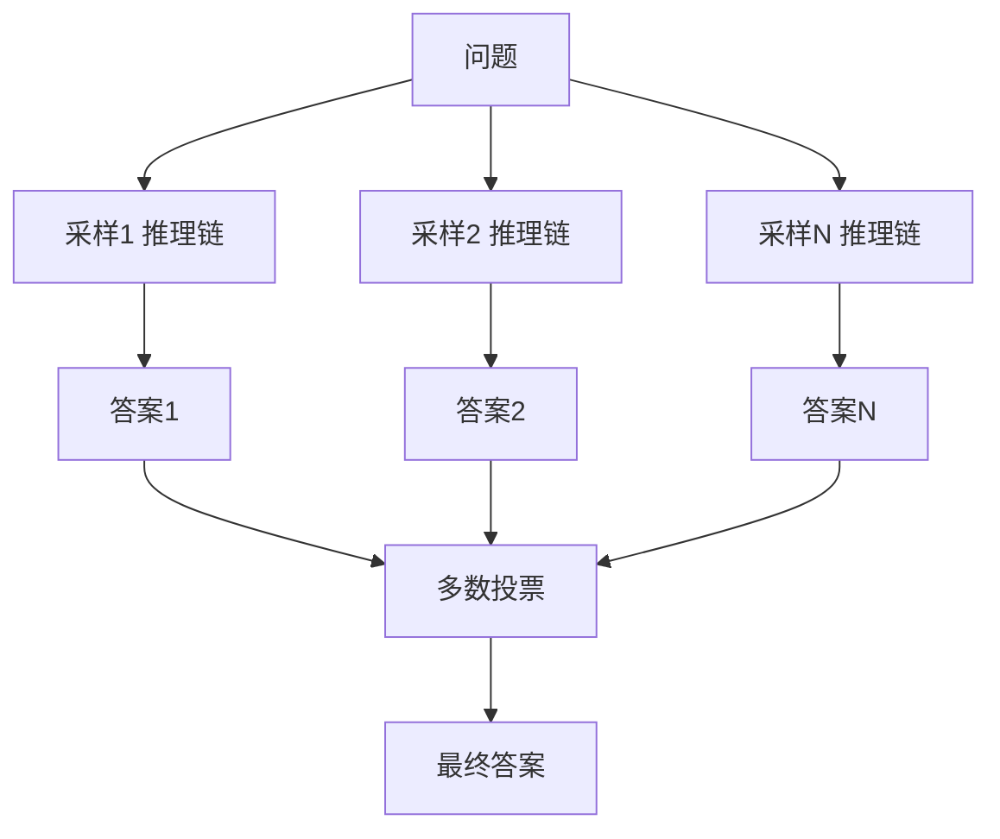
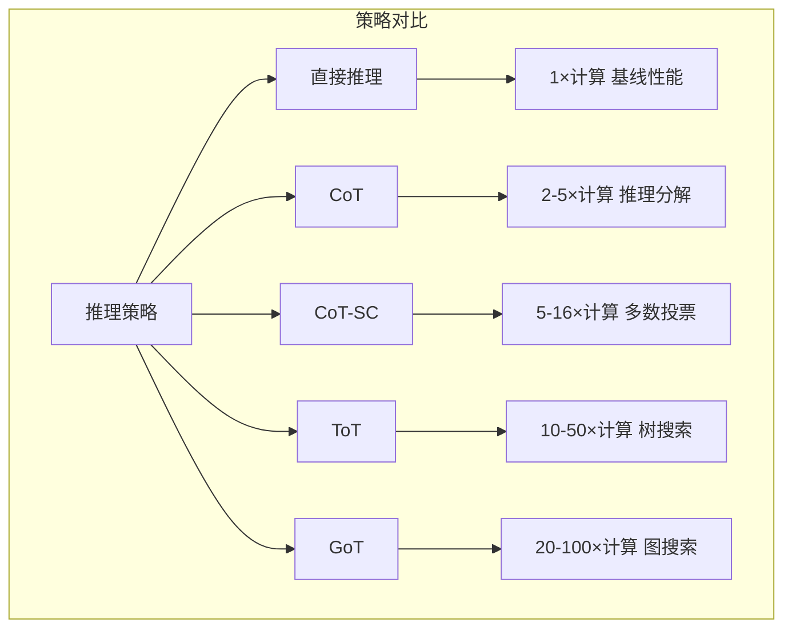
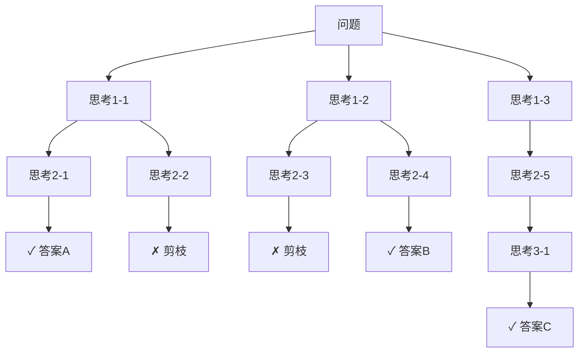

# 推理时扩展

## 1. 核心思想
- **训练时扩展**：更大模型 + 更多数据 → 更好性能
- **推理时扩展**：推理阶段更多计算 → 更好质量
- **两者互补**：推理时扩展让小模型达到大模型效果

## 2. 思维链 CoT

### 原理
- 引导模型生成中间推理步骤
- 将复杂问题分解为子步骤
- **Zero-shot CoT**："Let's think step by step"
- **Few-shot CoT**：示例 + 推理步骤

### 效果
- 数学推理（GSM8K）：25% → 75%
- 逻辑推理大幅提升

## 3. 自一致性 Self-Consistency

### 流程
1. 同问题多次采样推理链（temperature > 0）
2. 聚合答案（多数投票）
3. 正确率随采样次数增加



## 4. Tree-of-Thoughts / Graph-of-Thoughts

### Tree-of-Thoughts（ToT）
- 在推理树上搜索（BFS/DFS）
- 每步生成多个可能的推理分支
- 评估分支质量，剪枝低质量分支

### Graph-of-Thoughts（GoT）
- 更灵活的有向图推理结构
- 分支合并、回溯、并行推理

## 5. 推理时扩展策略对比



### ToT 搜索树



## 6. 代码示例

### Chain-of-Thought 实现

```python
import openai
import json
import re

class ChainOfThought:
    def __init__(self, model="gpt-4o-mini", api_key=None):
        self.model = model
        self.client = openai.OpenAI(api_key=api_key)

    def zero_shot_cot(self, question):
        response = self.client.chat.completions.create(
            model=self.model,
            messages=[
                {"role": "user", "content": f"{question}\nLet's think step by step."}
            ],
            temperature=0.0
        )
        full = response.choices[0].message.content
        answer = self.client.chat.completions.create(
            model=self.model,
            messages=[
                {"role": "user", "content": f"{question}"},
                {"role": "assistant", "content": full},
                {"role": "user", "content": "Therefore, the final answer is:"}
            ],
            temperature=0.0,
            max_tokens=50
        )
        return full, answer.choices[0].message.content

    def few_shot_cot(self, question, examples):
        messages = []
        for ex in examples:
            messages.append({"role": "user", "content": ex["question"]})
            messages.append({"role": "assistant", "content": f"{ex['reasoning']}\nTherefore, the answer is {ex['answer']}."})
        messages.append({"role": "user", "content": question})
        response = self.client.chat.completions.create(
            model=self.model, messages=messages, temperature=0.0)
        return response.choices[0].message.content

    def extract_final_answer(self, text):
        patterns = [
            r"Therefore, the answer is (.+?)[.\n]",
            r"The answer is (.+?)[.\n]",
            r"final answer is (.+?)[.\n]",
            r"answer: (.+?)[.\n]"
        ]
        for pattern in patterns:
            match = re.search(pattern, text, re.IGNORECASE)
            if match:
                return match.group(1).strip()
        return text.strip().split('\n')[-1]
```

### Self-Consistency 聚合

```python
import openai
from collections import Counter
import numpy as np

class SelfConsistency:
    def __init__(self, model="gpt-4o-mini", num_samples=8, temperature=0.7):
        self.model = model
        self.num_samples = num_samples
        self.temperature = temperature
        self.client = openai.OpenAI()

    def sample_reasoning_paths(self, question):
        paths = []
        for i in range(self.num_samples):
            response = self.client.chat.completions.create(
                model=self.model,
                messages=[
                    {"role": "user", "content": f"{question}\nLet's think step by step."}
                ],
                temperature=self.temperature,
                max_tokens=1024
            )
            paths.append(response.choices[0].message.content)
        return paths

    @staticmethod
    def extract_answer(text):
        text = text.strip()
        for line in reversed(text.split('\n')):
            line = line.strip().lower()
            if any(kw in line for kw in ['answer', 'therefore', 'result']):
                line = line.split(':')[-1].strip()
                return line
        return text.split('\n')[-1].strip()

    def aggregate_by_vote(self, paths):
        answers = [self.extract_answer(p) for p in paths]
        counter = Counter(answers)
        most_common = counter.most_common(1)[0][0]
        return most_common, dict(counter)

    def aggregate_by_weighted_vote(self, paths, confidence_scores=None):
        answers = [self.extract_answer(p) for p in paths]
        if confidence_scores:
            score_map = {}
            for ans, score in zip(answers, confidence_scores):
                score_map[ans] = score_map.get(ans, 0) + score
            final = max(score_map, key=score_map.get)
            return final, score_map
        return self.aggregate_by_vote(paths)

    def solve_with_confidence(self, question):
        paths = self.sample_reasoning_paths(question)
        final_answer, vote_dist = self.aggregate_by_vote(paths)
        confidence = vote_dist[final_answer] / sum(vote_dist.values())
        return final_answer, confidence, dict(vote_dist)
```

### Tree-of-Thoughts 搜索

```python
import numpy as np
from dataclasses import dataclass, field
from typing import List, Callable

@dataclass
class ToTNode:
    thought: str
    parent: 'ToTNode' = None
    children: List['ToTNode'] = field(default_factory=list)
    value: float = 0.0
    depth: int = 0

class TreeOfThoughts:
    def __init__(self, generate_fn: Callable, evaluate_fn: Callable,
                 max_branches=3, max_depth=5, beam_width=3):
        self.generate_fn = generate_fn
        self.evaluate_fn = evaluate_fn
        self.max_branches = max_branches
        self.max_depth = max_depth
        self.beam_width = beam_width

    def bfs_search(self, problem, eval_threshold=0.5):
        root = ToTNode(thought=problem)
        candidates = [root]
        solutions = []

        for depth in range(self.max_depth):
            next_candidates = []
            for node in candidates:
                thoughts = self.generate_fn(node.thought, self.max_branches)
                for thought_text in thoughts:
                    child = ToTNode(thought=thought_text, parent=node, depth=depth+1)
                    child.value = self.evaluate_fn(thought_text, problem)
                    node.children.append(child)
                    next_candidates.append(child)
                    if child.value > eval_threshold:
                        solutions.append(child)

            next_candidates.sort(key=lambda n: n.value, reverse=True)
            candidates = next_candidates[:self.beam_width]

            if not candidates:
                break
        return solutions, root

    def dfs_search(self, node, problem, depth=0, eval_threshold=0.5):
        if depth >= self.max_depth:
            return []
        node.value = self.evaluate_fn(node.thought, problem)
        solutions = []
        if node.value > eval_threshold:
            solutions.append(node)
        if depth < self.max_depth:
            thoughts = self.generate_fn(node.thought, self.max_branches)
            for thought_text in thoughts:
                child = ToTNode(thought=thought_text, parent=node, depth=depth+1)
                node.children.append(child)
                sub_solutions = self.dfs_search(child, problem, depth+1, eval_threshold)
                solutions.extend(sub_solutions)
        return solutions

    def backtrack_solution(self, solution_node):
        path = []
        node = solution_node
        while node:
            path.append(node.thought)
            node = node.parent
        return list(reversed(path))
```

### 推理预算控制

```python
from enum import Enum

class ReasoningLevel(Enum):
    FAST = "fast"        # 简单问题
    NORMAL = "normal"    # 中等难度
    DEEP = "deep"        # 复杂推理
    MAX = "max"          # 极限推理

class BudgetConfig:
    def __init__(self):
        self.budgets = {
            ReasoningLevel.FAST:  {"max_tokens": 256, "num_samples": 1,  "temperature": 0.0, "max_depth": 1},
            ReasoningLevel.NORMAL: {"max_tokens": 1024, "num_samples": 4, "temperature": 0.3, "max_depth": 3},
            ReasoningLevel.DEEP:   {"max_tokens": 4096, "num_samples": 8, "temperature": 0.7, "max_depth": 5},
            ReasoningLevel.MAX:    {"max_tokens": 16384, "num_samples": 16, "temperature": 0.9, "max_depth": 8},
        }

    def get_budget(self, level):
        return self.budgets[level]

class AdaptiveReasoner:
    def __init__(self, model="gpt-4o-mini"):
        self.model = model
        self.budget_config = BudgetConfig()

    def estimate_difficulty(self, question):
        keywords = {
            "high": ["proof", "theorem", "derivation", "complex", "multi-step", "optimization"],
            "medium": ["explain", "compare", "analyze", "calculate", "solve", "why"],
            "low": ["what", "define", "who", "when", "list", "name"]
        }
        q_lower = question.lower()
        for kw in keywords["high"]:
            if kw in q_lower: return ReasoningLevel.DEEP
        for kw in keywords["medium"]:
            if kw in q_lower: return ReasoningLevel.NORMAL
        return ReasoningLevel.FAST

    def allocate_compute(self, question, user_level=None):
        if user_level:
            level = user_level
        else:
            level = self.estimate_difficulty(question)
        budget = self.budget_config.get_budget(level)
        return level, budget

    def solve(self, question, level=None):
        level, budget = self.allocate_compute(question, level)
        print(f"Reasoning level: {level.value}, budget: {budget['max_tokens']} tokens")
        responses = []
        for i in range(budget["num_samples"]):
            responses.append(f"Sample {i+1} for: {question}")
        return responses, level

class BudgetController:
    def __init__(self, total_budget=100000):
        self.total_budget = total_budget
        self.used = 0

    def can_allocate(self, tokens_needed):
        return self.used + tokens_needed <= self.total_budget

    def allocate(self, tokens):
        if self.can_allocate(tokens):
            self.used += tokens
            return True
        return False

    def reset(self):
        self.used = 0

    def optimize_budget(self, questions, difficulty_fn):
        allocations = []
        for q in questions:
            diff = difficulty_fn(q)
            if diff == "hard":
                need = 4000
            elif diff == "medium":
                need = 1000
            else:
                need = 250
            if self.can_allocate(need):
                self.allocate(need)
                allocations.append((q, need, "allocated"))
            else:
                allocations.append((q, need, "insufficient budget"))
        return allocations
```

## 7. 推理方法对比

| 方法 | 额外计算 | 性能提升 (GSM8K) | 适用场景 | 复杂度 |
|------|---------|-----------------|---------|-------|
| 直接回答 | 1× | 基线 (30%) | 简单问答 | O(1) |
| Zero-shot CoT | 2-3× | 60-75% | 通用推理 | O(L) |
| Few-shot CoT | 2-3× | 75-85% | 领域推理 | O(L) |
| CoT-SC (k=8) | 8-16× | 80-88% | 数学/逻辑 | O(kL) |
| CoT-SC (k=40) | 40-80× | 83-90% | 高精度需求 | O(kL) |
| ToT (BFS) | 10-50× | 85-92% | 规划/搜索 | O(b^d) |
| GoT | 20-100× | 88-95% | 复杂推理 | O(v+e) |

## 8. 扩展策略对比

| 策略 | 搜索空间 | 多样性 | 答案质量 | 计算可控 |
|------|---------|-------|---------|---------|
| 温度采样 | 连续 | 高 | 中 | 直接 |
| Top-k 采样 | 离散 | 中 | 中 | 直接 |
| Beam Search | 路径 | 低 | 高 | 间接 |
| 多数投票 | 答案 | 高 | 高 | 直接 |
| 验证器重排 | 候选 | 中 | 极高 | 间接 |

## 9. o1/o3 vs DeepSeek R1 对比

| 特性 | o1/o3 | DeepSeek R1 |
|------|-------|-------------|
| CoT 可见性 | 隐式（内部） | 显式（可见） |
| 训练方法 | RL + 推理奖励 | GRPO + 自我验证 |
| 开源 | ✗ | ✓ |
| 推理链长度 | 数万token | 数千token |
| 编程能力 | 强（Codeforces 高Elo） | 强 |
| 数学能力 | AIME 高分 | AIME 高分 |
| 架构 | 专有 | MoE |

## 10. 推理时计算与性能关系

| 方法 | 额外计算 | 性能提升 |
|------|---------|---------|
| 直接回答 | 1× | 基线 |
| CoT | 2-5× | 显著 |
| 自一致性 | 5-16× | +5-10% |
| ToT | 10-50× | +10-20% |
| GoT | 20-100× | +15-25% |
| o1 推理 | 20-200× | +20-40% |

## 11. 2025-2026 趋势
- **自适应推理**：按问题难度分配计算
- **长推理链**：千步级别的推理
- **验证者 + 搜索**：LLM 生成 + 验证者评估 + 搜索最优
- **推理时硬件的设计**：芯片支持推理计算扩展
