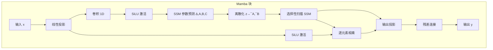

# 状态空间模型 SSM

## 1. 背景
- **Transformer 问题**：O(n²) 计算复杂度，长序列计算量过大
- **SSM 方案**：通过状态空间表示达到 O(n) 复杂度

## 2. S4（Structured State Space Sequence Model）

### 核心
- 将序列建模视为连续系统的离散化
- **状态方程**：h'(t) = Ah(t) + Bx(t)
- **输出方程**：y(t) = Ch(t) + Dx(t)
- **HiPPO 初始化**：记忆近期的理论最优矩阵

### 优势
- **线性复杂度 O(n)**
- **长程依赖**优于 Transformer
- **并行训练**（卷积模式），自回归推理（循环模式）

## 3. Mamba（2023-2024）

### Mamba 1
- **选择机制**：参数（A/B/C）随输入变化 → 类似注意力
- **硬件感知扫描**：分段扫描 + 并行关联扫描
- **无注意力**：完全替代 Transformer

### Mamba 2
- **SSD（State Space Dual）**：SSM + 结构化矩阵
- **更快的训练速度**
- **与注意力关系**：SSM 是注意力的特殊形式

### Mamba 架构图



### SSM vs Transformer 对比图

```mermaid
graph LR
    subgraph SSM O(n)
        A1[x₁] --> B1[h₁]
        A2[x₂] --> B2[h₂]
        A3[x₃] --> B3[h₃]
        A4[x₄] --> B4[h₄]
        B1 --> C1[y₁]
        B2 --> C2[y₂]
        B3 --> C3[y₃]
        B4 --> C4[y₄]
        B1 --> B2
        B2 --> B3
        B3 --> B4
    end
    subgraph Transformer O(n²)
        D1[x₁] -.-> E1[attn]
        D1[x₂] -.-> E1
        D2[x₁] -.-> E2[attn]
        D2[x₂] -.-> E2
        D3[x₁] -.-> E3[attn]
        D3[x₂] -.-> E3
    end
```

## 4. 代码示例

### S4 离散化实现

```python
import torch
import torch.nn as nn
import torch.nn.functional as F
import math

def discretize(A, B, delta):
    I = torch.eye(A.shape[-1], device=A.device)
    dA = torch.linalg.solve(I - delta.unsqueeze(-1) * A / 2,
                             I + delta.unsqueeze(-1) * A / 2)
    dB = dA @ (delta.unsqueeze(-1) * B)
    return dA, dB

class S4Layer(nn.Module):
    def __init__(self, d_model=128, d_state=64, dt_min=0.001, dt_max=0.1):
        super().__init__()
        self.d_model = d_model
        self.d_state = d_state
        Lambda = torch.exp(torch.complex(torch.zeros(d_state), torch.randn(d_state)))
        self.A_log = nn.Parameter(torch.log(Lambda.real + 1e-4))
        self.B = nn.Parameter(torch.randn(d_model, d_state))
        self.C = nn.Parameter(torch.randn(d_state, d_model))
        self.D = nn.Parameter(torch.randn(d_model))
        self.log_dt = nn.Parameter(torch.log(torch.rand(d_model) * (dt_max - dt_min) + dt_min))

    def forward(self, u):
        batch, length, d_model = u.shape
        delta = torch.exp(self.log_dt)
        Lambda = torch.exp(torch.complex(self.A_log, torch.zeros_like(self.A_log)))
        A = torch.diag(Lambda)
        _, dB = discretize(A, self.B, delta)
        A_re = A.real
        B_re = dB.real
        C = self.C
        hs = [torch.zeros(batch, self.d_state, device=u.device)]
        for t in range(length):
            h = A_re @ hs[-1] + B_re @ u[:, t].unsqueeze(-1)
            hs.append(h.squeeze(-1))
        hs = torch.stack(hs[1:], dim=1)
        y = (hs @ C) + self.D * u
        return y

class S4(nn.Module):
    def __init__(self, d_model=128, d_state=64, layers=4):
        super().__init__()
        self.layers = nn.ModuleList([S4Layer(d_model, d_state) for _ in range(layers)])
        self.norm = nn.LayerNorm(d_model)

    def forward(self, x):
        for layer in self.layers:
            x = x + layer(self.norm(x))
        return x
```

### Mamba 简化实现

```python
import torch
import torch.nn as nn
import torch.nn.functional as F

class SelectiveSSM(nn.Module):
    def __init__(self, d_model=128, d_state=16, d_conv=4):
        super().__init__()
        self.d_model = d_model
        self.d_state = d_state
        self.d_conv = d_conv

        self.in_proj = nn.Linear(d_model, d_model * 2)
        self.conv1d = nn.Conv1d(d_model, d_model, kernel_size=d_conv, padding=d_conv-1, groups=d_model)
        self.x_proj = nn.Linear(d_model, d_state * 3)
        self.dt_proj = nn.Linear(d_model, d_model)

        A = torch.ones(d_model, d_state)
        self.A_log = nn.Parameter(torch.log(A))
        self.D = nn.Parameter(torch.ones(d_model))

        self.out_proj = nn.Linear(d_model, d_model)

    def forward(self, x):
        batch, seq_len, _ = x.shape
        x_and_res = self.in_proj(x)
        x, res = x_and_res.chunk(2, dim=-1)

        x_conv = self.conv1d(x.transpose(1, 2))[..., :seq_len].transpose(1, 2)
        x = F.silu(x_conv)

        delta = F.softplus(self.dt_proj(x))
        A = -torch.exp(self.A_log)
        dt = delta.unsqueeze(-1)
        dA = torch.exp(dt * A)
        dB = dt * self.x_proj(x).view(batch, seq_len, self.d_model, -1).transpose(-2, -1)

        h = torch.zeros(batch, self.d_model, self.d_state, device=x.device)
        ys = []
        for t in range(seq_len):
            h = dA[:, t] * h + dB[:, t]
            y = (h @ self.x_proj(x[:, t]).view(batch, -1, 1)).squeeze(-1)
            ys.append(y)
        y = torch.stack(ys, dim=1)
        y = y + self.D * x
        y = y * F.silu(res)
        return self.out_proj(y)

class MambaBlock(nn.Module):
    def __init__(self, d_model=128, d_state=16):
        super().__init__()
        self.norm = nn.LayerNorm(d_model)
        self.ssm = SelectiveSSM(d_model, d_state)

    def forward(self, x):
        return x + self.ssm(self.norm(x))

class SimplifiedMamba(nn.Module):
    def __init__(self, d_model=128, d_state=16, n_layers=6, vocab_size=32000):
        super().__init__()
        self.embed = nn.Embedding(vocab_size, d_model)
        self.layers = nn.ModuleList([MambaBlock(d_model, d_state) for _ in range(n_layers)])
        self.norm = nn.LayerNorm(d_model)
        self.head = nn.Linear(d_model, vocab_size)

    def forward(self, input_ids):
        x = self.embed(input_ids)
        for layer in self.layers:
            x = layer(x)
        x = self.norm(x)
        return self.head(x)

    def generate(self, input_ids, max_new_tokens=100):
        for _ in range(max_new_tokens):
            logits = self.forward(input_ids)
            next_token = logits[:, -1].argmax(dim=-1, keepdim=True)
            input_ids = torch.cat([input_ids, next_token], dim=-1)
        return input_ids
```

### 选择性 SSM 与注意力对比

```python
import torch
import torch.nn as nn
import torch.nn.functional as F
import time
import math

def attention_complexity(n, d):
    return n * n * d

def ssm_complexity(n, d, s):
    return n * d * s

def benchmark_efficiency(max_len=8192, d_model=512, d_state=32):
    lengths = [128, 256, 512, 1024, 2048, 4096, 8192]
    results = []
    for L in lengths:
        x = torch.randn(1, L, d_model)

        attn_start = time.time()
        q = torch.randn(1, L, d_model)
        k = torch.randn(1, L, d_model)
        v = torch.randn(1, L, d_model)
        score = torch.bmm(q, k.transpose(1, 2)) / math.sqrt(d_model)
        attn_out = torch.bmm(F.softmax(score, dim=-1), v)
        attn_time = time.time() - attn_start

        ssm_start = time.time()
        A = torch.randn(d_model, d_state)
        B = torch.randn(d_model, d_state)
        h = torch.zeros(1, d_model, d_state)
        ssm_outs = []
        for t in range(L):
            dt = torch.sigmoid(torch.randn(1, d_model, 1))
            dA = torch.exp(dt * A)
            dB = dt * B
            h = dA * h + dB * x[:, t:t+1].unsqueeze(-1)
            y = (h @ torch.randn(d_state, d_model).unsqueeze(0))
            ssm_outs.append(y)
        ssm_time = time.time() - ssm_start

        results.append({
            "length": L,
            "attention_time_ms": attn_time * 1000,
            "ssm_time_ms": ssm_time * 1000,
            "attention_flops": attention_complexity(L, d_model),
            "ssm_flops": ssm_complexity(L, d_model, d_state),
            "speedup": attn_time / ssm_time if ssm_time > 0 else float('inf')
        })
    return results

def compute_receptive_field(seq_len, kernel_size=4, dilation=1):
    r = kernel_size + (kernel_size - 1) * (dilation - 1)
    return min(seq_len, r)

def compare_memory_usage(seq_len=8192, d_model=1024, n_heads=16, d_state=32):
    kv_cache_size = 2 * n_heads * seq_len * (d_model // n_heads) * 2
    ssm_state_size = d_model * d_state * 2
    ratio = kv_cache_size / ssm_state_size
    return {
        "kv_cache_bytes": kv_cache_size,
        "ssm_state_bytes": ssm_state_size,
        "ratio": ratio,
        "kv_cache_gb": kv_cache_size / (1024**3),
        "ssm_state_mb": ssm_state_size / (1024**2)
    }
```

### 完整 SSM 推理管线

```python
import torch
import torch.nn as nn

class SSMInferenceEngine:
    def __init__(self, model, d_state=16):
        self.model = model
        self.d_state = d_state
        self.states = {}

    def reset_state(self):
        self.states = {}

    def step(self, x, layer_idx=0):
        d_model = x.shape[-1]
        if layer_idx not in self.states:
            self.states[layer_idx] = torch.zeros(*x.shape[:-1], d_model, self.d_state, device=x.device)
        h = self.states[layer_idx]
        A = -torch.exp(self.model.layers[layer_idx].ssm.A_log)
        B = self.model.layers[layer_idx].ssm.x_proj(x).view(*x.shape[:-1], -1, 1)
        dt = F.softplus(self.model.layers[layer_idx].ssm.dt_proj(x))
        dA = torch.exp(dt.unsqueeze(-1) * A)
        dB = dt.unsqueeze(-1) * B
        h = dA * h + dB
        self.states[layer_idx] = h
        y = (h @ torch.randn(d_model, self.d_state, device=x.device).T).squeeze(-1)
        return y

    def generate_autoregressive(self, input_ids, max_steps=100):
        self.reset_state()
        outputs = input_ids.clone()
        for _ in range(max_steps):
            x = self.model.embed(outputs[:, -1:])
            for i in range(len(self.model.layers)):
                x = self.step(x, i)
            logits = self.model.head(x)
            next_token = logits.argmax(-1)
            outputs = torch.cat([outputs, next_token], dim=-1)
        return outputs

    def parallel_inference(self, prompt, seq_len=2048):
        _ = self.model(prompt)
        outputs = prompt.clone()
        for _ in range(seq_len - prompt.shape[1]):
            x = outputs[:, -1:]
            for i in range(len(self.model.layers)):
                x = self.step(x, i)
            logits = self.model.head(self.model.norm(x))
            next_token = logits.argmax(-1)
            outputs = torch.cat([outputs, next_token], dim=-1)
        return outputs
```

## 5. 混合架构

### Jamba（AI21）
- Transformer 层 + Mamba 层交错
- MoE 进一步扩大参数量

### Griffin / HawkEye
- **Google**：多查询注意力 + 门控线性递归
- **Hawk**：纯 RNN 型
- **Griffin**：RNN + 注意力混合

### Samba / Mamba-Transformer
- 每层：注意力 + Mamba 并行或串行
- 兼顾局部和全局建模

### 混合架构配置对比

| 架构 | 注意力层占比 | SSM层占比 | MoE | 总参数 | 有效参数 |
|------|------------|----------|-----|-------|---------|
| Jamba | 50% | 50% | ✓ | 52B | 12B |
| Griffin | 25% | 75% | ✗ | 14B | 14B |
| Hawk | 0% | 100% | ✗ | 7B | 7B |
| Samba | 50% | 50% | ✗ | 3.8B | 3.8B |
| Mamba-2-Hybrid | 33% | 67% | ✗ | 2.8B | 2.8B |

## 6. SSM 家族对比

| 模型 | 年份 | 核心创新 | O(n) | 选择机制 | 硬件优化 | 开源 |
|------|------|---------|------|---------|---------|------|
| S4 | 2021 | HiPPO初始化+结构化矩阵 | ✓ | ✗ | ✗ | ✓ |
| S5 | 2022 | 多输入多输出SSM | ✓ | ✗ | ✗ | ✓ |
| DSS | 2022 | 对角SSM | ✓ | ✗ | ✗ | ✓ |
| Mamba 1 | 2023 | 选择机制+硬件扫描 | ✓ | ✓ | ✓ | ✓ |
| Mamba 2 | 2024 | SSD+张量并行 | ✓ | ✓ | ✓ | ✓ |
| xLSTM | 2024 | LSTM现代化+矩阵记忆 | ✓ | ✓ | ✗ | ✓ |
| RWKV-6 | 2024 | 线性注意力+RNN | ✓ | ✓ | ✗ | ✓ |

## 7. 对比分析

| 特性 | Transformer | Mamba | 混合 |
|------|------------|-------|------|
| 计算复杂度 | O(n²) | O(n) | O(n²)~O(n) |
| 长序列质量 | 差（超上下文） | 好 | 好 |
| 训练速度 | 快（短序列） | 快 | 中等 |
| 推理速度 | 慢（大KV缓存） | 快 | 中等 |
| 硬件利用率 | 好（GPU矩阵） | 中等 | 好 |
| KV缓存 | O(n·d) | O(d·s) | 混合 |
| 上下文窗口 | 固定 | 无限 | 可扩展 |
| 训练稳定性 | 好 | 需谨慎 | 好 |

## 8. Mamba 效果

| 任务 | Mamba vs Transformer |
|------|---------------------|
| 语言建模 | 相当或更好 |
| 长序列（16K+） | 显著优于 |
| 推理速度 | 3-5× 更快 |
| 显存占用 | 一半以下 |
| 训练效率 | 2× 更快 |
| 外推能力 | 显著更好 |

## 9. 2025-2026 趋势
- **SSM 成为 Transformer 主流替代**
- **混合架构成新标准**：DeepSeek, GPT 等下一代模型部分采用 SSM
- **视觉 SSM**：VMamba / Vision Mamba
- **多模态 SSM**
