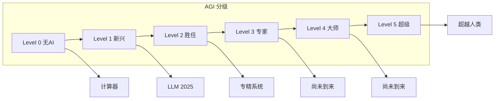
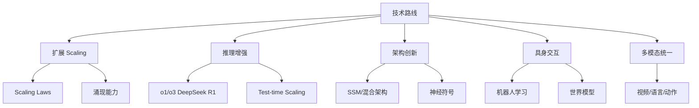
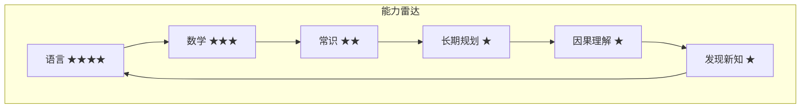
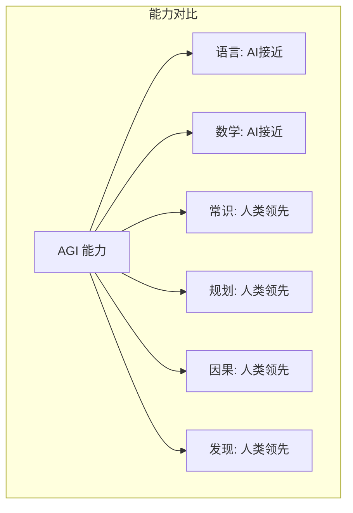

# AGI 探索

## 1. AGI 定义与标准

### 什么是 AGI
AGI（通用人工智能）是指能够完成人类任何智力任务的 AI 系统。

### 其他定义
| 组织 | 定义 |
|------|------|
| OpenAI | 在大多数有经济价值的工作上超越人类 |
| DeepMind | 通过"图灵测试+"广泛认知任务 |
| Morris 等（2023） | 不完全、无评级、渐进的定义框架 |

### AGI 分级（DeepMind 2023）
| 级别 | 名称 | 描述 | 示例 |
|------|------|------|------|
| Level 0 | 无 AI | - | 计算器 |
| Level 1 | 新兴 AGI | 相当或优于未受过训练的成人 | 当前 LLM |
| Level 2 | 胜任 AGI | Top 50% 专业人士水平 | 当前特化系统 |
| Level 3 | 专家 AGI | Top 1% 水平 | 尚未出现 |
| Level 4 | 大师 AGI | 超越所有人 | 尚未出现 |
| Level 5 | 超级 AGI | 超越全体人类总和 | 尚未出现 |

### AGI 分级图



## 2. 通向 AGI 的路线



### 当前 vs 人类能力对比



## 3. 代码示例

### 涌现能力测量

```python
import numpy as np
from scipy import stats
from collections import defaultdict

class EmergentAbilityMeasure:
    def __init__(self):
        self.results = defaultdict(list)

    def evaluate_across_scales(self, model_sizes, task_fn, metric_fn, n_runs=3):
        measurements = {}
        for size in model_sizes:
            scores = []
            for _ in range(n_runs):
                output = task_fn(size)
                score = metric_fn(output)
                scores.append(score)
            measurements[size] = {"mean": np.mean(scores), "std": np.std(scores)}
        return measurements

    def detect_emergence(self, model_sizes, scores, window=3):
        linear_fit = np.polyfit(model_sizes, scores, 1)
        linear_pred = np.polyval(linear_fit, model_sizes)
        residuals = np.array(scores) - linear_pred
        threshold = 2.0 * np.std(residuals)
        emergence_points = []
        for i, (size, res) in enumerate(zip(model_sizes, residuals)):
            if abs(res) > threshold:
                emergence_points.append((size, res))
        return emergence_points, {"linear_slope": linear_fit[0], "residual_std": np.std(residuals)}

    def phase_transition_test(self, params, scores, n_bootstrap=1000):
        param_arr = np.array(params)
        score_arr = np.array(scores)
        best_r2 = 0
        best_split = None
        for i in range(1, len(params) - 1):
            left = score_arr[:i]
            right = score_arr[i:]
            if len(left) < 3 or len(right) < 3:
                continue
            total_var = np.var(score_arr)
            within_var = (len(left) * np.var(left) + len(right) * np.var(right)) / len(score_arr)
            r2 = 1 - within_var / total_var
            if r2 > best_r2:
                best_r2 = r2
                best_split = param_arr[i]

        bootstrap_r2s = []
        for _ in range(n_bootstrap):
            boot_scores = np.random.choice(score_arr, len(score_arr))
            boot_best = 0
            for i in range(1, len(params) - 1):
                l = boot_scores[:i]
                r = boot_scores[i:]
                if len(l) < 3 or len(r) < 3: continue
                tv = np.var(boot_scores)
                wv = (len(l) * np.var(l) + len(r) * np.var(r)) / len(boot_scores)
                rs = 1 - wv / tv
                if rs > boot_best: boot_best = rs
            bootstrap_r2s.append(boot_best)

        p_value = np.mean(np.array(bootstrap_r2s) >= best_r2)
        return {
            "best_split": best_split,
            "r_squared": best_r2,
            "p_value": p_value,
            "significant": p_value < 0.05
        }

    def calculate_task_emergence(self, task_scores, baseline=0.0, emergence_threshold=0.5):
        suddenness = []
        for i in range(1, len(task_scores)):
            delta = task_scores[i] - task_scores[i-1]
            suddenness.append(delta)
        mean_suddenness = np.mean(suddenness)
        max_suddenness = np.max(suddenness)
        above_baseline = sum(1 for s in task_scores if s > baseline + emergence_threshold)
        return {
            "mean_suddenness": mean_suddenness,
            "max_suddenness": max_suddenness,
            "tasks_above_threshold": above_baseline,
            "emergence_ratio": above_baseline / len(task_scores)
        }
```

### ARC-AGI 评估简化

```python
import numpy as np
from collections import Counter

class ARCGrid:
    def __init__(self, grid):
        self.grid = np.array(grid)
        self.height, self.width = self.grid.shape

    def get_colors(self):
        return sorted(set(self.grid.flatten()))

    def get_objects(self, background=0):
        visited = np.zeros_like(self.grid, dtype=bool)
        objects = []
        for i in range(self.height):
            for j in range(self.width):
                if not visited[i, j] and self.grid[i, j] != background:
                    obj = self._flood_fill(i, j, self.grid[i, j], visited)
                    objects.append(obj)
        return objects

    def _flood_fill(self, i, j, color, visited):
        stack = [(i, j)]
        pixels = []
        while stack:
            ci, cj = stack.pop()
            if ci < 0 or ci >= self.height or cj < 0 or cj >= self.width:
                continue
            if visited[ci, cj] or self.grid[ci, cj] != color:
                continue
            visited[ci, cj] = True
            pixels.append((ci, cj))
            for di, dj in [(0, 1), (0, -1), (1, 0), (-1, 0)]:
                stack.append((ci + di, cj + dj))
        return {"color": color, "pixels": pixels}

    def get_shape_signature(self):
        return tuple(self.grid.shape) + tuple(self.grid.flatten())

class ARCEvaluator:
    def __init__(self):
        self.tasks = []

    def solve_task(self, train_pairs, test_input):
        best_match = None
        for train_in, train_out in train_pairs:
            transform = self.infer_transformation(train_in, train_out)
            prediction = transform(test_input)
            if best_match is None:
                best_match = prediction
            else:
                if self.compare_grids(prediction, train_out) > self.compare_grids(best_match, train_out):
                    best_match = prediction
        return best_match

    def infer_transformation(self, input_grid, output_grid):
        inp = ARCGrid(input_grid)
        out = ARCGrid(output_grid)
        transforms = []
        if inp.grid.shape == out.grid.shape:
            transforms.append(("identity", lambda x: x))
        if inp.get_colors() == out.get_colors():
            diff = out.grid - inp.grid
            if np.any(diff):
                transforms.append(("color_change", lambda x: x + diff))
        if inp.grid.shape != out.grid.shape:
            if out.height > inp.height:
                ratio_h = out.height / inp.height
                ratio_w = out.width / inp.width
                if ratio_h == ratio_w and ratio_h == int(ratio_h):
                    factor = int(ratio_h)
                    transforms.append(("scale_up", lambda x: np.repeat(np.repeat(x, factor, axis=0), factor, axis=1)))
        return transforms[-1][1] if transforms else (lambda x: x)

    @staticmethod
    def compare_grids(pred, target):
        if pred.shape != target.shape:
            return 0.0
        return np.mean(pred == target)

    def evaluate(self, test_cases):
        scores = []
        for case in test_cases:
            train_pairs = [(ARCGrid(t["input"]), ARCGrid(t["output"])) for t in case["train"]]
            test_in = ARCGrid(case["test"]["input"])
            test_out = ARCGrid(case["test"]["output"])
            prediction = self.solve_task([(t["input"], t["output"]) for t in case["train"]],
                                        case["test"]["input"])
            score = self.compare_grids(prediction, case["test"]["output"])
            scores.append(score)
        return {"accuracy": np.mean(scores), "per_task": scores}

class ARCBenchmark:
    def __init__(self):
        self.difficulty_levels = {"easy": [], "medium": [], "hard": [], "expert": []}

    def classify_difficulty(self, task):
        n_train = len(task.get("train", []))
        inp_objects = len(ARCGrid(task["test"]["input"]).get_objects())
        colors_used = len(ARCGrid(task["test"]["input"]).get_colors())
        score = n_train * 0.3 + inp_objects * 0.4 + colors_used * 0.3
        if score < 2: return "easy"
        elif score < 4: return "medium"
        elif score < 6: return "hard"
        else: return "expert"

    def score_arc_solution(self, predicted, target):
        if predicted.shape != target.shape: return 0.0
        correct = np.sum(np.array(predicted) == np.array(target))
        total = predicted.size
        return correct / total
```

### 推理扩展分析

```python
import numpy as np
from scipy.optimize import curve_fit
import matplotlib.pyplot as plt

class ScalingLawAnalyzer:
    def __init__(self):
        self.models = {}

    def add_model(self, name, params, compute, performance):
        self.models[name] = {
            "params": params,
            "compute": compute,
            "performance": performance
        }

    @staticmethod
    def power_law(x, a, b, c):
        return a * x ** b + c

    def fit_scaling_law(self, model_sizes, performances):
        popt, pcov = curve_fit(self.power_law, model_sizes, performances,
                              p0=[0.1, 0.5, 0.0], maxfev=5000)
        return {"a": popt[0], "b": popt[1], "c": popt[2], "cov": pcov}

    def predict_capability(self, model_sizes, current_perf, future_scale):
        params = self.fit_scaling_law(model_sizes, current_perf)
        return self.power_law(future_scale, params["a"], params["b"], params["c"])

    def compute_agi_gap(self, current_perf, human_level=1.0):
        gaps = {}
        for task, score in current_perf.items():
            gaps[task] = max(0, human_level - score)
        avg_gap = np.mean(list(gaps.values()))
        return {"per_task": gaps, "average_gap": avg_gap, "tasks_below_human": sum(1 for g in gaps.values() if g > 0)}

class InferenceScalingAnalysis:
    def __init__(self):
        self.data = []

    def add_datapoint(self, model_name, inference_flops, accuracy, task):
        self.data.append({
            "model": model_name, "flops": inference_flops,
            "accuracy": accuracy, "task": task
        })

    def compute_roi(self, baseline_flops, baseline_acc):
        rois = []
        for d in self.data:
            if d["flops"] > 0:
                acc_gain = d["accuracy"] - baseline_acc
                flops_ratio = d["flops"] / baseline_flops
                roi = acc_gain / flops_ratio if flops_ratio > 0 else 0
                rois.append({**d, "acc_gain": acc_gain, "roi": roi})
        return rois

    def find_optimal_budget(self, budgets, accuracies, min_gain=0.01):
        gains = np.diff(accuracies)
        marginal = gains / np.diff(budgets)
        optimal_idx = 0
        for i, mg in enumerate(marginal):
            if mg >= min_gain / np.mean(budgets[i:i+2]):
                optimal_idx = i + 1
        return {"optimal_budget": budgets[optimal_idx],
                "optimal_accuracy": accuracies[optimal_idx],
                "marginal_gains": marginal.tolist()}

    def model_scaling_frontier(self, model_sizes, inference_times, accuracies):
        frontier = []
        sorted_indices = np.argsort(model_sizes)
        max_acc = 0
        for i in sorted_indices:
            if accuracies[i] > max_acc:
                max_acc = accuracies[i]
                frontier.append({
                    "model_size": model_sizes[i],
                    "inference_time": inference_times[i],
                    "accuracy": accuracies[i]
                })
        return frontier
```

### 案例：AGI Agent 工具调用闭环（ReAct 风格）

通往 AGI 的关键能力是"感知-推理-行动"闭环。下面给出一个极简 ReAct 循环（思考→行动→观察→再思考）：

```python
import re

class TinyReActAgent:
    def __init__(self, llm_fn):
        self.llm = llm_fn  # 输入 prompt 返回文本
        self.tools = {
            "search": lambda q: f"搜索结果: {q} 的前 3 条摘要",
            "calc": lambda e: str(eval(e)),
        }

    def run(self, goal, max_steps=5):
        traj = []
        prompt = f"目标: {goal}\n请按 Thought/Action/Observation 迭代。"
        for step in range(max_steps):
            out = self.llm(prompt)
            thought = re.search(r"Thought:(.+)", out, re.S)
            action = re.search(r"Action:(.+?)\[(.+?)\]", out)
            traj.append(("thought", thought.group(1).strip() if thought else out))
            if action:
                name, arg = action.group(1).strip(), action.group(2).strip()
                obs = self.tools.get(name, lambda x: "未知工具")(arg)
                traj.append(("obs", obs))
                prompt += f"\nObservation: {obs}\n"
            else:
                break
        return traj

# 用法示例（用假 LLM 演示流程）
agent = TinyReActAgent(lambda p: "Thought: 需要计算\nAction: calc[1+2*3]")
print(agent.run("今天天气如何联网查询并算 1+2*3"))
```

### 案例：AGI 能力雷达（当前 vs 人类）



## 4. AGI 认知能力对比

| 能力 | 当前 AI (2025) | 人类水平 | 差距 | 突破预测 |
|------|:------------:|:--------:|:----:|:--------:|
| 语言理解 | ★★★★ | ★★★★★ | 小 | 2025 已接近 |
| 数学推理 | ★★★★ | ★★★★ | 中 | o3 可达 |
| 常识推理 | ★★ | ★★★★★ | 大 | 需要世界模型 |
| 长期规划 | ★ | ★★★★ | 极大 | 2027+ |
| 因果理解 | ★ | ★★★★ | 极大 | 2028+ |
| 新知识发现 | ★ | ★★★★★ | 极大 | 2030+ |
| 多模态理解 | ★★★ | ★★★★★ | 中 | 2026 |
| 物理交互 | ★ | ★★★★★ | 极大 | 2030+ |
| 元认知 | ☆ | ★★★★ | 极大 | 2030+ |
| 创造力 | ★★ | ★★★★★ | 大 | 2027+ |

## 5. 当前 LLM 能力评估

| 基准 | GPT-4o | Claude 3.5 | Gemini 2.0 | DeepSeek R1 | 人类水平 |
|------|--------|------------|-------------|-------------|---------|
| MMLU | 88.7% | 88.3% | 90.1% | 90.8% | 89.8% |
| GSM8K | 95.8% | 96.0% | 94.5% | 97.3% | 92% |
| HumanEval | 90.2% | 92.0% | 89.0% | 92.4% | 96% |
| ARC-AGI (o3) | 87.5% | - | - | - | 85% |
| GPQA | 64.2% | 65.0% | 67.5% | 71.5% | 70% |

## 6. 主要 AGI 项目

| 项目 | 方法 | 目标 | 参数规模 | 开源 |
|------|------|------|---------|------|
| OpenAI (GPT) | LLM Scaling + 推理 | 商业 AGI | 万亿+ | ✗ |
| DeepMind (Gemini) | 多模态 + RL | 科学 AGI | 万亿 | ✗ |
| Anthropic (Claude) | 安全对齐 + LLM | 安全 AGI | - | ✗ |
| Meta (Llama) | 开源 + 研究 | 开放 AGI | 405B | ✓ |
| DeepSeek | 高效MoE + 推理 | 开放研究 | 671B | ✓ |

## 7. AGI 能力评估框架

| 评估维度 | 测试方法 | 当前最好 | 人类基线 | 差距 |
|---------|---------|---------|---------|------|
| 语言 | MMLU/Bench | 90.8% | 89.8% | -1% |
| 视觉 | MMMU | 77% | 85% | 8% |
| 编程 | SWE-bench | 71% | 85% | 14% |
| 推理 | ARC-AGI | 87.5% | 85% | -2.5% |
| 数学 | AIME 2025 | 93% | 95% | 2% |
| 科学 | GPQA Diamond | 71.5% | 70% | -1.5% |

## 8. 通向 AGI 的关键里程碑

| 里程碑 | 达标情况 | 时间线 |
|--------|---------|--------|
| 多模态理解 | ✓ 已达标 | 2024-2025 |
| 代码编写 | ✓ 已达标 | 2024-2025 |
| 数学竞赛 (AIME) | ✓ 已达标 | 2025 |
| 论文级推理 | △ 接近 | 2026 |
| 长期自主 Agent | △ 接近 | 2026-2027 |
| 新科学发现 | ✗ 未达标 | 2028+ |
| 通用物理操作 | ✗ 未达标 | 2030+ |
| 自我改进 | ✗ 未达标 | 2030+ |

## 9. 安全与存在风险

### X-Risk（存在风险）
- **对齐问题**：无法保证 AGI 目标与人类一致
- **权力寻求**：AGI 可能追求资源和控制
- **失控**：快速自我改进 → 不可控

### 安全研究
- 超级对齐
- 可解释性
- 可控性
- 价值锁定

## 10. 预测时间线

| 预测人 | 预计 AGI 时间 | 来源 |
|--------|-------------|------|
| Altman | 2027-2030 | 内部信号 |
| Demis Hassabis | 2030+ | 渐进式 |
| Dario Amodei | 2026-2027 | 能力增长速率 |
| 大多数 AI 研究员 | 2040-2060 | 调查（2024） |

## 11. 2025-2026 进展
- **o3 达到 ARC-AGI 85%**：接近人类水平
- **DeepSeek R1 开源**：推理能力民主化
- **Agent 自主性提升**：长周期任务自主完成
- **但争议仍大**：当前能力是"模式匹配"还是"真正理解"？
