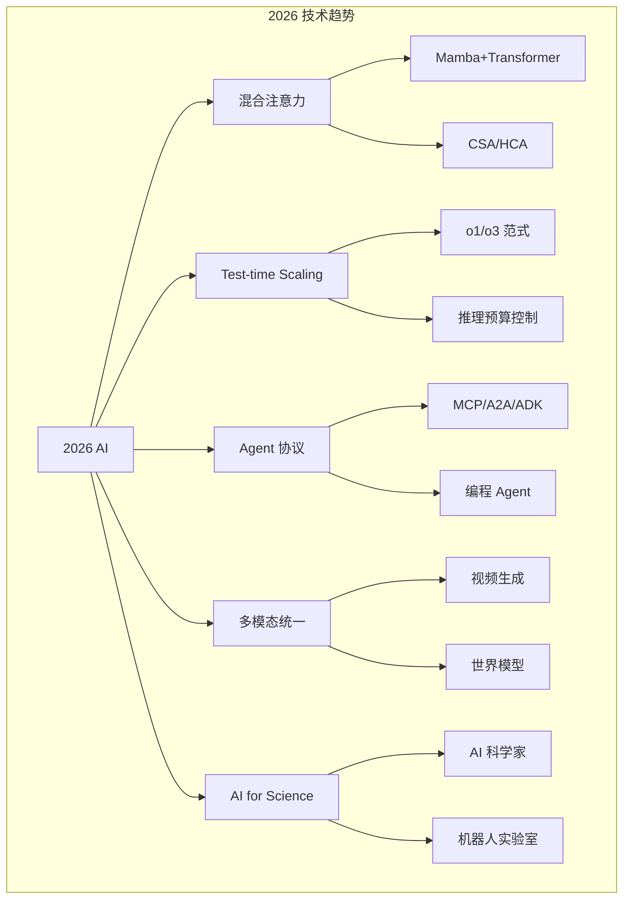
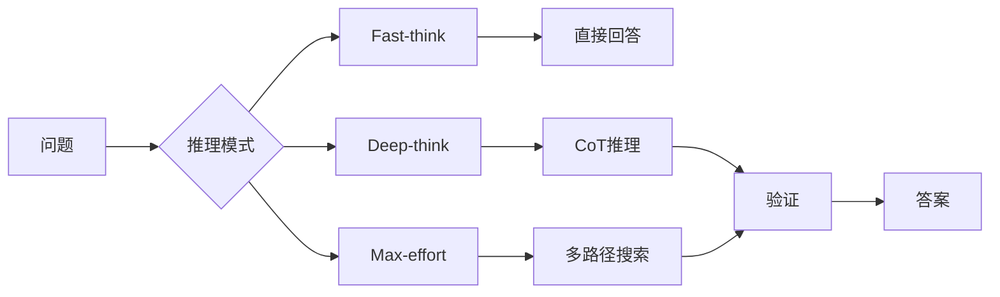

# 2026 前沿趋势全景

## 1. 模型架构：效率为王

### 混合注意力成为标准
- **趋势**：纯 Transformer 不再是唯一选择
- **Mamba+Transformer 混合**：OLMo Hybrid 证明混合层比纯架构更优
- **DeepSeek V4 的 CSA+HCA**：百万级上下文 KV Cache 降至 10%
- **影响**：2026 年后发布的模型将普遍采用混合注意力

### MoE 继续壮大
- **激活率持续降低**：DeepSeek V4 (3.1%) < Llama 4 (4.3%) < Qwen3 (9.4%)
- **专家路由优化**：路由稳定性仍是大规模 MoE 的挑战



## 2. 训练范式：多阶段蒸馏流水线

- **独立培养 → 统一蒸馏**：DeepSeek V4 验证 10+ 领域专家蒸馏有效
- **合成数据成为标配**：30% 混合最优比
- **Muon 优化器**：首次挑战 AdamW 霸主地位

## 3. 推理：Test-time Scaling

- **o1/o3 效应**：推理时计算量增加带来准确率提升
- **推理模式分级**：Fast-think / Deep-think / Max-effort
- **持续验证**：模型自己推理→验证→修正循环



## 4. 代码示例

### 趋势追踪代码示例

```python
import json
import requests
from datetime import datetime
from collections import defaultdict

class TrendTracker:
    def __init__(self):
        self.trends = defaultdict(lambda: {"mentions": 0, "papers": [], "repos": [], "timeline": []})

    def scan_arxiv(self, query, max_results=50):
        import urllib.parse
        query_encoded = urllib.parse.quote(query)
        url = f"http://export.arxiv.org/api/query?search_query=all:{query_encoded}&max_results={max_results}&sortBy=submittedDate&sortOrder=descending"
        response = requests.get(url, headers={"User-Agent": "TrendTracker/1.0"})
        entries = []
        if response.status_code == 200:
            import xml.etree.ElementTree as ET
            root = ET.fromstring(response.content)
            ns = {"atom": "http://www.w3.org/2005/Atom"}
            for entry in root.findall("atom:entry", ns):
                title = entry.find("atom:title", ns).text.strip()
                published = entry.find("atom:published", ns).text
                entries.append({"title": title, "date": published})
        return entries

    def scan_github(self, topic, sort="stars", per_page=20):
        url = f"https://api.github.com/search/repositories?q={topic}&sort={sort}&per_page={per_page}"
        response = requests.get(url, headers={"Accept": "application/vnd.github.v3+json"})
        repos = []
        if response.status_code == 200:
            data = response.json()
            for item in data.get("items", []):
                repos.append({
                    "name": item["full_name"],
                    "stars": item["stargazers_count"],
                    "description": item["description"],
                    "url": item["html_url"]
                })
        return repos

    def add_trend(self, category, paper=None, repo=None):
        self.trends[category]["mentions"] += 1
        if paper:
            self.trends[category]["papers"].append(paper)
        if repo:
            self.trends[category]["repos"].append(repo)

    def get_momentum_score(self, category, days=30):
        trend = self.trends[category]
        recent = [p for p in trend["papers"] if
                  (datetime.now() - datetime.fromisoformat(p.get("date", "2026-01-01").replace("Z", ""))).days <= days]
        return len(recent) * 2 + len(trend["repos"]) * 3 + trend["mentions"]

    def rank_trends(self, days=30):
        scores = {}
        for category in self.trends:
            scores[category] = self.get_momentum_score(category, days)
        return sorted(scores.items(), key=lambda x: x[1], reverse=True)

    def generate_report(self):
        ranking = self.rank_trends()
        report = {
            "generated_at": datetime.now().isoformat(),
            "top_trends": [{"category": cat, "momentum": score} for cat, score in ranking[:10]],
            "details": {cat: {"mentions": v["mentions"], "papers": len(v["papers"]), "repos": len(v["repos"])}
                       for cat, v in self.trends.items()}
        }
        return json.dumps(report, indent=2, ensure_ascii=False)

    def compute_growth_rate(self, category, weekly_data):
        if len(weekly_data) < 2:
            return 0.0
        rates = []
        for i in range(1, len(weekly_data)):
            if weekly_data[i-1] > 0:
                rates.append((weekly_data[i] - weekly_data[i-1]) / weekly_data[i-1])
        return sum(rates) / len(rates) if rates else 0.0

    def predict_next_month(self, category, historical_counts):
        if len(historical_counts) < 3:
            return None
        n = len(historical_counts)
        x = list(range(n))
        coeffs = np.polyfit(x, historical_counts, 1)
        next_val = coeffs[0] * n + coeffs[1]
        return max(0, int(next_val))
```

### 技术雷达

```python
from enum import Enum

class TrendPhase(Enum):
    EMERGING = "新兴"
    GROWING = "增长"
    MAINSTREAM = "主流"
    MATURE = "成熟"
    DECLINING = "衰退"

class TechRadar:
    def __init__(self):
        self.entries = []

    def add_entry(self, name, category, phase, adoption_rate, impact_score, maturity_years):
        self.entries.append({
            "name": name,
            "category": category,
            "phase": phase.value,
            "adoption_rate": adoption_rate,
            "impact_score": impact_score,
            "maturity_years": maturity_years
        })

    def classify_phase(self, adoption_rate, growth_rate, maturity):
        if adoption_rate < 0.05 and growth_rate > 0.5:
            return TrendPhase.EMERGING
        elif adoption_rate < 0.2 and growth_rate > 0.2:
            return TrendPhase.GROWING
        elif adoption_rate < 0.6:
            return TrendPhase.MAINSTREAM
        elif maturity < 5:
            return TrendPhase.MATURE
        else:
            return TrendPhase.DECLINING

    def get_trend_heatmap(self):
        categories = set(e["category"] for e in self.entries)
        phases = [p.value for p in TrendPhase]
        heatmap = {cat: {p: 0 for p in phases} for cat in categories}
        for e in self.entries:
            heatmap[e["category"]][e["phase"]] += 1
        return heatmap

    def recommend_investment(self, min_impact=7, max_maturity=3):
        candidates = [e for e in self.entries
                      if e["impact_score"] >= min_impact and e["maturity_years"] <= max_maturity]
        return sorted(candidates, key=lambda x: x["impact_score"], reverse=True)

    def build_radar_data(self):
        return {
            "emerging": [e["name"] for e in self.entries if e["phase"] == TrendPhase.EMERGING.value],
            "growing": [e["name"] for e in self.entries if e["phase"] == TrendPhase.GROWING.value],
            "mainstream": [e["name"] for e in self.entries if e["phase"] == TrendPhase.MAINSTREAM.value],
            "mature": [e["name"] for e in self.entries if e["phase"] == TrendPhase.MATURE.value],
            "declining": [e["name"] for e in self.entries if e["phase"] == TrendPhase.DECLINING.value]
        }

class ArchitectureTrendAnalyzer:
    def __init__(self):
        self.architecture_stats = defaultdict(lambda: {"papers": 0, "adoption": 0, "benchmarks": []})

    def add_model_stats(self, arch_name, num_papers, adoption_rate, benchmark_scores):
        self.architecture_stats[arch_name]["papers"] = num_papers
        self.architecture_stats[arch_name]["adoption"] = adoption_rate
        self.architecture_stats[arch_name]["benchmarks"] = benchmark_scores

    def compute_dominance_score(self, arch_name):
        stats = self.architecture_stats[arch_name]
        paper_score = min(1.0, stats["papers"] / 1000)
        adoption_score = stats["adoption"]
        bench_avg = np.mean(list(stats["benchmarks"].values())) if stats["benchmarks"] else 0
        return 0.3 * paper_score + 0.4 * adoption_score + 0.3 * bench_avg

    def predict_architecture_shift(self, current_arch, emerging_arch, benchmark_trend):
        current_score = self.compute_dominance_score(current_arch)
        emerging_score = self.compute_dominance_score(emerging_arch)

        crossover = None
        for year, ratio in enumerate(benchmark_trend):
            cur = current_score * (1 - 0.1 * year)
            em = emerging_score * (1 + 0.2 * year)
            if em > cur and crossover is None:
                crossover = year
        return {
            "current_dominance": current_score,
            "emerging_dominance": emerging_score,
            "predicted_crossover_year": crossover,
            "recommendation": "switch" if crossover and crossover < 3 else "monitor"
        }
```

## 5. 2026 年技术趋势雷达

| 技术 | 类别 | 阶段 | 采用率 | 影响力 | 成熟度 |
|------|------|------|-------|-------|-------|
| 混合注意力 | 架构 | 增长 | 30% | 9/10 | 2年 |
| MoE 路由优化 | 架构 | 主流 | 60% | 8/10 | 3年 |
| Test-time Scaling | 推理 | 增长 | 25% | 10/10 | 1年 |
| MCP/A2A 协议 | Agent | 增长 | 20% | 9/10 | 1年 |
| 合成数据 | 训练 | 主流 | 70% | 8/10 | 4年 |
| AI 科学家 | 应用 | 新兴 | 5% | 10/10 | 0.5年 |
| 具身智能 | 应用 | 增长 | 15% | 9/10 | 3年 |
| 视频生成 | 多模态 | 主流 | 50% | 8/10 | 3年 |
| 长上下文 | 基础设施 | 主流 | 65% | 7/10 | 2年 |
| 开源模型 | 生态 | 成熟 | 80% | 9/10 | 5年 |

## 6. 2026 模型能力对比

| 模型 | 架构 | 上下文 | 推理能力 | 编程 | 多模态 | Agent | 效率 |
|------|------|-------|---------|------|-------|-------|------|
| DeepSeek V4 | CSA+HCA MoE | 1M | ★★★★ | ★★★★ | ★★★ | ★★★★ | ★★★★★ |
| Llama 4 | iRoPE+MoE | 256K | ★★★ | ★★★ | ★★★ | ★★★ | ★★★★ |
| GPT-5 | 混合+MoE | 512K | ★★★★★ | ★★★★★ | ★★★★★ | ★★★★ | ★★★ |
| Claude 4 | 混合架构 | 200K | ★★★★ | ★★★★★ | ★★★★ | ★★★★★ | ★★★ |
| Gemini 2.5 | 原生上下文 | 1M+ | ★★★★ | ★★★★ | ★★★★★ | ★★★ | ★★★★ |

## 7. 训练效率对比

| 方法 | 数据效率 | 计算效率 | 模型质量 | 实现复杂度 |
|------|---------|---------|---------|-----------|
| 标准预训练 | 1× | 1× | 基线 | 低 |
| 多阶段蒸馏 | 3× | 5× | 98-99% | 高 |
| 课程学习 | 1.5× | 1.2× | 99.5% | 中 |
| 合成数据增强 | 2× | 1× | 98% | 中 |
| Muon 优化器 | - | 2× | 100%+ | 中 |

## 8. 推理部署方案对比

| 方案 | 延迟 | 吞吐量 | 成本/token | 适用场景 |
|------|------|-------|-----------|---------|
| Fast-think | 50ms | 1000/s | 1× | 简单问答 |
| Deep-think | 200ms | 200/s | 5× | 复杂推理 |
| Max-effort | 2s | 20/s | 50× | 高精度 |
| 量化 (INT4) | -20% | +200% | 0.4× | 大规模部署 |
| Speculative Decode | -40% | +60% | 0.8× | 低延迟 |

## 9. Agent 框架对比

| 框架 | 协议支持 | 多Agent | 工具调用 | 持久记忆 | 开源 |
|------|---------|---------|---------|---------|------|
| Claude Code | MCP | ✗ | ✓ | ✓ | ✗ |
| OpenCode | MCP | ✗ | ✓ | ✓ | ✓ |
| Cursor | 自定义 | ✗ | ✓ | ✓ | ✗ |
| CrewAI | MCP/A2A | ✓ | ✓ | ✓ | ✓ |
| AutoGen | A2A | ✓ | ✓ | ✓ | ✓ |
| MS Agent | A2A/ADK | ✓ | ✓ | ✓ | 部分 |

## 10. Agent：协议标准化元年

- **MCP + A2A + ADK** 三协议栈成熟
- **编程 Agent 崛起**：Claude Code/OpenCode/Cursor
- **多 Agent 协作**：CrewAI/AutoGen/微软 Agent Framework
- **人机回环**：渐进式自治成为部署标准

## 11. 长上下文：百万级成为现实

- **DeepSeek V4**：1M 上下文不涨价
- **Gemini**：原生长上下文
- **影响**：RAG 范式可能被长上下文部分替代

## 12. 关键论文与模型（2025-2026）

| 论文/模型 | 核心贡献 | 影响 |
|-----------|---------|------|
| DeepSeek V4 | CSA+HCA 混合注意力 | 长上下文效率突破 |
| Llama 4 | iRoPE + 大 MoE | 开源 MoE 新标准 |
| OLMo Hybrid | 混合注意力层研究 | 架构创新方向 |
| Mamba 2 | SSM 改进 | 替代注意力候选 |
| o1 推理模型 | Test-time Scaling | 推理新范式 |
| Sora | 视频生成 | 物理世界模拟 |
| CLAUDE 3.5/4 | Agent 可靠性 | 企业级 IA |

## 13. 对从业者的建议

### 入门者
- **学**：Transformer → LLM → RAG → Agent
- **练**：OpenCode / Claude Code / Cursor

### 进阶者
- **学**：MoE 路由、推理优化、对齐技术
- **练**：微调自己的模型、搭建 RAG 系统

### 大师
- **学**：混合注意力、Test-time Scaling、AI for Science
- **练**：参与开源模型训练、前沿论文复现

## 14. 展望 2027

- **视频生成实时化**：实时视频生成成为可能
- **Agent 自主性提升**：从辅助到自主完成复杂项目
- **MoE 激活率 <1%**：更大模型但更低推理成本
- **AI 科学家**：AI 自主发现科学规律
- **具身智能突破**：机器人通用操作能力
