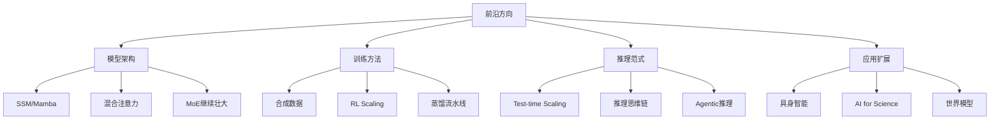

# 前沿方向

## 概述

AI 技术发展日新月异，本模块追踪最前沿的研究方向和技术趋势，帮助读者站在技术发展的最前沿。

## 目录

```
10-前沿方向/
├── README.md
├── 01-世界模型.md          # 世界模型/GATO/自动驾驶基础模型
├── 02-AI-for-Science.md    # AlphaFold/AI制药/气象模型
├── 03-具身智能.md          # 机器人+AI/灵巧操作/自主导航
├── 04-推理时扩展.md        # o1/o3/推理Scaling/Fast-think/Deep-think
├── 05-状态空间模型.md      # Mamba/RWKV/Hyena/混合注意力
├── 06-AGI探索.md           # AGI理论/能力涌现/意识理论
└── 07-2026前沿趋势.md      # 年度趋势/关键论文/人物
```

## 前沿技术栈全景



## 2026 年关键趋势

| 方向 | 重要性 | 成熟度 | 说明 |
|------|--------|-------|------|
| 推理时扩展 | ★★★★★ | 高 | o1/o3 证明推理计算量提升有效 |
| 混合注意力 | ★★★★ | 中高 | Mamba+Transformer 融合 |
| 百万级上下文 | ★★★★ | 高 | DeepSeek V4 实现 1M 不涨价 |
| Agentic AI | ★★★★★ | 中 | MCP/A2A 协议标准化 |
| 视频生成 | ★★★★ | 中高 | 从 4s 到 60s，一致性突破 |
| AI for Science | ★★★★ | 中 | 蛋白质/材料/气象 |
| 具身智能 | ★★★ | 低 | 机器人+基础模型 |
